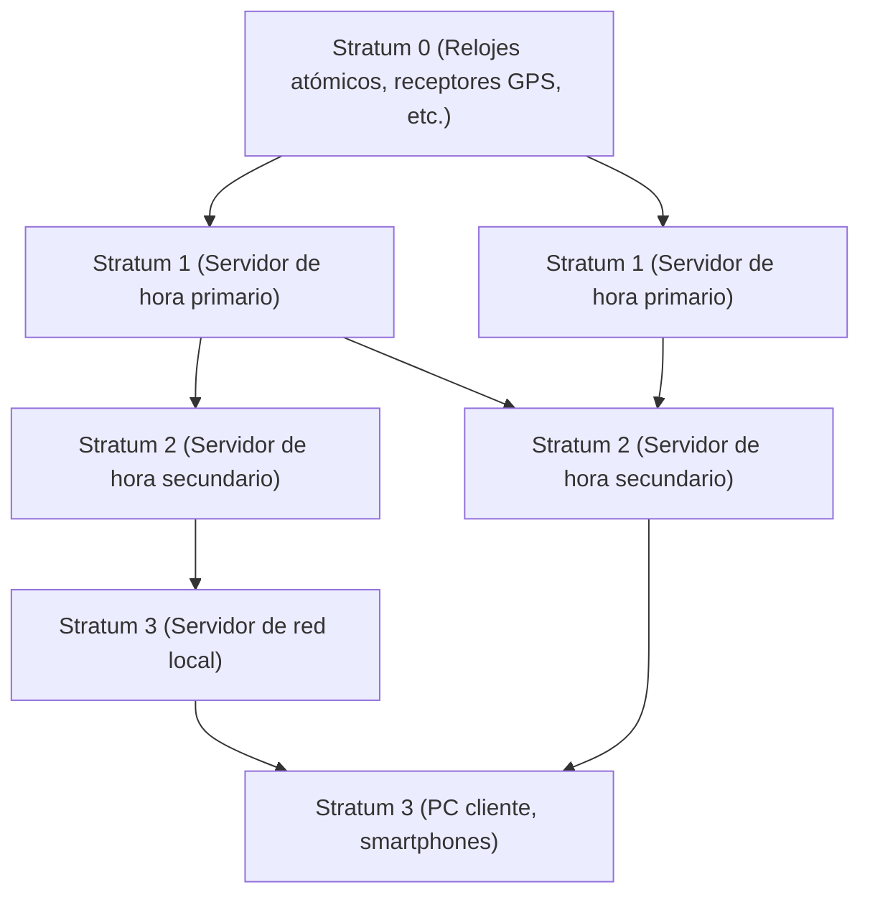

En la sociedad digital moderna, la "hora exacta" se ha convertido en algo tan natural como el aire. Si abres tu smartphone, siempre verás la hora exacta al segundo, las reuniones en línea comienzan a la hora programada y las transacciones financieras se registran con precisión de milisegundos. Sin embargo, ¿cómo es que innumerables ordenadores que operan de forma autónoma en Internet comparten el tiempo con tanta precisión?

Detrás de esto opera **NTP (Network Time Protocol)**, una tecnología extremadamente refinada a pesar de su antigüedad. En este artículo, profundizaremos desde la perspectiva de la tecnología y la ingeniería, explicando desde el mecanismo de sincronización de hora en la infraestructura de TI, hasta el futuro de la sincronización de hora impulsado por los últimos "relojes de red óptica".

## ¿Por qué los ordenadores necesitan sincronización de hora?

Los PC y servidores que utilizamos tienen un pequeño reloj incorporado en la placa base llamado RTC (Real-Time Clock). Este funciona con una pila de botón y sigue marcando el tiempo incluso cuando el ordenador está apagado. Sin embargo, este reloj que usa un oscilador de cristal es susceptible a cambios de temperatura y al envejecimiento, y no es raro que experimente una desviación (drift) de varios segundos a decenas de segundos por día.

¿Qué pasaría si la hora de los servidores en todo el mundo estuviera desincronizada?

- **Inconsistencia de registros (logs)**: En caso de un fallo en el sistema, incluso si se comparan los registros de varios servidores, es imposible investigar la causa si las horas están desincronizadas.
- **Vulnerabilidades de seguridad**: Los tickets de autenticación (como la autenticación Kerberos) y los certificados son estrictos con las fechas de caducidad. Si la hora se desincroniza, usuarios legítimos podrían no poder iniciar sesión, o podría permitirse el acceso no autorizado.
- **Contradicciones en la base de datos**: En las bases de datos distribuidas, los datos se actualizan en múltiples nodos. Si las marcas de tiempo están desajustadas, puede ocurrir una "pérdida de datos" al sobrescribir datos nuevos con datos antiguos.

De esta manera, en la infraestructura de TI, "compartir el tiempo con precisión" es un elemento tan crítico que se puede considerar la sangre del sistema.

## Cómo funciona el NTP (Network Time Protocol)

El NTP fue diseñado por el profesor David L. Mills de la Universidad de Delaware en 1985 y es uno de los protocolos más antiguos en la historia de Internet. Utiliza el puerto UDP 123 y tiene un mecanismo para calcular la latencia de la red y sincronizar la hora exacta.

### Garantía de precisión mediante una estructura jerárquica (Stratum)

La red NTP tiene una estructura jerárquica llamada "Stratum".

- **Stratum 0**: La fuente de tiempo más precisa. Esto incluye hardware como relojes atómicos de cesio, relojes atómicos de rubidio o receptores de señales de hora de satélites GPS. Estos no están conectados directamente a la red.
- **Stratum 1**: Servidores conectados directamente a los dispositivos Stratum 0 mediante un cable dedicado. Cuentan con una precisión altísima (a nivel de microsegundos).
- **Stratum 2**: Servidores que obtienen la hora de los servidores Stratum 1 a través de la red. Muchos de los servidores NTP públicos en Internet se incluyen aquí. Obtienen la hora de múltiples servidores Stratum 1 y se conectan entre sí (peer-to-peer) para aumentar mutuamente la precisión.
- **Stratum 3 y posteriores**: Servidores de nivel inferior y dispositivos finales como nuestros PCs y smartphones. El Stratum está definido hasta un máximo de 15, siendo 16 el significado de "no sincronizable".

### La magia de corregir la latencia de la red

El aspecto más brillante del NTP es que tiene un algoritmo que calcula la "latencia (Delay)" cuando los paquetes viajan de ida y vuelta a través de la red, y la "asimetría (Dispersion)" de los tiempos de ida y vuelta, para luego corregir el reloj del cliente.

Cuando un cliente solicita la hora al servidor, registra las siguientes cuatro marcas de tiempo:

1. La hora en que el cliente envió la solicitud
2. La hora en que el servidor recibió la solicitud
3. La hora en que el servidor envió la respuesta
4. La hora en que el cliente recibió la respuesta

A partir de estas diferencias de tiempo, el NTP deduce matemáticamente el retraso de transmisión de la red (el tiempo de ida y vuelta menos el tiempo de procesamiento del servidor) y la desviación (offset) entre el reloj del cliente y del servidor. Gracias a este cálculo, incluso a través de Internet, donde hay latencias de comunicación de varios milisegundos a decenas de milisegundos, es posible ajustar la hora con una precisión de milisegundos (milésimas de segundo).

## Hacia una sincronización de mayor precisión: PTP y relojes de red óptica

Aunque el NTP tiene una precisión más que suficiente para usos generales, en los campos tecnológicos de vanguardia modernos se requiere una precisión aún mayor.

Por ejemplo, la sincronización entre las estaciones base de las redes móviles 5G o en los sistemas financieros que realizan operaciones de alta frecuencia (HFT) requieren una precisión a nivel de microsegundos (millonésimas de segundo) a nanosegundos (billonésimas de segundo). En este ámbito, en lugar del NTP se utiliza un protocolo llamado **PTP (Precision Time Protocol: IEEE 1588)**. El PTP aplica marcas de tiempo a nivel de hardware, logrando una precisión de nanosegundos bajo entornos de red extremadamente estrictos.

### El reloj definitivo de próxima generación: "Reloj de red óptica"

Además, lo que actualmente llama la atención en la vanguardia de la ciencia y tecnología es el "**reloj de red óptica**" (optical lattice clock).

Actualmente, 1 segundo en el Sistema Internacional de Unidades (SI) se define como "la duración de 9.192.631.770 periodos de la radiación correspondiente a la transición entre los dos niveles hiperfinos del estado fundamental del átomo de cesio-133". El reloj atómico de cesio cuenta con una asombrosa precisión de desfasarse solo 1 segundo en decenas de millones de años, pero el reloj de red óptica lo supera ampliamente.

Inventado por el profesor Hidetoshi Katori de la Universidad de Tokio y su equipo, el reloj de red óptica confina átomos como el estroncio en una "caja de huevos de luz" (red óptica) creada con luz láser, y mide simultáneamente la vibración de decenas de miles de átomos para mejorar drásticamente la precisión. Su nivel de precisión alcanza un nivel inimaginable en el que "no se desfasaría ni 1 segundo aunque transcurriera la edad del universo (aproximadamente 13.800 millones de años)".

### El futuro donde la infraestructura de TI y los relojes de red óptica se cruzan

Entonces, ¿cómo se relacionará este reloj definitivo con la infraestructura de TI?

Si se logra la implementación práctica de los relojes de red óptica, y se establecen la miniaturización y la tecnología de distribución de hora de alta precisión a través de redes de fibra óptica, el núcleo de la infraestructura de comunicaciones evolucionará drásticamente.

1. **Sincronización de red de ultra alta precisión**: Si todo Internet se sincroniza a nivel de nanosegundos o picosegundos, el concepto mismo de computación distribuida cambiará. Los complejos protocolos que consideran la latencia serán innecesarios, y será posible que los servidores de todo el mundo funcionen en perfecta sincronía, como si fueran un solo ordenador gigante.
2. **Aplicación en TI de la tecnología geodésica relativista**: Según la teoría de la relatividad general de Einstein, el tiempo transcurre más lentamente donde la gravedad es más fuerte (a menor altitud). Con la precisión del reloj de red óptica, es posible detectar un retraso en el tiempo debido a una diferencia de altitud de solo 1 cm. Esto podría hacer que los relojes instalados en cada centro de datos o nodo de red funcionen como una gigantesca red de sensores para detectar su propia altitud o movimientos de la corteza terrestre.
3. **Base para nuevas tecnologías de encriptación**: En las comunicaciones cuánticas y en los sistemas criptográficos de próxima generación, una sincronización de hora extremadamente precisa constituye la base de la seguridad. Una infraestructura que pueda garantizar una "simultaneidad" absoluta elevará la ciberseguridad a una dimensión completamente nueva.

## Conclusión

El NTP, una tecnología de larga data, sustenta el gigantesco ecosistema del Internet actual y sincroniza el "latido" de los ordenadores de todo el mundo al unísono. El tiempo exacto del que disfrutamos sin ser conscientes comienza en los relojes atómicos del Stratum 0 y, tras pasar por la magia de múltiples redes y algoritmos, llega a nuestros smartphones.

Y ahora, el avance en ciencia fundamental que representan los relojes de red óptica está a punto de fusionarse con la tecnología de comunicaciones y la infraestructura de TI. La evolución de la tecnología para medir el tiempo está directamente ligada a la evolución de la computación. Cuando reflexionamos sobre cómo los ordenadores del mundo sincronizan sus relojes y su funcionamiento, nos damos cuenta de la tremenda y profunda complejidad de la tecnología que la humanidad ha construido.
