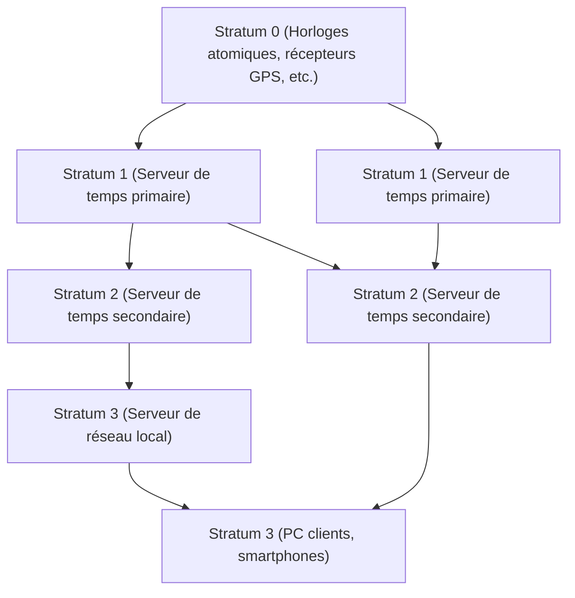

Dans la société numérique moderne, "l'heure exacte" est devenue une évidence, tout comme l'air que nous respirons. Lorsque vous ouvrez votre smartphone, l'heure exacte à la seconde près est toujours affichée, les réunions en ligne commencent à l'heure prévue et les transactions financières sont enregistrées avec une précision de l'ordre de la milliseconde. Cependant, comment d'innombrables ordinateurs fonctionnant de manière autonome sur Internet partagent-ils l'heure de manière aussi précise ?

Derrière cela se cache une technologie très ancienne mais extrêmement sophistiquée appelée **NTP (Network Time Protocol)**. Dans cet article, nous explorerons en profondeur, du point de vue de la technologie et de l'ingénierie, depuis les mécanismes de synchronisation temporelle de l'infrastructure informatique jusqu'à l'avenir de la synchronisation temporelle apportée par les dernières "horloges à réseau optique".

## Pourquoi les ordinateurs ont-ils besoin de synchronisation temporelle ?

Nos PC et serveurs disposent d'une petite horloge intégrée sur la carte mère appelée RTC (Real-Time Clock). Elle est alimentée par une pile bouton et continue de donner l'heure même lorsque l'ordinateur est éteint. Cependant, cette horloge, qui utilise un oscillateur à cristal, est très sensible aux changements de température et à la dégradation au fil du temps, et il n'est pas rare qu'elle dérive de quelques secondes à plusieurs dizaines de secondes par jour.

Que se passerait-il si les heures des serveurs du monde entier étaient désynchronisées ?

- **Incohérence des journaux (logs)** : Lors d'une panne système, même en croisant les journaux de plusieurs serveurs, il serait impossible d'en identifier la cause si les heures ne correspondent pas.
- **Vulnérabilités de sécurité** : Les tickets d'authentification (comme l'authentification Kerberos) et les certificats ont des dates d'expiration très strictes. Si l'heure est incorrecte, même les utilisateurs légitimes pourraient ne pas pouvoir se connecter, ou pire, un accès non autorisé pourrait être permis.
- **Incohérences de base de données** : Dans les bases de données distribuées, les données sont mises à jour sur plusieurs nœuds. Si les horodatages sont faux, une "perte de données" peut se produire où les nouvelles données sont écrasées par des données anciennes.

Ainsi, dans l'infrastructure informatique, le "partage du temps exact" est un élément si crucial qu'on peut le considérer comme le sang du système.

## Le mécanisme du NTP (Network Time Protocol)

NTP est l'un des plus anciens protocoles de l'histoire d'Internet, conçu en 1985 par le professeur David L. Mills de l'Université du Delaware. Il utilise le port UDP 123 et possède un mécanisme qui calcule le délai du réseau pour synchroniser l'heure avec précision.

### Garantie de l'exactitude grâce à une structure hiérarchique (Stratum)

Le réseau NTP possède une structure hiérarchique appelée "Stratum".

- **Stratum 0** : La source de temps la plus précise. Cela inclut le matériel comme les horloges atomiques au césium ou au rubidium, ou encore les appareils recevant des signaux horaires des satellites GPS. Ils ne sont pas directement connectés au réseau.
- **Stratum 1** : Ce sont des serveurs connectés directement aux appareils de Stratum 0 par un câble dédié. Ils offrent une très haute précision (de l'ordre de la microseconde).
- **Stratum 2** : Ce sont des serveurs qui obtiennent l'heure des serveurs de Stratum 1 via le réseau. La plupart des serveurs NTP publics sur Internet appartiennent à cette catégorie. Ils obtiennent l'heure de plusieurs serveurs de Stratum 1 et s'interconnectent (peering) pour améliorer leur précision mutuelle.
- **Stratum 3 et au-delà** : Ce sont les serveurs de niveau inférieur, ainsi que nos PC, smartphones et autres appareils finaux (end devices). Le Stratum est défini jusqu'à un maximum de 15, le niveau 16 signifiant "non synchronisé".

### La magie de la correction des délais de réseau

Le point le plus remarquable de NTP est qu'il possède un algorithme qui calcule le "délai (Delay)" aller-retour des paquets sur le réseau et l'"asymétrie (Dispersion)" du temps d'aller et de retour, afin de corriger l'horloge du client.

Lorsqu'un client demande l'heure à un serveur, il enregistre les quatre horodatages suivants :

1. L'heure à laquelle le client a envoyé la requête
2. L'heure à laquelle le serveur a reçu la requête
3. L'heure à laquelle le serveur a envoyé la réponse
4. L'heure à laquelle le client a reçu la réponse

À partir de ces différences de temps, NTP déduit mathématiquement le délai de transmission du réseau (le temps aller-retour moins le temps de traitement du serveur) et le décalage (offset) entre l'horloge du client et celle du serveur. Grâce à ce calcul, même via Internet avec des délais de communication de quelques millisecondes à plusieurs dizaines de millisecondes, l'heure peut être ajustée avec une précision de l'ordre de la milliseconde (un millième de seconde).

## Vers une synchronisation encore plus précise : PTP et horloges à réseau optique

Bien que le NTP offre une précision plus que suffisante pour un usage général, des domaines de technologie de pointe modernes exigent désormais une précision encore plus grande.

Par exemple, la synchronisation entre les stations de base des réseaux mobiles 5G ou les systèmes financiers effectuant du trading à haute fréquence (HFT) requièrent une précision de l'ordre de la microseconde (un millionième de seconde) à la nanoseconde (un milliardième de seconde). Dans ce domaine, on utilise un protocole appelé **PTP (Precision Time Protocol : IEEE 1588)** à la place du NTP. Le PTP attribue des horodatages au niveau matériel et permet une synchronisation à la nanoseconde près dans des environnements réseau extrêmement stricts.

### "L'horloge à réseau optique", l'horloge ultime de nouvelle génération

Actuellement, ce qui attire l'attention à l'avant-garde de la science et de la technologie, c'est l'"**horloge à réseau optique**".

Aujourd'hui, une seconde dans le Système international d'unités (SI) est définie comme "la durée de 9 192 631 770 périodes de la radiation correspondant à la transition entre les deux niveaux hyperfins de l'état fondamental de l'atome de césium 133". L'horloge atomique au césium bénéficie d'une précision étonnante, se décalant d'une seconde seulement sur plusieurs dizaines de millions d'années, mais l'horloge à réseau optique la surpasse encore.

Inventée par le professeur Hidetoshi Katori de l'Université de Tokyo et son équipe, l'horloge à réseau optique confine des atomes tels que le strontium dans une "boîte à œufs de lumière (réseau optique)" créée par des lasers, et mesure la vibration de dizaines de milliers d'atomes à la fois, améliorant considérablement la précision. Cette précision atteint un niveau inimaginable où "elle ne dériverait pas d'une seule seconde même si l'âge de l'univers (environ 13,8 milliards d'années) s'était écoulé".

### L'avenir où l'infrastructure informatique et les horloges à réseau optique se croisent

Alors, comment cette horloge ultime est-elle liée à l'infrastructure informatique ?

Si l'horloge à réseau optique est mise en pratique et que la miniaturisation ainsi que la technologie de distribution de l'heure de haute précision via les réseaux de fibre optique sont établies, le cœur de l'infrastructure de communication évoluera de manière spectaculaire.

1. **Synchronisation réseau ultra-précise** : Si l'ensemble d'Internet est synchronisé à la nanoseconde, voire à la picoseconde, le concept même de l'informatique distribuée changera. Les protocoles complexes tenant compte de la latence deviendront inutiles, et les serveurs du monde entier pourront fonctionner de manière parfaitement synchronisée, comme un seul et unique superordinateur gigantesque.
2. **Application informatique des technologies géodésiques relativistes** : Selon la théorie de la relativité générale d'Einstein, plus la gravité est forte (à basse altitude), plus le temps s'écoule lentement. Avec la précision d'une horloge à réseau optique, un retard temporel causé par une différence d'altitude de seulement 1 cm peut être détecté. Ainsi, les horloges installées dans chaque centre de données ou nœud de réseau pourraient fonctionner comme un vaste réseau de capteurs détectant leur propre altitude ou les déformations de la croûte terrestre.
3. **Fondement des nouvelles technologies cryptographiques** : Dans la communication quantique ou les systèmes cryptographiques de nouvelle génération, une synchronisation temporelle extrêmement précise constitue le fondement de la sécurité. Une infrastructure capable de garantir une "simultanéité" absolue propulsera la cybersécurité vers une toute nouvelle dimension.

## Conclusion

Une technologie ancienne comme le NTP soutient l'écosystème gigantesque de l'Internet d'aujourd'hui, unifiant les "battements de cœur" des ordinateurs du monde entier. Le temps exact dont nous profitons sans en avoir conscience commence par les horloges atomiques de Stratum 0 et, après être passé par de multiples couches de réseaux et la magie des algorithmes, parvient jusqu'à nos smartphones.

Aujourd'hui, une percée scientifique fondamentale qu'est l'horloge à réseau optique est sur le point de fusionner avec les technologies de communication et l'infrastructure informatique. L'évolution de la technologie de mesure du temps est directement liée à l'évolution de l'informatique elle-même. Lorsque nous réfléchissons aux mécanismes par lesquels les ordinateurs du monde entier règlent leurs horloges, nous prenons conscience de la profondeur insondable de la technologie que l'humanité a construite.
