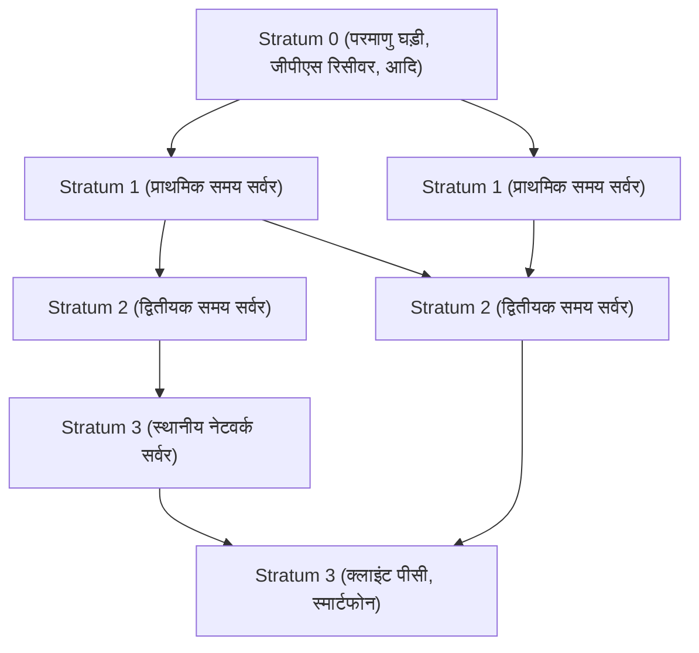

आधुनिक डिजिटल समाज में, 'सटीक समय' हवा की तरह एक स्वाभाविक उपस्थिति बन गया है। जब आप अपना स्मार्टफोन खोलते हैं, तो हमेशा सेकंड तक सटीक समय प्रदर्शित होता है, ऑनलाइन बैठकें निर्धारित समय पर शुरू होती हैं, और वित्तीय लेनदेन मिलीसेकंड सटीकता के साथ रिकॉर्ड किए जाते हैं। लेकिन इंटरनेट पर स्वायत्त रूप से चलने वाले अनगिनत कंप्यूटर इतने सटीक समय को कैसे साझा करते हैं?

इसके पीछे **NTP (Network Time Protocol)** नामक एक अत्यंत परिष्कृत तकनीक काम कर रही है, जो काफी पुरानी होने के बावजूद बहुत प्रभावी है। इस लेख में, हम आईटी बुनियादी ढांचे में समय तुल्यकालन (टाइम सिंक्रोनाइज़ेशन) के तंत्र से लेकर नवीनतम 'ऑप्टिकल लैटिस क्लॉक' द्वारा लाए जाने वाले भविष्य के समय तुल्यकालन तक, प्रौद्योगिकी और इंजीनियरिंग के दृष्टिकोण से गहराई से चर्चा करेंगे।

## कंप्यूटरों को समय तुल्यकालन की आवश्यकता क्यों है?

हमारे द्वारा उपयोग किए जाने वाले पीसी और सर्वर के मदरबोर्ड में RTC (रियल टाइम क्लॉक) नामक एक छोटी घड़ी अंतर्निहित होती है। यह एक बटन बैटरी आदि द्वारा संचालित होती है, और कंप्यूटर के बंद होने पर भी समय रखती है। हालांकि, क्रिस्टल ऑसिलेटर का उपयोग करने वाली इस घड़ी पर तापमान परिवर्तन और समय के साथ होने वाले क्षरण का आसानी से प्रभाव पड़ता है, और प्रति दिन कुछ सेकंड से लेकर दसियों सेकंड तक का विचलन (ड्रिफ्ट) होना असामान्य नहीं है।

यदि दुनिया भर के सर्वरों का समय अलग-अलग हो तो क्या होगा?

- **लॉग की विसंगति**: सिस्टम विफलता के मामले में, भले ही कई सर्वरों के लॉग का मिलान किया जाए, यदि समय मेल नहीं खाता है तो कारण का पता लगाना असंभव है।
- **सुरक्षा भेद्यता**: प्रमाणीकरण टिकट (जैसे Kerberos प्रमाणीकरण) और प्रमाणपत्र समाप्ति तिथियों के बारे में सख्त होते हैं। यदि समय गलत है, तो वैध उपयोगकर्ता भी लॉग इन नहीं कर पाएंगे, या अनधिकृत पहुंच की अनुमति मिलने का जोखिम होता है।
- **डेटाबेस विरोधाभास**: वितरित डेटाबेस में, डेटा को कई नोड्स में अपडेट किया जाता है। यदि टाइमस्टैम्प गलत है, तो 'डेटा हानि' हो सकती है जहाँ पुराना डेटा नए डेटा को ओवरराइट कर देता है।

इस प्रकार, आईटी बुनियादी ढांचे में 'सटीक समय साझा करना' एक इतना महत्वपूर्ण तत्व है कि इसे सिस्टम का रक्त कहा जा सकता है।

## NTP (Network Time Protocol) का तंत्र

NTP इंटरनेट के इतिहास में सबसे पुराने प्रोटोकॉल में से एक है, जिसे 1985 में डेलावेयर विश्वविद्यालय के प्रोफेसर डेविड एल. मिल्स द्वारा डिज़ाइन किया गया था। यह UDP पोर्ट 123 का उपयोग करता है और इसमें नेटवर्क विलंब की गणना करके सटीक समय को सिंक्रनाइज़ करने का एक तंत्र है।

### पदानुक्रमित संरचना (Stratum) के माध्यम से सटीकता की गारंटी

NTP नेटवर्क में 'Stratum (स्ट्रैटम)' नामक एक पदानुक्रमित संरचना होती है।

- **Stratum 0**: समय का सबसे सटीक स्रोत। इसमें सीज़ियम परमाणु घड़ियाँ, रूबिडियम परमाणु घड़ियाँ, या जीपीएस उपग्रहों से समय संकेत प्राप्त करने वाले हार्डवेयर आदि शामिल हैं। ये सीधे नेटवर्क से जुड़े नहीं होते हैं।
- **Stratum 1**: वे सर्वर जो सीधे समर्पित केबल के माध्यम से Stratum 0 उपकरणों से जुड़े होते हैं। ये बहुत उच्च सटीकता (माइक्रोसेकंड स्तर) का दावा करते हैं।
- **Stratum 2**: वे सर्वर जो नेटवर्क के माध्यम से Stratum 1 सर्वर से समय प्राप्त करते हैं। इंटरनेट पर अधिकांश सार्वजनिक NTP सर्वर इसी में शामिल हैं। वे कई Stratum 1 सर्वरों से समय प्राप्त करते हैं और सटीकता में सुधार करने के लिए एक-दूसरे के साथ पीयर कनेक्शन बनाते हैं।
- **Stratum 3 और उसके बाद**: आगे के निचले स्तर के सर्वर, और हमारे पीसी और स्मार्टफोन जैसे अंतिम उपकरण (एंड डिवाइस)। Stratum को अधिकतम 15 तक परिभाषित किया गया है, और 16 का अर्थ 'सिंक्रनाइज़ करने में असमर्थ' है।

### नेटवर्क विलंब (Delay) को ठीक करने का जादू

NTP के बारे में सबसे आश्चर्यजनक बात यह है कि इसमें नेटवर्क पर पैकेट के आगे-पीछे जाने पर 'विलंब (Delay)' और राउंड-ट्रिप समय के 'असममिति (Dispersion)' की गणना करके क्लाइंट की घड़ी को सही करने के लिए एक एल्गोरिदम है।

जब कोई क्लाइंट सर्वर से समय के लिए पूछताछ करता है, तो वह निम्नलिखित 4 टाइमस्टैम्प रिकॉर्ड करता है:

1. क्लाइंट द्वारा अनुरोध भेजने का समय
2. सर्वर द्वारा अनुरोध प्राप्त करने का समय
3. सर्वर द्वारा प्रतिक्रिया भेजने का समय
4. क्लाइंट द्वारा प्रतिक्रिया प्राप्त करने का समय

NTP इन समय अंतरों से नेटवर्क के संचरण विलंब (सर्वर के प्रसंस्करण समय को घटाकर राउंड-ट्रिप समय) और क्लाइंट तथा सर्वर की घड़ी के बीच के विचलन (ऑफ़सेट) को गणितीय रूप से प्राप्त करता है। इस गणना के साथ, इंटरनेट पर भी, जहाँ संचार में कुछ मिलीसेकंड से लेकर दसियों मिलीसेकंड की देरी हो सकती है, मिलीसेकंड (सेकंड के 1/1000वें हिस्से) की सटीकता के साथ समय निर्धारित करना संभव है।

## उच्च सटीकता तुल्यकालन की ओर: PTP और ऑप्टिकल लैटिस क्लॉक

NTP में सामान्य अनुप्रयोगों के लिए पर्याप्त से अधिक सटीकता है, लेकिन आधुनिक उन्नत प्रौद्योगिकी क्षेत्रों में और भी अधिक सटीकता की मांग की जा रही है।

उदाहरण के लिए, 5G मोबाइल नेटवर्क के बेस स्टेशनों के बीच सिंक्रनाइज़ेशन या उच्च-आवृत्ति व्यापार (HFT) करने वाली वित्तीय प्रणालियों में, माइक्रोसेकंड (सेकंड का दस लाखवाँ हिस्सा) से नैनोसेकंड (सेकंड का एक अरबवाँ हिस्सा) स्तर की सटीकता की आवश्यकता होती है। इस क्षेत्र में, NTP के बजाय **PTP (Precision Time Protocol: IEEE 1588)** नामक प्रोटोकॉल का उपयोग किया जाता है। PTP हार्डवेयर स्तर पर टाइमस्टैम्पिंग करता है और अत्यधिक सख्त नेटवर्क वातावरण में नैनोसेकंड-सटीक तुल्यकालन प्राप्त करता है।

### अगली पीढ़ी की अंतिम घड़ी 'ऑप्टिकल लैटिस क्लॉक'

इसके अलावा, वर्तमान में विज्ञान और प्रौद्योगिकी के मोर्चे पर जो ध्यान आकर्षित कर रहा है वह है '**ऑप्टिकल लैटिस क्लॉक**'।

वर्तमान में, इकाइयों की अंतर्राष्ट्रीय प्रणाली (SI) में 1 सेकंड को 'सीज़ियम-133 परमाणु की जमीनी अवस्था के दो अतिसूक्ष्म स्तरों के बीच संक्रमण के अनुरूप विकिरण की 9,192,631,770 अवधियों के बराबर समय' के रूप में परिभाषित किया गया है। सीज़ियम परमाणु घड़ियाँ आश्चर्यजनक सटीकता का दावा करती हैं, जो करोड़ों वर्षों में केवल 1 सेकंड का अंतर दिखाती हैं, लेकिन ऑप्टिकल लैटिस घड़ियाँ इससे भी कहीं आगे निकल जाती हैं।

टोक्यो विश्वविद्यालय के प्रोफेसर हिदेतोशी कातोरी और अन्य द्वारा आविष्कृत ऑप्टिकल लैटिस क्लॉक, लेजर प्रकाश से बने 'प्रकाश के अंडे के कार्टन (ऑप्टिकल लैटिस)' में स्ट्रोंटियम जैसे परमाणुओं को फँसाती है और एक साथ हजारों परमाणुओं के कंपन को मापकर सटीकता में नाटकीय रूप से सुधार करती है। इसकी सटीकता ऐसे अकल्पनीय स्तर पर पहुँच गई है जहाँ 'ब्रह्मांड की आयु (लगभग 13.8 अरब वर्ष) बीत जाने के बाद भी यह 1 सेकंड नहीं भटकेगी'।

### वह भविष्य जहाँ आईटी बुनियादी ढांचा और ऑप्टिकल लैटिस क्लॉक मिलते हैं

तो, यह अंतिम घड़ी आईटी बुनियादी ढांचे से कैसे संबंधित होगी?

यदि ऑप्टिकल लैटिस क्लॉक का व्यावसायीकरण किया जाता है, इसे छोटा किया जाता है, और ऑप्टिकल फाइबर नेटवर्क के माध्यम से उच्च-सटीक समय वितरण तकनीक स्थापित की जाती है, तो संचार बुनियादी ढांचे का मूल नाटकीय रूप से विकसित होगा।

1. **अल्ट्रा-हाई प्रिसिजन नेटवर्क सिंक्रोनाइज़ेशन**: यदि संपूर्ण इंटरनेट को नैनोसेकंड या पिकोसेकंड में सिंक्रनाइज़ किया जाता है, तो वितरित कंप्यूटिंग (डिस्ट्रिब्यूटेड कंप्यूटिंग) की अवधारणा ही बदल जाएगी। विलंब पर विचार करने वाले जटिल प्रोटोकॉल की कोई आवश्यकता fixed नहीं होगी, और दुनिया भर के सर्वर एक विशाल कंप्यूटर की तरह पूरी तरह से सिंक्रनाइज़ होकर काम करने में सक्षम होंगे।
2. **सापेक्षवादी भूगणितीय (Geodesic) प्रौद्योगिकी का आईटी अनुप्रयोग**: आइंस्टीन के सामान्य सापेक्षता के सिद्धांत के अनुसार, जहाँ गुरुत्वाकर्षण अधिक मजबूत होता है (कम ऊंचाई), समय धीमी गति से बीतता है। ऑप्टिकल लैटिस क्लॉक की सटीकता के साथ, केवल 1 सेमी के ऊंचाई अंतर के कारण होने वाली समय की देरी का पता लगाया जा सकता है। इसके परिणामस्वरूप, प्रत्येक डेटा सेंटर या नेटवर्क नोड में स्थापित घड़ियाँ एक विशाल सेंसर नेटवर्क के रूप में कार्य कर सकती हैं जो अपनी ऊंचाई या क्रस्टल (भूपर्पटी) हलचल का पता लगाती हैं।
3. **नई क्रिप्टोग्राफिक प्रौद्योगिकी की नींव**: क्वांटम संचार और अगली पीढ़ी की क्रिप्टोग्राफिक प्रणालियों में, अत्यंत सटीक समय तुल्यकालन सुरक्षा का आधार बनता है। एक ऐसा बुनियादी ढांचा जो पूर्ण 'समकालिकता (Simultaneity)' की गारंटी दे सकता है, साइबर सुरक्षा को पूरी तरह से नए आयाम पर ले जाएगा।

## निष्कर्ष

NTP जैसी पुरानी तकनीक आज के इंटरनेट के विशाल पारिस्थितिकी तंत्र का समर्थन करती है, जो दुनिया भर के कंप्यूटरों की 'धड़कन' को एक साथ मिलाती है। जिस सटीक समय का हम बिना एहसास किए आनंद लेते हैं, वह Stratum 0 परमाणु घड़ी से शुरू होता है और हमारे स्मार्टफोन तक पहुंचने के लिए कई नेटवर्क और एल्गोरिदम के जादू से गुजरता है।

और अब, ऑप्टिकल लैटिस क्लॉक के रूप में बुनियादी विज्ञान की एक सफलता संचार प्रौद्योगिकी और आईटी बुनियादी ढांचे के साथ विलय करने वाली है। समय मापने की तकनीक का विकास सीधे तौर पर कंप्यूटिंग के विकास से जुड़ा है। जब हम इस तंत्र के बारे में सोचते हैं कि दुनिया भर के कंप्यूटर अपनी घड़ियों को कैसे मिलाते हैं, तो हमें उस तकनीक की अपार गहराई का एहसास होता है जिसे मानवता ने बनाया है。
