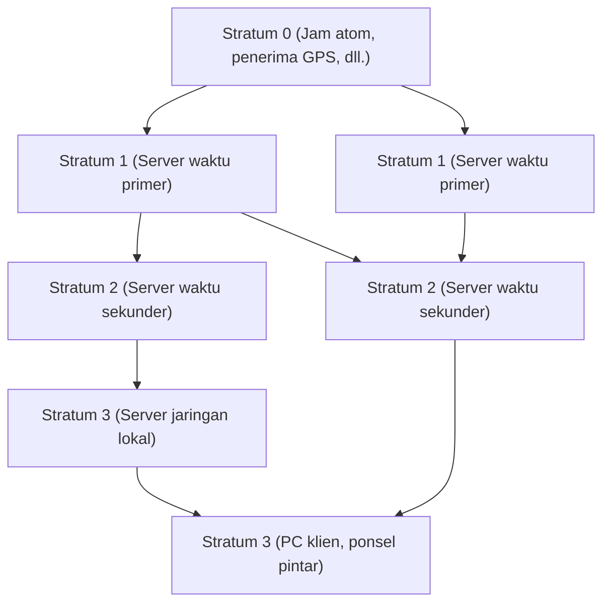

Di masyarakat digital modern, "waktu yang akurat" telah menjadi sesuatu yang dianggap biasa seperti halnya udara. Saat kita membuka ponsel pintar, waktu yang akurat selalu ditampilkan dalam hitungan detik, rapat online dimulai sesuai jadwal, dan transaksi keuangan dicatat dengan presisi milidetik. Namun, bagaimana komputer-komputer yang tak terhitung jumlahnya yang beroperasi secara otonom di internet berbagi waktu dengan begitu akurat?

Di baliknya, beroperasi teknologi yang sangat canggih dan sudah ada sejak lama, yaitu **NTP (Network Time Protocol)**. Artikel ini akan membahas secara mendalam dari perspektif teknologi dan rekayasa, mulai dari mekanisme sinkronisasi waktu dalam infrastruktur TI hingga masa depan sinkronisasi waktu yang dihadirkan oleh "jam kisi optik" (optical lattice clock) terbaru.

## Mengapa Komputer Membutuhkan Sinkronisasi Waktu?

PC atau server yang kita gunakan memiliki jam kecil yang terpasang di dalam motherboard, yang disebut RTC (Real-Time Clock). Komponen ini digerakkan oleh baterai kancing dan sejenisnya, dan terus menghitung waktu meskipun daya komputer dimatikan. Namun, jam yang menggunakan osilator kristal ini rentan terhadap perubahan suhu dan degradasi seiring berjalannya waktu, sehingga penyimpangan (drift) beberapa detik hingga puluhan detik per hari bukanlah hal yang aneh.

Apa yang akan terjadi jika waktu server di seluruh dunia tidak teratur?

- **Ketidakkonsistenan Log**: Jika terjadi kegagalan sistem, penyebabnya tidak mungkin diketahui dengan mencocokkan log beberapa server jika waktunya tidak sama.
- **Kerentanan Keamanan**: Tiket otentikasi (seperti otentikasi Kerberos) dan sertifikat sangat ketat mengenai masa berlakunya. Jika waktu tidak sesuai, pengguna yang sah mungkin tidak dapat masuk, atau ada risiko membiarkan akses yang tidak sah.
- **Inkonsistensi Database**: Dalam database terdistribusi, data diperbarui di banyak node. Jika stempel waktunya (timestamp) kacau, akan terjadi "kehilangan data" di mana data baru ditimpa oleh data lama.

Dengan demikian, dalam infrastruktur TI, "berbagi waktu yang akurat" merupakan elemen yang sangat penting yang dapat dikatakan sebagai aliran darah sistem.

## Cara Kerja NTP (Network Time Protocol)

NTP dirancang oleh Profesor David L. Mills dari University of Delaware pada tahun 1985 dan merupakan salah satu protokol tertua dalam sejarah internet. Menggunakan port UDP 123, ia memiliki mekanisme untuk menghitung penundaan jaringan dan menyinkronkan waktu yang akurat.

### Menjamin Keakuratan melalui Struktur Hierarkis (Stratum)

Jaringan NTP memiliki struktur hierarkis yang disebut "Stratum".

- **Stratum 0**: Sumber waktu yang paling akurat. Perangkat keras seperti jam atom cesium, jam atom rubidium, atau yang menerima sinyal waktu dari satelit GPS termasuk dalam kategori ini. Ini tidak terhubung langsung ke jaringan.
- **Stratum 1**: Server yang terhubung langsung ke perangkat Stratum 0 menggunakan kabel khusus. Memiliki presisi yang sangat tinggi (dalam orde mikrodetik).
- **Stratum 2**: Server yang mendapatkan waktu dari server Stratum 1 melalui jaringan. Banyak server NTP publik di internet termasuk dalam kategori ini. Mereka mendapatkan waktu dari beberapa Stratum 1 dan saling terhubung (peer) untuk meningkatkan akurasi.
- **Stratum 3 dan seterusnya**: Server di tingkat yang lebih rendah dan perangkat akhir seperti PC dan ponsel pintar kita. Stratum ditentukan hingga maksimal 15, dan 16 berarti "tidak dapat disinkronkan".

### Keajaiban Kompensasi Penundaan Jaringan

Hal yang paling menakjubkan tentang NTP adalah ia memiliki algoritma yang menghitung "penundaan (Delay)" saat paket berjalan bolak-balik melintasi jaringan dan "ketidaksimetrisan (Dispersion)" waktu pergi dan pulang, lalu mengoreksi jam klien.

Ketika klien meminta waktu dari server, ia mencatat empat stempel waktu berikut:

1. Waktu saat klien mengirim permintaan
2. Waktu saat server menerima permintaan
3. Waktu saat server mengirimkan respons
4. Waktu saat klien menerima respons

Dari perbedaan waktu ini, NTP secara matematis memperoleh penundaan transmisi jaringan (waktu bolak-balik dikurangi waktu pemrosesan server) dan perbedaan (offset) antara jam klien dan jam server. Perhitungan ini memungkinkan waktu disinkronkan dengan presisi milidetik (seperseribu detik) bahkan melalui internet, di mana komunikasi memiliki penundaan beberapa milidetik hingga puluhan milidetik.

## Menuju Sinkronisasi Presisi Lebih Tinggi: PTP dan Jam Kisi Optik

Meskipun NTP memiliki tingkat presisi yang lebih dari cukup untuk penggunaan umum, presisi yang lebih tinggi diperlukan di bidang teknologi canggih modern.

Sebagai contoh, sinkronisasi antara stasiun pangkalan jaringan seluler 5G dan sistem keuangan yang melakukan perdagangan frekuensi tinggi (HFT) memerlukan presisi dalam orde mikrodetik (sepersejuta detik) hingga nanodetik (sepersemiliar detik). Di area ini, protokol yang disebut **PTP (Precision Time Protocol: IEEE 1588)** digunakan menggantikan NTP. PTP menyediakan pemberian stempel waktu di tingkat perangkat keras dan mencapai sinkronisasi presisi nanodetik di bawah lingkungan jaringan yang sangat ketat.

### Jam Kisi Optik: Jam Tertinggi Generasi Berikutnya

Lebih jauh lagi, "jam kisi optik" saat ini menarik banyak perhatian di garis depan sains dan teknologi.

Saat ini, 1 detik dalam Sistem Satuan Internasional (SI) didefinisikan sebagai "durasi waktu yang setara dengan 9.192.631.770 kali periode radiasi yang sesuai dengan transisi antara dua tingkat hiperhalus keadaan dasar dari atom sesium-133". Jam atom sesium memiliki presisi menakjubkan yang hanya menyimpang 1 detik dalam puluhan juta tahun, tetapi jam kisi optik melampauinya.

Ditemukan oleh tim yang dipimpin Profesor Hidetoshi Katori dari Universitas Tokyo, jam kisi optik memerangkap atom seperti strontium dalam "karton telur cahaya (kisi optik)" yang dibuat oleh sinar laser dan meningkatkan akurasi secara dramatis dengan mengukur getaran puluhan ribu atom secara bersamaan. Presisinya telah mencapai tingkat yang tak terbayangkan yaitu "tidak akan meleset 1 detik pun bahkan setelah usia alam semesta (sekitar 13,8 miliar tahun) berlalu".

### Masa Depan Dimana Infrastruktur TI dan Jam Kisi Optik Bersilangan

Lalu, bagaimana kaitan jam pamungkas ini dengan infrastruktur TI?

Jika jam kisi optik diterapkan untuk penggunaan praktis dan teknologi untuk pengecilan serta distribusi waktu presisi tinggi melalui jaringan serat optik dikembangkan, fondasi infrastruktur komunikasi akan berkembang secara dramatis.

1. **Sinkronisasi Jaringan Presisi Sangat Tinggi**: Jika seluruh internet disinkronkan dalam nanodetik atau pikodetik, konsep komputasi terdistribusi itu sendiri akan berubah. Protokol kompleks yang memperhitungkan penundaan (delay) tidak lagi diperlukan, memungkinkan server di seluruh dunia beroperasi selaras layaknya satu komputer raksasa.
2. **Aplikasi TI dari Geodesi Relativistik**: Menurut teori relativitas umum Einstein, semakin kuat gravitasi (semakin rendah ketinggiannya), semakin lambat waktu berjalan. Dengan presisi jam kisi optik, perbedaan waktu karena perbedaan ketinggian hanya 1 cm dapat dideteksi. Hal ini dapat memungkinkan jam yang dipasang di setiap pusat data dan node jaringan berfungsi sebagai jaringan sensor raksasa yang mendeteksi perubahan ketinggian dan pergerakan kerak bumi.
3. **Fondasi Teknologi Kriptografi Baru**: Dalam komunikasi kuantum dan sistem enkripsi generasi mendatang, sinkronisasi waktu yang sangat akurat merupakan inti dari keamanan. Infrastruktur yang dapat menjamin "kebersamaan" mutlak akan membawa keamanan siber ke dimensi yang sama sekali baru.

## Penutup

Teknologi lama yang disebut NTP ini telah mendukung ekosistem internet raksasa saat ini dan menyelaraskan "detak jantung" komputer di seluruh dunia. Waktu akurat yang kita nikmati tanpa disadari berawal dari jam atom Stratum 0, dan melalui keajaiban jaringan dan algoritma yang berlapis-lapis, ia dikirim ke ponsel pintar di tangan kita.

Dan kini, sebuah terobosan dalam sains dasar yang disebut jam kisi optik akan segera bergabung dengan teknologi komunikasi dan infrastruktur TI. Evolusi teknologi pengukur waktu berkaitan langsung dengan evolusi komputasi. Ketika kita merenungkan bagaimana komputer di seluruh dunia menyesuaikan jamnya, kita menyadari kedalaman luar biasa dari teknologi yang telah dibangun oleh umat manusia.
