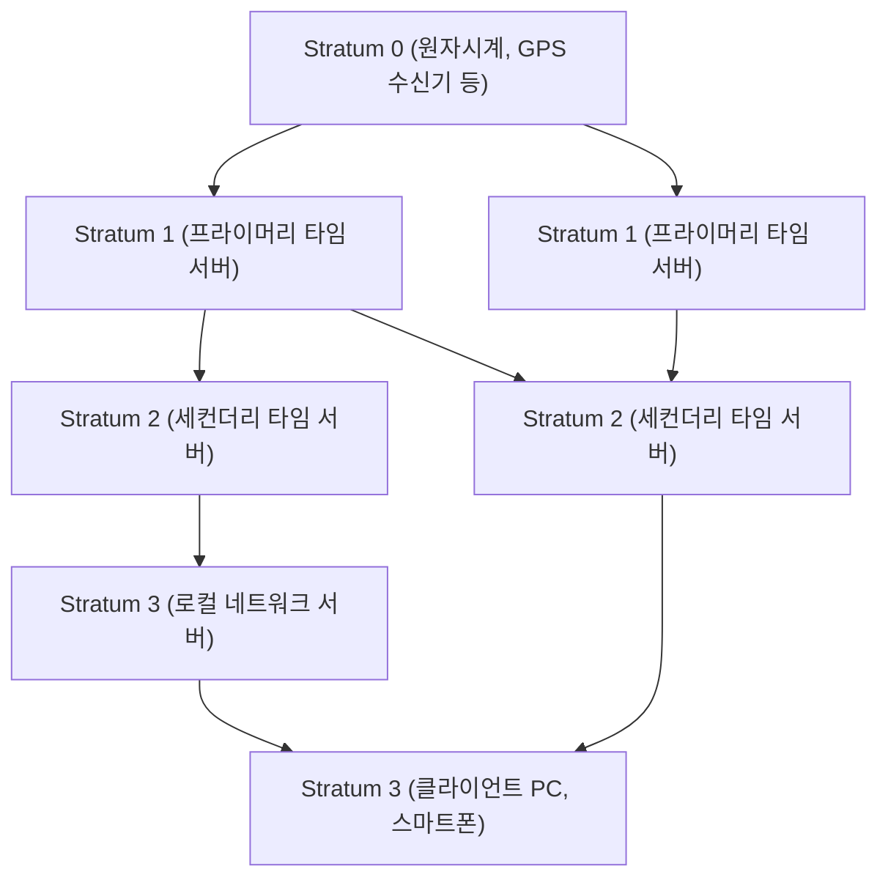

현대의 디지털 사회에서 '정확한 시간'은 공기처럼 당연한 존재가 되었습니다. 스마트폰을 열면 항상 초 단위로 정확한 시간이 표시되고, 온라인 회의는 예정된 시간에 시작되며, 금융 거래는 밀리초 단위의 정밀도로 기록됩니다. 하지만 인터넷상에서 자율적으로 움직이는 무수히 많은 컴퓨터가 어떻게 이렇게 정확하게 시간을 공유하고 있는 걸까요?

그 이면에는 **NTP(Network Time Protocol)**라는, 오래전에 등장했음에도 매우 세련된 기술이 작동하고 있습니다. 본 기사에서는 IT 인프라의 시간 동기화 원리부터 최신 '광격자 시계'가 가져올 미래의 시간 동기화까지 기술과 엔지니어링의 관점에서 깊이 있게 파헤쳐 봅니다.

## 왜 컴퓨터에는 시간 동기화가 필요한가?

우리가 사용하는 PC나 서버에는 메인보드에 RTC(리얼타임 클록)라고 불리는 작은 시계가 내장되어 있습니다. 이것은 버튼형 배터리 등으로 구동되며 컴퓨터의 전원이 꺼져 있어도 시간을 계속 측정합니다. 하지만 이 수정 발진기를 사용한 시계는 온도 변화나 노후화의 영향을 받기 쉬워 하루에 수 초에서 수십 초의 오차(드리프트)가 발생하는 일이 흔합니다.

만약 전 세계 서버의 시간이 제각각이라면 어떻게 될까요?

- **로그 불일치**: 시스템 장애가 발생했을 때 여러 서버의 로그를 대조해도 시간이 어긋나 있으면 원인 규명이 불가능합니다.
- **보안 취약성**: 인증 티켓(Kerberos 인증 등)이나 인증서는 유효기간이 엄격합니다. 시간이 어긋나면 정식 사용자라도 로그인할 수 없게 되거나 무단 접근을 허용할 위험이 있습니다.
- **데이터베이스 모순**: 분산 데이터베이스에서는 여러 노드에서 데이터가 업데이트됩니다. 타임스탬프가 어긋나 있으면 오래된 데이터로 새로운 데이터를 덮어쓰는 '데이터 손실'이 발생합니다.

이처럼 IT 인프라에서 '정확한 시간 공유'는 시스템의 혈액이라고 할 수 있을 정도로 중요한 요소입니다.

## NTP(Network Time Protocol)의 원리

NTP는 1985년 델라웨어 대학의 데이비드 L. 밀스 교수가 설계한, 인터넷 역사에서도 매우 오래된 프로토콜 중 하나입니다. UDP 포트 123번을 사용하며 네트워크의 지연을 계산해 정확한 시간을 동기화하는 구조를 가지고 있습니다.

### 계층 구조(Stratum)를 통한 정확성 보장

NTP 네트워크는 'Stratum(스트라텀)'이라고 불리는 계층 구조를 가지고 있습니다.

- **Stratum 0**: 가장 정확한 시간의 근원. 세슘 원자시계나 루비듐 원자시계, 또는 GPS 위성으로부터 시간 신호를 수신하는 하드웨어 등이 해당합니다. 이것들은 네트워크에 직접 연결되지 않습니다.
- **Stratum 1**: Stratum 0 기기와 전용 케이블로 직접 연결된 서버입니다. 매우 높은 정밀도(마이크로초 단위)를 자랑합니다.
- **Stratum 2**: Stratum 1 서버로부터 네트워크를 통해 시간을 얻어오는 서버입니다. 인터넷상의 공개 NTP 서버 대부분이 여기에 포함됩니다. 여러 개의 Stratum 1로부터 시간을 얻고 서로 피어 연결을 맺어 정밀도를 높입니다.
- **Stratum 3 이후**: 더 하위의 서버나 우리의 PC, 스마트폰 등 엔드 디바이스입니다. Stratum은 최대 15까지 정의되어 있으며, 16은 '동기화 불가'를 의미합니다.

### 네트워크 지연 보정이라는 마법

NTP의 가장 훌륭한 점은 패킷이 네트워크를 왕복할 때의 '지연(Delay)'과 왕복 시간의 '비대칭성(Dispersion)'을 계산하여 클라이언트의 시계를 보정하는 알고리즘을 가지고 있다는 것입니다.

클라이언트가 서버에 시간을 문의할 때 다음 4가지 타임스탬프를 기록합니다:

1. 클라이언트가 요청을 보낸 시간
2. 서버가 요청을 받은 시간
3. 서버가 응답을 보낸 시간
4. 클라이언트가 응답을 받은 시간

NTP는 이 시간 차이로부터 네트워크 전송 지연(왕복에 걸린 시간에서 서버의 처리 시간을 뺀 것)과 클라이언트와 서버 간 시계의 오차(오프셋)를 수학적으로 도출합니다. 이 계산을 통해 통신에 수 밀리초~수십 밀리초의 지연이 있는 인터넷 환경에서도 밀리초(1,000분의 1초) 단위의 정밀도로 시간을 맞출 수 있는 것입니다.

## 더 고정밀 동기화를 향해: PTP와 광격자 시계

NTP는 일반적인 용도에는 충분한 정밀도를 가지고 있지만, 현대의 첨단 기술 분야에서는 더 높은 정밀도가 요구되고 있습니다.

예를 들어 5G 모바일 네트워크의 기지국 간 동기화나 고빈도 매매(HFT)를 수행하는 금융 시스템에서는 마이크로초(100만분의 1초)에서 나노초(10억분의 1초) 단위의 정밀도가 필요합니다. 이 영역에서는 NTP를 대신해 **PTP(Precision Time Protocol: IEEE 1588)**라는 프로토콜이 사용됩니다. PTP는 하드웨어 수준에서 타임스탬프를 부여하며 극히 엄격한 네트워크 환경에서 나노초 단위 정밀도의 동기화를 실현합니다.

### 차세대 궁극의 시계 '광격자 시계'

나아가 현재 과학 기술의 최전선에서 주목받고 있는 것이 '**광격자 시계**'입니다.

현재 국제단위계(SI)의 1초는 "세슘 133 원자의 바닥 상태에 있는 두 초미세 준위 사이의 전이에 대응하는 복사 주기의 9,192,631,770배와 같은 시간"으로 정의되어 있습니다. 세슘 원자시계는 수천만 년에 1초밖에 틀리지 않는 경이로운 정밀도를 자랑하지만, 이를 뛰어넘는 것이 광격자 시계입니다.

도쿄 대학의 카토리 히데토시 교수 등이 고안한 광격자 시계는 레이저 빛으로 만든 '빛의 계란판(광격자)'에 스트론튬 등의 원자를 가두고 수만 개 원자의 진동을 한 번에 측정함으로써 정밀도를 비약적으로 높입니다. 그 정밀도는 "우주의 나이(약 138억 년)가 지나도 1초도 틀리지 않는다"는, 상상을 초월하는 수준에 도달해 있습니다.

### IT 인프라와 광격자 시계가 교차하는 미래

그렇다면 이 궁극의 시계는 IT 인프라와 어떻게 연관될까요?

광격자 시계가 상용화되고 소형화 및 광섬유 네트워크망을 통한 고정밀 시간 전송 기술이 확립된다면 통신 인프라의 근간이 획기적으로 진화할 것입니다.

1. **초고정밀 네트워크 동기화**: 인터넷 전체가 나노초, 피코초 단위로 동기화된다면 분산 컴퓨팅의 개념 자체가 바뀝니다. 지연을 고려한 복잡한 프로토콜이 필요 없어지고 전 세계의 서버가 마치 하나의 거대한 컴퓨터처럼 완전히 동기화되어 작동할 수 있게 됩니다.
2. **상대론적 측지 기술의 IT 응용**: 아인슈타인의 일반 상대성 이론에 따르면 중력이 강한(고도가 낮은) 곳일수록 시간의 흐름은 느려집니다. 광격자 시계의 정밀도라면 불과 1cm의 고도 차이에 의한 시간 지연을 감지할 수 있습니다. 이를 통해 각 데이터 센터나 네트워크 노드에 설치된 시계가 스스로의 고도나 지각 변동을 감지하는 거대한 센서 네트워크로 기능할 가능성이 있습니다.
3. **새로운 암호 기술의 기반**: 양자 통신이나 차세대 암호 시스템에서 극히 정밀한 시간 동기화는 보안의 근간을 이룹니다. 절대적인 '동시성'을 보장할 수 있는 인프라는 사이버 보안을 전혀 새로운 차원으로 끌어올릴 것입니다.

## 맺음말

NTP라는 오래된 기술이 오늘날 인터넷의 거대한 생태계를 지탱하며 전 세계 컴퓨터의 '고동'을 하나로 맞추고 있습니다. 우리가 의식하지 못한 채 누리고 있는 정확한 시간은 Stratum 0의 원자시계에서 시작되어 수많은 네트워크와 알고리즘의 마법을 거쳐 우리 손의 스마트폰으로 전달되고 있는 것입니다.

그리고 지금, 광격자 시계라는 기초 과학의 돌파구가 통신 기술 및 IT 인프라와 융합하려 하고 있습니다. 시간을 측정하는 기술의 진화는 곧 컴퓨팅의 진화로 직결됩니다. 전 세계의 컴퓨터가 어떻게 시계를 맞추고 있는지 그 원리에 대해 생각해 볼 때, 우리는 인류가 쌓아온 기술의 엄청난 깊이를 깨닫게 됩니다.
