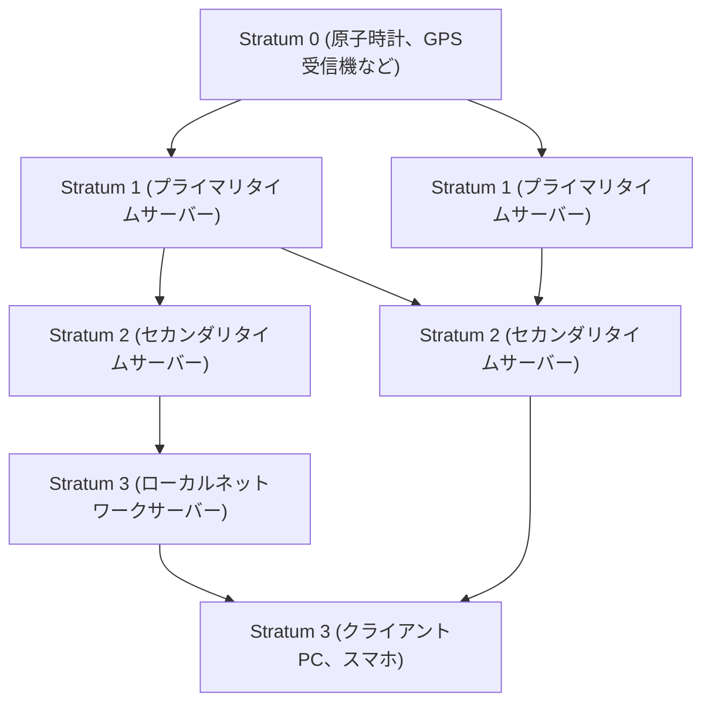

現代のデジタル社会において、「正確な時間」は空気のように当たり前の存在となっています。スマートフォンを開けば常に秒単位で正確な時刻が表示され、オンライン会議は予定通りの時刻に始まり、金融取引はミリ秒単位の精度で記録されます。しかし、インターネット上で自律して動いている無数のコンピュータが、どのようにしてこれほど正確に時刻を共有しているのでしょうか？

その背後には、<strong>NTP（Network Time Protocol）</strong>という、古くから存在しながらも極めて洗練された技術が稼働しています。本記事では、ITインフラストラクチャにおける時刻同期の仕組みから、最新の「光格子時計」がもたらす未来の時刻同期まで、テクノロジーとエンジニアリングの視点から深く掘り下げて解説します。

## なぜコンピュータには時刻同期が必要なのか？

私たちの使っているPCやサーバーには、マザーボード上にRTC（リアルタイムクロック）と呼ばれる小さな時計が内蔵されています。これはボタン電池などで駆動し、コンピュータの電源が切れていても時間を刻み続けます。しかし、この水晶発振器を使った時計は、温度変化や経年劣化の影響を受けやすく、1日に数秒から数十秒のズレ（ドリフト）が生じることが珍しくありません。

もし世界中のサーバーの時間がバラバラだったらどうなるでしょうか？

- **ログの不整合**: システム障害が発生した際、複数のサーバーのログを突き合わせても、時間がずれていれば原因究明が不可能です。
- **セキュリティの脆弱性**: 認証チケット（Kerberos認証など）や証明書は有効期限に厳格です。時間がずれると正規のユーザーでもログインできなくなったり、不正なアクセスを許してしまう危険性があります。
- **データベースの矛盾**: 分散データベースでは、複数のノードでデータが更新されます。タイムスタンプが狂っていると、古いデータで新しいデータを上書きしてしまう「データロスト」が発生します。

このように、ITインフラにおいて「正確な時間の共有」はシステムの血液とも言えるほど重要な要素なのです。

## NTP（Network Time Protocol）の仕組み

NTPは、1985年にデラウェア大学のデイヴィッド・L・ミルズ教授によって設計された、インターネットの歴史の中でも非常に古いプロトコルの一つです。UDPポート123番を使用し、ネットワークの遅延を計算して正確な時刻を同期する仕組みを持っています。

### 階層構造（Stratum）による正確性の担保

NTPネットワークは、「Stratum（ストラタム）」と呼ばれる階層構造を持っています。

- **Stratum 0**: 最も正確な時間の源。セシウム原子時計やルビジウム原子時計、あるいはGPS衛星からの時刻信号を受信するハードウェアなどが該当します。これらはネットワークには直接接続されません。
- **Stratum 1**: Stratum 0の機器と専用ケーブルで直接接続されたサーバーです。非常に高い精度（マイクロ秒単位）を誇ります。
- **Stratum 2**: Stratum 1のサーバーからネットワーク経由で時刻を取得するサーバーです。インターネット上の公開NTPサーバーの多くはここに含まれます。複数のStratum 1から時刻を取得し、互いにピア接続して精度を高め合います。
- **Stratum 3以降**: さらに下位のサーバーや、私たちのPC、スマートフォンなどのエンドデバイスです。Stratumは最大15まで定義されており、16は「同期不能」を意味します。

### ネットワーク遅延の補正という魔法

NTPの最も素晴らしい点は、パケットがネットワークを往復する際の「遅延（Delay）」と、行き帰りの時間の「非対称性（Dispersion）」を計算し、クライアントの時計を補正するアルゴリズムを持っていることです。

クライアントがサーバーに時刻を問い合わせる際、以下の4つのタイムスタンプを記録します：

1. クライアントがリクエストを送信した時刻
2. サーバーがリクエストを受信した時刻
3. サーバーがレスポンスを送信した時刻
4. クライアントがレスポンスを受信した時刻

NTPはこれらの時間差から、ネットワークの伝送遅延（往復にかかった時間からサーバーの処理時間を引いたもの）と、クライアントとサーバーの時計のズレ（オフセット）を数学的に導き出します。この計算により、通信に数ミリ秒〜数十ミリ秒の遅延があるインターネット越しでも、ミリ秒（1000分の1秒）単位の精度で時刻を合わせることができるのです。

## より高精度な同期へ：PTPと光格子時計

NTPは一般的な用途には十分すぎる精度を持っていますが、現代の先端技術分野では、さらに高い精度が求められるようになっています。

たとえば、5Gモバイルネットワークの基地局間の同期や、高頻度取引（HFT）を行う金融システムでは、マイクロ秒（100万分の1秒）からナノ秒（10億分の1秒）単位の精度が必要です。この領域では、NTPに代わり<strong>PTP（Precision Time Protocol: IEEE 1588）</strong>というプロトコルが使用されます。PTPはハードウェアレベルでのタイムスタンプ付与を行い、極めて厳格なネットワーク環境下でナノ秒精度の同期を実現します。

### 次世代の究極の時計「光格子時計」

さらに現在、科学技術の最前線で注目を集めているのが「**光格子時計**」です。

現在、国際単位系（SI）の1秒は「セシウム133原子の基底状態の2つの超微細準位の間の遷移に対応する放射の周期の91億9263万1770倍に等しい時間」と定義されています。セシウム原子時計は数千万年に1秒しかずれないという驚異的な精度を誇りますが、それをさらに凌駕するのが光格子時計です。

東京大学の香取秀俊教授らによって考案された光格子時計は、レーザー光で作った「光の卵パック（光格子）」にストロンチウムなどの原子を閉じ込め、数万個の原子の振動を一度に測定することで精度を飛躍的に高めます。その精度は「宇宙の年齢（約138億年）が経過しても1秒もずれない」という、もはや想像を絶するレベルに達しています。

### ITインフラと光格子時計が交差する未来

では、この究極の時計はITインフラとどう関わってくるのでしょうか。

光格子時計が実用化され、小型化や光ファイバーネットワーク網を通じた高精度な時刻配信技術が確立されれば、通信インフラの根幹が劇的に進化します。

1. **超高精度なネットワーク同期**: インターネット全体がナノ秒、ピコ秒単位で同期されれば、分散コンピューティングの概念そのものが変わります。遅延を考慮した複雑なプロトコルが不要になり、世界中のサーバーがまるで1つの巨大なコンピュータのように完全に同期して動作することが可能になります。
2. **相対論的測地技術のIT応用**: アインシュタインの一般相対性理論によれば、重力が強い（標高が低い）場所ほど時間の進み方は遅くなります。光格子時計の精度があれば、わずか1cmの標高差による時間の遅れを検知できます。これにより、各データセンターやネットワークノードに設置された時計が、自らの標高や地殻変動を検知する巨大なセンサーネットワークとして機能する可能性があります。
3. **新しい暗号技術の基盤**: 量子通信や次世代の暗号システムにおいて、極めて精密な時刻同期はセキュリティの根幹をなします。絶対的な「同時性」を担保できるインフラは、サイバーセキュリティを全く新しい次元へ引き上げるでしょう。

## おわりに

NTPという古くからある技術が、今日のインターネットの巨大なエコシステムを支え、世界中のコンピュータの「鼓動」を一つに合わせています。私たちが意識することなく享受している正確な時間は、Stratum 0の原子時計から始まり、幾重ものネットワークとアルゴリズムの魔法を経て、手元のスマートフォンへと届けられているのです。

そして今、光格子時計という基礎科学のブレイクスルーが、通信技術やITインフラと融合しようとしています。時間を計る技術の進化は、そのままコンピューティングの進化に直結します。世界中のコンピュータがどのように時計を合わせているのか、その仕組みに思いを馳せるとき、私たちは人類が築き上げてきたテクノロジーの途方もない奥深さに気づかされるのです。
