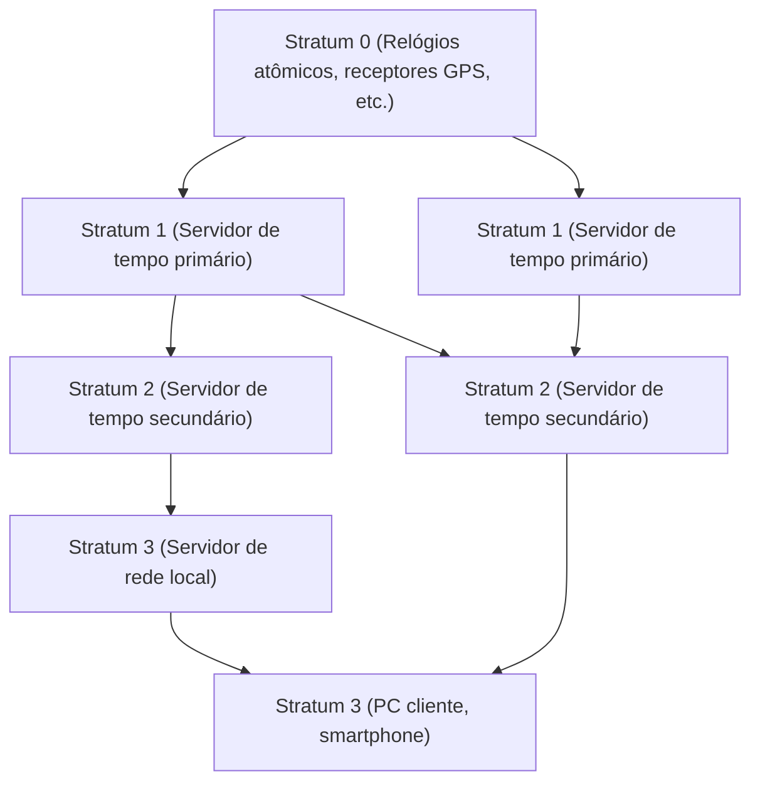

Na sociedade digital moderna, o "tempo exato" tornou-se algo tão natural quanto o ar que respiramos. Se você abrir o seu smartphone, a hora exata ao segundo é sempre exibida, as reuniões online começam na hora programada e as transações financeiras são registradas com precisão de milissegundos. Mas como é que os inúmeros computadores que operam de forma autônoma na Internet partilham o tempo com tanta precisão?

Por trás disso, opera uma tecnologia muito antiga, mas extremamente sofisticada, chamada **NTP (Network Time Protocol)**. Neste artigo, exploraremos a fundo o mecanismo de sincronização de tempo na infraestrutura de TI até o futuro da sincronização de tempo trazido pelo mais recente "relógio de rede óptica", a partir de uma perspectiva de tecnologia e engenharia.

## Por que os computadores precisam de sincronização de tempo?

Os PCs e servidores que usamos possuem um pequeno relógio embutido na placa-mãe chamado RTC (Real Time Clock). Ele é alimentado por uma bateria tipo botão e continua a contar o tempo mesmo quando o computador está desligado. No entanto, esses relógios que usam osciladores de cristal são suscetíveis a mudanças de temperatura e degradação ao longo do tempo, e não é incomum ocorrer um desvio (drift) de alguns a dezenas de segundos por dia.

O que aconteceria se os horários dos servidores de todo o mundo estivessem dessincronizados?

- **Inconsistência de logs**: Quando ocorre uma falha no sistema, mesmo que os logs de vários servidores sejam cruzados, é impossível investigar a causa se os horários estiverem incorretos.
- **Vulnerabilidade de segurança**: Os tickets de autenticação (como a autenticação Kerberos) e certificados têm prazos de validade rigorosos. Se o tempo estiver errado, usuários legítimos podem não conseguir fazer login, ou pode-se permitir o acesso não autorizado.
- **Inconsistência de banco de dados**: Em bancos de dados distribuídos, os dados são atualizados em vários nós. Se os carimbos de data/hora (timestamps) estiverem desregulados, ocorre uma "perda de dados" onde dados antigos substituem os novos.

Desta forma, o "compartilhamento do tempo exato" na infraestrutura de TI é um elemento tão importante que pode ser considerado o sangue do sistema.

## O Mecanismo do NTP (Network Time Protocol)

O NTP é um dos protocolos mais antigos da história da Internet, projetado em 1985 pelo professor David L. Mills da Universidade de Delaware. Ele usa a porta UDP 123 e possui um mecanismo que calcula o atraso da rede para sincronizar o horário com precisão.

### Garantindo a precisão através da estrutura hierárquica (Stratum)

A rede NTP possui uma estrutura hierárquica chamada "Stratum".

- **Stratum 0**: A fonte de tempo mais precisa. Inclui hardware que recebe sinais de tempo de relógios atômicos de césio, relógios atômicos de rubídio ou satélites GPS. Eles não estão conectados diretamente à rede.
- **Stratum 1**: Servidores conectados diretamente a dispositivos Stratum 0 por meio de cabos dedicados. Possuem uma precisão altíssima (nível de microssegundos).
- **Stratum 2**: Servidores que obtêm tempo pela rede a partir de servidores Stratum 1. Muitos dos servidores NTP públicos na Internet estão incluídos aqui. Eles obtêm tempo de múltiplos Stratum 1 e se conectam uns aos outros para melhorar a precisão.
- **Stratum 3 em diante**: Servidores de nível inferior e dispositivos finais, como nossos PCs e smartphones. O Stratum é definido até um máximo de 15, com 16 significando "não sincronizado".

### A magia da compensação de atraso de rede

A característica mais maravilhosa do NTP é que ele possui um algoritmo que calcula o "atraso (Delay)" dos pacotes indo e vindo pela rede e a "assimetria (Dispersion)" do tempo de ida e volta, corrigindo assim o relógio do cliente.

Quando o cliente solicita a hora ao servidor, ele registra os seguintes quatro carimbos de data/hora (timestamps):

1. A hora em que o cliente enviou a solicitação
2. A hora em que o servidor recebeu a solicitação
3. A hora em que o servidor enviou a resposta
4. A hora em que o cliente recebeu a resposta

A partir dessas diferenças de tempo, o NTP deduz matematicamente o atraso de transmissão da rede (o tempo de ida e volta menos o tempo de processamento do servidor) e o desvio do relógio (offset) entre o cliente e o servidor. Com esse cálculo, mesmo através da Internet, onde há um atraso de alguns a dezenas de milissegundos na comunicação, é possível sincronizar o tempo com uma precisão na ordem dos milissegundos (milésimos de segundo).

## Rumo a uma sincronização de alta precisão: PTP e Relógio de Rede Óptica

Embora o NTP tenha uma precisão mais do que suficiente para usos em geral, campos de tecnologia avançada moderna têm exigido precisões ainda maiores.

Por exemplo, a sincronização entre estações rádio base de redes móveis 5G e sistemas financeiros que realizam negociações de alta frequência (HFT) requerem precisões da ordem de microssegundos (um milionésimo de segundo) a nanossegundos (um bilionésimo de segundo). Nessas áreas, utiliza-se o protocolo **PTP (Precision Time Protocol: IEEE 1588)** no lugar do NTP. O PTP realiza a atribuição de timestamps a nível de hardware e alcança uma sincronização de precisão de nanossegundos em ambientes de rede extremamente rigorosos.

### O "Relógio de Rede Óptica", o Relógio Definitivo da Próxima Geração

Atualmente, na vanguarda da ciência e tecnologia, o que está chamando a atenção é o "**relógio de rede óptica**".

Hoje, um segundo no Sistema Internacional de Unidades (SI) é definido como "a duração de 9.192.631.770 períodos da radiação correspondente à transição entre os dois níveis hiperfinos do estado fundamental do átomo de césio 133". Embora o relógio atômico de césio possua uma precisão assombrosa, atrasando apenas um segundo a cada dezenas de milhões de anos, o relógio de rede óptica o supera ainda mais.

O relógio de rede óptica, idealizado pelo professor Hidetoshi Katori da Universidade de Tóquio e outros, aprisiona átomos como o estrôncio em "caixas de ovo de luz (rede óptica)" criadas por feixes de laser e mede a vibração de dezenas de milhares de átomos simultaneamente, aumentando drasticamente a precisão. Sua precisão atinge um nível quase inimaginável, onde "não desviaria nem 1 segundo mesmo se a idade do universo (cerca de 13,8 bilhões de anos) tivesse se passado".

### O futuro onde a Infraestrutura de TI e o Relógio de Rede Óptica se cruzam

Então, como esse relógio supremo se relaciona com a infraestrutura de TI?

Se os relógios de rede óptica forem colocados em uso prático e tecnologias para sua miniaturização e distribuição de tempo de alta precisão através de redes de fibra óptica forem estabelecidas, a base da infraestrutura de comunicação evoluirá dramaticamente.

1. **Sincronização de rede de altíssima precisão**: Se toda a Internet for sincronizada em unidades de nanossegundos ou picossegundos, o próprio conceito de computação distribuída mudará. Protocolos complexos que consideram atrasos se tornarão desnecessários, e servidores em todo o mundo poderão operar de forma completamente sincronizada, como se fossem um único e gigantesco computador.
2. **Aplicação em TI de tecnologia geodésica relativística**: De acordo com a teoria da relatividade geral de Einstein, quanto mais forte for a gravidade (menor a altitude), mais lentamente o tempo passa. Com a precisão de um relógio de rede óptica, é possível detectar o atraso de tempo causado por uma diferença de altitude de apenas 1 cm. Isso significa que os relógios instalados em cada data center ou nó de rede poderão funcionar como uma enorme rede de sensores, detectando sua própria altitude e os movimentos da crosta terrestre.
3. **Nova base para tecnologia de criptografia**: Em comunicações quânticas e sistemas criptográficos de próxima geração, uma sincronização de tempo extremamente precisa constitui o alicerce da segurança. Uma infraestrutura capaz de garantir uma "simultaneidade" absoluta elevará a segurança cibernética a um patamar completamente novo.

## Conclusão

A antiga tecnologia conhecida como NTP sustenta o enorme ecossistema da Internet atual, fazendo com que as "batidas" dos computadores em todo o mundo pulsem em uníssono. O tempo preciso de que desfrutamos sem perceber começa nos relógios atômicos do Stratum 0 e, através de múltiplas camadas de redes e da magia dos algoritmos, chega aos nossos smartphones.

E agora, o avanço científico fundamental do relógio de rede óptica está prestes a se fundir com a tecnologia de comunicação e a infraestrutura de TI. A evolução da tecnologia de medição de tempo está diretamente ligada à evolução da computação. Quando refletimos sobre como os computadores de todo o mundo sincronizam seus relógios e o mecanismo por trás disso, percebemos a profundidade extraordinária da tecnologia que a humanidade construiu.
