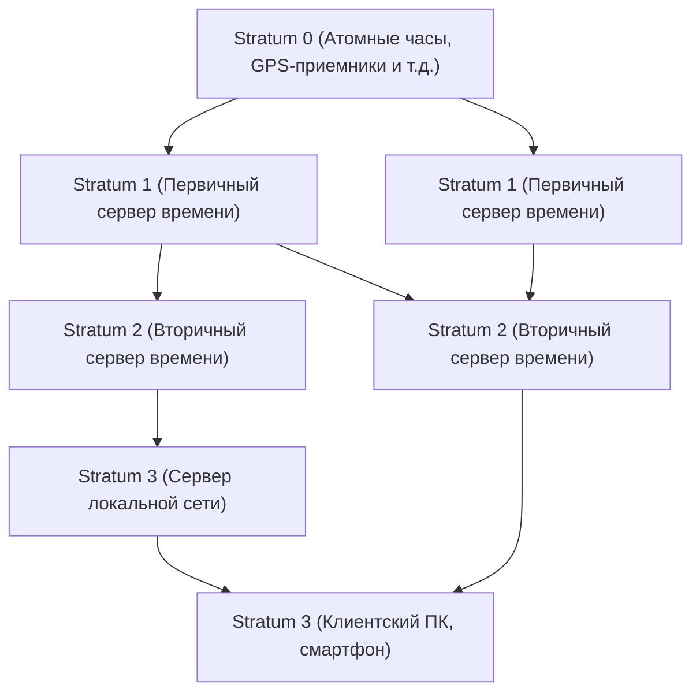

В современном цифровом обществе «точное время» стало таким же естественным и само собой разумеющимся, как воздух. Стоит открыть смартфон, как всегда отображается точное время с точностью до секунды, онлайн-встречи начинаются в запланированное время, а финансовые транзакции записываются с точностью до миллисекунд. Но как бесчисленным компьютерам, работающим автономно в Интернете, удается так точно синхронизировать время?

За этим стоит **NTP (Network Time Protocol)** — старая, но чрезвычайно сложная и отлаженная технология. В этой статье мы подробно рассмотрим эту тему с точки зрения технологий и инженерии, начиная с механизмов синхронизации времени в ИТ-инфраструктуре и заканчивая будущим синхронизации времени, которое принесут новейшие «оптические часы на оптической решетке».

## Зачем компьютерам нужна синхронизация времени?

ПК и серверы, которыми мы пользуемся, имеют на материнской плате встроенные небольшие часы, называемые RTC (часы реального времени). Они работают от батарейки и продолжают отсчитывать время даже тогда, когда питание компьютера отключено. Однако такие часы, использующие кварцевый генератор, подвержены влиянию изменений температуры и старения, и нередко их дрейф составляет от нескольких секунд до десятков секунд в день.

Что бы произошло, если бы время на серверах по всему миру расходилось?

- **Несоответствие логов**: При возникновении системного сбоя, если время на нескольких серверах расходится, сопоставить логи и найти причину становится невозможно.
- **Уязвимости безопасности**: Билеты аутентификации (например, аутентификация Kerberos) и сертификаты имеют строгие сроки действия. Если время сбито, законные пользователи могут потерять возможность войти в систему, или же это может открыть путь для несанкционированного доступа.
- **Противоречия в базах данных**: В распределенных базах данных данные обновляются на нескольких узлах. Если временные метки неверны, может произойти «потеря данных», когда новые данные перезаписываются старыми.

Таким образом, «совместное использование точного времени» в ИТ-инфраструктуре является настолько важным элементом, что его можно назвать кровью системы.

## Как работает NTP (Network Time Protocol)

NTP — один из старейших протоколов в истории Интернета, разработанный в 1985 году профессором Дэвидом Л. Миллсом (David L. Mills) из Делавэрского университета. Он использует UDP-порт 123 и имеет механизм точной синхронизации времени путем вычисления сетевой задержки.

### Обеспечение точности с помощью иерархической структуры (Stratum)

Сеть NTP имеет иерархическую структуру, называемую «Stratum» (стратум).

- **Stratum 0**: Самый точный источник времени. К ним относится такое оборудование, как цезиевые или рубидиевые атомные часы, или аппаратное обеспечение, принимающее сигналы времени от спутников GPS. Они не подключены напрямую к сети.
- **Stratum 1**: Серверы, напрямую подключенные к оборудованию Stratum 0 с помощью специального кабеля. Обладают чрезвычайно высокой точностью (до микросекунд).
- **Stratum 2**: Серверы, получающие время от серверов Stratum 1 по сети. Большинство публичных NTP-серверов в Интернете относятся к этой категории. Они получают время от нескольких серверов Stratum 1 и соединяются друг с другом как пиры для повышения точности.
- **Stratum 3 и ниже**: Серверы более низкого уровня и конечные устройства, такие как наши ПК и смартфоны. Определено до 15 уровней Stratum, а 16 означает «синхронизация невозможна».

### Магия компенсации сетевой задержки

Самое замечательное в NTP то, что у него есть алгоритм вычисления «задержки» (Delay) при прохождении пакета туда и обратно по сети и «асимметрии» (Dispersion) времени туда и обратно, который затем корректирует часы клиента.

Когда клиент запрашивает время у сервера, записываются следующие четыре временные метки:

1. Время отправки запроса клиентом
2. Время получения запроса сервером
3. Время отправки ответа сервером
4. Время получения ответа клиентом

На основе разницы этих времен NTP математически выводит сетевую задержку передачи (время туда-обратно минус время обработки на сервере) и расхождение (смещение) между часами клиента и сервера. Благодаря этому вычислению время можно синхронизировать с точностью до миллисекунд (тысячных долей секунды), даже если задержка при передаче через Интернет составляет от нескольких миллисекунд до десятков миллисекунд.

## К еще более точной синхронизации: PTP и оптические часы на оптической решетке

NTP обладает более чем достаточной точностью для общих целей, но в современных передовых технологических областях требуется еще более высокая точность.

Например, для синхронизации базовых станций мобильных сетей 5G или в финансовых системах, занимающихся высокочастотной торговлей (HFT), требуется точность от микросекунд (миллионных долей секунды) до наносекунд (миллиардных долей секунды). В этой области вместо NTP используется протокол **PTP (Precision Time Protocol: IEEE 1588)**. PTP выполняет присвоение временных меток на аппаратном уровне и обеспечивает синхронизацию с наносекундной точностью в строго контролируемых сетевых средах.

### Оптические часы на оптической решетке: идеальные часы следующего поколения

Более того, на переднем крае науки и техники сейчас привлекают внимание «**оптические часы на оптической решетке**» (optical lattice clock).

В настоящее время 1 секунда в Международной системе единиц (СИ) определяется как «время, равное 9 192 631 770 периодам излучения, соответствующего переходу между двумя сверхтонкими уровнями основного состояния атома цезия-133». Цезиевые атомные часы могут похвастаться поразительной точностью: они отстают лишь на 1 секунду за десятки миллионов лет, но оптические часы на оптической решетке превосходят даже этот показатель.

Оптические часы на оптической решетке, изобретенные профессором Хидэтоси Катори (Hidetoshi Katori) из Токийского университета и его командой, улавливают атомы стронция в «упаковке для яиц из света» (оптической решетке), созданной лазерным светом, и значительно повышают точность за счет одновременного измерения колебаний десятков тысяч атомов. Их точность достигла невообразимого уровня: «даже если пройдет возраст Вселенной (около 13,8 миллиарда лет), они не собьются ни на одну секунду».

### Будущее, в котором пересекаются ИТ-инфраструктура и оптические часы

Итак, как же эти идеальные часы связаны с ИТ-инфраструктурой?

Если оптические часы будут внедрены в практику, станут компактными и будет создана технология высокоточной передачи времени через оптоволоконные сети, основа коммуникационной инфраструктуры претерпит кардинальные изменения.

1. **Сверхточная сетевая синхронизация**: Если весь Интернет будет синхронизирован на уровне наносекунд или пикосекунд, сама концепция распределенных вычислений изменится. Сложные протоколы, учитывающие задержки, станут ненужными, и серверы по всему миру смогут работать в полной синхронизации, словно один гигантский компьютер.
2. **Применение релятивистских геодезических технологий в ИТ**: Согласно общей теории относительности Эйнштейна, в местах с более сильной гравитацией (на меньшей высоте) время течет медленнее. Точность оптических часов позволяет обнаружить задержку времени, вызванную разницей в высоте всего в 1 см. Благодаря этому часы, установленные в каждом центре обработки данных или сетевом узле, могут работать как гигантская сенсорная сеть, которая определяет собственную высоту и движение земной коры.
3. **Основа для новых криптографических технологий**: В квантовой связи и криптографических системах следующего поколения чрезвычайно точная синхронизация времени составляет основу безопасности. Инфраструктура, способная гарантировать абсолютную «одновременность», выведет кибербезопасность на совершенно новый уровень.

## Заключение

NTP, древняя технология, поддерживает огромную экосистему современного Интернета и синхронизирует «сердцебиение» компьютеров по всему миру в единый ритм. Точное время, которым мы бессознательно наслаждаемся, берет свое начало от атомных часов Stratum 0, проходит через магию множества сетей и алгоритмов и доставляется на наши смартфоны.

И сейчас фундаментальный научный прорыв, такой как оптические часы на оптической решетке, сливается с коммуникационными технологиями и ИТ-инфраструктурой. Эволюция технологий измерения времени напрямую связана с эволюцией вычислительной техники. Задумываясь о том, как компьютеры по всему миру синхронизируют свои часы и о механизмах этого процесса, мы осознаем невероятную глубину технологий, созданных человечеством.
