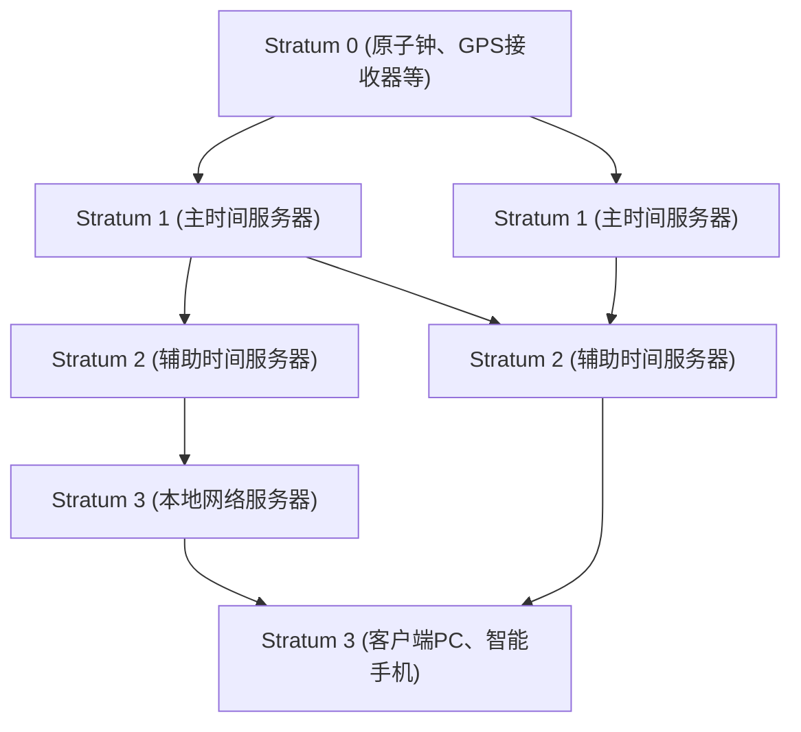

在现代数字社会中，“准确的时间”已经像空气一样理所当然。打开智能手机，总是能显示精确到秒的时间；在线会议按计划准时开始；金融交易以毫秒级的精度记录。然而，在互联网上自主运行的无数计算机，是如何如此精确地共享时间的呢？

在其背后，运行着一项名为**NTP（Network Time Protocol，网络时间协议）**的古老却又极其成熟的技术。本文将从技术与工程的角度深入探讨，从IT基础设施中时间同步的机制，一直讲到最新的“光晶格钟”将带来的未来时间同步。

## 为什么计算机需要时间同步？

我们使用的PC和服务器的主板上，内置了一个被称为RTC（实时时钟）的小时钟。它由纽扣电池等驱动，即使计算机断电也能继续计时。然而，这种使用石英振荡器的时钟很容易受到温度变化和老化等影响，每天产生几秒到几十秒的偏差（漂移）并不少见。

如果世界各地服务器的时间各不相同，会发生什么呢？

- **日志不一致**：当系统发生故障时，即使核对多台服务器的日志，如果时间有偏差，也无法查明原因。
- **安全漏洞**：身份验证票据（如Kerberos身份验证）和证书对有效期的要求非常严格。一旦时间出现偏差，可能会导致合法用户无法登录，或者面临被非法访问的风险。
- **数据库冲突**：在分布式数据库中，数据会在多个节点上进行更新。如果时间戳混乱，就会发生用旧数据覆盖新数据的“数据丢失”现象。

综上所述，在IT基础设施中，“共享准确的时间”是如同系统血液一般重要的要素。

## NTP（网络时间协议）的机制

NTP由特拉华大学的大卫·L·米尔斯（David L. Mills）教授于1985年设计，是互联网历史上非常古老的协议之一。它使用UDP 123端口，具有计算网络延迟并同步准确时间的机制。

### 通过层级结构（Stratum）保证准确性

NTP网络具有被称为“Stratum（层级）”的层级结构。

- **Stratum 0**：最准确的时间源。包括铯原子钟、铷原子钟，或接收GPS卫星时间信号的硬件等。它们不直接连接到网络。
- **Stratum 1**：通过专用电缆与Stratum 0设备直接连接的服务器。拥有极高的精度（微秒级）。
- **Stratum 2**：通过网络从Stratum 1服务器获取时间的服务器。互联网上的许多公共NTP服务器都属于这一层。它们从多个Stratum 1服务器获取时间，并相互进行对等连接以提高精度。
- **Stratum 3及以上**：更下层的服务器，以及我们的PC、智能手机等终端设备。Stratum最大定义为15，16则表示“无法同步”。

### 修正网络延迟的魔法

NTP最了不起的一点在于，它拥有一种算法，能够计算数据包在网络中往返的“延迟（Delay）”以及往返时间的“不对称性（Dispersion）”，从而对客户端的时钟进行修正。

当客户端向服务器查询时间时，会记录以下4个时间戳：

1. 客户端发送请求的时间
2. 服务器接收请求的时间
3. 服务器发送响应的时间
4. 客户端接收响应的时间

根据这些时间差，NTP能够数学推导出网络传输延迟（往返时间减去服务器处理时间）以及客户端和服务器之间的时间偏差（偏移量）。通过这种计算，即使在存在几毫秒到几十毫秒通信延迟的互联网上，也能以毫秒（千分之一秒）为单位的精度对齐时间。

## 迈向更高精度的同步：PTP与光晶格钟

NTP在一般用途上已经具备了绰绰有余的精度，但在现代前沿技术领域，对精度的要求正变得越来越高。

例如，在5G移动网络的基站间同步或进行高频交易（HFT）的金融系统中，需要微秒（百万分之一秒）到纳秒（十亿分之一秒）级别的精度。在这一领域，通常会使用**PTP（Precision Time Protocol: IEEE 1588，精确时间协议）**来替代NTP。PTP在硬件级别赋予时间戳，能够在极为严格的网络环境下实现纳秒级的同步。

### 下一代的终极时钟“光晶格钟”

此外，目前在科学技术的最前沿，备受瞩目的是“**光晶格钟**”。

目前，国际单位制（SI）的1秒被定义为“铯-133原子基态的两个超精细能级之间跃迁所对应的辐射周期的91亿9263万1770倍的时间”。铯原子钟拥有几千万年才产生1秒误差的惊人精度，但光晶格钟更是超越了这一水平。

由东京大学的香取秀俊教授等人构想的光晶格钟，利用激光束形成“光的鸡蛋盒（光晶格）”将锶等原子困在其中，通过同时测量数万个原子的振动，从而使精度实现了飞跃性的提升。它的精度已经达到了“即使经过宇宙的年龄（约138亿年）也不会偏差1秒”的难以想象的水平。

### IT基础设施与光晶格钟交汇的未来

那么，这种终极时钟将如何与IT基础设施联系起来呢？

一旦光晶格钟实现商业化，并且基于光纤网络网的小型化与高精度时间分配技术得到确立，通信基础设施的根基将发生戏剧性的演变。

1. **超高精度网络同步**：如果整个互联网能够以纳秒甚至皮秒为单位进行同步，分布式计算的概念本身将发生改变。将不再需要考虑延迟的复杂协议，世界各地的服务器可以像一台巨大的计算机一样完美同步地运行。
2. **相对论测地技术的IT应用**：根据爱因斯坦的广义相对论，引力越强（海拔越低）的地方，时间流逝得越慢。利用光晶格钟的精度，可以检测到仅1厘米海拔差异带来的时间延迟。这样一来，安装在各个数据中心或网络节点的时钟就有可能成为感知自身海拔与地壳变动的巨大传感器网络。
3. **新密码技术的基石**：在量子通信和下一代密码系统中，极其精密的时间同步构成了安全的根基。能够保证绝对“同时性”的基础设施，将把网络安全提升到一个全新的高度。

## 结语

NTP这项古老的技术支撑着今天互联网的庞大生态系统，将世界各地计算机的“心跳”合而为一。我们在不经意间享受到的准确时间，是从Stratum 0的原子钟开始，经过重重网络与算法的魔法，最终传递到我们手中的智能手机上。

而如今，被称为光晶格钟的基础科学突破，正准备与通信技术和IT基础设施相融合。计时技术的演进将直接带动计算技术的演进。当我们思考世界各地的计算机是如何对时的，以及背后的机制时，我们便会深刻地意识到人类所建立的技术之广博与深邃。
