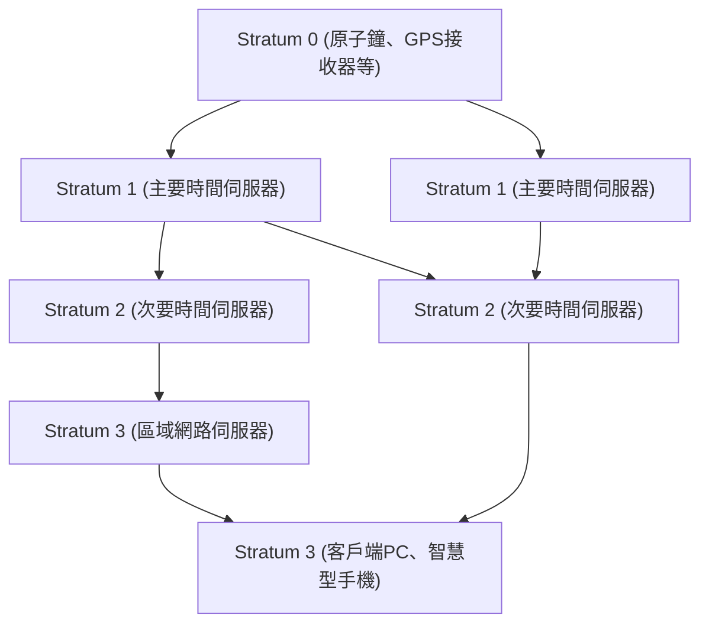

現代的數位社會中，「準確的時間」就像空氣一樣是理所當然的存在。打開智慧型手機，總能顯示精確到秒的時間，線上會議會按時開始，金融交易則以毫秒級的精度記錄。然而，在網際網路上自主運作的無數電腦，是如何如此準確地共享時間的呢？

其背後運作著一項名為**NTP（Network Time Protocol）**，歷史悠久卻極度精密的技術。本文將從技術與工程的視角，深入探討從IT基礎設施中時間同步的機制，到最新的「光晶格鐘」所帶來未來時間同步的發展。

## 為什麼電腦需要時間同步？

我們使用的個人電腦和伺服器中，主機板上內建了一個稱為RTC（Real Time Clock，即時時鐘）的小型時鐘。它由鈕扣電池等驅動，即使電腦關機也能持續計時。然而，這種使用石英震盪器的時鐘容易受到溫度變化和老化的影響，一天產生數秒到數十秒的偏差（漂移）並不罕見。

如果全世界伺服器的時間都參差不齊，會發生什麼事？

- **日誌不一致**: 當系統發生故障時，即使比對多台伺服器的日誌，如果時間有偏差，將無法追查原因。
- **安全漏洞**: 認證票證（如Kerberos認證）和憑證對有效期限非常嚴格。時間偏差可能導致合法使用者無法登入，或允許未經授權的存取。
- **資料庫矛盾**: 在分散式資料庫中，資料會在多個節點上更新。如果時間戳記錯誤，會發生用舊資料覆寫新資料的「資料遺失」。

因此，在IT基礎設施中，「準確的時間共享」可以說是系統血液般重要的元素。

## NTP（Network Time Protocol）的運作原理

NTP是由德拉瓦大學的David L. Mills教授於1985年所設計，是網際網路歷史中非常古老的協定之一。它使用UDP連接埠123，具有計算網路延遲以同步準確時間的機制。

### 透過階層結構（Stratum）確保準確性

NTP網路具有被稱為「Stratum」的階層結構。

- **Stratum 0**: 最準確的時間來源。例如銫原子鐘、銣原子鐘，或接收GPS衛星時間訊號的硬體等。它們不會直接連接到網路。
- **Stratum 1**: 使用專用纜線直接連接Stratum 0設備的伺服器。具有極高的精確度（微秒級）。
- **Stratum 2**: 透過網路從Stratum 1伺服器取得時間的伺服器。網際網路上的大多數公開NTP伺服器都屬於此類。它們從多個Stratum 1取得時間，並相互進行對等連線（Peer）以提高精確度。
- **Stratum 3及以下**: 更下層的伺服器，以及我們的PC、智慧型手機等終端裝置。Stratum最高定義到15，16代表「無法同步」。

### 網路延遲補償的魔法

NTP最出色的一點在於，它擁有計算封包在網路上往返時的「延遲（Delay）」以及去程和回程時間的「不對稱性（Dispersion）」，並藉此補償客戶端時鐘的演算法。

當客戶端向伺服器查詢時間時，會記錄以下四個時間戳記：

1. 客戶端發送請求的時間
2. 伺服器接收請求的時間
3. 伺服器發送回應的時間
4. 客戶端接收回應的時間

NTP能透過這些時間差，透過數學推導出網路傳輸延遲（往返時間減去伺服器處理時間）以及客戶端與伺服器之間的時鐘偏差（Offset）。透過這項計算，即使在通訊有數毫秒至數十毫秒延遲的網際網路上，也能將時間精確到毫秒（千分之一秒）等級。

## 邁向更高精度的同步：PTP與光晶格鐘

NTP在一般用途上已經具備綽綽有餘的精確度，但在現代尖端科技領域，則需要更高的精確度。

例如，在5G行動網路基地台之間的同步，或是進行高頻交易（HFT）的金融系統中，需要微秒（百萬分之一秒）至奈秒（十億分之一秒）等級的精確度。在這些領域，會使用<strong>PTP（Precision Time Protocol: IEEE 1588）</strong>協定來取代NTP。PTP在硬體層級附加時間戳記，在極其嚴格的網路環境下實現奈秒級精確度的同步。

### 次世代的終極時鐘「光晶格鐘」

此外，目前在科學技術最前線備受矚目的是「**光晶格鐘**」。

目前，國際單位制（SI）中的1秒被定義為「銫-133原子基態的兩個超精細能階之間躍遷對應之輻射週期的9,192,631,770倍的時間」。銫原子鐘具有數千萬年才誤差1秒的驚人精確度，但光晶格鐘甚至超越了這個水準。

由東京大學香取秀俊教授等人發明的光晶格鐘，是將鍶等原子困在雷射光產生的「光雞蛋盒（光晶格）」中，透過同時測量數萬個原子的振動來大幅提升精確度。其精確度達到了「即使經過宇宙年齡（約138億年）也不會誤差1秒」這種令人難以想像的境界。

### IT基礎設施與光晶格鐘交會的未來

那麼，這個終極時鐘將如何與IT基礎設施產生關聯呢？

如果光晶格鐘能夠實用化、微型化，並確立透過光纖網路進行高精度時間傳輸的技術，通訊基礎設施的根本將會發生巨大的演進。

1. **超高精度的網路同步**: 如果整個網際網路能以奈秒、皮秒級同步，分散式運算的整體概念將被顛覆。考量延遲的複雜協定將不再需要，全世界的伺服器將能像一台巨大的電腦般完美同步運作。
2. **相對論測地技術的IT應用**: 根據愛因斯坦的廣義相對論，重力越強（海拔越低）的地方時間流逝得越慢。以光晶格鐘的精確度，能夠偵測到僅1公分海拔差異所造成的時間延遲。這意味著，設置在各資料中心或網路節點的時鐘，有可能作為偵測自身海拔或地殼變動的巨大感測器網路。
3. **新型密碼技術的基礎**: 在量子通訊與次世代密碼系統中，極度精確的時間同步是安全性的根本。能夠確保絕對「同時性」的基礎設施，將把網路安全提升到一個全新層次。

## 結語

NTP這項歷史悠久的技術，支撐著今日網際網路龐大的生態系統，將全世界電腦的「心跳」統一步調。我們在無意間享受著的準確時間，是從Stratum 0的原子鐘開始，經過重重的網路與演算法的魔法，才傳遞到我們手中的智慧型手機。

而現在，光晶格鐘這項基礎科學的突破，正準備與通訊技術和IT基礎設施融合。測時技術的進化，將直接帶動運算的進化。當我們思考全世界的電腦是如何對時的時候，也會驚嘆於人類所建立的科技是如此深奧。
