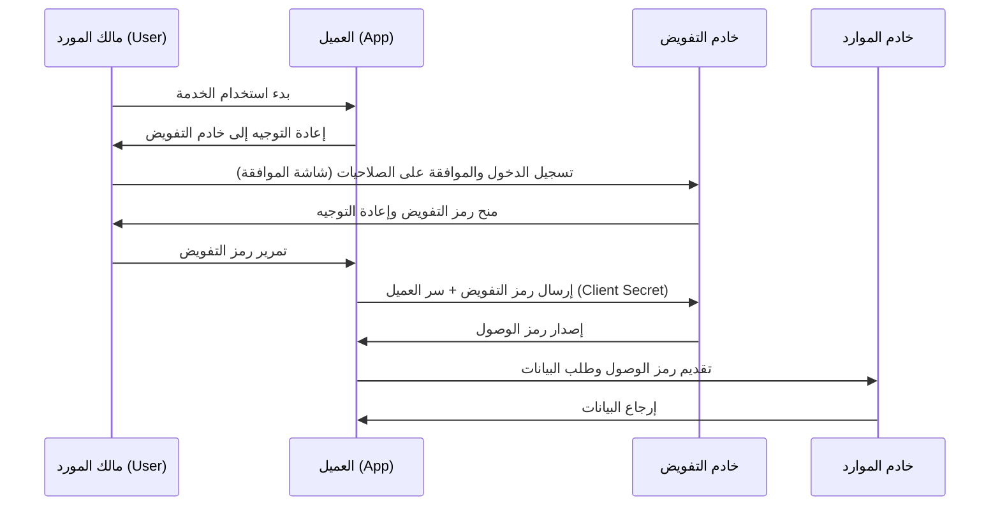

من الأمور المعتادة عند استخدام خدمات الويب رؤية أزرار مثل "تسجيل الدخول باستخدام Google" أو "تسجيل الدخول باستخدام X (تويتر سابقًا)". ومع ذلك، فإن عدد المطورين الذين يفهمون بدقة ما يحدث وراء الكواليس قد يكون أقل مما تعتقد.

ما يدعم هذه الآلية هو بروتوكولان قياسيان هما **OAuth 2.0** و **OpenID Connect (OIDC)**. والخطوة الأولى والأهم لفهمها هي التعرف بشكل صحيح على الفرق بين "المصادقة (Authentication)" و"التفويض (Authorization)".

في هذه المقالة، سنبدأ بالفرق بين هذين المفهومين، وسنتعمق في سير عمل التفويض في OAuth 2.0، والخلفية التاريخية، ومخاطر استخدام OAuth للمصادقة، و OpenID Connect الذي تم إنشاؤه لحل هذه المشكلة، وآلية JWT (JSON Web Token) التي لا غنى عنها لبنية المصادقة والتفويض الحديثة.

## 1. الفرق الأساسي بين المصادقة (Authentication) والتفويض (Authorization)

في عالم الأمن السيبراني، المصادقة والتفويض مفهومان مختلفان تمامًا. الخلط بينهما يمكن أن يتسبب في ثغرات أمنية خطيرة.

### المصادقة (Authentication / AuthN)
إنها عملية التحقق **"من أنت؟ (Who are you?)"**.
في العالم الحقيقي، يعادل هذا تقديم جواز السفر أو رخصة القيادة لإثبات هويتك.
في النظام، يتضمن ذلك إدخال معرف المستخدم وكلمة المرور، أو المصادقة البيومترية (بصمة الإصبع أو الوجه)، أو المصادقة متعددة العوامل (MFA) باستخدام هاتف ذكي.

### التفويض (Authorization / AuthZ)
إنه عملية التحكم **"ماذا يمكنك أن تفعل؟ (What can you do?)"**.
في العالم الحقيقي، بغض النظر عما إذا كان لديك جواز سفر أم لا، فهذا يعادل تحديد "ما إذا كان لديك الصلاحية لدخول غرفة كبار الشخصيات هذه" أو "ما إذا كان بإمكانك عرض هذا الملف السري".
في النظام، يتضمن هذا التحكم في الوصول مثل "السماح للمستخدمين العاديين بالقراءة فقط، والسماح للمسؤولين بالكتابة والحذف أيضًا".

### العلاقة بينهما
عادةً، **يتم التفويض بعد حدوث المصادقة**. فبعد تحديد "من أنت (المصادقة)"، يمكن تحديد "ما هو مسموح لك بفعله (التفويض)".
ومع ذلك، هما مفهومان مستقلان، وحالة "المصادقة بشكل صحيح، ولكن غير مفوض لإجراء عملية معينة" شائعة جدًا.

## 2. جوهر OAuth 2.0 والخلفية التاريخية

غالبًا ما يُساء فهم OAuth 2.0 على أنه "بروتوكول لتسجيل الدخول"، ولكنه في جوهره **إطار عمل لـ "التفويض (Authorization)"**.

### الخلفية التاريخية وولادة OAuth
في الماضي، إذا أرادت خدمة ويب استخدام بيانات من خدمة أخرى (مثل تطبيق مشاركة الصور الذي يريد قائمة الأصدقاء في شبكة اجتماعية)، كان يتم استخدام طريقة خطيرة جدًا وهي جعل المستخدم يدخل "المعرف وكلمة المرور للشبكة الاجتماعية" مباشرة. يُعرف هذا باسم "النمط المضاد لكلمة المرور".

يعهد المستخدم بكلمة مروره إلى تطبيق تابع لجهة خارجية، وإذا كان هذا التطبيق ضارًا، فسيتم اختراق الحساب بالكامل.

لحل هذه المشكلة تم ابتكار **OAuth**. الفكرة الأساسية لـ OAuth هي "بدلًا من تسليم كلمة المرور، يتم تسليم 'مفتاح (رمز وصول)' بصلاحيات محدودة".

### الأدوار الرئيسية في OAuth 2.0
لفهم OAuth 2.0، يجب استيعاب 4 أدوار.

1. **مالك المورد (Resource Owner)**: المستخدم الذي لديه حق الوصول إلى البيانات.
2. **العميل (Client)**: التطبيق الذي يريد الوصول إلى بيانات المستخدم (مثل تطبيق طباعة الصور).
3. **خادم التفويض (Authorization Server)**: الخادم الذي يصادق على المستخدم ويصدر رمز وصول للعميل (مثل خادم مصادقة Google).
4. **خادم الموارد (Resource Server)**: الخادم الذي يحتفظ ببيانات المستخدم، ويتحقق من رمز الوصول ويقدم البيانات (مثل Google Photo API).

### سير عمل رمز التفويض (Authorization Code Flow)
يحتوي OAuth 2.0 على عدة تدفقات (أنواع المنح)، ولكن الأكثر أمانًا وشيوعًا هو "سير عمل رمز التفويض".

النقطة الأهم في هذا التدفق هي أن **رمز الوصول لا يمر عبر متصفح المستخدم (الواجهة الأمامية)**. يمر فقط قسيمة مؤقتة تسمى رمز التفويض عبر الواجهة الأمامية، ويتم تبادل رمز الوصول الفعلي فقط في الواجهة الخلفية (بين العميل وخادم التفويض). هذا يقلل بشكل كبير من خطر تسريب الرمز.

## 3. مخاطر استخدام OAuth للمصادقة

مع انتشار OAuth 2.0، بدأ العديد من المطورين يفكرون: "إذا استخدمنا هذه الآلية، يمكننا تنفيذ ميزة تسجيل الدخول دون جعل المستخدمين يديرون المعرفات/كلمات المرور الخاصة بهم؟" هذه هي بداية ما يسمى بـ "تسجيل الدخول الاجتماعي".

ومع ذلك، كما ذكرنا سابقًا، OAuth هو بروتوكول "التفويض"، وليس بروتوكول "المصادقة". يؤدي استخدام OAuth كما هو للمصادقة إلى مخاطر جسيمة مثل:

### 1. سوء الفهم بأن "امتلاك رمز وصول = أنك هذا المستخدم"
يشير رمز الوصول إلى "الصلاحية للوصول إلى مورد معين"، ولا يثبت "من تمت مصادقته".
هناك مخاطر مثل "هجوم استبدال الرمز (Token Substitution Attack)" حيث يحاول عميل ضار آخر (تطبيق ب) تسجيل الدخول إلى العميل المستهدف (تطبيق أ) عن طريق إرسال رمز وصول تم الحصول عليه.

### 2. نقص المعلومات حول حدث المصادقة
لا يتضمن رمز وصول OAuth معلومات حول "متى" و "كيف" تمت مصادقة المستخدم. لا يمكن لجانب العميل تحديد ما إذا كان المستخدم قد سجل الدخول للتو، أو ما إذا كانت هناك جلسة سابقة لا تزال نشطة.

## 4. ولادة OpenID Connect (OIDC)

تم إنشاء **OpenID Connect (OIDC)** كحل جذري لـ "مشاكل استخدام OAuth للمصادقة".

تم بناء OIDC كمواصفة توسعة لـ OAuth 2.0. باختصار، هو **"وضع 'شهادة مصادقة' تسمى رمز المعرف (ID Token) فوق تدفق تفويض OAuth 2.0"**.

بينما يصدر OAuth 2.0 "رمز وصول (مفتاح غرفة الفندق)"، يصدر OIDC بالإضافة إلى ذلك "رمز معرف (بطاقة هوية)".

### دور رمز المعرف
رمز المعرف هو بيانات موقعة رقميًا يضمن فيها خادم التفويض أن "هذا المستخدم تمت مصادقته بالتأكيد". من خلال التحقق من رمز المعرف هذا، يمكن للعميل تحديد "من قام بتسجيل الدخول" بأمان.

## 5. آلية والتحقق من JWT (JSON Web Token)

في كثير من الأحيان، يتم التعبير عن حقيقة رمز المعرف الصادر عن OIDC بتنسيق **JWT (JSON Web Token)**. JWT هو معيار مفتوح (RFC 7519) لنقل المعلومات بأمان بتنسيق JSON.

### هيكل JWT
يتكون JWT من 3 سلاسل مشفرة بـ Base64URL مفصولة بـ `.` (نقطة).

`Header.Payload.Signature`

1. **الرأس (Header)**:
   يحتوي على معلومات وصفية مثل نوع الرمز (JWT) والخوارزمية المستخدمة للتوقيع (مثل RS256).
2. **الحمولة (Payload)**:
   تحتوي على البيانات الفعلية (المطالبات - Claims). في حالة رمز معرف OIDC، يتم تضمين معلومات مثل التالية (المطالبات القياسية):
   - `iss` (Issuer): عنوان URL لخادم التفويض الذي أصدر الرمز.
   - `sub` (Subject): المعرف الفريد للمستخدم.
   - `aud` (Audience): متلقي الرمز (معرف العميل).
   - `exp` (Expiration Time): وقت انتهاء صلاحية الرمز.
   - `iat` (Issued At): وقت وتاريخ إصدار الرمز.
3. **التوقيع (Signature)**:
   توقيع رقمي يتم إنشاؤه باستخدام مفتاح سري على مزيج من الرأس والحمولة. يضمن هذا عدم التلاعب بالبيانات.

### عملية التحقق من JWT
للوكثوق بـ JWT (رمز المعرف) الذي تلقاه العميل، فإن عملية التحقق التالية ضرورية. إهمال ذلك سيسمح بتسجيل دخول غير مصرح به باستخدام رمز مزيف.

1. **التحقق من التوقيع**: باستخدام المفتاح العام الذي ينشره خادم التفويض (يتم الحصول عليه عبر JWKS وما إلى ذلك)، يتم التحقق من صحة التوقيع (وعدم التلاعب بالرأس والحمولة).
2. **التحقق من `iss` (المصدر)**: التأكد من أن الرمز تم إصداره من خادم التفويض المتوقع.
3. **التحقق من `aud` (الجمهور)**: التأكد من أن الرمز تم إصداره لتطبيقك. (لمنع إعادة استخدام الرموز المخصصة لتطبيقات أخرى).
4. **التحقق من `exp` (انتهاء الصلاحية)**: التأكد من أن صلاحية الرمز لم تنتهِ.

## الخلاصة

*   **المصادقة (AuthN)** تتحقق من "من هو"، و**التفويض (AuthZ)** يتحكم في "ما يمكنه فعله".
*   **OAuth 2.0** هو بروتوكول "تفويض" لتفويض حقوق الوصول إلى الموارد (رمز الوصول) بشكل آمن.
*   استخدام OAuth كما هو لتسجيل الدخول (المصادقة) أمر خطير.
*   **OpenID Connect (OIDC)** يوسع OAuth 2.0 وهو بروتوكول "مصادقة" لتحقيق تسجيل دخول آمن.
*   **رمز المعرف (JWT)** الصادر عن OIDC يثبت نتيجة مصادقة المستخدم، والتحقق المناسب (التوقيع، `iss`، `aud`، `exp`) أمر ضروري.

من خلال الفهم والتنفيذ الصحيحين لهذه البروتوكولات والمفاهيم، يمكنك بناء تطبيقات مريحة وآمنة للغاية للمستخدمين. في التطوير الحديث للويب والهواتف المحمولة، يمكن القول إن معرفة OAuth 2.0 و OIDC أصبحت ثقافة أساسية لا غنى عنها.
