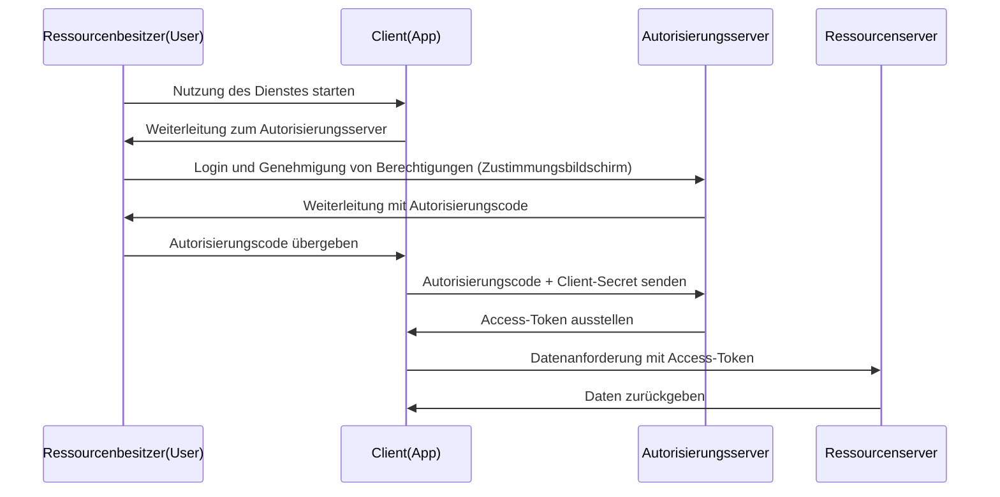

Es ist heutzutage alltäglich, bei der Nutzung von Webdiensten Buttons wie "Mit Google anmelden" oder "Mit X (ehemals Twitter) anmelden" zu sehen. Es gibt jedoch überraschend wenige Entwickler, die genau verstehen, was hinter den Kulissen passiert.

Dieser Mechanismus wird durch zwei Standardprotokolle unterstützt: **OAuth 2.0** und **OpenID Connect (OIDC)**. Der wichtigste erste Schritt, um diese zu verstehen, besteht darin, den Unterschied zwischen "Authentifizierung" (Authentication) und "Autorisierung" (Authorization) richtig zu erkennen.

In diesem Artikel beginnen wir mit dem Unterschied zwischen diesen beiden Konzepten, tauchen tief in den Autorisierungsfluss von OAuth 2.0 und seinen historischen Hintergrund ein und erklären die Risiken der Zweckentfremdung von OAuth zur Authentifizierung. Anschließend betrachten wir die Entstehung von OpenID Connect, das dieses Problem löst, sowie die Funktionsweise von JWT (JSON Web Token), die für moderne Authentifizierungs- und Autorisierungsinfrastrukturen unerlässlich ist.

## 1. Der grundlegende Unterschied zwischen Authentifizierung (Authentication) und Autorisierung (Authorization)

In der Welt der Sicherheit sind Authentifizierung und Autorisierung völlig unterschiedliche Konzepte. Wenn man diese verwechselt, kann dies zu schwerwiegenden Sicherheitslücken führen.

### Authentifizierung (Authentication / AuthN)
Dies ist der Prozess der Überprüfung: **"Wer bist du? (Who are you?)"**.
In der realen Welt entspricht dies der Vorlage eines Reisepasses oder Führerscheins, um die eigene Identität nachzuweisen.
Im Systemumfeld umfasst dies die Eingabe einer Benutzer-ID und eines Passworts, biometrische Authentifizierung (Fingerabdruck oder Gesicht) oder Multi-Faktor-Authentifizierung (MFA) mit einem Smartphone.

### Autorisierung (Authorization / AuthZ)
Dies ist der Prozess der Kontrolle: **"Was darfst du tun? (What can you do?)"**.
In der realen Welt bedeutet dies, unabhängig davon, ob man einen Reisepass hat, zu entscheiden: "Hat diese Person die Berechtigung, diesen VIP-Raum zu betreten?" oder "Darf diese Person dieses vertrauliche Dokument einsehen?".
Im Systemumfeld entspricht dies der Zugriffskontrolle, z. B. "Allgemeine Benutzer haben nur Leserechte, während Administratoren auch Schreib- und Löschrechte haben".

### Die Beziehung der beiden
Normalerweise **erfolgt die Autorisierung nach der Authentifizierung**. Erst wenn "wer du bist" (Authentifizierung) festgestellt wurde, kann entschieden werden, "was dieser Person erlaubt ist" (Autorisierung).
Diese beiden Konzepte sind jedoch unabhängig voneinander. Es kommt häufig vor, dass jemand "korrekt authentifiziert ist, aber für eine bestimmte Aktion nicht autorisiert ist".

## 2. Das Wesen und der historische Hintergrund von OAuth 2.0

OAuth 2.0 wird oft fälschlicherweise als "Protokoll für Logins" verstanden, ist aber im Wesentlichen ein **Framework für "Autorisierung" (Authorization)**.

### Historischer Hintergrund und die Entstehung von OAuth
Früher, wenn ein Webdienst die Daten eines anderen Dienstes (z. B. ein Foto-Sharing-Dienst die Freundesliste eines sozialen Netzwerks) nutzen wollte, wurde die sehr gefährliche Methode angewandt, den Benutzer aufzufordern, seine "Social-Media-ID und sein Passwort" direkt einzugeben. Dies wird als "Passwort-Antipattern" bezeichnet.

Der Benutzer übergibt sein Passwort an eine Drittanbieter-App. Wenn diese App böswillige Absichten hat, kann das Konto vollständig übernommen werden.

Um dieses Problem zu lösen, wurde **OAuth** entwickelt. Die Grundidee von OAuth besteht darin, "anstelle der Weitergabe des Passworts einen 'Schlüssel (Access-Token)' mit eingeschränkten Berechtigungen zu übergeben".

### Die Hauptrollen in OAuth 2.0
Um OAuth 2.0 zu verstehen, muss man vier Rollen kennen:

1. **Ressourcenbesitzer (Resource Owner)**: Der Benutzer, der Zugriffsrechte auf die Daten hat.
2. **Client (Client)**: Die Anwendung, die auf die Daten des Benutzers zugreifen möchte (z. B. eine Foto-Druck-App).
3. **Autorisierungsserver (Authorization Server)**: Der Server, der den Benutzer authentifiziert und ein Access-Token an den Client ausgibt (z. B. der Authentifizierungsserver von Google).
4. **Ressourcenserver (Resource Server)**: Der Server, der die Daten des Benutzers speichert, das Access-Token verifiziert und die Daten bereitstellt (z. B. die Google Photo API).

### Autorisierungscode-Fluss (Authorization Code Flow)
OAuth 2.0 verfügt über mehrere Abläufe (Grant Types), aber der sicherste und gängigste ist der "Autorisierungscode-Fluss".

Der wichtigste Punkt in diesem Ablauf ist, dass **das Access-Token nicht über den Browser (Frontend) des Benutzers gesendet wird**. Nur der temporäre Autorisierungscode passiert das Frontend, während das tatsächliche Access-Token nur im Backend (zwischen Client und Autorisierungsserver) ausgetauscht wird. Dadurch wird das Risiko eines Token-Lecks drastisch reduziert.

## 3. Die Risiken der Zweckentfremdung von OAuth zur Authentifizierung

Mit der zunehmenden Verbreitung von OAuth 2.0 dachten viele Entwickler: "Wenn wir diesen Mechanismus nutzen, können wir eine Login-Funktion implementieren, ohne dass Benutzer IDs/Passwörter verwalten müssen, oder?". Das war der Beginn des sogenannten "Social Login".

Wie bereits erwähnt, ist OAuth jedoch ein Protokoll für "Autorisierung" und nicht für "Authentifizierung". Wenn man OAuth direkt für die Authentifizierung zweckentfremdet, entstehen folgende schwerwiegende Risiken:

### 1. Das Missverständnis: "Ein Access-Token zu haben = dieser Benutzer zu sein"
Ein Access-Token zeigt "die Berechtigung für den Zugriff auf eine bestimmte Ressource" an und beweist nicht, "wer authentifiziert wurde".
Es besteht die Gefahr von Angriffen wie der "Token Substitution Attack", bei der ein böswilliger Client (App B) ein erworbenes Access-Token an einen Ziel-Client (App A) sendet, um einen Login zu versuchen.

### 2. Fehlende Informationen über das Authentifizierungsereignis
Das Access-Token von OAuth enthält keine Informationen darüber, "wann" und "wie" sich der Benutzer authentifiziert hat. Die Client-Seite kann nicht feststellen, ob der Benutzer sich gerade erst angemeldet hat oder ob noch eine alte Login-Sitzung aus der Vergangenheit aktiv ist.

## 4. Die Entstehung von OpenID Connect (OIDC)

Um diese "Probleme bei der Verwendung von OAuth zur Authentifizierung" grundlegend zu lösen, wurde **OpenID Connect (OIDC)** entwickelt.

OIDC ist eine Erweiterungsspezifikation von OAuth 2.0. Kurz gesagt: **"OIDC fügt dem Autorisierungsfluss von OAuth 2.0 ein ID-Token als 'Authentifizierungsnachweis' hinzu"**.

Während OAuth 2.0 ein "Access-Token (Zimmerschlüssel im Hotel)" ausstellt, stellt OIDC zusätzlich ein "ID-Token (Ausweisdokument)" aus.

### Die Rolle des ID-Tokens
Das ID-Token sind digital signierte Daten, mit denen der Autorisierungsserver garantiert: "Dieser Benutzer wurde tatsächlich authentifiziert". Durch die Überprüfung dieses ID-Tokens kann der Client sicher feststellen, "wer sich angemeldet hat".

## 5. Die Funktionsweise und Verifizierung von JWT (JSON Web Token)

Das von OIDC ausgestellte ID-Token liegt oft im **JWT (JSON Web Token)**-Format vor. JWT ist ein offener Standard (RFC 7519) zur sicheren Übertragung von Informationen im JSON-Format.

### Die Struktur von JWT
Ein JWT besteht aus drei Base64URL-codierten Zeichenfolgen, die durch Punkte (`.`) getrennt sind:

`Header.Payload.Signature`

1. **Header (Header)**:
   Enthält Metainformationen wie den Token-Typ (JWT) und den für die Signatur verwendeten Algorithmus (z. B. RS256).
2. **Payload (Payload)**:
   Enthält die eigentlichen Daten (Claims). Bei einem OIDC-ID-Token sind typischerweise folgende Informationen (Standard-Claims) enthalten:
   - `iss` (Issuer): Die URL des Autorisierungsservers, der das Token ausgestellt hat.
   - `sub` (Subject): Die eindeutige Kennung des Benutzers.
   - `aud` (Audience): Der Empfänger des Tokens (Client-ID).
   - `exp` (Expiration Time): Das Ablaufdatum des Tokens.
   - `iat` (Issued At): Das Ausstellungsdatum des Tokens.
3. **Signature (Signatur)**:
   Eine digitale Signatur, die über den kombinierten Header und Payload mit einem geheimen Schlüssel erstellt wird. Dies stellt sicher, dass die Daten nicht manipuliert wurden.

### Der Verifizierungsprozess von JWT
Um dem erhaltenen JWT (ID-Token) vertrauen zu können, muss der Client den folgenden Verifizierungsprozess durchführen. Wenn dieser vernachlässigt wird, ermöglicht man unbefugte Logins mit gefälschten Tokens.

1. **Verifizierung der Signatur**: Verwenden Sie den vom Autorisierungsserver veröffentlichten öffentlichen Schlüssel (z. B. über JWKS bezogen), um zu überprüfen, ob die Signatur gültig ist (ob Header und Payload nicht manipuliert wurden).
2. **Überprüfung von `iss` (Issuer)**: Überprüfen Sie, ob das Token von dem erwarteten Autorisierungsserver ausgestellt wurde.
3. **Überprüfung von `aud` (Audience)**: Überprüfen Sie, ob das Token für Ihre eigene Anwendung ausgestellt wurde (um zu verhindern, dass Tokens, die für andere Apps bestimmt sind, wiederverwendet werden).
4. **Überprüfung von `exp` (Expiration)**: Stellen Sie sicher, dass das Token nicht abgelaufen ist.

## Zusammenfassung

*   **Authentifizierung (AuthN)** überprüft, "wer jemand ist", während **Autorisierung (AuthZ)** kontrolliert, "was jemand darf".
*   **OAuth 2.0** ist ein "Autorisierungs"-Protokoll zur sicheren Delegierung von Zugriffsrechten (Access-Token) auf Ressourcen.
*   Es ist gefährlich, OAuth unverändert für den Login (Authentifizierung) zu verwenden.
*   **OpenID Connect (OIDC)** erweitert OAuth 2.0 und ist ein "Authentifizierungs"-Protokoll zur Realisierung sicherer Logins.
*   Das von OIDC ausgestellte **ID-Token (JWT)** beweist das Authentifizierungsergebnis des Benutzers und eine angemessene Verifizierung (Signatur, `iss`, `aud`, `exp`) ist unerlässlich.

Wenn Sie diese Protokolle und Konzepte richtig verstehen und implementieren, können Sie Anwendungen entwickeln, die für Benutzer bequem und gleichzeitig sicher sind. In der modernen Web- und Mobile-Entwicklung ist das Wissen über OAuth 2.0 und OIDC eine unverzichtbare Voraussetzung.
