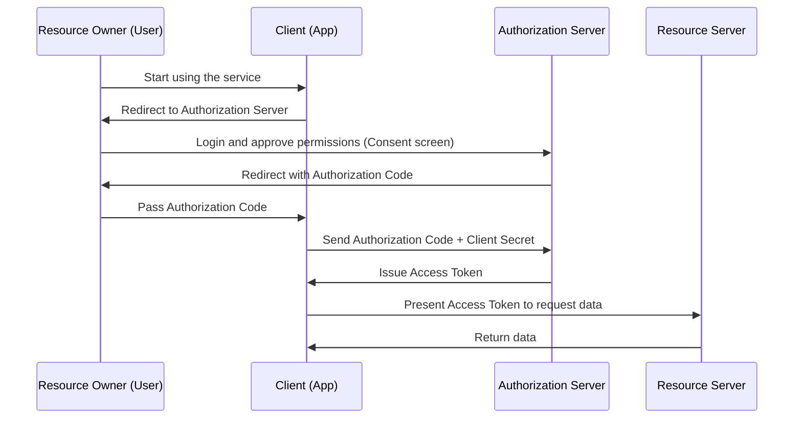

It is an everyday occurrence to see buttons like "Log in with Google" or "Log in with X (formerly Twitter)" when using web services. However, surprisingly few developers accurately understand what is happening behind the scenes.

Supporting this mechanism are two standard protocols: **OAuth 2.0** and **OpenID Connect (OIDC)**. And the most important first step to understanding these is to correctly recognize the difference between "Authentication" and "Authorization".

This article will begin with the difference between these two concepts, and then delve deeply into the OAuth 2.0 authorization flow, its historical background, the risks of repurposing OAuth for authentication and OpenID Connect which was born to solve them, and further, the mechanism of JWT (JSON Web Token) which is essential for modern authentication and authorization infrastructure.

## 1. The Fundamental Difference Between Authentication and Authorization

In the security world, authentication and authorization are entirely different concepts. Confusing them can lead to critical security holes.

### Authentication (AuthN)
This is the process of confirming **"Who are you?"**
In the real world, this is equivalent to presenting a passport or driver's license to prove your identity.
In a system, entering a user ID and password, biometric authentication (fingerprint or face), or multi-factor authentication (MFA) using a smartphone fall into this category.

### Authorization (AuthZ)
This is the process of controlling **"What can you do?"**
In the real world, regardless of whether you have a passport, it is the act of judging "Do you have the authority to enter this VIP room?" or "Can you view this confidential file?".
In a system, access controls such as "Allow read-only access to general users, and allow write/delete access to administrators" fall into this category.

### Relationship Between the Two
Usually, **authorization takes place after authentication**. This is because you can only determine "what is permitted for that person (authorization)" after confirming "who you are (authentication)".
However, these two are independent concepts, and the state of being "properly authenticated, but not authorized for a specific operation" happens quite normally.

## 2. The Essence and Historical Background of OAuth 2.0

OAuth 2.0 is often misunderstood as a "protocol for login," but essentially it is a **framework for "Authorization"**.

### Historical Background and the Birth of OAuth
In the past, when a web service wanted to use data from another service (e.g., a photo-sharing service using a social network's friend list), a very dangerous method was used where the user was asked to directly input their "social network ID and password". This is known as the "password anti-pattern".

Users would hand their passwords over to a third-party app, and if that app had malicious intent, the account could be completely hijacked.

To solve this problem, **OAuth** was born. The basic idea of OAuth is "instead of handing over a password, hand over a 'key (access token)' with limited privileges."

### Key Roles (Actors) in OAuth 2.0
To understand OAuth 2.0, you need to grasp four roles:

1. **Resource Owner**: The user who has access rights to the data.
2. **Client**: The application that wants to access the user's data (e.g., a photo printing app).
3. **Authorization Server**: The server that authenticates the user and issues access tokens to the client (e.g., Google's authentication server).
4. **Resource Server**: The server that holds the user's data, verifies the access token, and provides the data (e.g., Google Photo API).

### Authorization Code Flow
There are several flows (grant types) in OAuth 2.0, but the safest and most common is the "Authorization Code Flow".

The most important point of this flow is that **the access token does not pass through the user's browser (frontend)**. Only a temporary exchange ticket called an authorization code passes through the frontend, and the actual access token is exchanged only in the backend (between the client and the authorization server). This greatly reduces the risk of token leakage.

## 3. The Risks of Repurposing OAuth for Authentication

As OAuth 2.0 became widespread, more developers thought, "Can't we use this mechanism to implement a login feature without making users manage their ID/passwords?" This was the beginning of so-called "Social Login."

However, as mentioned earlier, OAuth is a protocol for "authorization", not a protocol for "authentication". Repurposing OAuth directly for authentication poses the following serious risks:

### 1. The Misconception That "Holding an Access Token = Being That User"
An access token indicates "the authority to access a specific resource," and it does not prove "who has been authenticated."
There is a risk of a "Token Substitution Attack," where a malicious other client (App B) tries to log in by sending an access token it acquired to a target client (App A).

### 2. Lack of Information About Authentication Events
OAuth access tokens do not contain information about "when" and "how" the user was authenticated. The client side cannot determine whether the user just logged in right now, or if it is merely a leftover session from a past login.

## 4. The Birth of OpenID Connect (OIDC)

To fundamentally solve these "problems when using OAuth for authentication," **OpenID Connect (OIDC)** was born.

OIDC was created as an extension specification of OAuth 2.0. In short, it is **"riding an 'authentication certificate' called an ID Token on top of the OAuth 2.0 authorization flow."**

While OAuth 2.0 issues an "access token (hotel room key)", OIDC issues an "ID token (identification card)" in addition to it.

### The Role of the ID Token
The ID token is digitally signed data where the authorization server guarantees "this user has certainly been authenticated." By verifying this ID token, the client can securely identify "who logged in."

## 5. The Mechanism and Verification of JWT (JSON Web Token)

The ID token issued in OIDC is most often represented in a format called **JWT (JSON Web Token)**. JWT is an open standard (RFC 7519) for securely transmitting information as a JSON object.

### The Structure of a JWT
A JWT consists of three Base64URL-encoded strings separated by `.` (dots).

`Header.Payload.Signature`

1. **Header**:
   Contains meta-information such as the type of token (JWT) and the algorithm used for the signature (e.g., RS256).
2. **Payload**:
   Contains the actual data (claims). In the case of an OIDC ID token, the following information (standard claims) is included:
   - `iss` (Issuer): The URL of the authorization server that issued the token.
   - `sub` (Subject): The unique identifier of the user.
   - `aud` (Audience): The intended recipient of the token (client ID).
   - `exp` (Expiration Time): The expiration date and time of the token.
   - `iat` (Issued At): The date and time the token was issued.
3. **Signature**:
   A digital signature created using a secret key against the combined Header and Payload. This guarantees that the data has not been tampered with.

### The Verification Process of a JWT
To trust a JWT (ID token) received by a client, the following verification process is indispensable. Neglecting this will allow unauthorized logins using forged tokens.

1. **Signature Verification**: Check whether the Signature is correct (the Header and Payload have not been tampered with) using the public key published by the authorization server (obtained via JWKS, etc.).
2. **`iss` (Issuer) Verification**: Check whether the token was issued by the expected authorization server.
3. **`aud` (Audience) Verification**: Check whether the token was issued for your application. (To prevent tokens intended for other apps from being reused).
4. **`exp` (Expiration) Verification**: Check whether the token has not expired.

## Summary

*   **Authentication (AuthN)** confirms "who", and **Authorization (AuthZ)** controls "what can be done".
*   **OAuth 2.0** is an "authorization" protocol for safely delegating access rights (access tokens) to resources.
*   It is dangerous to use OAuth as is for login (authentication).
*   **OpenID Connect (OIDC)** is an "authentication" protocol that extends OAuth 2.0 to achieve secure login.
*   The **ID Token (JWT)** issued by OIDC proves the result of the user's authentication, and proper verification (signature, `iss`, `aud`, `exp`) is indispensable.

By correctly understanding and implementing these protocols and concepts, you can build applications that are highly convenient for users and secure. In modern web and mobile development, knowledge of OAuth 2.0 and OIDC can now be said to be an essential education.
