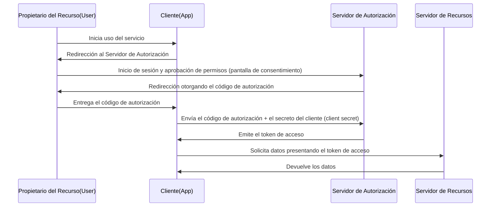

Al utilizar servicios web, es muy común ver botones como "Iniciar sesión con Google" o "Iniciar sesión con X (antes Twitter)". Sin embargo, la cantidad de desarrolladores que entienden exactamente qué sucede detrás de escena podría ser sorprendentemente pequeña.

Los que sustentan este mecanismo son dos protocolos estándar: **OAuth 2.0** y **OpenID Connect (OIDC)**. Y el primer paso, y el más importante, para entenderlos es reconocer correctamente la diferencia entre "Autenticación (Authentication)" y "Autorización (Authorization)".

En este artículo, comenzaremos con la diferencia entre estos dos conceptos y profundizaremos en el flujo de autorización de OAuth 2.0, sus antecedentes históricos, los riesgos de desviar OAuth para la autenticación y cómo OpenID Connect nació para resolverlos, hasta llegar al funcionamiento de JWT (JSON Web Token), indispensable en la infraestructura moderna de autenticación y autorización.

## 1. La diferencia fundamental entre Autenticación (Authentication) y Autorización (Authorization)

En el mundo de la seguridad, la autenticación y la autorización son conceptos completamente diferentes. Confundirlos es la causa de importantes vulnerabilidades de seguridad.

### Autenticación (Authentication / AuthN)
Es el proceso de confirmar **"¿Quién eres? (Who are you?)"**.
En el mundo real, equivale al acto de demostrar tu identidad presentando un pasaporte o licencia de conducir.
En el sistema, esto corresponde a ingresar un ID de usuario y una contraseña, la autenticación biométrica (huella dactilar o rostro) o la autenticación multifactor (MFA) usando un teléfono inteligente.

### Autorización (Authorization / AuthZ)
Es el proceso de controlar **"¿Qué puedes hacer? (What can you do?)"**.
En el mundo real, independientemente de si tienes un pasaporte o no, es el acto de determinar si "tienes permiso para entrar a esta sala VIP" o "si puedes ver este archivo confidencial".
En el sistema, esto corresponde al control de acceso, como "permitir solo lectura a los usuarios generales, y permitir también escritura y eliminación a los administradores".

### Relación entre los dos
Normalmente, **la autorización se realiza después de la autenticación**. Esto se debe a que solo cuando se establece "quién eres (autenticación)", se puede determinar "qué se te permite hacer (autorización)".
Sin embargo, estos dos son conceptos independientes, y es bastante común que ocurra el estado de "estar correctamente autenticado, pero no estar autorizado para una operación específica".

## 2. La esencia de OAuth 2.0 y sus antecedentes históricos

OAuth 2.0 a menudo se malinterpreta como "un protocolo para el inicio de sesión", pero en esencia es **un marco de trabajo para la "Autorización (Authorization)"**.

### Antecedentes históricos y el nacimiento de OAuth
En el pasado, cuando un servicio web quería utilizar los datos de otro servicio (por ejemplo, un servicio para compartir fotos usando la lista de amigos de una red social), se utilizaba un método muy peligroso de pedirle al usuario que ingresara directamente "su ID y contraseña de la red social". A esto se le llama el "antipatrón de la contraseña".

El usuario terminaba entregando su contraseña a una aplicación de terceros, y si esa aplicación tenía intenciones maliciosas, la cuenta podía ser secuestrada por completo.

**OAuth** nació para resolver este problema. La idea básica de OAuth es "en lugar de entregar una contraseña, entregar una 'llave (token de acceso)' con permisos limitados".

### Roles principales de OAuth 2.0 (Personajes)
Para entender OAuth 2.0, es necesario comprender 4 roles.

1. **Propietario del Recurso (Resource Owner)**: El usuario que tiene derecho a acceder a los datos.
2. **Cliente (Client)**: La aplicación que desea acceder a los datos del usuario (por ejemplo, una aplicación para imprimir fotos).
3. **Servidor de Autorización (Authorization Server)**: El servidor que autentica al usuario y emite el token de acceso al cliente (por ejemplo, el servidor de autenticación de Google).
4. **Servidor de Recursos (Resource Server)**: El servidor que retiene los datos del usuario, verifica el token de acceso y proporciona los datos (por ejemplo, Google Photo API).

### Flujo de Código de Autorización (Authorization Code Flow)
Existen varios flujos (tipos de concesión o grant types) en OAuth 2.0, pero el más seguro y común es el "Flujo de Código de Autorización".

El punto más importante de este flujo es que **el token de acceso no pasa por el navegador del usuario (frontend)**. Solo un boleto temporal llamado código de autorización pasa por el frontend, y el token de acceso real se intercambia únicamente en el backend (entre el cliente y el servidor de autorización). Esto reduce significativamente el riesgo de fuga del token.

## 3. Riesgos de desviar OAuth para la Autenticación

A medida que OAuth 2.0 se popularizó, más desarrolladores pensaron: "¿No podemos usar este mecanismo para implementar una función de inicio de sesión sin que el usuario administre un ID/contraseña?". Este fue el comienzo del llamado "inicio de sesión social".

Sin embargo, como se mencionó anteriormente, OAuth es un protocolo de "autorización" y no de "autenticación". Desviar OAuth tal cual para la autenticación conlleva los siguientes riesgos graves.

### 1. El malentendido de "tener un token de acceso = ser ese usuario"
El token de acceso indica "el permiso para acceder a un recurso específico", pero no prueba "quién fue autenticado".
Existe el riesgo de un "Ataque de Sustitución de Token (Token Substitution Attack)", en el cual un cliente malicioso (App B) envía el token de acceso que obtuvo al cliente objetivo (App A) para intentar iniciar sesión.

### 2. Falta de información sobre el evento de autenticación
El token de acceso de OAuth no contiene información sobre "cuándo" y "cómo" se autenticó el usuario. El lado del cliente no puede determinar si el usuario acaba de iniciar sesión en ese momento o si solo queda una sesión de inicio de sesión anterior.

## 4. El nacimiento de OpenID Connect (OIDC)

Para resolver fundamentalmente estos "problemas al usar OAuth para la autenticación", nació **OpenID Connect (OIDC)**.

OIDC se creó como una extensión de la especificación de OAuth 2.0. En pocas palabras, es **"agregar un 'certificado de autenticación' llamado ID Token sobre el flujo de autorización de OAuth 2.0"**.

Mientras que OAuth 2.0 emite un "token de acceso (llave de la habitación del hotel)", OIDC emite adicionalmente un "ID Token (documento de identidad)".

### El rol del ID Token
El ID Token es un conjunto de datos con firma digital en el que el servidor de autorización garantiza que "este usuario definitivamente ha sido autenticado". Al verificar este ID Token, el cliente puede identificar de forma segura "quién inició sesión".

## 5. El mecanismo y verificación de JWT (JSON Web Token)

La entidad del ID Token emitido en OIDC se expresa en la mayoría de los casos en un formato llamado **JWT (JSON Web Token)**. JWT es un estándar abierto (RFC 7519) para transmitir información de manera segura en formato JSON.

### Estructura de JWT
Un JWT consta de 3 cadenas codificadas en Base64URL separadas por un punto (`.`).

`Header.Payload.Signature`

1. **Header (Encabezado)**:
   Contiene metainformación como el tipo de token (JWT) y el algoritmo utilizado para la firma (por ejemplo, RS256).
2. **Payload (Carga útil)**:
   Contiene los datos reales (claims o reclamaciones). En el caso del ID Token de OIDC, incluye la siguiente información (claims estándar):
   - `iss` (Issuer): La URL del servidor de autorización que emitió el token.
   - `sub` (Subject): El identificador único del usuario.
   - `aud` (Audience): El destinatario del token (ID del cliente).
   - `exp` (Expiration Time): La fecha y hora de vencimiento del token.
   - `iat` (Issued At): La fecha y hora en que se emitió el token.
3. **Signature (Firma)**:
   Es una firma digital creada utilizando una clave privada aplicada a la combinación del Header y el Payload. Esto garantiza que los datos no hayan sido alterados.

### Proceso de verificación de JWT
Para confiar en el JWT (ID Token) recibido por el cliente, el siguiente proceso de verificación es indispensable. Descuidar esto permitirá inicios de sesión no autorizados con tokens falsificados.

1. **Verificación de la firma**: Se verifica si la Signature es correcta (si el Header y el Payload no han sido alterados) usando la clave pública expuesta por el servidor de autorización (obtenida mediante JWKS, etc.).
2. **Confirmación del `iss` (Issuer)**: Se verifica si el token fue emitido por el servidor de autorización esperado.
3. **Confirmación del `aud` (Audience)**: Se verifica si el token fue emitido para su propia aplicación. (Para evitar que se reutilicen tokens destinados a otras aplicaciones).
4. **Confirmación de la `exp` (Expiration)**: Se verifica si el token no ha expirado.

## Resumen

*   **Autenticación (AuthN)** confirma "quién es", y **Autorización (AuthZ)** controla "qué puede hacer".
*   **OAuth 2.0** es un protocolo de "autorización" para delegar de forma segura los derechos de acceso (token de acceso) a los recursos.
*   Usar OAuth tal cual para iniciar sesión (autenticación) es peligroso.
*   **OpenID Connect (OIDC)** es un protocolo de "autenticación" que extiende OAuth 2.0 para lograr inicios de sesión seguros.
*   El **ID Token (JWT)** emitido por OIDC prueba el resultado de la autenticación del usuario, y la verificación adecuada (firma, `iss`, `aud`, `exp`) es indispensable.

Al comprender e implementar correctamente estos protocolos y conceptos, se pueden construir aplicaciones seguras y altamente convenientes para los usuarios. En el desarrollo moderno de aplicaciones web y móviles, el conocimiento de OAuth 2.0 y OIDC es ahora una cultura general indispensable.
