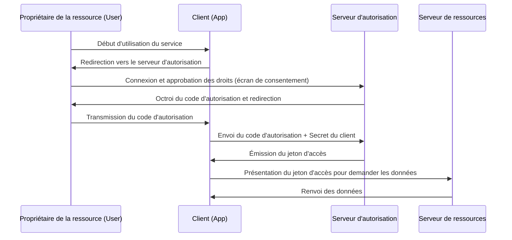

Il est monnaie courante de voir des boutons tels que « Se connecter avec Google » ou « Se connecter avec X (anciennement Twitter) » lors de l'utilisation de services web. Cependant, étonnamment, peu de développeurs comprennent exactement ce qui se passe en coulisses.

Ce système repose sur deux protocoles standards : **OAuth 2.0** et **OpenID Connect (OIDC)**. La première étape, et la plus importante, pour les comprendre est de bien différencier l'« Authentification » (Authentication) de l'« Autorisation » (Authorization).

Dans cet article, nous allons explorer en profondeur ces concepts, en commençant par la différence entre ces deux termes, puis en examinant le flux d'autorisation d'OAuth 2.0, son contexte historique, les risques liés à l'utilisation d'OAuth pour l'authentification et comment OpenID Connect a été créé pour résoudre ce problème. Enfin, nous détaillerons le fonctionnement des JWT (JSON Web Token), devenus indispensables dans les infrastructures modernes d'authentification et d'autorisation.

## 1. La différence fondamentale entre Authentification (Authentication) et Autorisation (Authorization)

Dans le domaine de la sécurité, l'authentification et l'autorisation sont des concepts totalement distincts. Les confondre peut créer d'importantes failles de sécurité.

### Authentification (Authentication / AuthN)
C'est le processus qui répond à la question **« Qui êtes-vous ? » (Who are you?)**.
Dans le monde réel, cela équivaut à présenter un passeport ou un permis de conduire pour prouver son identité.
Sur un système, cela correspond à la saisie d'un identifiant et d'un mot de passe, à l'authentification biométrique (empreinte digitale ou visage), ou encore à l'authentification multifacteur (MFA) via un smartphone.

### Autorisation (Authorization / AuthZ)
C'est le processus qui contrôle **« Ce que vous pouvez faire » (What can you do?)**.
Dans le monde réel, cela consiste à déterminer, que vous ayez un passeport ou non, si « vous avez l'autorisation d'entrer dans cette salle VIP » ou si « vous pouvez consulter ce document confidentiel ».
Sur un système, cela correspond au contrôle d'accès, comme « autoriser la lecture seule pour les utilisateurs normaux, et autoriser également l'écriture/suppression pour les administrateurs ».

### La relation entre les deux
Généralement, **l'autorisation a lieu après l'authentification**. Ce n'est qu'une fois que l'on a déterminé « qui vous êtes » (authentification) que l'on peut juger de « ce qui vous est permis » (autorisation).
Toutefois, ces deux concepts sont indépendants, et il est tout à fait courant de rencontrer des situations où un utilisateur est « correctement authentifié, mais non autorisé à effectuer une action spécifique ».

## 2. La nature d'OAuth 2.0 et son contexte historique

OAuth 2.0 est souvent confondu à tort avec un « protocole de connexion », mais il s'agit fondamentalement d'un **framework d'« Autorisation » (Authorization)**.

### Contexte historique et naissance d'OAuth
Autrefois, lorsqu'un service web souhaitait utiliser les données d'un autre service (par exemple, un service de partage de photos voulant accéder à la liste d'amis d'un réseau social), on demandait souvent à l'utilisateur de saisir directement « l'identifiant et le mot de passe du réseau social », ce qui était une méthode extrêmement dangereuse. C'est ce qu'on appelle l'« anti-pattern du mot de passe ».

L'utilisateur confiait ainsi son mot de passe à une application tierce. Si cette application était malveillante, le compte pouvait être entièrement piraté.

**OAuth** a été créé pour résoudre ce problème. L'idée de base d'OAuth est de « fournir une « clé » (jeton d'accès ou access token) dotée de droits limités, plutôt que de donner le mot de passe ».

### Les rôles principaux d'OAuth 2.0
Pour comprendre OAuth 2.0, il faut saisir quatre rôles distincts.

1. **Propriétaire de la ressource (Resource Owner)** : L'utilisateur qui possède les droits d'accès aux données.
2. **Client (Client)** : L'application qui souhaite accéder aux données de l'utilisateur (ex : une application d'impression de photos).
3. **Serveur d'autorisation (Authorization Server)** : Le serveur qui authentifie l'utilisateur et délivre un jeton d'accès au client (ex : le serveur d'authentification de Google).
4. **Serveur de ressources (Resource Server)** : Le serveur qui stocke les données de l'utilisateur, vérifie le jeton d'accès et fournit les données (ex : l'API de Google Photos).

### Flux du code d'autorisation (Authorization Code Flow)
OAuth 2.0 possède plusieurs flux (types de concessions ou grant types), mais le plus sûr et le plus courant est le « flux du code d'autorisation ».

Le point crucial de ce flux est que **le jeton d'accès ne passe pas par le navigateur de l'utilisateur (frontend)**. Seul le code d'autorisation, qui est un ticket d'échange temporaire, transite par le frontend. Le véritable jeton d'accès est échangé uniquement en backend (entre le client et le serveur d'autorisation). Cela réduit considérablement le risque de fuite du jeton.

## 3. Les risques de détourner OAuth pour l'authentification

Avec la popularisation d'OAuth 2.0, de plus en plus de développeurs ont pensé : « En utilisant ce système, ne pourrions-nous pas implémenter une fonctionnalité de connexion sans que l'utilisateur ait à gérer un identifiant/mot de passe ? ». C'est ainsi qu'a commencé le « Social Login ».

Cependant, comme mentionné précédemment, OAuth est un protocole d'« autorisation » et non d'« authentification ». Détourner OAuth pour l'utiliser tel quel comme authentification engendre des risques importants.

### 1. L'idée fausse que « posséder un jeton d'accès = être cet utilisateur »
Un jeton d'accès indique le « droit d'accéder à une ressource spécifique » et ne prouve pas « qui a été authentifié ».
Il existe un risque d'attaque par substitution de jeton (Token Substitution Attack), où un client malveillant (App B) utilise un jeton d'accès qu'il a obtenu et l'envoie à un client cible (App A) pour tenter de s'y connecter.

### 2. Le manque d'informations sur l'événement d'authentification
Le jeton d'accès d'OAuth ne contient pas d'informations sur « quand » ni « comment » l'utilisateur a été authentifié. Côté client, il est impossible de savoir si l'utilisateur vient tout juste de se connecter ou s'il s'agit simplement d'une session de connexion passée qui est toujours active.

## 4. La naissance d'OpenID Connect (OIDC)

Pour résoudre fondamentalement ces « problèmes liés à l'utilisation d'OAuth pour l'authentification », **OpenID Connect (OIDC)** a vu le jour.

OIDC a été conçu comme une spécification d'extension d'OAuth 2.0. En un mot, il s'agit **d'ajouter un « certificat d'authentification » appelé Jeton d'identité (ID Token) au-dessus du flux d'autorisation d'OAuth 2.0**.

Là où OAuth 2.0 délivre un « jeton d'accès (la clé d'une chambre d'hôtel) », OIDC y ajoute un « jeton d'identité (une pièce d'identité) ».

### Le rôle du jeton d'identité
Le jeton d'identité est un ensemble de données signé numériquement par lequel le serveur d'autorisation garantit que « cet utilisateur a bien été authentifié ». En vérifiant ce jeton d'identité, le client peut identifier en toute sécurité « qui s'est connecté ».

## 5. Le fonctionnement et la vérification des JWT (JSON Web Token)

Dans la plupart des cas, le jeton d'identité délivré par OIDC est formaté en tant que **JWT (JSON Web Token)**. Le JWT est un standard ouvert (RFC 7519) permettant de transmettre des informations de manière sécurisée sous format JSON.

### Structure d'un JWT
Un JWT se compose de trois chaînes de caractères encodées en Base64URL et séparées par des points (`.`).

`Header.Payload.Signature`

1. **Header (En-tête)** :
   Il contient des méta-informations telles que le type de jeton (JWT) et l'algorithme utilisé pour la signature (ex : RS256).
2. **Payload (Charge utile)** :
   Il contient les données réelles (revendications ou claims). Dans le cas d'un jeton d'identité OIDC, il inclut les informations suivantes (revendications standards) :
   - `iss` (Issuer) : L'URL du serveur d'autorisation qui a émis le jeton.
   - `sub` (Subject) : L'identifiant unique de l'utilisateur.
   - `aud` (Audience) : Le destinataire du jeton (ID du client).
   - `exp` (Expiration Time) : La date et l'heure d'expiration du jeton.
   - `iat` (Issued At) : La date et l'heure d'émission du jeton.
3. **Signature** :
   C'est une signature numérique créée à l'aide d'une clé privée sur la combinaison du Header et du Payload. Cela garantit que les données n'ont pas été altérées.

### Le processus de vérification d'un JWT
Pour que le client puisse faire confiance au JWT (jeton d'identité) reçu, le processus de vérification suivant est indispensable. Négliger cette étape reviendrait à autoriser des connexions frauduleuses avec des jetons falsifiés.

1. **Vérification de la signature** : À l'aide de la clé publique diffusée par le serveur d'autorisation (obtenue via JWKS, etc.), on vérifie que la signature est correcte (que le Header et le Payload n'ont pas été modifiés).
2. **Vérification de l'`iss` (Issuer)** : On vérifie que le jeton a bien été émis par le serveur d'autorisation attendu.
3. **Vérification de l'`aud` (Audience)** : On vérifie que le jeton a été émis pour sa propre application. (Pour éviter qu'un jeton destiné à une autre application ne soit réutilisé).
4. **Vérification de l'`exp` (Expiration)** : On vérifie que le jeton n'a pas expiré.

## Résumé

*   **L'authentification (AuthN)** vérifie « qui vous êtes », et **l'autorisation (AuthZ)** contrôle « ce que vous pouvez faire ».
*   **OAuth 2.0** est un protocole d'« autorisation » permettant de déléguer en toute sécurité le droit d'accès à des ressources (via un jeton d'accès).
*   Il est dangereux d'utiliser OAuth tel quel pour la connexion (l'authentification).
*   **OpenID Connect (OIDC)** est un protocole d'« authentification » qui étend OAuth 2.0 pour permettre une connexion sécurisée.
*   Le **jeton d'identité (JWT)** délivré par OIDC prouve le résultat de l'authentification de l'utilisateur, et sa vérification appropriée (signature, `iss`, `aud`, `exp`) est indispensable.

Comprendre et implémenter correctement ces protocoles et concepts permet de construire des applications à la fois pratiques pour les utilisateurs et hautement sécurisées. Dans le développement web et mobile moderne, la maîtrise d'OAuth 2.0 et d'OIDC est désormais une compétence indispensable.
