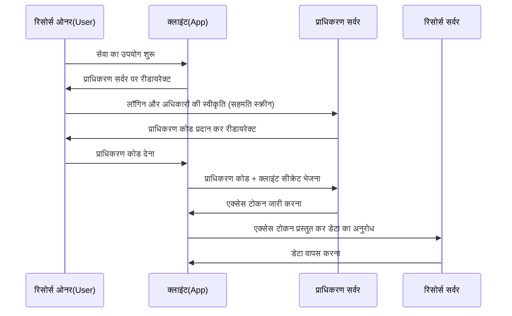

वेब सेवाओं का उपयोग करते समय "Google के साथ लॉगिन करें" या "X (पूर्व में Twitter) के साथ लॉगिन करें" जैसे बटन देखना आम बात है। हालाँकि, आश्चर्यजनक रूप से कुछ ही डेवलपर्स यह सटीक रूप से समझते हैं कि इसके पीछे वास्तव में क्या हो रहा है।

इस प्रणाली का समर्थन करने वाले दो मानक प्रोटोकॉल **OAuth 2.0** और **OpenID Connect (OIDC)** हैं। और इन्हें समझने के लिए सबसे महत्वपूर्ण पहला कदम "प्रमाणीकरण (Authentication)" और "प्राधिकरण (Authorization)" के बीच के अंतर को सही ढंग से पहचानना है।

इस लेख में, हम इन दो अवधारणाओं के बीच के अंतर से शुरुआत करेंगे, OAuth 2.0 के प्राधिकरण प्रवाह, ऐतिहासिक पृष्ठभूमि, OAuth का प्रमाणीकरण के लिए उपयोग करने के जोखिम और इस समस्या को हल करने के लिए OpenID Connect के जन्म पर चर्चा करेंगे, और अंत में आधुनिक प्रमाणीकरण/प्राधिकरण बुनियादी ढांचे के लिए आवश्यक JWT (JSON Web Token) तंत्र में गहराई से गोता लगाएंगे।

## 1. प्रमाणीकरण (Authentication) और प्राधिकरण (Authorization) के बीच मूलभूत अंतर

सुरक्षा की दुनिया में, प्रमाणीकरण और प्राधिकरण पूरी तरह से अलग अवधारणाएं हैं। उन्हें मिलाने से गंभीर सुरक्षा खामियां पैदा हो सकती हैं।

### प्रमाणीकरण (Authentication / AuthN)
**"आप कौन हैं? (Who are you?)"** की पुष्टि करने की प्रक्रिया है।
वास्तविक दुनिया में, यह आपकी पहचान साबित करने के लिए पासपोर्ट या ड्राइवर का लाइसेंस दिखाने के समान है।
सिस्टम में, इसमें यूज़र आईडी और पासवर्ड दर्ज करना, बायोमेट्रिक प्रमाणीकरण (फिंगरप्रिंट या चेहरा), या स्मार्टफोन का उपयोग करके बहु-कारक प्रमाणीकरण (MFA) शामिल है।

### प्राधिकरण (Authorization / AuthZ)
**"आप क्या कर सकते हैं? (What can you do?)"** को नियंत्रित करने की प्रक्रिया है।
वास्तविक दुनिया में, इसका मतलब यह तय करना है कि क्या आपको "इस वीआईपी रूम में प्रवेश करने का अधिकार है" या "क्या आप इस गोपनीय फ़ाइल को देख सकते हैं", भले ही आपके पास पासपोर्ट हो या नहीं।
सिस्टम में, इसमें एक्सेस कंट्रोल शामिल है, जैसे "सामान्य उपयोगकर्ताओं को केवल पढ़ने की अनुमति है, जबकि व्यवस्थापकों को लिखने और हटाने की भी अनुमति है।"

### दोनों के बीच संबंध
आमतौर पर, **प्राधिकरण प्रमाणीकरण के बाद होता है**। ऐसा इसलिए है क्योंकि "किसी व्यक्ति को क्या अनुमति है (प्राधिकरण)" यह केवल "आप कौन हैं (प्रमाणीकरण)" निर्धारित होने के बाद ही आंका जा सकता है।
हालाँकि, ये दो स्वतंत्र अवधारणाएँ हैं, और ऐसी स्थिति होना बहुत आम है जहाँ "प्रमाणीकरण सही है, लेकिन किसी विशिष्ट कार्य के लिए प्राधिकरण नहीं दिया गया है।"

## 2. OAuth 2.0 का सार और ऐतिहासिक पृष्ठभूमि

OAuth 2.0 को अक्सर "लॉगिन के लिए प्रोटोकॉल" समझने की गलती की जाती है, लेकिन संक्षेप में यह **"प्राधिकरण (Authorization)" के लिए एक फ्रेमवर्क** है।

### ऐतिहासिक पृष्ठभूमि और OAuth का जन्म
अतीत में, जब कोई वेब सेवा अन्य सेवाओं के डेटा (उदाहरण: एक फोटो-शेयरिंग सेवा जो SNS की मित्र सूची का उपयोग करना चाहती है) का उपयोग करना चाहती थी, तो उपयोगकर्ताओं को सीधे "अपने SNS आईडी और पासवर्ड" दर्ज करने के लिए कहने का एक बहुत ही खतरनाक तरीका अपनाया गया था। इसे "पासवर्ड एंटी-पैटर्न" कहा जाता है।

उपयोगकर्ताओं को अपना पासवर्ड किसी तीसरे पक्ष के ऐप को सौंपना पड़ता था, और अगर वह ऐप दुर्भावनापूर्ण होता, तो उनका खाता पूरी तरह से हाईजैक हो सकता था।

इस समस्या को हल करने के लिए **OAuth** का जन्म हुआ। OAuth का मूल विचार है "पासवर्ड सौंपने के बजाय सीमित अधिकारों वाली एक 'कुंजी (एक्सेस टोकन)' सौंपना"।

### OAuth 2.0 की प्रमुख भूमिकाएँ (Roles)
OAuth 2.0 को समझने के लिए, चार भूमिकाओं को समझना आवश्यक है।

1. **रिसोर्स ओनर (Resource Owner)**: डेटा तक पहुँच का अधिकार रखने वाला उपयोगकर्ता।
2. **क्लाइंट (Client)**: वह एप्लिकेशन जो उपयोगकर्ता के डेटा तक पहुँचना चाहता है (उदाहरण: एक फोटो प्रिंटिंग ऐप)।
3. **प्राधिकरण सर्वर (Authorization Server)**: वह सर्वर जो उपयोगकर्ता को प्रमाणित करता है और क्लाइंट को एक्सेस टोकन जारी करता है (उदाहरण: Google का प्रमाणीकरण सर्वर)।
4. **रिसोर्स सर्वर (Resource Server)**: वह सर्वर जो उपयोगकर्ता का डेटा रखता है, एक्सेस टोकन को सत्यापित करता है और डेटा प्रदान करता है (उदाहरण: Google Photo API)।

### प्राधिकरण कोड प्रवाह (Authorization Code Flow)
OAuth 2.0 में कई प्रवाह (Grant Types) हैं, लेकिन सबसे सुरक्षित और आम "प्राधिकरण कोड प्रवाह" है।

इस प्रवाह का सबसे महत्वपूर्ण बिंदु यह है कि **एक्सेस टोकन उपयोगकर्ता के ब्राउज़र (फ्रंटएंड) से होकर नहीं गुजरता है**। केवल एक अस्थायी वाउचर, जिसे प्राधिकरण कोड कहा जाता है, फ्रंटएंड से गुजरता है, और वास्तविक एक्सेस टोकन का आदान-प्रदान केवल बैकएंड (क्लाइंट और प्राधिकरण सर्वर के बीच) में होता है। इससे टोकन लीक होने का जोखिम काफी कम हो जाता है।

## 3. प्रमाणीकरण के लिए OAuth का उपयोग करने के जोखिम

जैसे-जैसे OAuth 2.0 लोकप्रिय हुआ, अधिक डेवलपर्स ने सोचा, "क्या हम इस तंत्र का उपयोग करके एक लॉगिन सुविधा लागू कर सकते हैं, बिना उपयोगकर्ताओं को आईडी/पासवर्ड प्रबंधित करने के?" यह "सोशल लॉगिन" की शुरुआत थी।

हालाँकि, जैसा कि पहले उल्लेख किया गया है, OAuth "प्राधिकरण" के लिए एक प्रोटोकॉल है, न कि "प्रमाणीकरण" के लिए एक प्रोटोकॉल। यदि OAuth का सीधा उपयोग प्रमाणीकरण के लिए किया जाता है, तो निम्नलिखित गंभीर जोखिम उत्पन्न होते हैं:

### 1. यह गलत धारणा कि "एक्सेस टोकन होने का अर्थ है कि आप वह उपयोगकर्ता हैं"
एक एक्सेस टोकन "किसी विशिष्ट संसाधन तक पहुँचने का अधिकार" दर्शाता है और यह साबित नहीं करता है कि "कौन प्रमाणित हुआ है"।
यदि कोई अन्य दुर्भावनापूर्ण क्लाइंट (ऐप B) एक्सेस टोकन प्राप्त करता है, तो उसे लक्षित क्लाइंट (ऐप A) को भेजकर लॉगिन करने का प्रयास किया जा सकता है। इसे "टोकन प्रतिस्थापन हमला (Token Substitution Attack)" कहा जाता है।

### 2. प्रमाणीकरण घटना की अपर्याप्त जानकारी
OAuth के एक्सेस टोकन में इस बारे में जानकारी नहीं होती है कि उपयोगकर्ता "कब" और "कैसे" प्रमाणित हुआ। क्लाइंट यह निर्धारित नहीं कर सकता कि क्या उपयोगकर्ता ने अभी लॉगिन किया है, या क्या पिछले लॉगिन से कोई शेष सत्र बचा है।

## 4. OpenID Connect (OIDC) का जन्म

इन "प्रमाणीकरण के लिए OAuth का उपयोग करने की समस्याओं" को मौलिक रूप से हल करने के लिए **OpenID Connect (OIDC)** का जन्म हुआ।

OIDC को OAuth 2.0 के विस्तार विनिर्देश के रूप में बनाया गया है। संक्षेप में, **"यह OAuth 2.0 के प्राधिकरण प्रवाह के ऊपर एक 'प्रमाणीकरण का प्रमाण पत्र' (ID Token) जोड़ता है।"**

जबकि OAuth 2.0 "एक्सेस टोकन (होटल के कमरे की चाबी)" जारी करता है, OIDC इसके अतिरिक्त "ID टोकन (पहचान पत्र)" जारी करता है।

### ID टोकन की भूमिका
ID टोकन एक डिजिटल रूप से हस्ताक्षरित डेटा है जहाँ प्राधिकरण सर्वर गारंटी देता है कि "यह उपयोगकर्ता निश्चित रूप से प्रमाणित किया गया है।" इस ID टोकन को सत्यापित करके, क्लाइंट सुरक्षित रूप से पहचान सकता है कि "किसने लॉगिन किया है।"

## 5. JWT (JSON Web Token) का तंत्र और सत्यापन

OIDC द्वारा जारी किए गए ID टोकन का वास्तविक रूप अक्सर **JWT (JSON Web Token)** प्रारूप में व्यक्त किया जाता है। JWT, JSON प्रारूप में सुरक्षित रूप से जानकारी प्रसारित करने के लिए एक खुला मानक (RFC 7519) है।

### JWT की संरचना
JWT तीन Base64URL एन्कोड किए गए स्ट्रिंग्स से बना होता है जो `.` (डॉट) द्वारा अलग किए गए होते हैं।

`Header.Payload.Signature`

1. **हेडर (Header)**:
   इसमें टोकन का प्रकार (JWT) और हस्ताक्षर के लिए उपयोग किए जाने वाले एल्गोरिदम (उदाहरण: RS256) जैसी मेटा जानकारी शामिल होती है।
2. **पेलोड (Payload)**:
   इसमें वास्तविक डेटा (क्लेम - Claims) शामिल होते हैं। OIDC के ID टोकन के मामले में, निम्नलिखित जानकारी (मानक क्लेम) शामिल होती है:
   - `iss` (Issuer): टोकन जारी करने वाले प्राधिकरण सर्वर का URL।
   - `sub` (Subject): उपयोगकर्ता का विशिष्ट पहचानकर्ता।
   - `aud` (Audience): टोकन प्राप्तकर्ता (क्लाइंट ID)।
   - `exp` (Expiration Time): टोकन की समाप्ति तिथि और समय।
   - `iat` (Issued At): वह तिथि और समय जब टोकन जारी किया गया था।
3. **हस्ताक्षर (Signature)**:
   यह हेडर और पेलोड को मिलाकर और एक निजी कुंजी का उपयोग करके बनाया गया डिजिटल हस्ताक्षर है। यह सुनिश्चित करता है कि डेटा के साथ कोई छेड़छाड़ नहीं की गई है।

### JWT सत्यापन प्रक्रिया
यह विश्वास करने के लिए कि क्लाइंट द्वारा प्राप्त किया गया JWT (ID टोकन) वैध है, निम्नलिखित सत्यापन प्रक्रिया आवश्यक है। इसे न करने से जाली टोकन के साथ अनधिकृत लॉगिन की अनुमति मिल सकती है।

1. **हस्ताक्षर का सत्यापन**: प्राधिकरण सर्वर (JWKS आदि के माध्यम से प्राप्त) की सार्वजनिक कुंजी का उपयोग करके जांचें कि हस्ताक्षर सही है या नहीं (क्या हेडर और पेलोड से छेड़छाड़ नहीं की गई है)।
2. **`iss` (Issuer) की जांच**: जांचें कि क्या टोकन अपेक्षित प्राधिकरण सर्वर से जारी किया गया था।
3. **`aud` (Audience) की जांच**: जांचें कि क्या टोकन आपके एप्लिकेशन के लिए जारी किया गया था (ताकि यह रोका जा सके कि अन्य ऐप्स के लिए जारी किए गए टोकन का उपयोग किया जा रहा है)।
4. **`exp` (Expiration) की जांच**: जांचें कि क्या टोकन की अवधि समाप्त तो नहीं हो गई है।

## निष्कर्ष

*   **प्रमाणीकरण (AuthN)** यह पुष्टि करता है कि "आप कौन हैं", और **प्राधिकरण (AuthZ)** यह नियंत्रित करता है कि "आप क्या कर सकते हैं।"
*   **OAuth 2.0** संसाधनों तक पहुँच अधिकार (एक्सेस टोकन) सुरक्षित रूप से सौंपने के लिए एक "प्राधिकरण" प्रोटोकॉल है।
*   OAuth का सीधे लॉगिन (प्रमाणीकरण) के लिए उपयोग करना खतरनाक है।
*   **OpenID Connect (OIDC)** OAuth 2.0 का विस्तार करता है और सुरक्षित लॉगिन प्राप्त करने के लिए एक "प्रमाणीकरण" प्रोटोकॉल है।
*   OIDC द्वारा जारी **ID टोकन (JWT)** उपयोगकर्ता के प्रमाणीकरण परिणामों को साबित करता है, और उचित सत्यापन (हस्ताक्षर, `iss`, `aud`, `exp`) आवश्यक है।

इन प्रोटोकॉल और अवधारणाओं को सही ढंग से समझकर और लागू करके, आप ऐसे एप्लिकेशन बना सकते हैं जो उपयोगकर्ताओं के लिए अत्यधिक सुविधाजनक और सुरक्षित दोनों हैं। आधुनिक वेब और मोबाइल विकास में, OAuth 2.0 और OIDC का ज्ञान अब एक आवश्यक कौशल माना जा सकता है।
