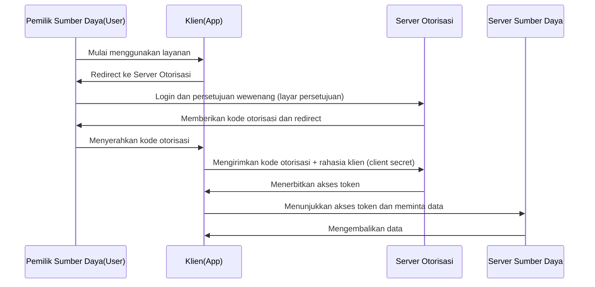

Melihat tombol seperti "Login dengan Google" atau "Login dengan X (sebelumnya Twitter)" saat menggunakan layanan web adalah hal yang biasa setiap hari. Namun, di balik layar, secara mengejutkan mungkin sedikit pengembang yang benar-benar memahami apa yang terjadi.

Protokol yang mendukung mekanisme ini adalah dua standar: **OAuth 2.0** dan **OpenID Connect (OIDC)**. Dan langkah pertama yang paling penting untuk memahami keduanya adalah mengenali perbedaan antara "Autentikasi (Authentication)" dan "Otorisasi (Authorization)" dengan benar.

Artikel ini akan dimulai dari perbedaan antara dua konsep ini, lalu menggali lebih dalam alur otorisasi OAuth 2.0, latar belakang sejarahnya, risiko menggunakan OAuth untuk autentikasi dan OpenID Connect yang lahir untuk menyelesaikan masalah tersebut, hingga cara kerja JWT (JSON Web Token) yang sangat penting untuk infrastruktur autentikasi dan otorisasi modern.

## 1. Perbedaan Mendasar antara Autentikasi (Authentication) dan Otorisasi (Authorization)

Dalam dunia keamanan, autentikasi dan otorisasi adalah konsep yang sama sekali berbeda. Mencampurkan keduanya dapat menyebabkan celah keamanan yang serius.

### Autentikasi (Authentication / AuthN)
Ini adalah proses untuk memastikan **"Siapa Anda? (Who are you?)"**.
Dalam dunia nyata, ini setara dengan tindakan membuktikan identitas Anda dengan menunjukkan paspor atau SIM.
Pada sistem, ini berupa memasukkan ID pengguna dan kata sandi, autentikasi biometrik (sidik jari atau wajah), atau autentikasi multi-faktor (MFA) menggunakan smartphone.

### Otorisasi (Authorization / AuthZ)
Ini adalah proses untuk mengontrol **"Apa yang dapat Anda lakukan? (What can you do?)"**.
Dalam dunia nyata, terlepas dari apakah Anda memiliki paspor atau tidak, ini adalah tindakan untuk menilai "apakah Anda memiliki wewenang untuk memasuki ruang VIP ini" atau "apakah Anda dapat melihat dokumen rahasia ini".
Pada sistem, ini berupa kontrol akses seperti "pengguna umum hanya diizinkan untuk membaca, sedangkan administrator juga diizinkan untuk menulis/menghapus".

### Hubungan Keduanya
Biasanya, **otorisasi dilakukan setelah autentikasi**. Karena hanya setelah "siapa Anda (autentikasi)" dipastikan, baru dapat dinilai "apa yang diizinkan untuk orang tersebut (otorisasi)".
Namun, keduanya adalah konsep yang independen, dan keadaan di mana "diotentikasi dengan benar, tetapi tidak diotorisasi untuk operasi tertentu" sangat umum terjadi.

## 2. Esensi dan Latar Belakang Sejarah OAuth 2.0

OAuth 2.0 sering disalahpahami sebagai "protokol untuk login", tetapi pada dasarnya ini adalah **kerangka kerja untuk "Otorisasi (Authorization)"**.

### Latar Belakang Sejarah dan Lahirnya OAuth
Di masa lalu, ketika sebuah layanan web ingin menggunakan data dari layanan lain (misalnya, layanan berbagi foto menggunakan daftar teman SNS), digunakan metode yang sangat berbahaya dengan meminta pengguna untuk secara langsung memasukkan "ID dan kata sandi SNS". Ini disebut "Anti-pola kata sandi (Password anti-pattern)".

Pengguna harus menyerahkan kata sandi mereka ke aplikasi pihak ketiga, dan jika aplikasi tersebut memiliki niat buruk, akun mereka bisa sepenuhnya dibajak.

Untuk menyelesaikan masalah ini, lahirlah **OAuth**. Ide dasar dari OAuth adalah "daripada menyerahkan kata sandi, serahkan 'kunci (akses token)' yang memiliki wewenang terbatas".

### Peran Utama dalam OAuth 2.0
Untuk memahami OAuth 2.0, kita perlu memahami 4 peran (roles) ini.

1. **Pemilik Sumber Daya (Resource Owner)**: Pengguna yang memiliki hak akses ke data.
2. **Klien (Client)**: Aplikasi yang ingin mengakses data pengguna (misal: aplikasi cetak foto).
3. **Server Otorisasi (Authorization Server)**: Server yang mengautentikasi pengguna dan menerbitkan akses token ke klien (misal: server autentikasi Google).
4. **Server Sumber Daya (Resource Server)**: Server yang menyimpan data pengguna, memverifikasi akses token, dan menyediakan data (misal: Google Photo API).

### Alur Kode Otorisasi (Authorization Code Flow)
OAuth 2.0 memiliki beberapa alur (tipe grant), tetapi yang paling aman dan umum adalah "Alur Kode Otorisasi".

Poin terbesar dari alur ini adalah **akses token tidak melewati browser pengguna (frontend)**. Hanya tiket sementara berupa kode otorisasi yang melewati frontend, sedangkan akses token yang sebenarnya hanya dipertukarkan di backend (antara klien dan server otorisasi). Hal ini secara signifikan mengurangi risiko kebocoran token.

## 3. Risiko Menggunakan OAuth untuk Autentikasi

Ketika OAuth 2.0 mulai populer, banyak pengembang berpikir "Jika kita menggunakan mekanisme ini, kita dapat mengimplementasikan fitur login tanpa mengharuskan pengguna mengelola ID/kata sandi, bukan?". Inilah awal mula "Social Login".

Namun, seperti yang disebutkan sebelumnya, OAuth adalah protokol "otorisasi", bukan protokol "autentikasi". Jika OAuth digunakan untuk autentikasi seperti apa adanya, risiko serius berikut akan muncul.

### 1. Kesalahpahaman "Memiliki akses token = Pengguna tersebut"
Akses token hanya menunjukkan "wewenang untuk mengakses sumber daya tertentu", dan tidak membuktikan "siapa yang telah diautentikasi".
Ada risiko seperti "Serangan Substitusi Token (Token Substitution Attack)" di mana klien berbahaya lain (Aplikasi B) yang telah memperoleh akses token mengirimkannya ke klien target (Aplikasi A) dan mencoba untuk login.

### 2. Kurangnya Informasi Peristiwa Autentikasi
Akses token OAuth tidak berisi informasi tentang "kapan" atau "bagaimana" pengguna diautentikasi. Pihak klien tidak dapat membedakan apakah pengguna baru saja login, atau apakah hanya ada sesi yang tersisa dari login sebelumnya.

## 4. Lahirnya OpenID Connect (OIDC)

Untuk secara fundamental menyelesaikan "masalah saat menggunakan OAuth untuk autentikasi", **OpenID Connect (OIDC)** dilahirkan.

OIDC dibuat sebagai ekstensi dari spesifikasi OAuth 2.0. Singkatnya, ini adalah **"sebuah 'Sertifikat Autentikasi' berupa ID Token (ID Token) yang diletakkan di atas alur otorisasi OAuth 2.0"**.

Jika OAuth 2.0 menerbitkan "akses token (kunci kamar hotel)", OIDC menerbitkan "ID Token (kartu identitas)" sebagai tambahannya.

### Peran ID Token
ID Token adalah data dengan tanda tangan digital dari server otorisasi yang menjamin bahwa "pengguna ini benar-benar telah diautentikasi". Klien dapat memverifikasi ID token ini untuk secara aman mengidentifikasi "siapa yang telah login".

## 5. Cara Kerja dan Verifikasi JWT (JSON Web Token)

Entitas dari ID Token yang diterbitkan di OIDC dalam banyak kasus direpresentasikan dalam format **JWT (JSON Web Token)**. JWT adalah standar terbuka (RFC 7519) untuk mengirimkan informasi secara aman dalam format JSON.

### Struktur JWT
JWT terdiri dari tiga string yang di-encode dengan Base64URL dan dipisahkan oleh `.` (titik).

`Header.Payload.Signature`

1. **Header (Header)**:
   Berisi informasi meta seperti jenis token (JWT) dan algoritma yang digunakan untuk tanda tangan (misal: RS256).
2. **Payload (Payload)**:
   Berisi data aktual (klaim). Untuk ID Token OIDC, biasanya terdapat informasi (klaim standar) berikut.
   - `iss` (Issuer): URL server otorisasi yang menerbitkan token.
   - `sub` (Subject): Pengidentifikasi unik dari pengguna.
   - `aud` (Audience): Penerima token (ID Klien).
   - `exp` (Expiration Time): Waktu kedaluwarsa token.
   - `iat` (Issued At): Waktu saat token diterbitkan.
3. **Signature (Tanda Tangan)**:
   Tanda tangan digital yang dibuat menggunakan kunci rahasia pada gabungan Header dan Payload. Ini menjamin bahwa data tidak diubah.

### Proses Verifikasi JWT
Agar klien dapat mempercayai JWT (ID Token) yang diterimanya, proses verifikasi berikut ini sangat penting. Jika ini diabaikan, akan memungkinkan login tidak sah menggunakan token palsu.

1. **Verifikasi Tanda Tangan**: Memastikan apakah Signature benar (Header dan Payload tidak diubah) menggunakan kunci publik (diperoleh melalui JWKS dll.) yang dipublikasikan oleh server otorisasi.
2. **Konfirmasi `iss` (Issuer)**: Memastikan apakah token diterbitkan oleh server otorisasi yang diharapkan.
3. **Konfirmasi `aud` (Audience)**: Memastikan apakah token diterbitkan untuk aplikasi Anda sendiri. (Untuk mencegah token yang ditujukan untuk aplikasi lain disalahgunakan).
4. **Konfirmasi `exp` (Expiration)**: Memastikan apakah masa berlaku token belum berakhir.

## Kesimpulan

*   **Autentikasi (AuthN)** mengonfirmasi "siapa", dan **Otorisasi (AuthZ)** mengontrol "apa yang dapat dilakukan".
*   **OAuth 2.0** adalah protokol "otorisasi" untuk mendelegasikan hak akses (akses token) secara aman ke sumber daya.
*   Sangat berbahaya menggunakan OAuth seperti apa adanya untuk login (autentikasi).
*   **OpenID Connect (OIDC)** adalah protokol "autentikasi" yang memperluas OAuth 2.0 untuk mewujudkan login yang aman.
*   **ID Token (JWT)** yang diterbitkan oleh OIDC membuktikan hasil autentikasi pengguna, dan verifikasi yang tepat (Tanda Tangan, `iss`, `aud`, `exp`) sangatlah penting.

Dengan memahami dan mengimplementasikan protokol dan konsep ini secara tepat, Anda dapat membangun aplikasi yang sangat nyaman bagi pengguna dan sekaligus aman. Dalam pengembangan web/mobile modern, pengetahuan tentang OAuth 2.0 dan OIDC bisa dibilang merupakan pengetahuan yang wajib dimiliki.
