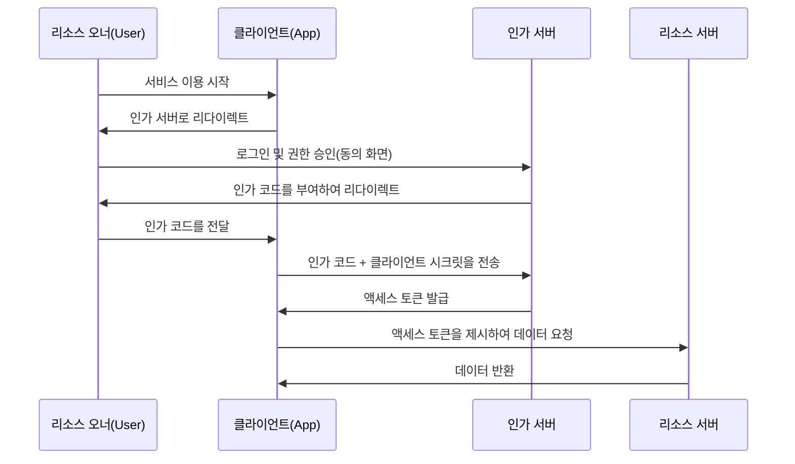

웹 서비스를 이용할 때 "Google로 로그인", "X(구 Twitter)로 로그인"과 같은 버튼을 보는 것은 일상다반사입니다. 하지만 그 이면에서 무슨 일이 일어나고 있는지 정확히 이해하고 있는 개발자는 의외로 적을지도 모릅니다.

이 구조를 지탱하고 있는 것이 **OAuth 2.0**과 **OpenID Connect (OIDC)**라는 두 가지 표준 프로토콜입니다. 그리고 이를 이해하기 위한 가장 중요한 첫걸음이 '인증(Authentication)'과 '인가(Authorization)'의 차이를 올바르게 인식하는 것입니다.

본 문서에서는 이 두 개념의 차이부터 시작하여, OAuth 2.0의 인가 플로우, 역사적 배경, 그리고 OAuth를 인증에 전용할 때의 위험성과 이를 해결하기 위해 탄생한 OpenID Connect, 나아가 현대의 인증·인가 기반에 빼놓을 수 없는 JWT(JSON Web Token)의 구조까지 깊이 파고들어 해설합니다.

## 1. 인증(Authentication)과 인가(Authorization)의 근본적인 차이

보안의 세계에서 인증과 인가는 전혀 다른 개념입니다. 이를 혼동하면 중대한 보안 허점을 낳는 원인이 됩니다.

### 인증(Authentication / AuthN)
**"당신은 누구인가? (Who are you?)"**를 확인하는 프로세스입니다.
현실 세계로 치면 여권이나 운전면허증을 제시하여 신원을 증명하는 행위에 해당합니다.
시스템 상에서는 사용자 ID와 비밀번호 입력, 생체 인증(지문이나 얼굴), 혹은 스마트폰을 이용한 다중 인증(MFA) 등이 이에 해당합니다.

### 인가(Authorization / AuthZ)
**"당신은 무엇을 할 수 있는가? (What can you do?)"**를 제어하는 프로세스입니다.
현실 세계로 치면 여권 소지 여부와 관계없이, "이 VIP 룸에 입장할 권한이 있는지", "이 기밀 파일을 열람할 수 있는지"를 판단하는 행위입니다.
시스템 상에서는 "일반 사용자에게는 읽기만 허용하고, 관리자에게는 쓰기·삭제도 허용한다"와 같은 접근 제어가 이에 해당합니다.

### 두 가지의 관계성
일반적으로 **인증이 이루어진 후에 인가가 이루어집니다**. "당신이 누구인지(인증)"가 확정되어야 비로소 "그 사람에게 무엇이 허용되어 있는지(인가)"를 판단할 수 있기 때문입니다.
하지만 이 둘은 독립적인 개념이며, "올바르게 인증되었지만 특정 작업에 대한 인가는 되지 않았다"라는 상태는 아주 흔하게 발생합니다.

## 2. OAuth 2.0의 본질과 역사적 배경

OAuth 2.0은 흔히 "로그인을 위한 프로토콜"로 오해받기 쉽지만, 본질적으로는 **"인가(Authorization)"를 위한 프레임워크**입니다.

### 역사적 배경과 OAuth의 탄생
과거에 웹 서비스가 다른 서비스의 데이터(예: 사진 공유 서비스가 SNS의 친구 목록)를 이용하고 싶을 때, 사용자에게 "SNS의 ID와 비밀번호"를 직접 입력하게 하는 매우 위험한 방법이 사용되었습니다. 이를 "비밀번호 안티패턴"이라고 부릅니다.

사용자는 제3자의 앱에 자신의 비밀번호를 맡기게 되며, 그 앱이 악의를 가지고 있다면 계정을 완전히 하이재킹 당하게 됩니다.

이 문제를 해결하기 위해 탄생한 것이 **OAuth**입니다. OAuth의 기본 아이디어는 "비밀번호를 건네주는 대신, 제한적인 권한을 가진 '열쇠(액세스 토큰)'를 건네준다"는 것입니다.

### OAuth 2.0의 주요 역할(등장인물)
OAuth 2.0을 이해하려면 4가지 역할을 파악해야 합니다.

1. **리소스 오너 (Resource Owner)**: 데이터에 대한 접근 권한을 가진 사용자.
2. **클라이언트 (Client)**: 사용자의 데이터에 접근하고 싶은 애플리케이션(예: 사진 인화 앱).
3. **인가 서버 (Authorization Server)**: 사용자를 인증하고, 클라이언트에게 액세스 토큰을 발급하는 서버(예: Google의 인증 서버).
4. **리소스 서버 (Resource Server)**: 사용자의 데이터를 보유하고, 액세스 토큰을 검증하여 데이터를 제공하는 서버(예: Google Photo API).

### 인가 코드 플로우 (Authorization Code Flow)
OAuth 2.0에는 몇 가지 플로우(그랜트 타입)가 있지만, 가장 안전하고 일반적인 것이 "인가 코드 플로우"입니다.

이 플로우의 가장 큰 포인트는 **액세스 토큰이 사용자의 브라우저(프론트엔드)를 거치지 않는다**는 것입니다. 인가 코드라는 일시적인 교환권만이 프론트엔드를 통과하며, 실제 액세스 토큰은 백엔드(클라이언트와 인가 서버 간)에서만 주고받습니다. 이를 통해 토큰 유출 위험을 대폭 줄이고 있습니다.

## 3. OAuth를 인증에 전용할 때의 위험성

OAuth 2.0이 보급되자 "이 구조를 사용하면 사용자에게 ID/비밀번호를 관리하게 하지 않고도 로그인 기능을 구현할 수 있지 않을까?"라고 생각하는 개발자가 늘어났습니다. 이른바 "소셜 로그인"의 시작입니다.

하지만 앞서 언급했듯이 OAuth는 "인가" 프로토콜이며, "인증" 프로토콜이 아닙니다. OAuth를 그대로 인증에 전용하면 다음과 같은 심각한 위험이 발생합니다.

### 1. "액세스 토큰을 가지고 있다 = 그 사용자이다"라는 오해
액세스 토큰은 "특정 리소스에 접근할 권한"을 나타내는 것이지, "누가 인증되었는가"를 증명하는 것이 아닙니다.
악의적인 다른 클라이언트(앱 B)가 획득한 액세스 토큰을 타겟이 되는 클라이언트(앱 A)에 전송하여 로그인을 시도하는 "토큰 치환 공격(Token Substitution Attack)" 등의 위험이 있습니다.

### 2. 인증 이벤트의 정보 부족
OAuth의 액세스 토큰에는 "언제", "어떻게" 사용자가 인증되었는지에 대한 정보가 포함되어 있지 않습니다. 클라이언트 측은 사용자가 방금 로그인한 것인지, 아니면 과거에 로그인한 세션이 남아있는 것일 뿐인지 판단할 수 없습니다.

## 4. OpenID Connect (OIDC)의 탄생

이러한 "OAuth를 인증에 사용할 때의 문제점"을 근본적으로 해결하기 위해 탄생한 것이 **OpenID Connect (OIDC)**입니다.

OIDC는 OAuth 2.0의 확장 사양으로 만들어졌습니다. 한마디로 말하면 **"OAuth 2.0의 인가 플로우 위에 ID 토큰(ID Token)이라는 '인증 증명서'를 얹은 것"**입니다.

OAuth 2.0이 "액세스 토큰(호텔 객실 키)"을 발급하는 반면, OIDC는 이에 더해 "ID 토큰(신분증)"을 발급합니다.

### ID 토큰의 역할
ID 토큰은 인가 서버가 "이 사용자는 확실히 인증되었습니다"라고 보증하는 디지털 서명이 포함된 데이터입니다. 클라이언트는 이 ID 토큰을 검증함으로써 안전하게 "누가 로그인했는지"를 특정할 수 있습니다.

## 5. JWT (JSON Web Token)의 구조와 검증

OIDC에서 발급되는 ID 토큰의 실체는 대부분 **JWT (JSON Web Token)**라는 포맷으로 표현됩니다. JWT는 정보를 JSON 형식으로 안전하게 전달하기 위한 개방형 표준(RFC 7519)입니다.

### JWT의 구조
JWT는 `.`(점)으로 구분된 3개의 Base64URL 인코딩된 문자열로 구성됩니다.

`Header.Payload.Signature`

1. **Header (헤더)**:
   토큰의 타입(JWT)이나 서명에 사용된 알고리즘(예: RS256) 등의 메타 정보가 포함됩니다.
2. **Payload (페이로드)**:
   실제 데이터(클레임)가 포함됩니다. OIDC의 ID 토큰의 경우 다음과 같은 정보(표준 클레임)가 포함됩니다.
   - `iss` (Issuer): 토큰을 발급한 인가 서버의 URL.
   - `sub` (Subject): 사용자의 고유 식별자.
   - `aud` (Audience): 토큰의 수신자(클라이언트 ID).
   - `exp` (Expiration Time): 토큰의 만료 시간.
   - `iat` (Issued At): 토큰이 발급된 일시.
3. **Signature (서명)**:
   Header와 Payload를 결합한 것에 대해 비밀 키를 사용하여 생성된 디지털 서명입니다. 이를 통해 데이터가 변조되지 않았음을 보증합니다.

### JWT 검증 프로세스
클라이언트가 받은 JWT(ID 토큰)를 신뢰하려면 다음의 검증 프로세스가 필수적입니다. 이를 게을리하면 위조된 토큰으로 부정 로그인을 허용하게 됩니다.

1. **서명 검증**: 인가 서버가 공개하고 있는 공개 키(JWKS 등에서 획득)를 사용하여 Signature가 올바른지(Header와 Payload가 변조되지 않았는지) 확인합니다.
2. **`iss` (Issuer) 확인**: 토큰이 기대하는 인가 서버에서 발급된 것인지 확인합니다.
3. **`aud` (Audience) 확인**: 토큰이 자신의 애플리케이션을 위해 발급된 것인지 확인합니다. (다른 앱을 위한 토큰이 재사용되고 있지 않은지 방지하기 위함).
4. **`exp` (Expiration) 확인**: 토큰의 만료 기한이 지나지 않았는지 확인합니다.

## 요약

*   **인증(AuthN)**은 "누구인지"를 확인하고, **인가(AuthZ)**는 "무엇을 할 수 있는지"를 제어합니다.
*   **OAuth 2.0**은 리소스에 대한 접근 권한(액세스 토큰)을 안전하게 위임하기 위한 "인가" 프로토콜입니다.
*   OAuth를 그대로 로그인(인증)에 사용하는 것은 위험합니다.
*   **OpenID Connect (OIDC)**는 OAuth 2.0을 확장하여 안전한 로그인을 구현하기 위한 "인증" 프로토콜입니다.
*   OIDC가 발급하는 **ID 토큰(JWT)**은 사용자의 인증 결과를 증명하는 것이며, 적절한 검증(서명, `iss`, `aud`, `exp`)이 필수적입니다.

이러한 프로토콜과 개념을 올바르게 이해하고 구현함으로써 사용자에게 편리하면서도 안전한 애플리케이션을 구축할 수 있습니다. 모던 웹·모바일 개발에서 OAuth 2.0과 OIDC에 대한 지식은 이제 필수적인 소양이라고 할 수 있습니다.
