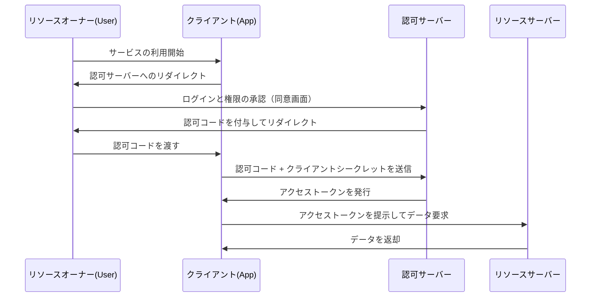

ウェブサービスを利用する上で「Googleでログイン」「X（旧Twitter）でログイン」といったボタンを見かけることは日常茶飯事です。しかし、その裏側で何が起こっているのか、正確に理解している開発者は意外と少ないかもしれません。

この仕組みを支えているのが **OAuth 2.0** と **OpenID Connect (OIDC)** という2つの標準プロトコルです。そして、これらを理解するための最も重要な第一歩が、「認証（Authentication）」と「認可（Authorization）」の違いを正しく認識することです。

本記事では、この2つの概念の違いから始まり、OAuth 2.0の認可フロー、歴史的背景、そしてOAuthを認証に流用するリスクとそれを解決するために誕生したOpenID Connect、さらに現代の認証・認可基盤に欠かせないJWT（JSON Web Token）の仕組みまで、深く掘り下げて解説します。

## 1. 認証（Authentication）と認可（Authorization）の根本的な違い

セキュリティの世界において、認証と認可は全く異なる概念です。ここを混同すると、重大なセキュリティホールを生み出す原因となります。

### 認証（Authentication / AuthN）
**「あなたは誰か？（Who are you?）」** を確認するプロセスです。
現実世界で言えば、パスポートや運転免許証を提示して身元を証明する行為に相当します。
システム上では、ユーザーIDとパスワードの入力、生体認証（指紋や顔）、あるいはスマートフォンを使った多要素認証（MFA）などがこれに当たります。

### 認可（Authorization / AuthZ）
**「あなたには何ができるか？（What can you do?）」** を制御するプロセスです。
現実世界で言えば、パスポートを持っているかどうかに関わらず、「このVIPルームに入室する権限があるか」「この機密ファイルを閲覧できるか」を判断する行為です。
システム上では、「一般ユーザーには読み取りのみを許可し、管理者には書き込み・削除も許可する」といったアクセス制御がこれに当たります。

### 2つの関係性
通常、**認証が行われた後に認可が行われます**。「あなたが誰であるか（認証）」が確定して初めて、「その人に何が許可されているか（認可）」を判断できるからです。
しかし、この2つは独立した概念であり、「正しく認証されているが、特定の操作に対する認可はされていない」という状態はごく普通に発生します。

## 2. OAuth 2.0 の本質と歴史的背景

OAuth 2.0 は、よく「ログインのためのプロトコル」と誤解されがちですが、本質的には **「認可（Authorization）」のためのフレームワーク** です。

### 歴史的背景と OAuth の誕生
かつて、ウェブサービスが他のサービスのデータ（例：写真共有サービスがSNSの友達リスト）を利用したい場合、ユーザーに「SNSのIDとパスワード」を直接入力させるという非常に危険な方法がとられていました。これを「パスワードのアンチパターン」と呼びます。

ユーザーは第三者のアプリに自分のパスワードを預けることになり、そのアプリが悪意を持っていれば、アカウントを完全にハイジャックされてしまいます。

この問題を解決するために生まれたのが **OAuth** です。OAuthの基本的なアイデアは、「パスワードを渡す代わりに、限定的な権限を持った『鍵（アクセストークン）』を渡す」というものです。

### OAuth 2.0 の主要なロール（登場人物）
OAuth 2.0 を理解するには、4つの役割を把握する必要があります。

1. **リソースオーナー (Resource Owner)**: データへのアクセス権を持つユーザー。
2. **クライアント (Client)**: ユーザーのデータにアクセスしたいアプリケーション（例：写真印刷アプリ）。
3. **認可サーバー (Authorization Server)**: ユーザーを認証し、クライアントにアクセストークンを発行するサーバー（例：Googleの認証サーバー）。
4. **リソースサーバー (Resource Server)**: ユーザーのデータを保持し、アクセストークンを検証してデータを提供するサーバー（例：Google Photo API）。

### 認可コードフロー (Authorization Code Flow)
OAuth 2.0 にはいくつかのフロー（グラントタイプ）がありますが、最も安全で一般的なのが「認可コードフロー」です。

このフローの最大のポイントは、**アクセストークンがユーザーのブラウザ（フロントエンド）を経由しない**ことです。認可コードという一時的な引換券だけがフロントエンドを通り、実際のアクセストークンはバックエンド（クライアントと認可サーバー間）でのみやり取りされます。これにより、トークンの漏洩リスクを大幅に低減しています。

## 3. OAuth を認証に流用するリスク

OAuth 2.0 が普及すると、「この仕組みを使えば、ユーザーにID/パスワードを管理させずにログイン機能を実装できるのでは？」と考える開発者が増えました。いわゆる「ソーシャルログイン」の始まりです。

しかし、前述の通り OAuth は「認可」のプロトコルであり、「認証」のプロトコルではありません。OAuth をそのまま認証に流用すると、次のような深刻なリスクが生じます。

### 1. 「アクセストークンを持っている＝そのユーザーである」という誤解
アクセストークンは「特定のリソースにアクセスする権限」を示すものであり、「誰が認証されたか」を証明するものではありません。
悪意のある別のクライアント（アプリB）が取得したアクセストークンを、ターゲットとなるクライアント（アプリA）に送信してログインを試みる「トークン置換攻撃（Token Substitution Attack）」などのリスクがあります。

### 2. 認証イベントの情報不足
OAuth のアクセストークンには、「いつ」「どのように」ユーザーが認証されたかという情報が含まれていません。クライアント側は、ユーザーがたった今ログインしたのか、それとも過去にログインしたセッションが残っているだけなのかを判断できません。

## 4. OpenID Connect (OIDC) の誕生

これらの「OAuthを認証に使う際の問題点」を根本的に解決するために誕生したのが **OpenID Connect (OIDC)** です。

OIDC は、OAuth 2.0 の拡張仕様として作られています。一言で言えば、**「OAuth 2.0 の認可フローの上に、IDトークン（ID Token）という『認証の証明書』を乗せたもの」** です。

OAuth 2.0 が「アクセストークン（ホテルのルームキー）」を発行するのに対し、OIDC はそれに加えて「IDトークン（身分証明書）」を発行します。

### IDトークンの役割
IDトークンは、認可サーバーが「このユーザーは確かに認証されました」と保証するデジタル署名付きのデータです。クライアントはこのIDトークンを検証することで、安全に「誰がログインしたか」を特定できます。

## 5. JWT (JSON Web Token) の仕組みと検証

OIDC で発行される IDトークン の実体は、多くの場合 **JWT (JSON Web Token)** というフォーマットで表現されます。JWTは、情報をJSON形式で安全に伝達するためのオープンスタンダード（RFC 7519）です。

### JWT の構造
JWTは `.`（ドット）で区切られた3つのBase64URLエンコードされた文字列で構成されます。

`Header.Payload.Signature`

1. **Header（ヘッダー）**:
   トークンのタイプ（JWT）や、署名に使用されているアルゴリズム（例：RS256）などのメタ情報が含まれます。
2. **Payload（ペイロード）**:
   実際のデータ（クレーム）が含まれます。OIDCのIDトークンの場合、以下のような情報（標準クレーム）が含まれます。
   - `iss` (Issuer): トークンを発行した認可サーバーのURL。
   - `sub` (Subject): ユーザーの一意の識別子。
   - `aud` (Audience): トークンの受取人（クライアントID）。
   - `exp` (Expiration Time): トークンの有効期限。
   - `iat` (Issued At): トークンが発行された日時。
3. **Signature（署名）**:
   HeaderとPayloadを結合したものに対して、秘密鍵を用いて作成されたデジタル署名です。これにより、データが改ざんされていないことを保証します。

### JWT の検証プロセス
クライアントが受け取ったJWT（IDトークン）を信頼するためには、以下の検証プロセスが不可欠です。これを怠ると、偽造されたトークンで不正ログインを許すことになります。

1. **署名の検証**: 認可サーバーが公開している公開鍵（JWKS等で取得）を使用して、Signatureが正しいか（HeaderとPayloadが改ざんされていないか）を確認します。
2. **`iss` (Issuer) の確認**: トークンが期待する認可サーバーから発行されたものかを確認します。
3. **`aud` (Audience) の確認**: トークンが自分のアプリケーション向けに発行されたものかを確認します。（他のアプリ向けのトークンを使い回されていないか防ぐため）。
4. **`exp` (Expiration) の確認**: トークンの有効期限が切れていないかを確認します。

## まとめ

*   **認証（AuthN）**は「誰か」を確認し、**認可（AuthZ）**は「何ができるか」を制御します。
*   **OAuth 2.0** はリソースへのアクセス権（アクセストークン）を安全に委譲するための「認可」のプロトコルです。
*   OAuthをそのままログイン（認証）に使うのは危険です。
*   **OpenID Connect (OIDC)** は、OAuth 2.0 を拡張し、安全なログインを実現するための「認証」プロトコルです。
*   OIDC が発行する **IDトークン（JWT）** は、ユーザーの認証結果を証明するものであり、適切な検証（署名、`iss`、`aud`、`exp`）が不可欠です。

これらのプロトコルと概念を正しく理解し実装することで、ユーザーにとって利便性が高く、かつセキュアなアプリケーションを構築することができます。モダンなウェブ・モバイル開発において、OAuth 2.0とOIDCの知識は、もはや必須の教養と言えるでしょう。
