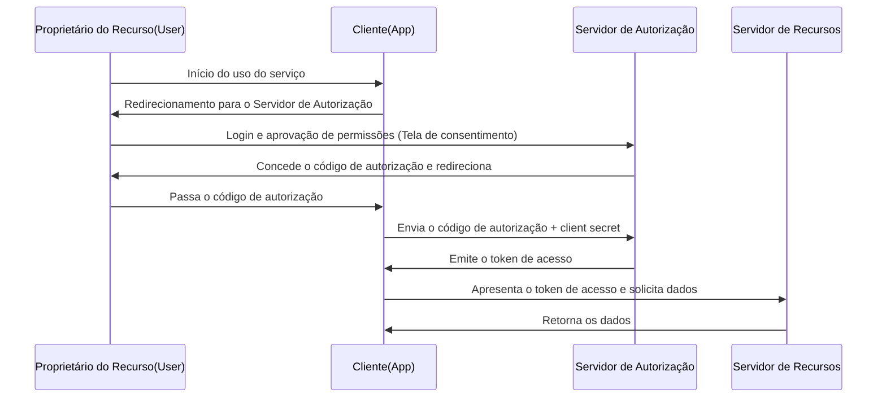

É comum vermos botões como "Fazer login com o Google" ou "Fazer login com o X (antigo Twitter)" ao usar serviços na web. No entanto, surpreendentemente, poucos desenvolvedores entendem exatamente o que acontece nos bastidores.

Essa infraestrutura é suportada por dois protocolos padrão: **OAuth 2.0** e **OpenID Connect (OIDC)**. O primeiro passo e o mais importante para compreendê-los é reconhecer corretamente a diferença entre "Autenticação (Authentication)" e "Autorização (Authorization)".

Neste artigo, começaremos com a diferença entre esses dois conceitos e nos aprofundaremos no fluxo de autorização do OAuth 2.0, seu histórico, os riscos de usar o OAuth para autenticação, o OpenID Connect que foi criado para resolver esses problemas e, finalmente, como funciona o JWT (JSON Web Token), que é indispensável para as infraestruturas modernas de autenticação e autorização.

## 1. A diferença fundamental entre Autenticação (Authentication) e Autorização (Authorization)

No mundo da segurança, autenticação e autorização são conceitos completamente diferentes. Confundi-los pode causar graves vulnerabilidades de segurança.

### Autenticação (Authentication / AuthN)
É o processo de confirmar **"Quem é você? (Who are you?)"**.
No mundo real, equivale a apresentar um passaporte ou carteira de motorista para provar sua identidade.
Nos sistemas, isso corresponde a inserir um ID de usuário e senha, usar biometria (impressão digital ou rosto) ou autenticação multifator (MFA) usando um smartphone.

### Autorização (Authorization / AuthZ)
É o processo de controlar **"O que você pode fazer? (What can you do?)"**.
No mundo real, independentemente de você ter um passaporte ou não, é o ato de determinar se você "tem permissão para entrar nesta sala VIP" ou "pode visualizar este arquivo confidencial".
Nos sistemas, isso corresponde ao controle de acesso, como "permitir apenas leitura para usuários comuns e permitir também gravação/exclusão para administradores".

### A relação entre os dois
Geralmente, **a autorização ocorre após a autenticação**. Isso ocorre porque só podemos determinar "o que é permitido a essa pessoa (autorização)" depois de confirmar "quem você é (autenticação)".
No entanto, esses são conceitos independentes e é muito comum ocorrer uma situação em que você está "autenticado corretamente, mas não está autorizado para uma operação específica".

## 2. A essência do OAuth 2.0 e o contexto histórico

O OAuth 2.0 é frequentemente mal interpretado como um "protocolo para login", mas em essência é um **framework para "Autorização (Authorization)"**.

### Contexto histórico e o nascimento do OAuth
No passado, quando um serviço da web queria usar dados de outro serviço (por exemplo, um serviço de compartilhamento de fotos acessando a lista de amigos de uma rede social), usava-se um método muito perigoso em que o usuário precisava inserir sua "ID e senha da rede social" diretamente. Isso é chamado de "anti-padrão de senha".

O usuário estava confiando sua senha a um aplicativo de terceiros e, se esse aplicativo fosse malicioso, a conta poderia ser completamente sequestrada.

O **OAuth** foi criado para resolver esse problema. A ideia básica do OAuth é "em vez de fornecer a senha, você fornece uma 'chave (access token)' com permissões limitadas".

### Principais papéis (Personagens) no OAuth 2.0
Para entender o OAuth 2.0, você precisa compreender quatro funções.

1. **Proprietário do recurso (Resource Owner)**: O usuário que possui os direitos de acesso aos dados.
2. **Cliente (Client)**: O aplicativo que deseja acessar os dados do usuário (por exemplo, um aplicativo de impressão de fotos).
3. **Servidor de Autorização (Authorization Server)**: O servidor que autentica o usuário e emite o token de acesso para o cliente (por exemplo, o servidor de autenticação do Google).
4. **Servidor de Recursos (Resource Server)**: O servidor que hospeda os dados do usuário, verifica o token de acesso e fornece os dados (por exemplo, Google Photo API).

### Fluxo de Código de Autorização (Authorization Code Flow)
Existem vários fluxos (grant types) no OAuth 2.0, mas o mais seguro e comum é o "Fluxo de Código de Autorização".

O ponto mais importante deste fluxo é que **o token de acesso não passa pelo navegador (frontend) do usuário**. Apenas o bilhete temporário chamado código de autorização passa pelo frontend, e o token de acesso real é trocado apenas no backend (entre o cliente e o servidor de autorização). Isso reduz significativamente o risco de vazamento do token.

## 3. Riscos de usar o OAuth para autenticação

Quando o OAuth 2.0 se tornou popular, muitos desenvolvedores pensaram: "Usando esse mecanismo, podemos implementar uma função de login sem que o usuário precise gerenciar um ID e senha?". Esse foi o início do que chamamos de "Login Social".

No entanto, como mencionado acima, o OAuth é um protocolo de "autorização" e não um protocolo de "autenticação". Se o OAuth for usado para autenticação da forma como está, surgem os seguintes riscos graves.

### 1. O mal-entendido de "ter um token de acesso = ser aquele usuário"
O token de acesso indica a "permissão para acessar um recurso específico" e não prova "quem foi autenticado".
Existe o risco de ataques como o "Ataque de Substituição de Token (Token Substitution Attack)", em que um token de acesso obtido por outro cliente malicioso (App B) é enviado para o cliente alvo (App A) na tentativa de fazer login.

### 2. Falta de informações sobre o evento de autenticação
O token de acesso do OAuth não contém informações sobre "quando" e "como" o usuário foi autenticado. O lado do cliente não pode determinar se o usuário acabou de fazer login ou se há apenas uma sessão que permaneceu de um login passado.

## 4. O nascimento do OpenID Connect (OIDC)

Para resolver fundamentalmente esses "problemas ao usar o OAuth para autenticação", foi criado o **OpenID Connect (OIDC)**.

O OIDC foi criado como uma especificação de extensão do OAuth 2.0. Em suma, é **"adicionar um 'certificado de autenticação' chamado ID Token ao fluxo de autorização do OAuth 2.0"**.

Enquanto o OAuth 2.0 emite um "token de acesso (chave do quarto de hotel)", o OIDC emite adicionalmente um "ID token (documento de identidade)".

### O papel do ID Token
O ID token é um dado com assinatura digital onde o servidor de autorização garante que "este usuário foi definitivamente autenticado". Ao validar este ID token, o cliente pode identificar com segurança "quem fez o login".

## 5. Como funciona e como validar o JWT (JSON Web Token)

A forma real do ID Token emitido no OIDC é frequentemente expressa em um formato chamado **JWT (JSON Web Token)**. O JWT é um padrão aberto (RFC 7519) para transmitir informações com segurança no formato JSON.

### A estrutura do JWT
O JWT consiste em três strings codificadas em Base64URL separadas por `.` (ponto).

`Header.Payload.Signature`

1. **Header (Cabeçalho)**:
   Contém metainformações como o tipo de token (JWT) e o algoritmo usado para a assinatura (por exemplo, RS256).
2. **Payload (Carga Útil)**:
   Contém os dados reais (claims). No caso de um ID token OIDC, as seguintes informações (standard claims) estão incluídas:
   - `iss` (Issuer): A URL do servidor de autorização que emitiu o token.
   - `sub` (Subject): O identificador exclusivo do usuário.
   - `aud` (Audience): O destinatário do token (ID do cliente).
   - `exp` (Expiration Time): A data de validade do token.
   - `iat` (Issued At): A data e hora em que o token foi emitido.
3. **Signature (Assinatura)**:
   É uma assinatura digital criada usando a chave privada em relação à combinação do Header e Payload. Isso garante que os dados não tenham sido adulterados.

### O processo de validação do JWT
Para que o cliente confie no JWT (ID token) recebido, o seguinte processo de validação é indispensável. Negligenciar isso permite logins não autorizados com tokens falsificados.

1. **Validação da assinatura**: Usando a chave pública (obtida via JWKS, etc.) exposta pelo servidor de autorização, verifica-se se a Assinatura está correta (se o Cabeçalho e a Carga Útil não foram adulterados).
2. **Verificação do `iss` (Issuer)**: Verifica se o token foi emitido pelo servidor de autorização esperado.
3. **Verificação do `aud` (Audience)**: Verifica se o token foi emitido para o seu aplicativo. (Para evitar que tokens destinados a outros aplicativos sejam reutilizados).
4. **Verificação de `exp` (Expiration)**: Verifica se o token não está expirado.

## Resumo

*   A **Autenticação (AuthN)** confirma "quem é você", e a **Autorização (AuthZ)** controla "o que você pode fazer".
*   O **OAuth 2.0** é um protocolo de "autorização" para delegar o direito de acesso (token de acesso) a recursos de forma segura.
*   Usar o OAuth diretamente para login (autenticação) é perigoso.
*   O **OpenID Connect (OIDC)** é um protocolo de "autenticação" que estende o OAuth 2.0 e realiza um login seguro.
*   O **ID token (JWT)** emitido pelo OIDC é uma prova do resultado da autenticação do usuário, e a validação adequada (assinatura, `iss`, `aud`, `exp`) é indispensável.

Ao compreender e implementar corretamente esses protocolos e conceitos, você pode construir aplicativos altamente convenientes e seguros para o usuário. No desenvolvimento web e mobile moderno, o conhecimento de OAuth 2.0 e OIDC é um pré-requisito indispensável.
