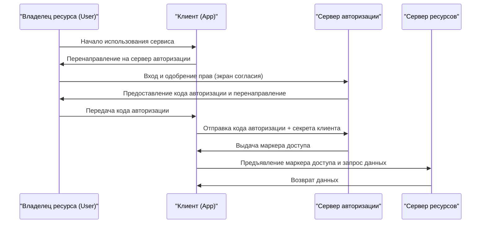

При использовании веб-сервисов мы постоянно видим кнопки вроде «Войти через Google» или «Войти через X (бывший Twitter)». Однако на удивление мало разработчиков точно понимают, что происходит за кулисами.

В основе этого механизма лежат два стандартных протокола: **OAuth 2.0** и **OpenID Connect (OIDC)**. Самый важный первый шаг к их пониманию — правильное осознание разницы между «аутентификацией» (Authentication) и «авторизацией» (Authorization).

В этой статье мы подробно разберем разницу между этими двумя концепциями, процесс авторизации OAuth 2.0, исторический контекст, риски использования OAuth для аутентификации, создание OpenID Connect для решения этих проблем, а также механизмы JWT (JSON Web Token), необходимые для современных систем аутентификации и авторизации.

## 1. Фундаментальная разница между аутентификацией (Authentication) и авторизацией (Authorization)

В мире безопасности аутентификация и авторизация — это совершенно разные понятия. Их смешивание может привести к серьезным уязвимостям в безопасности.

### Аутентификация (Authentication / AuthN)
Процесс подтверждения того, **«Кто вы?» (Who are you?)**.
В реальном мире это эквивалентно предъявлению паспорта или водительского удостоверения для подтверждения личности.
В системах это включает ввод ID пользователя и пароля, биометрическую аутентификацию (отпечаток пальца или лицо) или многофакторную аутентификацию (MFA) с использованием смартфона.

### Авторизация (Authorization / AuthZ)
Процесс контроля того, **«Что вы можете делать?» (What can you do?)**.
В реальном мире это решение о том, есть ли у вас право войти в VIP-комнату или просмотреть секретный файл, независимо от того, есть ли у вас паспорт.
В системах это означает управление доступом, например: «Обычным пользователям разрешено только чтение, а администраторам также разрешена запись и удаление».

### Связь между ними
Обычно **авторизация происходит после аутентификации**. Только после того, как установлено, «кто вы» (аутентификация), можно определить, «что вам разрешено» (авторизация).
Однако это независимые концепции, и ситуация «пользователь правильно аутентифицирован, но не авторизован для определенного действия» возникает довольно часто.

## 2. Суть и исторический контекст OAuth 2.0

OAuth 2.0 часто ошибочно понимают как «протокол для входа», но по своей сути это **фреймворк для «авторизации» (Authorization)**.

### Исторический контекст и появление OAuth
В прошлом, когда веб-сервис хотел использовать данные другого сервиса (например, сервис для обмена фотографиями хотел получить список друзей в соцсети), использовался очень опасный метод, когда пользователя просили напрямую ввести «ID и пароль от соцсети». Это называется «антипаттерном паролей».

Пользователь доверял свой пароль стороннему приложению, и если у этого приложения были злые намерения, аккаунт мог быть полностью взломан.

Для решения этой проблемы и был создан **OAuth**. Базовая идея OAuth заключается в том, чтобы «вместо передачи пароля передавать "ключ" (маркер доступа/access token) с ограниченными правами».

### Основные роли в OAuth 2.0
Для понимания OAuth 2.0 необходимо знать 4 роли:

1. **Владелец ресурса (Resource Owner)**: Пользователь, обладающий правами доступа к данным.
2. **Клиент (Client)**: Приложение, которое хочет получить доступ к данным пользователя (например, приложение для печати фотографий).
3. **Сервер авторизации (Authorization Server)**: Сервер, который аутентифицирует пользователя и выдает клиенту маркер доступа (например, сервер аутентификации Google).
4. **Сервер ресурсов (Resource Server)**: Сервер, который хранит данные пользователя, проверяет маркер доступа и предоставляет данные (например, Google Photo API).

### Поток кода авторизации (Authorization Code Flow)
В OAuth 2.0 есть несколько потоков (grant types), но самым безопасным и распространенным является «Поток кода авторизации».

Самый важный момент в этом потоке — **маркер доступа не проходит через браузер пользователя (фронтенд)**. Только временный код авторизации (как талончик) проходит через фронтенд, а сам маркер доступа передается только в бэкенде (между клиентом и сервером авторизации). Это значительно снижает риск утечки маркера.

## 3. Риски использования OAuth для аутентификации

По мере распространения OAuth 2.0 все больше разработчиков стали думать: «Может, мы можем использовать этот механизм для реализации функции входа без необходимости управления ID/паролями пользователей?». Так появился так называемый «социальный вход» (Social Login).

Однако, как упоминалось ранее, OAuth — это протокол «авторизации», а не «аутентификации». Использование OAuth напрямую для аутентификации влечет за собой следующие серьезные риски:

### 1. Заблуждение «Наличие маркера доступа = Это тот самый пользователь»
Маркер доступа указывает на «право доступа к определенному ресурсу», но не доказывает, «кто был аутентифицирован».
Существует риск «Атаки подмены маркера» (Token Substitution Attack), когда злонамеренный клиент (Приложение B) отправляет полученный маркер доступа целевому клиенту (Приложение A) для попытки входа.

### 2. Недостаток информации о событии аутентификации
Маркер доступа OAuth не содержит информации о том, «когда» и «как» был аутентифицирован пользователь. На стороне клиента невозможно определить, вошел ли пользователь только что, или это остатки сессии от предыдущего входа.

## 4. Появление OpenID Connect (OIDC)

Для фундаментального решения этих «проблем при использовании OAuth для аутентификации» был создан **OpenID Connect (OIDC)**.

OIDC был разработан как расширение спецификации OAuth 2.0. В двух словах, это **«добавление ID-токена (ID Token), служащего "сертификатом аутентификации", поверх потока авторизации OAuth 2.0»**.

В то время как OAuth 2.0 выдает «маркер доступа» (как ключ от гостиничного номера), OIDC в дополнение к нему выдает «ID-токен» (как удостоверение личности).

### Роль ID-токена
ID-токен — это данные с цифровой подписью, с помощью которых сервер авторизации гарантирует, что «этот пользователь действительно был аутентифицирован». Проверяя этот ID-токен, клиент может безопасно определить, «кто вошел в систему».

## 5. Механизм и проверка JWT (JSON Web Token)

Фактическое содержимое ID-токена, выдаваемого в OIDC, чаще всего представляется в формате **JWT (JSON Web Token)**. JWT — это открытый стандарт (RFC 7519) для безопасной передачи информации в формате JSON.

### Структура JWT
JWT состоит из трех строк, закодированных в Base64URL и разделенных точками `.`.

`Header.Payload.Signature`

1. **Header (Заголовок)**:
   Содержит метаинформацию, такую как тип токена (JWT) и алгоритм, используемый для подписи (например, RS256).
2. **Payload (Полезная нагрузка)**:
   Содержит фактические данные (утверждения/claims). Для ID-токена OIDC сюда входит следующая информация (стандартные утверждения):
   - `iss` (Issuer): URL сервера авторизации, выдавшего токен.
   - `sub` (Subject): Уникальный идентификатор пользователя.
   - `aud` (Audience): Получатель токена (ID клиента).
   - `exp` (Expiration Time): Время истечения срока действия токена.
   - `iat` (Issued At): Дата и время выдачи токена.
3. **Signature (Подпись)**:
   Цифровая подпись, созданная с использованием секретного ключа для объединенных Header и Payload. Это гарантирует, что данные не были подделаны.

### Процесс проверки JWT
Для того чтобы клиент мог доверять полученному JWT (ID-токену), необходим следующий процесс проверки. Игнорирование этого шага может привести к несанкционированному входу с помощью поддельного токена.

1. **Проверка подписи**: Используя открытый ключ, опубликованный сервером авторизации (полученный, например, через JWKS), необходимо убедиться, что Signature верна (что Header и Payload не были изменены).
2. **Проверка `iss` (Issuer)**: Убедиться, что токен был выдан ожидаемым сервером авторизации.
3. **Проверка `aud` (Audience)**: Убедиться, что токен был выдан именно для вашего приложения. (Чтобы предотвратить использование токенов, предназначенных для других приложений).
4. **Проверка `exp` (Expiration)**: Убедиться, что срок действия токена не истек.

## Заключение

*   **Аутентификация (AuthN)** подтверждает «кто вы», а **авторизация (AuthZ)** контролирует «что вы можете делать».
*   **OAuth 2.0** — это протокол «авторизации» для безопасной передачи прав доступа (маркеров доступа) к ресурсам.
*   Использовать OAuth напрямую для входа (аутентификации) опасно.
*   **OpenID Connect (OIDC)** — это протокол «аутентификации», который расширяет OAuth 2.0 для реализации безопасного входа.
*   **ID-токен (JWT)**, выдаваемый OIDC, доказывает результат аутентификации пользователя, и для него необходима правильная проверка (подпись, `iss`, `aud`, `exp`).

Правильное понимание и реализация этих протоколов и концепций позволяет создавать приложения, которые одновременно удобны для пользователей и безопасны. В современной веб- и мобильной разработке знание OAuth 2.0 и OIDC уже можно считать обязательной грамотностью.
