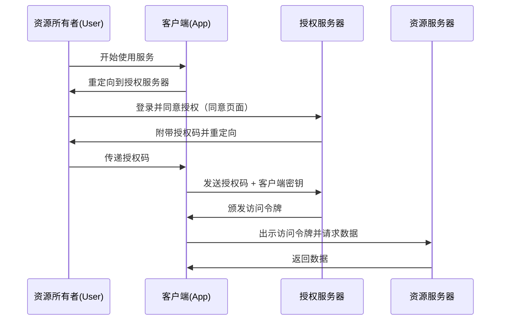

在使用 Web 服务时，我们经常会看到“使用 Google 登录”或“使用 X（原 Twitter）登录”这样的按钮，这已经司空见惯。然而，能够准确理解其背后运作原理的开发者可能意外地少。

支撑这一机制的是 **OAuth 2.0** 和 **OpenID Connect (OIDC)** 这两个标准协议。而理解它们最重要的一步，就是正确认识“认证（Authentication）”和“授权（Authorization）”之间的区别。

本文将从这两个概念的区别讲起，深入探讨 OAuth 2.0 的授权流程、历史背景，以及将 OAuth 直接用于认证的风险和为解决该问题而诞生的 OpenID Connect，最后还会详细解析现代认证与授权基础设施中不可或缺的 JWT（JSON Web Token）的工作原理。

## 1. 认证（Authentication）与授权（Authorization）的根本区别

在安全领域中，认证和授权是完全不同的概念。如果混淆这两者，将会导致严重的安全漏洞。

### 认证（Authentication / AuthN）
这是确认 **“你是谁？（Who are you?）”** 的过程。
在现实世界中，这就相当于出示护照或驾驶证来证明身份的行为。
在系统中，输入用户 ID 和密码、生物识别（指纹或人脸）或使用智能手机进行多因素认证（MFA）等，都属于这一范畴。

### 授权（Authorization / AuthZ）
这是控制 **“你能做什么？（What can you do?）”** 的过程。
在现实世界中，无论你是否有护照，这是判断“你是否有权限进入这个 VIP 房间”或“你是否能查看这份机密文件”的行为。
在系统中，“允许普通用户只读，允许管理员进行写入和删除”这种访问控制就属于授权。

### 两者的关系
通常情况下，**授权是在认证之后进行的**。只有在确定了“你是谁（认证）”之后，才能判断“允许该人做什么（授权）”。
然而，这两个是独立的概念，“已经正确认证，但未被授权执行特定操作”的状态是非常常见的。

## 2. OAuth 2.0 的本质与历史背景

OAuth 2.0 经常被误解为“用于登录的协议”，但其本质上是一个 **用于“授权（Authorization）”的框架**。

### 历史背景与 OAuth 的诞生
过去，当一个 Web 服务想要使用另一个服务的数据时（例如，照片分享服务想要获取社交网络的联系人列表），通常会采用让用户直接输入“社交网络的 ID 和密码”这种极其危险的方式。这被称为“密码反模式”。

用户需要将自己的密码交给第三方应用，如果该应用怀有恶意，用户的账户将被彻底劫持。

为了解决这个问题，**OAuth** 应运而生。OAuth 的基本理念是：“用一个具有有限权限的‘钥匙（访问令牌）’来代替密码交出”。

### OAuth 2.0 的主要角色（参与者）
要理解 OAuth 2.0，必须掌握四个角色：

1. **资源所有者 (Resource Owner)**: 拥有数据访问权限的用户。
2. **客户端 (Client)**: 想要访问用户数据的应用程序（例如照片打印应用）。
3. **授权服务器 (Authorization Server)**: 对用户进行认证并向客户端颁发访问令牌的服务器（例如 Google 的认证服务器）。
4. **资源服务器 (Resource Server)**: 保存用户数据、验证访问令牌并提供数据的服务器（例如 Google Photo API）。

### 授权码流程 (Authorization Code Flow)
OAuth 2.0 有几种流程（授权类型），但最安全、最通用的是“授权码流程”。

这个流程最大的特点是：**访问令牌不会经过用户的浏览器（前端）**。只有“授权码”这种临时兑换券会经过前端，而实际的访问令牌仅在后端（客户端与授权服务器之间）进行交换。这大幅降低了令牌泄露的风险。

## 3. 将 OAuth 用于认证的风险

随着 OAuth 2.0 的普及，越来越多的开发者开始认为：“如果使用这个机制，不就可以在不让用户管理 ID/密码的情况下实现登录功能了吗？”这就是所谓的“社交登录”的开端。

然而，正如前面所述，OAuth 是“授权”协议，而不是“认证”协议。如果将 OAuth 直接用于认证，将会带来以下严重风险：

### 1. 误以为“拥有访问令牌 = 就是该用户”
访问令牌表示的是“访问特定资源的权限”，并不能证明“谁被认证了”。
存在诸如“令牌替换攻击（Token Substitution Attack）”的风险，即恶意的另一个客户端（应用 B）获取了访问令牌，并将其发送给目标客户端（应用 A）以尝试登录。

### 2. 认证事件的信息不足
OAuth 的访问令牌中不包含用户是“何时”以及“如何”被认证的信息。客户端无法判断用户是刚刚登录的，还是仅仅保留了过去的登录会话。

## 4. OpenID Connect (OIDC) 的诞生

为了从根本上解决这些“将 OAuth 用于认证时的问题”，**OpenID Connect (OIDC)** 诞生了。

OIDC 是作为 OAuth 2.0 的扩展规范创建的。简而言之，就是 **“在 OAuth 2.0 的授权流程之上，增加了一个被称为 ID 令牌 (ID Token) 的‘认证凭证’”**。

如果说 OAuth 2.0 颁发的是“访问令牌（酒店房间钥匙）”，那么 OIDC 则在此基础上附加颁发了“ID 令牌（身份证）”。

### ID 令牌的作用
ID 令牌是带有数字签名的数字数据，由授权服务器保证“该用户的确已通过认证”。客户端通过验证这个 ID 令牌，就能安全地确认“谁登录了”。

## 5. JWT (JSON Web Token) 的机制与验证

在 OIDC 中颁发的 ID 令牌 的实体，大多数情况下是用 **JWT (JSON Web Token)** 这种格式来表示的。JWT 是一种用于安全传递 JSON 格式信息的开放标准 (RFC 7519)。

### JWT 的结构
JWT 由三个用 `.` (点) 分隔的，经过 Base64URL 编码的字符串组成。

`Header.Payload.Signature`

1. **Header (头部)**:
   包含令牌的类型 (JWT) 以及所使用的签名算法 (例如：RS256) 等元数据信息。
2. **Payload (负载)**:
   包含实际的数据 (声明/Claims)。在 OIDC 的 ID 令牌中，通常包含以下信息（标准声明）：
   - `iss` (Issuer): 颁发令牌的授权服务器的 URL。
   - `sub` (Subject): 用户的唯一标识符。
   - `aud` (Audience): 令牌的接收者（客户端 ID）。
   - `exp` (Expiration Time): 令牌的过期时间。
   - `iat` (Issued At): 令牌颁发的时间。
3. **Signature (签名)**:
   使用密钥对 Header 和 Payload 组合而成的字符串生成的数字签名。这可以保证数据未被篡改。

### JWT 的验证过程
为了信任客户端收到的 JWT (ID 令牌)，以下验证过程是必不可少的。如果忽略这些，可能会允许使用伪造的令牌进行非法登录。

1. **验证签名**: 使用授权服务器公开的公钥 (可通过 JWKS 等获取)，确认 Signature 是否正确 (即 Header 和 Payload 是否未被篡改)。
2. **确认 `iss` (Issuer)**: 确认令牌是否由预期的授权服务器颁发。
3. **确认 `aud` (Audience)**: 确认令牌是否是颁发给自己的应用程序的。(为了防止其他应用复用该令牌)。
4. **确认 `exp` (Expiration)**: 确认令牌是否尚未过期。

## 总结

*   **认证 (AuthN)** 确认“你是谁”，而 **授权 (AuthZ)** 控制“你能做什么”。
*   **OAuth 2.0** 是为了安全地委派资源访问权限 (访问令牌) 的“授权”协议。
*   直接将 OAuth 用于登录 (认证) 是危险的。
*   **OpenID Connect (OIDC)** 是扩展了 OAuth 2.0，用于实现安全登录的“认证”协议。
*   OIDC 颁发的 **ID 令牌 (JWT)** 是用户认证结果的证明，必须进行适当的验证 (签名、`iss`、`aud`、`exp`)。

通过正确理解和实现这些协议及概念，可以构建出既方便用户又安全的应用程序。在现代 Web 和移动开发中，OAuth 2.0 和 OIDC 的知识已经可以说是必备的常识了。
