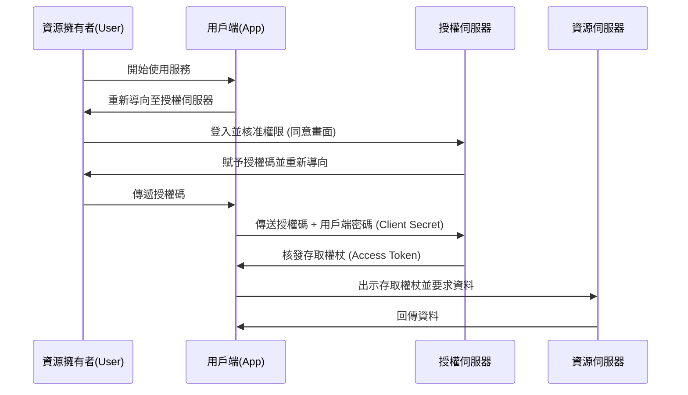

在使用網路服務時，我們經常會看到「使用 Google 登入」、「使用 X (原 Twitter) 登入」等按鈕，這已經是家常便飯。然而，真正了解這些按鈕背後運作原理的開發者，可能意外地少。

支撐這個機制的，是 **OAuth 2.0** 與 **OpenID Connect (OIDC)** 這兩個標準協定。而要了解這些協定，最重要的一步，就是正確體認「驗證 (Authentication)」與「授權 (Authorization)」這兩個概念的差異。

本篇文章將從這兩個概念的差異開始說起，深入探討 OAuth 2.0 的授權流程、歷史背景、將 OAuth 挪用於驗證的風險，以及為了解決此問題而誕生的 OpenID Connect，最後還會介紹現代驗證與授權基礎架構中不可或缺的 JWT (JSON Web Token) 的運作機制。

## 1. 驗證 (Authentication) 與授權 (Authorization) 的根本差異

在資安領域中，驗證與授權是完全不同的概念。如果將兩者混淆，將會成為產生重大資安漏洞的原因。

### 驗證 (Authentication / AuthN)
這是用來確認 **「你是誰？ (Who are you?)」** 的流程。
以現實世界來說，這相當於出示護照或駕照來證明身分的行為。
在系統上，輸入使用者 ID 與密碼、生物辨識（指紋或臉部），或是使用智慧型手機進行多重要素驗證（MFA）等，都屬於驗證。

### 授權 (Authorization / AuthZ)
這是用來控制 **「你能做什麼？ (What can you do?)」** 的流程。
以現實世界來說，這相當於判斷「你是否有權限進入這間 VIP 室」或「你是否能閱覽這份機密文件」的行為，而與你是否持有護照無關。
在系統上，「允許一般使用者僅能讀取，而允許管理員寫入與刪除」這類的存取控制，就屬於授權。

### 兩者的關聯性
通常，**驗證會先於授權進行**。因為必須先確定「你是誰（驗證）」之後，才能判斷「允許該對象做什麼（授權）」。
不過，這兩個是獨立的概念，因此「雖然已正確通過驗證，但並未獲准執行特定操作」的狀態是非常普遍的。

## 2. OAuth 2.0 的本質與歷史背景

OAuth 2.0 常常被誤解為「用於登入的協定」，但本質上它是一個 **「授權 (Authorization)」的框架**。

### 歷史背景與 OAuth 的誕生
過去，當網路服務想要使用其他服務的資料時（例如：相片分享服務想要取得社群網站的好友名單），會採取讓使用者直接輸入「社群網站的 ID 與密碼」這種非常危險的做法。這被稱為「密碼的抗體模式 (Password Anti-pattern)」。

這表示使用者必須將自己的密碼交給第三方應用程式，如果該應用程式心懷不軌，使用者的帳號就會完全被劫持。

為了解決這個問題，**OAuth** 應運而生。OAuth 的基本概念是：「與其交出密碼，不如給予一把權限受限的『鑰匙 (Access Token, 存取權杖)』」。

### OAuth 2.0 的主要角色 (Role)
要了解 OAuth 2.0，必須先掌握四種角色：

1. **資源擁有者 (Resource Owner)**: 擁有資料存取權限的使用者。
2. **用戶端 (Client)**: 想要存取使用者資料的應用程式（例如：相片列印 App）。
3. **授權伺服器 (Authorization Server)**: 負責驗證使用者並核發存取權杖給用戶端的伺服器（例如：Google 的驗證伺服器）。
4. **資源伺服器 (Resource Server)**: 保存使用者資料，負責驗證存取權杖並提供資料的伺服器（例如：Google Photo API）。

### 授權碼流程 (Authorization Code Flow)
OAuth 2.0 有好幾種流程 (Grant Type)，其中最安全也最常見的就是「授權碼流程」。

這個流程最大的重點在於，**存取權杖不會經過使用者的瀏覽器 (前端)**。只有「授權碼」這張暫時的兌換券會經過前端，實際的存取權杖只在後端（用戶端與授權伺服器之間）進行交換。這大幅降低了權杖外洩的風險。

## 3. 將 OAuth 挪用於驗證的風險

隨著 OAuth 2.0 的普及，越來越多開發者開始認為：「如果使用這個機制，是不是就能在不讓使用者管理 ID/密碼的情況下，實作登入功能？」這就是所謂「社群登入 (Social Login)」的開端。

然而，正如前面所述，OAuth 是「授權」的協定，而非「驗證」的協定。如果直接將 OAuth 挪用於驗證，將會產生以下嚴重的風險：

### 1. 「擁有存取權杖 ＝ 該使用者」的誤解
存取權杖代表的是「存取特定資源的權限」，並不能用來證明「誰通過了驗證」。
這會帶來例如「權杖替換攻擊 (Token Substitution Attack)」的風險，也就是惡意的另一個用戶端 (App B) 可以將取得的存取權杖，傳送給目標用戶端 (App A) 以嘗試登入。

### 2. 驗證事件的資訊不足
OAuth 的存取權杖中，並不包含使用者是「何時」且「如何」被驗證的資訊。用戶端無法判斷使用者是剛剛才登入，還是只剩下過去登入的連線階段 (Session)。

## 4. OpenID Connect (OIDC) 的誕生

為了解決這些「將 OAuth 用於驗證時的問題點」，**OpenID Connect (OIDC)** 誕生了。

OIDC 是作為 OAuth 2.0 的擴充規格而建立的。簡單來說，它就是 **「在 OAuth 2.0 的授權流程之上，加上名為 ID 權杖 (ID Token) 的『驗證證明書』」**。

相較於 OAuth 2.0 核發的是「存取權杖 (飯店的房間鑰匙)」，OIDC 則是額外再核發「ID 權杖 (身分證明)」。

### ID 權杖的作用
ID 權杖是由授權伺服器保證「這位使用者確實已通過驗證」、帶有數位簽章的資料。用戶端只要驗證這個 ID 權杖，就能安全地識別「是誰登入了」。

## 5. JWT (JSON Web Token) 的機制與驗證

OIDC 所核發的 ID 權杖實體，大多是以 **JWT (JSON Web Token)** 的格式來表示。JWT 是一種用於以 JSON 格式安全傳遞資訊的開放標準 (RFC 7519)。

### JWT 的結構
JWT 是由三個以 `.` (句點) 分隔的 Base64URL 編碼字串所組成。

`Header.Payload.Signature`

1. **Header (標頭)**:
   包含權杖類型 (JWT) 以及用於簽章的演算法 (例如：RS256) 等中介資料。
2. **Payload (內容/負載)**:
   包含實際資料 (宣告, Claims)。在 OIDC 的 ID 權杖中，會包含以下這類資訊 (標準宣告)：
   - `iss` (Issuer): 核發權杖的授權伺服器 URL。
   - `sub` (Subject): 使用者的唯一識別碼。
   - `aud` (Audience): 權杖的接收者 (用戶端 ID)。
   - `exp` (Expiration Time): 權杖的有效期限。
   - `iat` (Issued At): 權杖核發的日期時間。
3. **Signature (簽章)**:
   對 Header 與 Payload 結合後的字串，使用私鑰所建立的數位簽章。這能保證資料並未遭到竄改。

### JWT 的驗證流程
為了信任用戶端所接收到的 JWT (ID 權杖)，以下驗證流程是不可不可缺的。如果怠忽這些步驟，將會允許使用偽造的權杖進行未經授權的登入。

1. **驗證簽章**: 使用授權伺服器公開的公鑰 (透過 JWKS 等方式取得)，確認 Signature 是否正確 (Header 與 Payload 是否遭到竄改)。
2. **確認 `iss` (Issuer)**: 確認權杖是否由預期的授權伺服器所核發。
3. **確認 `aud` (Audience)**: 確認權杖是否是核發給自己的應用程式。(為了防止其他 App 的權杖遭到盜用)。
4. **確認 `exp` (Expiration)**: 確認權杖是否已過期。

## 總結

*   **驗證 (AuthN)** 是用來確認「是誰」，而 **授權 (AuthZ)** 則是用來控制「能做什麼」。
*   **OAuth 2.0** 是一種安全委派資源存取權限 (存取權杖) 的「授權」協定。
*   直接將 OAuth 用於登入 (驗證) 是危險的。
*   **OpenID Connect (OIDC)** 擴充了 OAuth 2.0，是一種用來實現安全登入的「驗證」協定。
*   OIDC 核發的 **ID 權杖 (JWT)** 可用來證明使用者的驗證結果，並必須經過適當的驗證 (簽章、`iss`、`aud`、`exp`)。

正確理解這些協定與概念並加以實作，便能建構出對使用者來說既便利又安全的應用程式。在現代的網頁與行動應用開發中，OAuth 2.0 與 OIDC 的知識，已經可以說是必須具備的基本常識了。
