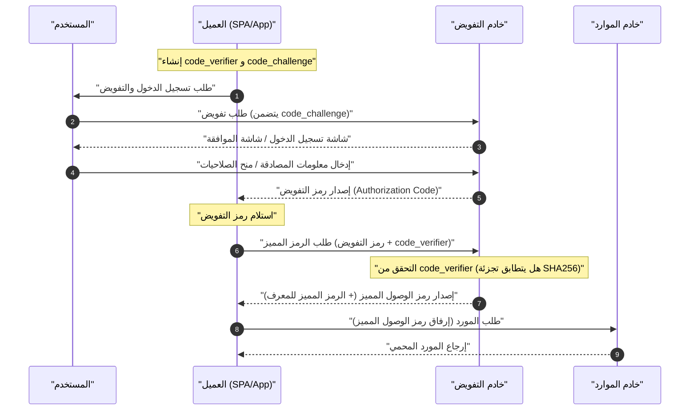

تعتبر تقنيات **OAuth 2.0** و **OIDC (OpenID Connect)** من التقنيات التي لا غنى عنها لتحقيق التوازن بين الأمان وتجربة المستخدم في تطبيقات الويب وتطبيقات الأجهزة المحمولة الحديثة. ومع ذلك، هناك العديد من المطورين الذين يخلطون بين "المصادقة (Authentication)" و "التفويض (Authorization)"، مما يؤدي إلى تنفيذها بشكل خاطئ في كثير من الحالات.

في هذا المقال، سنشرح بشكل مفصل وشامل للغاية المفاهيم الأساسية لـ **OAuth 2.0** و **OIDC**، وأدوار كل منهما، والفرق الواضح بين المصادقة والتفويض، وأنواع منح الصلاحيات المختلفة، وصولاً إلى طرق التنفيذ الآمنة التي تتضمن PKCE.

---

## 1. الفرق الواضح بين المصادقة (Authentication) والتفويض (Authorization)

أولاً وقبل كل شيء، دعونا نوضح الفرق بين "المصادقة" و "التفويض"، وهو الأمر الأكثر أهمية والذي يسهل الخلط بينهما.

### المصادقة (Authentication / AuthN)
**المصادقة** هي عملية التحقق من "هوية المستخدم الذي يحاول الوصول (هل هو الشخص المعني)".
على سبيل المثال، عند ذهابك إلى العمل، تقوم بتقديم "بطاقة الموظف" أو "رخصة القيادة" في مكتب الاستقبال لإثبات "أنا الموظف فلان في هذه الشركة".

### التفويض (Authorization / AuthZ)
من ناحية أخرى، **التفويض** هو عملية "منح حقوق الوصول إلى مورد معين لشخص معين (أو نظام معين)".
بالعودة إلى مثال الشركة، بعد الانتهاء من التحقق من الهوية، يتم التحكم في الوصول مثل "بما أن هذا الشخص موظف عادي، فلن يُمنح صلاحية (مفتاح) الدخول إلى غرفة الخوادم، ولكن سيُمنح صلاحية (مفتاح) الدخول إلى الطابق الخاص به".

| العنصر | المصادقة (Authentication) | التفويض (Authorization) |
| --- | --- | --- |
| الغرض | تحديد "من هو" | تحديد "ماذا يمكنه أن يفعل" |
| الاختصار الإنجليزي | AuthN | AuthZ |
| البروتوكولات التمثيلية | OpenID Connect (OIDC), SAML | OAuth 2.0, XACML |
| ما يتم استلامه | الرمز المميز للمعرف (معلومات المستخدم) | رمز الوصول المميز (حقوق الوصول) |

غالباً ما نسمع عبارة "استخدام OAuth لتنفيذ وظيفة تسجيل الدخول"، ولكن بالمعنى الدقيق للكلمة، فإن **OAuth 2.0** هو بروتوكول مخصص لـ "التفويض"، واستخدامه بمفرده لإجراء "المصادقة (تسجيل الدخول)" يعتبر استخداماً خارج النطاق المخصص له (مصادقة زائفة). لإجراء المصادقة، يعتبر استخدام **OIDC**، الذي يمثل امتداداً لـ OAuth 2.0، هو المعيار الحديث.

---

## 2. الفهم الكامل لـ OAuth 2.0

### 2.1 ما هو OAuth 2.0؟
**OAuth 2.0** هو بروتوكول قياسي يتيح منح تطبيقات الطرف الثالث حقوق وصول محدودة (رمز الوصول المميز) إلى بيانات المستخدم دون الحاجة إلى تسليم كلمة مرور المستخدم (RFC 6749).

### 2.2 الأدوار الأربعة في OAuth 2.0
لفهم تدفق OAuth 2.0، من الضروري التعرف على الأدوار الأربعة التالية:

1. **مالك المورد (Resource Owner)** : مالك البيانات (الموارد). عادة ما يشير إلى "المستخدم".
2. **العميل (Client)** : التطبيق الذي يحاول الوصول إلى بيانات المستخدم.
3. **خادم التفويض (Authorization Server)** : الخادم الذي يقوم بمصادقة المستخدم، والتحقق من حقوق الوصول، ثم إصدار رمز الوصول المميز للعميل.
4. **خادم الموارد (Resource Server)** : الخادم الذي يحتفظ ببيانات المستخدم، ويتحقق من رمز الوصول المميز للسماح بالوصول إلى البيانات.

### 2.3 أنواع منح الصلاحيات (طرق منح الامتيازات) في OAuth 2.0

في OAuth 2.0، يتم تعريف عدة "أنواع لمنح الصلاحيات (تدفقات الحصول على الرمز المميز)" بناءً على خصائص العميل.

#### 1. منح رمز التفويض (Authorization Code Grant)
هو التدفق الأكثر أماناً واستخداماً بشكل عام. وهو مناسب للتطبيقات التي يمكنها الاحتفاظ بسر العميل (Client Secret) بأمان (التطبيقات التي تمتلك خادماً خلفياً) مثل تطبيقات الويب.

#### 2. المنح الضمني (Implicit Grant)
تدفق تم إنشاؤه للتطبيقات التي لا يمكنها الاحتفاظ بسر العميل بأمان، مثل تطبيقات الصفحة الواحدة (SPA). ومع ذلك، نظراً لوجود مخاطر أمنية مثل كشف رمز الوصول المميز في جزء URL، فهو **غير موصى به حالياً**. حتى في تطبيقات SPA، يجب استخدام "منح رمز التفويض + PKCE" الموضح لاحقاً.

#### 3. منح بيانات اعتماد كلمة مرور مالك المورد (Resource Owner Password Credentials Grant)
تدفق يقوم فيه العميل باستلام معرف المستخدم وكلمة المرور مباشرة، وإرسالها إلى خادم التفويض للحصول على الرمز المميز. يُستخدم فقط في حالات محدودة للغاية مثل ترحيل الأنظمة القديمة. من الناحية الأمنية، هو **غير موصى به حالياً**.

#### 4. منح بيانات اعتماد العميل (Client Credentials Grant)
تدفق يُستخدم في الاتصال بين الأنظمة (M2M: Machine to Machine) دون تدخل المستخدم. يعمل العميل نفسه كمالك للمورد.

### 2.4 تعمق: تدفق رمز التفويض + PKCE (Proof Key for Code Exchange)

في تطبيقات SPA وتطبيقات الأجهزة المحمولة، لا يمكن إخفاء سر العميل بأمان. لذلك، تم إدخال **PKCE** (RFC 7636) لمنع هجوم اعتراض رمز التفويض (Authorization Code Interception Attack).

آلية عمل PKCE هي كما يلي:
قبل أن يبدأ العميل في طلب التفويض، يقوم بإنشاء سلسلة نصية عشوائية `code_verifier`، ويقوم بتجزئتها لإنشاء `code_challenge`.

التعبير الرياضي هو كما يلي:
$$
\text{تحدي\_الرمز} = \text{تشفير-BASE64URL}( \text{SHA256}( \text{مدقق\_الرمز} ) )
$$

#### مخطط التسلسل لتدفق رمز التفويض المصحوب بـ PKCE



#### مثال على تنفيذ إنشاء PKCE (JavaScript / Web Crypto API)

يوضح الكود التالي مثالاً لإنشاء المعلمات اللازمة لـ PKCE في بيئة JavaScript.

```javascript
// إنشاء سلسلة نصية عشوائية (code_verifier)
function generateCodeVerifier() {
    const array = new Uint32Array(56 / 2);
    window.crypto.getRandomValues(array);
    return Array.from(array, dec => ('0' + dec.toString(16)).substr(-2)).join('');
}

// حساب تجزئة SHA-256، وتشفير Base64URL (code_challenge)
async function generateCodeChallenge(codeVerifier) {
    const encoder = new TextEncoder();
    const data = encoder.encode(codeVerifier);
    const hashBuffer = await window.crypto.subtle.digest('SHA-256', data);
    const hashArray = Array.from(new Uint8Array(hashBuffer));
    const base64String = btoa(String.fromCharCode.apply(null, hashArray));
    return base64String.replace(/\+/g, '-').replace(/\//g, '_').replace(/=+$/, '');
}

// مثال التنفيذ
const codeVerifier = generateCodeVerifier();
generateCodeChallenge(codeVerifier).then(codeChallenge => {
    console.log("Code Verifier:", codeVerifier);
    console.log("Code Challenge:", codeChallenge);
});
```

---

## 3. الفهم الكامل لـ OIDC (OpenID Connect)

### 3.1 ما هو OIDC؟
**OpenID Connect (OIDC)** هو طبقة هوية بسيطة وقوية من أجل **المصادقة (Authentication)** تم بناؤها فوق OAuth 2.0. بينما يتولى OAuth 2.0 "منح حقوق الوصول (التفويض)"، يتولى OIDC "التحقق من هوية المستخدم (المصادقة)".

باستخدام OIDC، يمكن للعميل الحصول على **الرمز المميز للمعرف (ID Token)** الذي يحتوي على معلومات هوية المستخدم المصادق عليه في خادم التفويض (والذي يُسمى OpenID Provider, OP في عالم OIDC).

### 3.2 الفرق بين الرمز المميز للمعرف ورمز الوصول المميز
يجب عدم الخلط بين أدوار الرمزين المميزين في OAuth 2.0 / OIDC.

- **رمز الوصول المميز (Access Token)** : "المفتاح" للوصول إلى واجهة برمجة التطبيقات (خادم الموارد). عادة لا يتم فك تشفير محتواه، بل يتم إرفاقه في ترويسة Authorization لطلب [API](/ar/p/chatgpt-gemini-claude-api-comparison/) واستخدامه (غالباً ما يكون رمزاً مبهماً Opaque).
- **الرمز المميز للمعرف (ID Token)** : "بطاقة عمل" أو "شهادة" تحتوي على نتيجة مصادقة المستخدم ومعلومات السمة (الملف الشخصي). يتم إصداره دائماً بتنسيق **JWT (JSON Web Token)**، ويقوم العميل بفك تشفيره لاستخدام معلومات المستخدم. **يجب عدم استخدامه كصلاحية وصول إلى [API](/ar/p/chatgpt-gemini-claude-api-comparison/).**

### 3.3 هيكل والتحقق من JWT (JSON Web Token)

يتم التعبير عن الرمز المميز للمعرف بتنسيق JWT. يتكون JWT من 3 نصوص مشفرة بـ Base64URL مفصولة بـ `.` (نقطة).

1. **الرأس (Header)** : يشير إلى نوع الرمز المميز (JWT) وخوارزمية التوقيع (مثل: RS256).
2. **الحمولة (Payload)** : تحتوي على معلومات المستخدم والبيانات الوصفية للرمز المميز (المطالبات).
3. **التوقيع (Signature)** : توقيع مشفر يثبت أن الرمز المميز لم يتم التلاعب به.

#### المطالبات الرئيسية المضمنة في الحمولة
- `iss` (Issuer) : مُصدر الرمز المميز (رابط OP)
- `sub` (Subject) : المعرف الفريد للمستخدم
- `aud` (Audience) : العميل الذي يجب أن يتلقى هذا الرمز المميز (Client ID)
- `exp` (Expiration Time) : وقت انتهاء صلاحية الرمز المميز
- `iat` (Issued At) : وقت وتاريخ إصدار الرمز المميز

#### منطق التحقق من توقيع JWT

يجب على العميل الذي يتلقى الرمز المميز للمعرف أن يتحقق دائماً من التوقيع (Signature). عند استخدام خوارزمية [RSA](https://kenji.blog/ar/p/modern-cryptography-public-key-hash-signature/) (مثل RS256)، يتم الحصول على المفتاح العام (JWKS) الذي يوفره OP للتحقق منه.

يتم التعبير عن النموذج الرياضي لإنشاء التوقيع بالمعادلة التالية:
$$
\text{التوقيع} = \text{توقيع}_{\text{المفتاح\_الخاص}}( \text{SHA256}( \text{Base64Url}(\text{الرأس}) + "." + \text{Base64Url}(\text{الحمولة}) ) )
$$

عند التحقق، يتم استخدام المفتاح العام لفك التشفير والتأكد من تطابق قيمة التجزئة.

#### مثال على فك تشفير الرمز المميز للمعرف (JWT) (Python)

يوضح الكود التالي مثالاً على التحقق من الرمز المميز للمعرف وفك تشفيره باستخدام مكتبة `PyJWT` في Python.

```python
import jwt
from jwt import PyJWKClient

# نقطة نهاية JWKS (مجموعة المفاتيح العامة) لجهة الإصدار
jwks_url = "https://example.com/.well-known/jwks.json"
jwk_client = PyJWKClient(jwks_url)

id_token = "eyJhbGciOiJSUzI1NiIs..." # الرمز المميز للمعرف الذي تم الحصول عليه
client_id = "your_client_id"
issuer = "https://example.com"

try:
    # تحديد المفتاح (kid) المستخدم من رأس الرمز المميز، والحصول على المفتاح العام
    signing_key = jwk_client.get_signing_key_from_jwt(id_token)
    
    # التحقق من التوقيع، والتحقق من aud (الجمهور)، و iss (جهة الإصدار)، و exp (وقت انتهاء الصلاحية) في نفس الوقت
    decoded_payload = jwt.decode(
        id_token,
        signing_key.key,
        algorithms=["RS256"],
        audience=client_id,
        issuer=issuer
    )
    print("المصادقة ناجحة. معرف المستخدم:", decoded_payload["sub"])
    print("اسم المستخدم:", decoded_payload.get("name"))

except jwt.ExpiredSignatureError:
    print("خطأ: انتهت صلاحية الرمز المميز.")
except jwt.InvalidTokenError as e:
    print(f"خطأ: رمز مميز غير صالح. التفاصيل: {e}")
```

---

## 4. الأمان وأفضل الممارسات

عند تنفيذ OAuth 2.0 و OIDC، من الضروري مراعاة العديد من المخاطر الأمنية.

### 4.1 الحماية من [CSRF](https://kenji.blog/ar/p/web-application-vulnerability-owasp-top-10/) باستخدام المعلمة State
من خلال تضمين معلمة `state` لا يمكن تخمينها في طلب التفويض، والتحقق من تطابقها عند رد النداء، يمكن منع هجمات تزوير الطلبات عبر المواقع ([CSRF](https://kenji.blog/ar/p/web-application-vulnerability-owasp-top-10/)).

### 4.2 عمر الرمز المميز وحسابه
للحفاظ على الأمان، من أفضل الممارسات تعيين عمر قصير لرمز الوصول المميز (`exp`) (على سبيل المثال: 15 دقيقة إلى ساعة واحدة). في حالة انتهاء الصلاحية، يتم استخدام الرمز المميز للتحديث (Refresh Token) للحصول على رمز وصول مميز جديد.

يعتمد تحديد ما إذا كان الرمز المميز صالحاً أم لا على المتباينة التالية. هنا، نفترض أن الوقت الحالي هو $ T_{now} $، ووقت إصدار الرمز المميز هو $ T_{iat} $، ومدة الصلاحية هي $ D_{lifetime} $.

$$
T_{now} < T_{iat} + D_{lifetime} \quad (\text{أو ببساطة } T_{now} < T_{exp})
$$

### 4.3 اختيار تدفق OIDC
سواء كان تطبيق ويب أو تطبيق أجهزة محمولة، فإن التدفق الموصى به حالياً هو **تدفق رمز التفويض + PKCE**. لم يعد تدفق Implicit يعتبر آمناً، لذا يجب عدم استخدامه مطلقاً في التطورات الجديدة.

## الخلاصة

في هذا المقال، تعمقنا في الفرق بين **OAuth 2.0** و **OIDC**، والاختلاف في المفاهيم الأساسية بين "التفويض" و "المصادقة".
- **OAuth 2.0** هو إطار عمل لـ "التفويض (منح الصلاحيات)".
- **OIDC** هو بروتوكول لـ "المصادقة (التحقق من الهوية)" مبني فوقه.
- في التطبيقات الحديثة، يعتبر استخدام **تدفق رمز التفويض + PKCE** المعيار الفعلي (De facto standard) من الناحية الأمنية.

من خلال الفهم الصحيح لهذه المواصفات والآليات، وتنفيذ التدفق المناسب ومنطق التحقق، دعونا نحقق إدارة قوية وآمنة للهوية.
