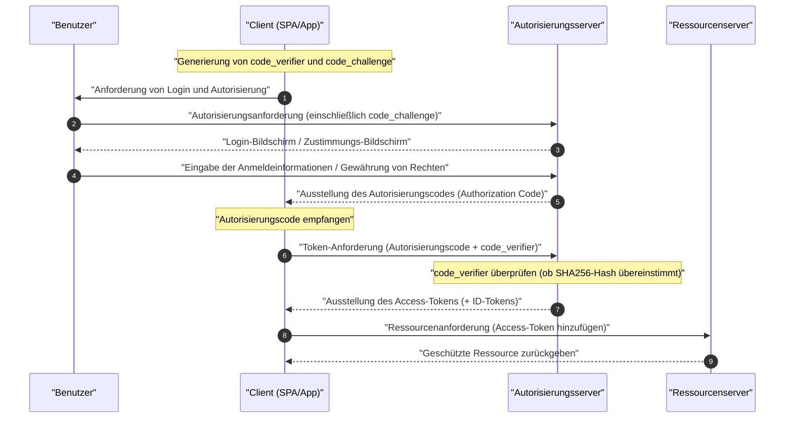

In modernen Web- und mobilen Anwendungen sind **OAuth 2.0** und **OIDC (OpenID Connect)** unverzichtbare Technologien, um Sicherheit und Benutzerfreundlichkeit in Einklang zu bringen. Dennoch gibt es immer wieder Fälle, in denen Entwickler die Unterschiede zwischen "Authentifizierung (Authentication)" und "Autorisierung (Authorization)" verwechseln und falsche Implementierungen vornehmen.

Dieser Artikel bietet eine sehr detaillierte und umfassende Erklärung, angefangen bei den grundlegenden Konzepten von **OAuth 2.0** und **OIDC**, über ihre jeweiligen Rollen, die klaren Unterschiede zwischen Authentifizierung und Autorisierung, die verschiedenen Grant-Typen bis hin zu sicheren Implementierungsmethoden mit PKCE.

---

## 1. Der klare Unterschied zwischen Authentifizierung (Authentication) und Autorisierung (Authorization)

Lassen Sie uns zunächst den wichtigsten und am häufigsten verwechselten Unterschied zwischen "Authentifizierung" und "Autorisierung" klären.

### Authentifizierung (Authentication / AuthN)
**Authentifizierung** ist der Prozess der Überprüfung, "wer der zugreifende Benutzer ist (ob er die Person ist, die er vorgibt zu sein)".
Um ein Beispiel zu geben: Es entspricht dem Vorzeigen eines "Firmenausweises" oder "Führerscheins" am Empfang, wenn Sie zur Arbeit kommen, um zu beweisen: "Ich bin der Mitarbeiter XX dieses Unternehmens".

### Autorisierung (Authorization / AuthZ)
Andererseits ist **Autorisierung** der Prozess, "einer bestimmten Person (oder einem System) Zugriffsrechte auf eine bestimmte Ressource zu gewähren".
Um auf das Unternehmensbeispiel zurückzukommen, entspricht dies der Zugriffskontrolle nach Abschluss der Identitätsprüfung, wie z. B.: "Da diese Person ein normaler Angestellter ist, geben wir ihr keine Berechtigung (Schlüssel), um den Serverraum zu betreten, aber wir geben ihr die Berechtigung (Schlüssel), um ihre eigene Etage zu betreten."

| Element | Authentifizierung (Authentication) | Autorisierung (Authorization) |
| --- | --- | --- |
| Zweck | Identifizieren, "wer es ist" | Bestimmen, "was getan werden kann" |
| Englische Abkürzung | AuthN | AuthZ |
| Typische Protokolle | OpenID Connect (OIDC), SAML | OAuth 2.0, XACML |
| Was empfangen wird | ID-Token (Benutzerinformationen) | Access-Token (Zugriffsrecht) |

Oft hört man den Ausdruck "eine Login-Funktion mit OAuth implementieren", aber streng genommen ist **OAuth 2.0** ein Protokoll für die "Autorisierung", und die alleinige Verwendung für die "Authentifizierung (Login)" ist eine zweckentfremdete Nutzung der Spezifikation (Pseudo-Authentifizierung). Um eine Authentifizierung durchzuführen, ist die Verwendung von **OIDC**, einer Erweiterung von OAuth 2.0, der moderne Standard.

---

## 2. Vollständiges Verständnis von OAuth 2.0

### 2.1 Was ist OAuth 2.0?
**OAuth 2.0** ist ein Standardprotokoll (RFC 6749), mit dem Drittanbieter-Anwendungen eingeschränkte Zugriffsrechte (Access-Token) auf die Daten eines Benutzers gewährt werden können, ohne das Passwort des Benutzers preiszugeben.

### 2.2 Die 4 Rollen (Roles) von OAuth 2.0
Um den Ablauf von OAuth 2.0 zu verstehen, ist es unerlässlich, die folgenden 4 Rollen zu kennen.

1. **Ressourcenbesitzer (Resource Owner)** : Der Besitzer der Daten (Ressourcen). Bezieht sich normalerweise auf den "Benutzer".
2. **Client (Client)** : Die Anwendung, die versucht, auf die Daten des Benutzers zuzugreifen.
3. **Autorisierungsserver (Authorization Server)** : Der Server, der den Benutzer authentifiziert, die Zugriffsrechte überprüft und dann ein Access-Token an den Client ausgibt.
4. **Ressourcenserver (Resource Server)** : Der Server, der die Daten des Benutzers speichert, das Access-Token verifiziert und den Zugriff auf die Daten gewährt.

### 2.3 Grant-Typen (Methoden zur Rechtevergabe) von OAuth 2.0

In OAuth 2.0 sind je nach den Eigenschaften des Clients mehrere "Grant-Typen (Abläufe zum Abrufen von Token)" definiert.

#### 1. Autorisierungscode-Grant (Authorization Code Grant)
Dies ist der sicherste und am häufigsten verwendete Ablauf. Er eignet sich für Anwendungen, die das Client-Geheimnis sicher aufbewahren können (die einen Backend-Server haben), wie z. B. Webanwendungen.

#### 2. Impliziter Grant (Implicit Grant)
Dies ist ein Ablauf, der für Anwendungen entwickelt wurde, die das Client-Geheimnis nicht aufbewahren können, wie z. B. SPA (Single Page Application). Aufgrund von Sicherheitsrisiken, wie der Offenlegung des Access-Tokens in URL-Fragmenten, ist dies jedoch **mittlerweile veraltet**. Auch SPAs sollten den unten beschriebenen "Autorisierungscode-Grant + PKCE" verwenden.

#### 3. Ressourcenbesitzer-Passwort-Anmeldeinformationen-Grant (Resource Owner Password Credentials Grant)
Dies ist ein Ablauf, bei dem der Client die ID und das Passwort des Benutzers direkt empfängt, sie an den Autorisierungsserver sendet und ein Token erhält. Er wird nur für sehr begrenzte Zwecke verwendet, wie z. B. die Migration von Legacy-Systemen. Aus Sicherheitsgründen ist dies **mittlerweile veraltet**.

#### 4. Client-Anmeldeinformationen-Grant (Client Credentials Grant)
Dies ist ein Ablauf, der für die Kommunikation zwischen Systemen (M2M: Machine to Machine) ohne Beteiligung des Benutzers verwendet wird. Der Client selbst fungiert als Ressourcenbesitzer.

### 2.4 Vertiefung: Autorisierungscode-Ablauf + PKCE (Proof Key for Code Exchange)

Bei SPAs und mobilen Apps kann das Client-Geheimnis nicht sicher verborgen werden. Um Angriffe durch das Abfangen des Autorisierungscodes (Authorization Code Interception Attack) zu verhindern, wurde **PKCE** (RFC 7636) eingeführt.

Der Mechanismus von PKCE ist wie folgt.
Bevor der Client die Autorisierungsanforderung startet, generiert er eine zufällige Zeichenfolge `code_verifier`, hasht diese und erstellt eine `code_challenge`.

Der mathematische Ausdruck lautet wie folgt:
$$
\text{code\_challenge} = \text{BASE64URL-ENCODE}( \text{SHA256}( \text{code\_verifier} ) )
$$

#### Sequenzdiagramm des Autorisierungscode-Ablaufs mit PKCE



#### Implementierungsbeispiel für die PKCE-Generierung (JavaScript / Web Crypto API)

Der folgende Code ist ein Beispiel für die Generierung der für PKCE erforderlichen Parameter in einer JavaScript-Umgebung.

```javascript
// Zufällige Zeichenfolge (code_verifier) generieren
function generateCodeVerifier() {
    const array = new Uint32Array(56 / 2);
    window.crypto.getRandomValues(array);
    return Array.from(array, dec => ('0' + dec.toString(16)).substr(-2)).join('');
}

// SHA-256 Hash berechnen und Base64URL-Codierung (code_challenge) durchführen
async function generateCodeChallenge(codeVerifier) {
    const encoder = new TextEncoder();
    const data = encoder.encode(codeVerifier);
    const hashBuffer = await window.crypto.subtle.digest('SHA-256', data);
    const hashArray = Array.from(new Uint8Array(hashBuffer));
    const base64String = btoa(String.fromCharCode.apply(null, hashArray));
    return base64String.replace(/\+/g, '-').replace(/\//g, '_').replace(/=+$/, '');
}

// Ausführungsbeispiel
const codeVerifier = generateCodeVerifier();
generateCodeChallenge(codeVerifier).then(codeChallenge => {
    console.log("Code Verifier:", codeVerifier);
    console.log("Code Challenge:", codeChallenge);
});
```

---

## 3. Vollständiges Verständnis von OIDC (OpenID Connect)

### 3.1 Was ist OIDC?
**OpenID Connect (OIDC)** ist eine einfache und leistungsstarke Identitätsschicht für die **Authentifizierung (Authentication)**, die auf OAuth 2.0 aufbaut. Während OAuth 2.0 für die "Gewährung von Zugriffsrechten (Autorisierung)" verantwortlich ist, ist OIDC für die "Überprüfung der Identität des Benutzers (Authentifizierung)" verantwortlich.

Durch die Verwendung von OIDC kann der Client ein **ID-Token (ID Token)** erhalten, das die Identitätsinformationen des Benutzers enthält, der vom Autorisierungsserver (in der OIDC-Welt OpenID Provider, OP genannt) authentifiziert wurde.

### 3.2 Der Unterschied zwischen ID-Token und Access-Token
Stellen Sie sicher, dass Sie die Rollen der beiden Token in OAuth 2.0 / OIDC nicht verwechseln.

- **Access-Token (Access Token)** : Der "Schlüssel" für den Zugriff auf die API (Ressourcenserver). Normalerweise wird der Inhalt nicht entschlüsselt, sondern es wird im Authorization-Header der API-Anforderung angehängt und verwendet (es ist oft ein Opaque-Token).
- **ID-Token (ID Token)** : Eine "Visitenkarte" oder ein "Zertifikat", das das Authentifizierungsergebnis und die Attributinformationen (Profil) des Benutzers enthält. Es wird immer im **JWT (JSON Web Token)** Format ausgestellt, vom Client decodiert und zur Nutzung der Benutzerinformationen verwendet. **Es darf nicht als Zugriffsberechtigung für die API verwendet werden.**

### 3.3 Struktur und Überprüfung von JWT (JSON Web Token)

Das ID-Token wird im JWT-Format dargestellt. Ein JWT besteht aus drei Base64URL-codierten Zeichenfolgen, die durch einen `.` (Punkt) getrennt sind.

1. **Header (Header)** : Gibt den Typ des Tokens (JWT) und den Signaturalgorithmus (z. B. RS256) an.
2. **Payload (Payload)** : Enthält Benutzerinformationen und Token-Metadaten (Claims).
3. **Signature (Signatur)** : Eine verschlüsselte Signatur, die beweist, dass das Token nicht manipuliert wurde.

#### Wichtige Claims, die in der Payload enthalten sind
- `iss` (Issuer) : Der Aussteller des Tokens (die URL des OP)
- `sub` (Subject) : Eine eindeutige Kennung des Benutzers
- `aud` (Audience) : Der Client, der dieses Token empfangen soll (Client ID)
- `exp` (Expiration Time) : Die Ablaufzeit des Tokens
- `iat` (Issued At) : Die Ausstellungszeit des Tokens

#### Logik zur Überprüfung der JWT-Signatur

Der Client, der das ID-Token erhält, muss unbedingt die Signatur (Signature) überprüfen. Wenn der [RSA](https://kenji.blog/de/p/modern-cryptography-public-key-hash-signature/)-Algorithmus (wie RS256) verwendet wird, ruft er den vom OP veröffentlichten öffentlichen Schlüssel (JWKS) ab und überprüft ihn.

Das mathematische Modell für die Signaturgenerierung wird durch die folgende Formel dargestellt:
$$
\text{Signature} = \text{Sign}_{\text{PrivateKey}}( \text{SHA256}( \text{Base64Url}(\text{Header}) + "." + \text{Base64Url}(\text{Payload}) ) )
$$

Bei der Überprüfung wird der öffentliche Schlüssel verwendet, um die Entschlüsselung durchzuführen, und es wird geprüft, ob der Hashwert übereinstimmt.

#### Beispiel für die Decodierung eines ID-Tokens (JWT) (Python)

Der folgende Code ist ein Beispiel für die Überprüfung und Decodierung eines ID-Tokens mit der Python-Bibliothek `PyJWT`.

```python
import jwt
from jwt import PyJWKClient

# JWKS (Public Key Set) Endpunkt des Ausstellers
jwks_url = "https://example.com/.well-known/jwks.json"
jwk_client = PyJWKClient(jwks_url)

id_token = "eyJhbGciOiJSUzI1NiIs..." # Das erhaltene ID-Token
client_id = "your_client_id"
issuer = "https://example.com"

try:
    # Identifizieren des verwendeten Schlüssels (kid) aus dem Token-Header und Abrufen des öffentlichen Schlüssels
    signing_key = jwk_client.get_signing_key_from_jwt(id_token)
    
    # Gleichzeitige Überprüfung der Signatur und von aud (Audience), iss (Issuer) und exp (Expiration Time)
    decoded_payload = jwt.decode(
        id_token,
        signing_key.key,
        algorithms=["RS256"],
        audience=client_id,
        issuer=issuer
    )
    print("Authentifizierung erfolgreich. Benutzer-ID:", decoded_payload["sub"])
    print("Benutzername:", decoded_payload.get("name"))

except jwt.ExpiredSignatureError:
    print("Fehler: Das Token ist abgelaufen.")
except jwt.InvalidTokenError as e:
    print(f"Fehler: Ungültiges Token. Details: {e}")
```

---

## 4. Sicherheit und Best Practices

Bei der Implementierung von OAuth 2.0 und OIDC müssen zahlreiche Sicherheitsrisiken berücksichtigt werden.

### 4.1 [CSRF](https://kenji.blog/de/p/web-application-vulnerability-owasp-top-10/)-Schutz mit dem State-Parameter
Indem ein nicht vorhersehbarer `state`-Parameter in die Autorisierungsanforderung aufgenommen und beim Callback überprüft wird, ob er übereinstimmt, werden Cross-Site-Request-Forgery ([CSRF](https://kenji.blog/de/p/web-application-vulnerability-owasp-top-10/)) Angriffe verhindert.

### 4.2 Lebensdauer und Berechnung von Token
Um die Sicherheit zu gewährleisten, ist es Best Practice, die Lebensdauer (`exp`) des Access-Tokens kurz einzustellen (z. B. 15 Minuten bis 1 Stunde). Wenn es abläuft, wird ein Refresh-Token (Refresh Token) verwendet, um ein neues Access-Token abzurufen.

Die Bestimmung, ob ein Token gültig ist, basiert auf der folgenden Ungleichung. Hierbei sei $ T_{now} $ die aktuelle Zeit, $ T_{iat} $ die Ausstellungszeit des Tokens und $ D_{lifetime} $ die Gültigkeitsdauer.

$$
T_{now} < T_{iat} + D_{lifetime} \quad (\text{oder einfach } T_{now} < T_{exp})
$$

### 4.3 Auswahl des OIDC-Ablaufs
Unabhängig davon, ob es sich um eine Web- oder mobile Anwendung handelt, ist der derzeit am meisten empfohlene Ablauf der **Autorisierungscode-Ablauf + PKCE**. Der Implicit-Ablauf gilt nicht mehr als sicher und sollte daher bei Neuentwicklungen auf keinen Fall verwendet werden.

## Zusammenfassung

In diesem Artikel haben wir die Unterschiede zwischen **OAuth 2.0** und **OIDC** sowie den Unterschied zwischen den Kernkonzepten der "Autorisierung" und "Authentifizierung" eingehend untersucht.
- **OAuth 2.0** ist ein Framework zur "Autorisierung (Rechtevergabe)".
- **OIDC** ist ein darauf aufbauendes Protokoll zur "Authentifizierung (Identitätsprüfung)".
- In modernen Anwendungen ist die Verwendung des **Autorisierungscode-Ablaufs + PKCE** der De-facto-Standard in Bezug auf die Sicherheit.

Indem Sie diese Spezifikationen und Mechanismen richtig verstehen und angemessene Abläufe und Überprüfungslogiken implementieren, können Sie ein sicheres und robustes Identitätsmanagement realisieren.
