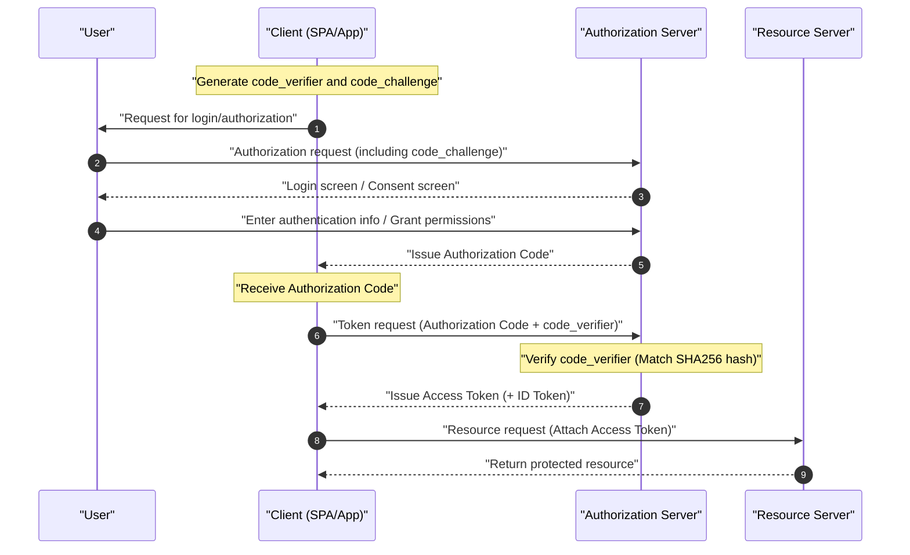

An essential technology for balancing security and user experience in modern Web and mobile applications is **OAuth 2.0** and **OIDC (OpenID Connect)**. However, many developers continue to confuse the differences between "Authentication" and "Authorization", leading to incorrect implementations.

This article provides a very detailed and comprehensive explanation of **OAuth 2.0** and **OIDC**, from their basic concepts to their respective roles, the clear difference between authentication and authorization, various grant types, and secure implementation methods involving PKCE.

---

## 1. The Clear Difference Between Authentication and Authorization

First and foremost, let's clarify the difference between "Authentication" and "Authorization", which is the most important and easily confused aspect.

### Authentication (AuthN)
**Authentication** is the process of confirming "who the accessing user is (whether they are the actual person)".
To use an analogy, it is equivalent to presenting an "employee ID" or "driver's license" at the reception desk when arriving at a company, proving "I am an employee of this company".

### Authorization (AuthZ)
On the other hand, **Authorization** is the process of "granting access rights to specific resources for a specific person (or system)".
In the company analogy mentioned earlier, after identity verification is complete, this corresponds to access control such as "Since this person is a regular employee, they are not granted the right (key) to enter the server room, but they are granted the right (key) to enter their own floor".

| Item | Authentication | Authorization |
| --- | --- | --- |
| Purpose | Identify "who you are" | Determine "what you can do" |
| English Abbreviation | AuthN | AuthZ |
| Representative Protocols | OpenID Connect (OIDC), SAML | OAuth 2.0, XACML |
| What is Received | ID Token (User information) | Access Token (Access rights) |

We often hear the expression "implement a login function using OAuth", but strictly speaking, **OAuth 2.0** is a protocol for "Authorization", and using it alone for "Authentication (login)" is an off-label use (pseudo-authentication). To perform authentication, the modern standard is to use **OIDC**, which is an extension of OAuth 2.0.

---

## 2. Complete Understanding of OAuth 2.0

### 2.1 What is OAuth 2.0?
**OAuth 2.0** is a standard protocol (RFC 6749) for granting third-party applications limited access rights (access tokens) to user data without handing over the user's password.

### 2.2 The 4 Roles of OAuth 2.0
To understand the flow of OAuth 2.0, it is essential to grasp the following four roles:

1. **Resource Owner** : The owner of the data (resource). Usually refers to the "User".
2. **Client** : The application attempting to access the user's data.
3. **Authorization Server** : The server that authenticates the user, verifies access rights, and then issues an access token to the client.
4. **Resource Server** : The server that holds the user's data and grants access to it by verifying the access token.

### 2.3 OAuth 2.0 Grant Types (Authorization Methods)

OAuth 2.0 defines multiple "grant types (token acquisition flows)" according to the characteristics of the client.

#### 1. Authorization Code Grant
This is the most secure and commonly used flow. It is suitable for applications that can securely hold a client secret (those with a backend server), such as Web applications.

#### 2. Implicit Grant
A flow created for applications that cannot hold a client secret, such as SPAs (Single Page Applications). However, it is **currently deprecated** due to security risks like the access token being exposed in URL fragments. Even for SPAs, the "Authorization Code Grant + PKCE" described later should be used.

#### 3. Resource Owner Password Credentials Grant
A flow where the client directly receives the user's ID and password and sends them to the authorization server to obtain a token. It is used only for extremely limited purposes such as migrating legacy systems. It is **currently deprecated** for security reasons.

#### 4. Client Credentials Grant
A flow used for system-to-system (M2M: Machine to Machine) communication without user involvement. The client itself acts as the resource owner.

### 2.4 Deep Dive: Authorization Code Flow + PKCE (Proof Key for Code Exchange)

SPAs and mobile apps cannot safely conceal client secrets. Therefore, **PKCE** (RFC 7636) was introduced to prevent Authorization Code Interception Attacks.

The mechanism of PKCE is as follows:
Before starting an authorization request, the client generates a random string `code_verifier`, hashes it, and creates a `code_challenge`.

The mathematical representation is as follows:
$$
\text{code\_challenge} = \text{BASE64URL-ENCODE}( \text{SHA256}( \text{code\_verifier} ) )
$$

#### Sequence Diagram of Authorization Code Flow with PKCE



#### PKCE Generation Implementation Example (JavaScript / Web Crypto API)

The following code is an example of generating the parameters necessary for PKCE in a JavaScript environment.

```javascript
// Generate a random string (code_verifier)
function generateCodeVerifier() {
    const array = new Uint32Array(56 / 2);
    window.crypto.getRandomValues(array);
    return Array.from(array, dec => ('0' + dec.toString(16)).substr(-2)).join('');
}

// Calculate SHA-256 hash and Base64URL encode (code_challenge)
async function generateCodeChallenge(codeVerifier) {
    const encoder = new TextEncoder();
    const data = encoder.encode(codeVerifier);
    const hashBuffer = await window.crypto.subtle.digest('SHA-256', data);
    const hashArray = Array.from(new Uint8Array(hashBuffer));
    const base64String = btoa(String.fromCharCode.apply(null, hashArray));
    return base64String.replace(/\+/g, '-').replace(/\//g, '_').replace(/=+$/, '');
}

// Execution example
const codeVerifier = generateCodeVerifier();
generateCodeChallenge(codeVerifier).then(codeChallenge => {
    console.log("Code Verifier:", codeVerifier);
    console.log("Code Challenge:", codeChallenge);
});
```

---

## 3. Complete Understanding of OIDC (OpenID Connect)

### 3.1 What is OIDC?
**OpenID Connect (OIDC)** is a simple and powerful identity layer for **Authentication** built on top of OAuth 2.0. While OAuth 2.0 is responsible for "granting access rights (authorization)", OIDC is responsible for "verifying the user's identity (authentication)".

By using OIDC, the client can obtain an **ID Token** that contains the identity information of the user authenticated by the authorization server (called the OpenID Provider, OP, in the OIDC world).

### 3.2 Difference Between ID Token and Access Token
Do not confuse the roles of the two tokens in OAuth 2.0 / OIDC.

- **Access Token** : A "key" to access an API (Resource Server). It is usually used by attaching it to the Authorization header of an API request without decoding its contents (often an Opaque token).
- **ID Token** : A "business card" or "certificate" containing the user's authentication results and attribute information (profile). It is always issued in **JWT (JSON Web Token)** format, and the client uses the user information by decoding it. **It must not be used as an API access permission.**

### 3.3 JWT (JSON Web Token) Structure and Verification

The ID token is expressed in JWT format. A JWT consists of three Base64URL-encoded strings separated by a `.` (dot).

1. **Header** : Indicates the token type (JWT) and the signing algorithm (e.g., RS256).
2. **Payload** : Contains user information and token metadata (claims).
3. **Signature** : An encrypted signature proving that the token has not been tampered with.

#### Main Claims Included in Payload
- `iss` (Issuer) : Token issuer (OP URL)
- `sub` (Subject) : Unique identifier for the user
- `aud` (Audience) : The client (Client ID) that should receive this token
- `exp` (Expiration Time) : Token expiration time
- `iat` (Issued At) : Token issue time

#### JWT Signature Verification Logic

A client that receives an ID token must verify the signature. When an [RSA](https://kenji.blog/en/p/modern-cryptography-public-key-hash-signature/) algorithm (like RS256) is used, the verification is done by retrieving the public key (JWKS) published by the OP.

The mathematical model for signature generation is expressed by the following formula:
$$
\text{Signature} = \text{Sign}_{\text{PrivateKey}}( \text{SHA256}( \text{Base64Url}(\text{Header}) + "." + \text{Base64Url}(\text{Payload}) ) )
$$

During verification, it is decrypted using the public key to confirm that the hash value matches.

#### ID Token (JWT) Decoding Example (Python)

The following code is an example of verifying and decoding an ID token using Python's `PyJWT` library.

```python
import jwt
from jwt import PyJWKClient

# Issuer's JWKS (JSON Web Key Set) endpoint
jwks_url = "https://example.com/.well-known/jwks.json"
jwk_client = PyJWKClient(jwks_url)

id_token = "eyJhbGciOiJSUzI1NiIs..." # Acquired ID token
client_id = "your_client_id"
issuer = "https://example.com"

try:
    # Identify the key (kid) used from the token header and get the public key
    signing_key = jwk_client.get_signing_key_from_jwt(id_token)
    
    # Simultaneously verify the signature, aud (Audience), iss (Issuer), and exp (Expiration Time)
    decoded_payload = jwt.decode(
        id_token,
        signing_key.key,
        algorithms=["RS256"],
        audience=client_id,
        issuer=issuer
    )
    print("Authentication successful. User ID:", decoded_payload["sub"])
    print("Username:", decoded_payload.get("name"))

except jwt.ExpiredSignatureError:
    print("Error: The token has expired.")
except jwt.InvalidTokenError as e:
    print(f"Error: Invalid token. Details: {e}")
```

---

## 4. Security and Best Practices

When implementing OAuth 2.0 and OIDC, a number of security risks must be considered.

### 4.1 [CSRF](https://kenji.blog/en/p/web-application-vulnerability-owasp-top-10/) Prevention with State Parameter
By including an unpredictable `state` parameter during the authorization request and verifying that it matches during the callback, you prevent Cross-Site Request Forgery ([CSRF](https://kenji.blog/en/p/web-application-vulnerability-owasp-top-10/)) attacks.

### 4.2 Token Lifetime and Calculation
To maintain security, it is a best practice to set the access token's lifetime (`exp`) to be short (e.g., 15 minutes to 1 hour). When it expires, a Refresh Token is used to obtain a new access token.

The determination of whether a token is valid is based on the following inequality. Here, the current time is $ T_{now} $, the token issue time is $ T_{iat} $, and the lifetime is $ D_{lifetime} $.

$$
T_{now} < T_{iat} + D_{lifetime} \quad (\text{or simply } T_{now} < T_{exp})
$$

### 4.3 Selecting OIDC Flow
Whether for Web applications or mobile apps, the most recommended flow currently is **Authorization Code Flow + PKCE**. Since the Implicit flow is no longer considered safe, it must absolutely not be used in new developments.

## Conclusion

In this article, we deeply explored the differences between **OAuth 2.0** and **OIDC**, as well as the difference in the core concepts of "Authorization" and "Authentication".
- **OAuth 2.0** is an "Authorization (permission granting)" framework.
- **OIDC** is an "Authentication (identity verification)" protocol built on top of it.
- In modern applications, using the **Authorization Code Flow + PKCE** is the de facto standard for security.

By correctly understanding these specifications and mechanisms, and implementing appropriate flows and verification logic, let's achieve safe and robust identity management.
