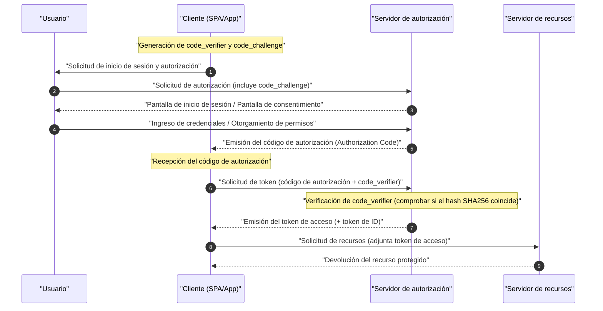

En las aplicaciones web y móviles modernas, **OAuth 2.0** y **OIDC (OpenID Connect)** son tecnologías indispensables para equilibrar la seguridad y la experiencia del usuario. Sin embargo, muchos desarrolladores confunden la diferencia entre "autenticación (Authentication)" y "autorización (Authorization)", lo que resulta en una implementación incorrecta.

En este artículo, explicaremos de manera muy detallada y exhaustiva desde los conceptos básicos de **OAuth 2.0** y **OIDC**, hasta sus respectivos roles, las claras diferencias entre autenticación y autorización, los distintos tipos de concesión y los métodos de implementación seguros con PKCE.

---

## 1. La clara diferencia entre Autenticación (Authentication) y Autorización (Authorization)

En primer lugar, organicemos la diferencia entre "autenticación" y "autorización", que es la más importante y la que más fácilmente se confunde.

### Autenticación (Authentication / AuthN)
La **autenticación** es el proceso de confirmar "quién es el usuario que accede (si es la persona real)".
Por ejemplo, equivale al acto de presentar una "tarjeta de empleado" o una "licencia de conducir" en la recepción al llegar a la oficina y demostrar "Soy fulano de tal, empleado de esta empresa".

### Autorización (Authorization / AuthZ)
Por otro lado, la **autorización** es el proceso de "otorgar a una persona (o sistema) específico el derecho de acceso a un recurso específico".
En el ejemplo anterior de la empresa, una vez finalizada la verificación de identidad, equivale al acto de control de acceso como "Dado que esta persona es un empleado general, no se le otorgará permiso (llave) para entrar a la sala de servidores, pero sí se le otorgará permiso (llave) para entrar a su propio piso".

| Elemento | Autenticación (Authentication) | Autorización (Authorization) |
| --- | --- | --- |
| Propósito | Identificar "quién es" | Determinar "qué puede hacer" |
| Abreviatura en inglés | AuthN | AuthZ |
| Protocolos representativos | OpenID Connect (OIDC), SAML | OAuth 2.0, XACML |
| Lo que se recibe | Token de ID (Información del usuario) | Token de acceso (Permiso de acceso) |

A menudo escuchamos la expresión "implementar una función de inicio de sesión usando OAuth", pero estrictamente hablando, **OAuth 2.0** es un protocolo para la "autorización", y usarlo por sí solo para la "autenticación (inicio de sesión)" es un uso fuera de su propósito (pseudo-autenticación). Para llevar a cabo la autenticación, el estándar moderno es utilizar **OIDC**, que es una extensión de OAuth 2.0.

---

## 2. Comprensión completa de OAuth 2.0

### 2.1 ¿Qué es OAuth 2.0?
**OAuth 2.0** es un protocolo estándar (RFC 6749) para otorgar a aplicaciones de terceros derechos de acceso limitados (tokens de acceso) a los datos del usuario sin revelar la contraseña del usuario.

### 2.2 Los 4 roles de OAuth 2.0
Para comprender el flujo de OAuth 2.0, es esencial comprender los siguientes 4 roles.

1. **Propietario del recurso (Resource Owner)** : El propietario de los datos (recursos). Por lo general, se refiere al "usuario".
2. **Cliente (Client)** : La aplicación que intenta acceder a los datos del usuario.
3. **Servidor de autorización (Authorization Server)** : El servidor que autentica al usuario, verifica los derechos de acceso y luego emite un token de acceso al cliente.
4. **Servidor de recursos (Resource Server)** : El servidor que retiene los datos del usuario, valida el token de acceso y permite el acceso a los datos.

### 2.3 Tipos de concesión (Métodos de otorgamiento de permisos) de OAuth 2.0

OAuth 2.0 define múltiples "tipos de concesión (flujos de obtención de tokens)" según las características del cliente.

#### 1. Concesión de código de autorización (Authorization Code Grant)
Es el flujo más seguro y de uso común. Es adecuado para aplicaciones que pueden mantener de forma segura el secreto del cliente (tienen un servidor backend), como las aplicaciones web.

#### 2. Concesión implícita (Implicit Grant)
Es un flujo creado para aplicaciones que no pueden mantener un secreto del cliente, como las SPA (Single Page Application). Sin embargo, debido a riesgos de seguridad como la exposición del token de acceso en el fragmento de la URL, **actualmente está en desuso**. Incluso las SPA deben utilizar la "Concesión de código de autorización + PKCE" descrita a continuación.

#### 3. Concesión de credenciales de contraseña del propietario del recurso (Resource Owner Password Credentials Grant)
Es un flujo en el que el cliente recibe el ID y la contraseña del usuario directamente y los envía al servidor de autorización para obtener un token. Se utiliza solo en casos de uso muy limitados, como la migración de sistemas heredados. Por razones de seguridad, **actualmente está en desuso**.

#### 4. Concesión de credenciales del cliente (Client Credentials Grant)
Es un flujo utilizado para la comunicación entre sistemas (M2M: Machine to Machine) sin la participación del usuario. El propio cliente actúa como el propietario del recurso.

### 2.4 Inmersión profunda: Flujo de código de autorización + PKCE (Proof Key for Code Exchange)

En las SPA y las aplicaciones móviles, el secreto del cliente no se puede ocultar de forma segura. Por lo tanto, se introdujo **PKCE** (RFC 7636) para evitar el ataque de intercepción del código de autorización (Authorization Code Interception Attack).

El mecanismo de PKCE es el siguiente.
Antes de iniciar la solicitud de autorización, el cliente genera una cadena aleatoria `code_verifier` y crea un `code_challenge` mediante su hashing.

La expresión matemática es la siguiente:
$$
\text{desafío\_de\_código} = \text{CODIFICAR-BASE64URL}( \text{SHA256}( \text{verificador\_de\_código} ) )
$$

#### Diagrama de secuencia del flujo de código de autorización con PKCE



#### Ejemplo de implementación de generación de PKCE (JavaScript / Web Crypto API)

El siguiente código es un ejemplo de generación de los parámetros necesarios para PKCE en un entorno JavaScript.

```javascript
// Generar una cadena aleatoria (code_verifier)
function generateCodeVerifier() {
    const array = new Uint32Array(56 / 2);
    window.crypto.getRandomValues(array);
    return Array.from(array, dec => ('0' + dec.toString(16)).substr(-2)).join('');
}

// Calcular el hash SHA-256 y codificar en Base64URL (code_challenge)
async function generateCodeChallenge(codeVerifier) {
    const encoder = new TextEncoder();
    const data = encoder.encode(codeVerifier);
    const hashBuffer = await window.crypto.subtle.digest('SHA-256', data);
    const hashArray = Array.from(new Uint8Array(hashBuffer));
    const base64String = btoa(String.fromCharCode.apply(null, hashArray));
    return base64String.replace(/\+/g, '-').replace(/\//g, '_').replace(/=+$/, '');
}

// Ejemplo de ejecución
const codeVerifier = generateCodeVerifier();
generateCodeChallenge(codeVerifier).then(codeChallenge => {
    console.log("Verificador de código:", codeVerifier);
    console.log("Desafío de código:", codeChallenge);
});
```

---

## 3. Comprensión completa de OIDC (OpenID Connect)

### 3.1 ¿Qué es OIDC?
**OpenID Connect (OIDC)** es una capa de identidad simple y poderosa para la **autenticación (Authentication)** construida sobre OAuth 2.0. Mientras que OAuth 2.0 se encarga de la "concesión de derechos de acceso (autorización)", OIDC se encarga de la "verificación de identidad del usuario (autenticación)".

Al utilizar OIDC, el cliente puede obtener un **Token de ID (ID Token)** que contiene información de identidad del usuario autenticado en el servidor de autorización (llamado OpenID Provider, OP, en el mundo de OIDC).

### 3.2 Diferencia entre el Token de ID y el Token de acceso
Asegúrese de no confundir los roles de los dos tokens en OAuth 2.0 / OIDC.

- **Token de acceso (Access Token)** : Una "llave" para acceder a la API (servidor de recursos). Por lo general, no se descifra su contenido y se usa adjuntándolo en el encabezado Authorization de la solicitud a la API (a menudo es un token Opaco).
- **Token de ID (ID Token)** : Una "tarjeta de presentación" o "certificado" que describe el resultado de la autenticación del usuario y la información de sus atributos (perfil). Siempre se emite en el formato **JWT (JSON Web Token)** y el cliente lo decodifica para usar la información del usuario. **No debe utilizarse como permiso de acceso a una API.**

### 3.3 Estructura y verificación del JWT (JSON Web Token)

El Token de ID se representa en formato JWT. Un JWT consta de tres cadenas codificadas en Base64URL separadas por `.` (puntos).

1. **Encabezado (Header)** : Indica el tipo de token (JWT) y el algoritmo de firma (por ejemplo, RS256).
2. **Carga útil (Payload)** : Contiene información del usuario y metadatos del token (reclamos o claims).
3. **Firma (Signature)** : Una firma cifrada que demuestra que el token no ha sido alterado.

#### Reclamos (Claims) principales incluidos en la Carga útil
- `iss` (Issuer) : Emisor del token (URL del OP)
- `sub` (Subject) : Identificador único del usuario
- `aud` (Audience) : Cliente que debe recibir este token (Client ID)
- `exp` (Expiration Time) : Tiempo de expiración del token
- `iat` (Issued At) : Fecha y hora de emisión del token

#### Lógica de verificación de firma del JWT

El cliente que recibe un Token de ID debe verificar obligatoriamente la firma (Signature). Cuando se utiliza el algoritmo [RSA](https://kenji.blog/es/p/modern-cryptography-public-key-hash-signature/) (como RS256), se obtiene la clave pública (JWKS) publicada por el OP para realizar la verificación.

El modelo matemático de generación de firmas se expresa mediante la siguiente fórmula.
$$
\text{Firma} = \text{Firmar}_{\text{ClavePrivada}}( \text{SHA256}( \text{Base64Url}(\text{Encabezado}) + "." + \text{Base64Url}(\text{CargaÚtil}) ) )
$$

Al verificar, se descifra utilizando la clave pública y se comprueba si el valor hash coincide.

#### Ejemplo de decodificación de Token de ID (JWT) (Python)

El siguiente código es un ejemplo del uso de la biblioteca `PyJWT` de Python para verificar y decodificar un Token de ID.

```python
import jwt
from jwt import PyJWKClient

# Punto de enlace JWKS (conjunto de claves públicas) del emisor
jwks_url = "https://example.com/.well-known/jwks.json"
jwk_client = PyJWKClient(jwks_url)

id_token = "eyJhbGciOiJSUzI1NiIs..." # Token de ID obtenido
client_id = "your_client_id"
issuer = "https://example.com"

try:
    # Identificar la clave utilizada (kid) a partir del encabezado del token y obtener la clave pública
    signing_key = jwk_client.get_signing_key_from_jwt(id_token)
    
    # Verificar la firma y simultáneamente verificar aud(Audience), iss(Issuer), y exp(Tiempo de expiración)
    decoded_payload = jwt.decode(
        id_token,
        signing_key.key,
        algorithms=["RS256"],
        audience=client_id,
        issuer=issuer
    )
    print("Autenticación exitosa. ID de usuario:", decoded_payload["sub"])
    print("Nombre de usuario:", decoded_payload.get("name"))

except jwt.ExpiredSignatureError:
    print("Error: El token ha expirado.")
except jwt.InvalidTokenError as e:
    print(f"Error: Token inválido. Detalles: {e}")
```

---

## 4. Seguridad y mejores prácticas

Al implementar OAuth 2.0 y OIDC, se deben considerar muchos riesgos de seguridad.

### 4.1 Protección contra [CSRF](https://kenji.blog/es/p/web-application-vulnerability-owasp-top-10/) mediante el parámetro State
Al incluir un parámetro `state` impredecible durante la solicitud de autorización y verificar si coincide durante la devolución de llamada, se evitan los ataques de falsificación de solicitudes entre sitios ([CSRF](https://kenji.blog/es/p/web-application-vulnerability-owasp-top-10/)).

### 4.2 Tiempo de vida y cálculo de tokens
Para mantener la seguridad, una mejor práctica es establecer el tiempo de vida (`exp`) del token de acceso de forma corta (por ejemplo, de 15 minutos a 1 hora). Cuando expira, se utiliza un token de actualización (Refresh Token) para obtener un nuevo token de acceso.

La determinación de si un token es válido se basa en la siguiente desigualdad. Aquí, el tiempo actual es $ T_{now} $, el tiempo de emisión del token es $ T_{iat} $, y el período de validez es $ D_{lifetime} $.

$$
T_{now} < T_{iat} + D_{lifetime} \quad (\text{o simplemente } T_{now} < T_{exp})
$$

### 4.3 Selección del flujo de OIDC
Independientemente de si se trata de una aplicación web o una aplicación móvil, el flujo más recomendado en la actualidad es el **Flujo de código de autorización + PKCE**. Dado que el flujo Implícito ya no se considera seguro, no debe utilizarse en absoluto en nuevos desarrollos.

## Resumen

En este artículo, profundizamos en las diferencias entre **OAuth 2.0** y **OIDC**, y en la discrepancia del concepto central entre "autorización" y "autenticación".
- **OAuth 2.0** es un marco de "autorización (otorgamiento de permisos)".
- **OIDC** es un protocolo de "autenticación (verificación de identidad)" construido sobre él.
- En las aplicaciones modernas, el uso del **Flujo de código de autorización + PKCE** es el estándar de facto de seguridad.

Comprendiendo correctamente estas especificaciones y mecanismos, e implementando flujos y lógicas de verificación adecuadas, logremos una gestión de identidad segura y robusta.
