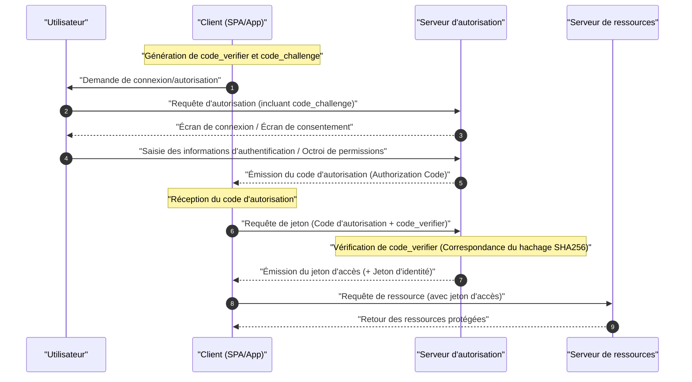

Dans les applications Web et mobiles modernes, **OAuth 2.0** et **OIDC (OpenID Connect)** sont des technologies indispensables pour concilier sécurité et expérience utilisateur. Cependant, de nombreux développeurs confondent encore la différence entre "authentification (Authentication)" et "autorisation (Authorization)", ce qui conduit souvent à des implémentations incorrectes.

Cet article explique de manière très détaillée et exhaustive les concepts de base de **OAuth 2.0** et **OIDC**, leurs rôles respectifs, la différence claire entre l'authentification et l'autorisation, les différents types d'octroi (grant types), et les méthodes d'implémentation sécurisées avec PKCE.

---

## 1. La différence claire entre Authentification (Authentication) et Autorisation (Authorization)

Tout d'abord, clarifions la différence la plus importante et la plus souvent confondue entre "l'authentification" et "l'autorisation".

### Authentification (Authentication / AuthN)
L' **authentification** est le processus qui permet de confirmer "qui est l'utilisateur qui accède (s'il est bien la personne qu'il prétend être)".
Pour donner une analogie, cela équivaut à présenter un "badge d'employé" ou un "permis de conduire" à la réception en arrivant au travail pour prouver "je suis M. X, un employé de cette entreprise".

### Autorisation (Authorization / AuthZ)
D'autre part, l' **autorisation** est le processus qui consiste à "accorder des droits d'accès à une ressource spécifique à une personne (ou un système) spécifique".
En reprenant l'exemple de l'entreprise, une fois la vérification d'identité terminée, cela correspond au contrôle d'accès tel que "cette personne étant un employé ordinaire, on ne lui donne pas le droit (la clé) d'entrer dans la salle des serveurs, mais on lui donne le droit (la clé) d'entrer à son propre étage".

| Élément | Authentification (Authentication) | Autorisation (Authorization) |
| --- | --- | --- |
| Objectif | Identifier "qui c'est" | Déterminer "ce qu'il peut faire" |
| Abréviation anglaise | AuthN | AuthZ |
| Protocoles typiques | OpenID Connect (OIDC), SAML | OAuth 2.0, XACML |
| Élément reçu | Jeton d'identité (Informations utilisateur) | Jeton d'accès (Droits d'accès) |

On entend souvent l'expression "implémenter une fonctionnalité de connexion en utilisant OAuth", mais techniquement, **OAuth 2.0** est un protocole pour "l'autorisation", et l'utiliser seul pour "l'authentification (connexion)" est un usage en dehors de ses spécifications (pseudo-authentification). Pour effectuer l'authentification, la norme moderne est d'utiliser **OIDC**, qui est une extension de OAuth 2.0.

---

## 2. Compréhension complète de OAuth 2.0

### 2.1 Qu'est-ce que OAuth 2.0 ?
**OAuth 2.0** est un protocole standard (RFC 6749) permettant d'accorder à des applications tierces un droit d'accès limité (jeton d'accès) aux données d'un utilisateur sans divulguer le mot de passe de ce dernier.

### 2.2 Les 4 rôles (rôles) de OAuth 2.0
Pour comprendre le flux OAuth 2.0, il est essentiel de connaître les 4 rôles suivants :

1. **Propriétaire de la ressource (Resource Owner)** : Le propriétaire des données (ressources). Désigne généralement "l'utilisateur".
2. **Client (Client)** : L'application qui tente d'accéder aux données de l'utilisateur.
3. **Serveur d'autorisation (Authorization Server)** : Le serveur qui authentifie l'utilisateur, vérifie les droits d'accès et émet un jeton d'accès au client.
4. **Serveur de ressources (Resource Server)** : Le serveur qui détient les données de l'utilisateur et autorise l'accès aux données après avoir vérifié le jeton d'accès.

### 2.3 Les types d'octroi (Grant Types) de OAuth 2.0

OAuth 2.0 définit plusieurs "types d'octroi (flux d'obtention de jeton)" en fonction des caractéristiques du client.

#### 1. Octroi de code d'autorisation (Authorization Code Grant)
C'est le flux le plus sécurisé et le plus couramment utilisé. Il convient aux applications, comme les applications Web, qui peuvent conserver un secret client de manière sécurisée (ayant un serveur backend).

#### 2. Octroi implicite (Implicit Grant)
C'est un flux conçu pour les applications qui ne peuvent pas conserver un secret client, comme les SPA (Single Page Application). Cependant, en raison des risques de sécurité tels que l'exposition du jeton d'accès dans le fragment d'URL, il est **actuellement déprécié**. Même pour les SPA, il faut utiliser "l'octroi de code d'autorisation + PKCE" décrit ci-dessous.

#### 3. Octroi par mot de passe du propriétaire de la ressource (Resource Owner Password Credentials Grant)
C'est un flux où le client reçoit directement l'ID et le mot de passe de l'utilisateur et les envoie au serveur d'autorisation pour obtenir un jeton. Il n'est utilisé que pour des cas très spécifiques, comme la migration de systèmes existants. Pour des raisons de sécurité, il est **actuellement déprécié**.

#### 4. Octroi d'informations d'identification du client (Client Credentials Grant)
C'est un flux utilisé pour la communication entre systèmes (M2M : Machine to Machine) sans l'implication de l'utilisateur. Le client lui-même agit en tant que propriétaire de la ressource.

### 2.4 En profondeur : [Flux](https://kenji.blog/fr/p/state-management-history-redux-context-recoil-zustand/) de code d'autorisation + PKCE (Proof Key for Code Exchange)

Les SPA et les applications mobiles ne peuvent pas dissimuler un secret client de manière sécurisée. C'est pourquoi **PKCE** (RFC 7636) a été introduit pour prévenir les attaques d'interception de code d'autorisation (Authorization Code Interception Attack).

Le fonctionnement de PKCE est le suivant :
Avant de commencer la requête d'autorisation, le client génère une chaîne aléatoire `code_verifier`, puis la hache pour créer un `code_challenge`.

La représentation mathématique est la suivante :
$$
\text{code\_challenge} = \text{BASE64URL-ENCODE}( \text{SHA256}( \text{code\_verifier} ) )
$$

#### Diagramme de séquence du flux de code d'autorisation avec PKCE



#### Exemple d'implémentation de génération PKCE (JavaScript / Web Crypto API)

Le code suivant est un exemple de génération des paramètres nécessaires pour PKCE dans un environnement JavaScript.

```javascript
// Générer une chaîne de caractères aléatoire (code_verifier)
function generateCodeVerifier() {
    const array = new Uint32Array(56 / 2);
    window.crypto.getRandomValues(array);
    return Array.from(array, dec => ('0' + dec.toString(16)).substr(-2)).join('');
}

// Calculer le hachage SHA-256 et l'encoder en Base64URL (code_challenge)
async function generateCodeChallenge(codeVerifier) {
    const encoder = new TextEncoder();
    const data = encoder.encode(codeVerifier);
    const hashBuffer = await window.crypto.subtle.digest('SHA-256', data);
    const hashArray = Array.from(new Uint8Array(hashBuffer));
    const base64String = btoa(String.fromCharCode.apply(null, hashArray));
    return base64String.replace(/\+/g, '-').replace(/\//g, '_').replace(/=+$/, '');
}

// Exemple d'exécution
const codeVerifier = generateCodeVerifier();
generateCodeChallenge(codeVerifier).then(codeChallenge => {
    console.log("Code Verifier :", codeVerifier);
    console.log("Code Challenge :", codeChallenge);
});
```

---

## 3. Compréhension complète de OIDC (OpenID Connect)

### 3.1 Qu'est-ce que OIDC ?
**OpenID Connect (OIDC)** est une couche d'identité simple et puissante construite sur OAuth 2.0 pour l' **authentification (Authentication)**. Alors que OAuth 2.0 se charge de "l'octroi des droits d'accès (autorisation)", OIDC se charge de "la vérification de l'identité de l'utilisateur (authentification)".

En utilisant OIDC, le client peut obtenir un **jeton d'identité (ID Token)** contenant les informations d'identité de l'utilisateur authentifié par le serveur d'autorisation (appelé OpenID Provider, OP dans le monde de OIDC).

### 3.2 Différence entre le jeton d'identité et le jeton d'accès
Il ne faut pas confondre les rôles des deux jetons dans OAuth 2.0 / OIDC.

- **Jeton d'accès (Access Token)** : La "clé" pour accéder à l'API (serveur de ressources). En général, son contenu n'est pas déchiffré par le client, et il est utilisé en l'attachant à l'en-tête Authorization de la requête API (c'est souvent un jeton opaque).
- **Jeton d'identité (ID Token)** : La "carte de visite" ou le "certificat" contenant le résultat de l'authentification et les informations de profil (attributs) de l'utilisateur. Il est toujours émis au format **JWT (JSON Web Token)**, et le client le décode pour utiliser les informations de l'utilisateur. **Il ne doit pas être utilisé comme droit d'accès à une API.**

### 3.3 Structure et vérification du JWT (JSON Web Token)

Le jeton d'identité est représenté au format JWT. Un JWT est composé de trois chaînes encodées en Base64URL séparées par un point (`.`).

1. **Header (En-tête)** : Indique le type de jeton (JWT) et l'algorithme de signature (ex: RS256).
2. **Payload (Charge utile)** : Contient les informations de l'utilisateur et les métadonnées du jeton (revendications).
3. **Signature (Signature)** : Une signature chiffrée prouvant que le jeton n'a pas été altéré.

#### Principales revendications incluses dans le Payload
- `iss` (Issuer) : L'émetteur du jeton (URL de l'OP)
- `sub` (Subject) : L'identifiant unique de l'utilisateur
- `aud` (Audience) : Le client censé recevoir ce jeton (Client ID)
- `exp` (Expiration Time) : La date d'expiration du jeton
- `iat` (Issued At) : La date d'émission du jeton

#### Logique de vérification de la signature JWT

Le client qui reçoit un jeton d'identité doit obligatoirement vérifier la signature (Signature). Si un algorithme [RSA](https://kenji.blog/fr/p/modern-cryptography-public-key-hash-signature/) (comme RS256) est utilisé, il récupère la clé publique (JWKS) exposée par l'OP pour la vérification.

Le modèle mathématique de génération de la signature est exprimé par la formule suivante :
$$
\text{Signature} = \text{Sign}_{\text{CléPrivée}}( \text{SHA256}( \text{Base64Url}(\text{Header}) + "." + \text{Base64Url}(\text{Payload}) ) )
$$

Lors de la vérification, la clé publique est utilisée pour déchiffrer, et on vérifie si la valeur de hachage correspond.

#### Exemple de décodage d'un jeton d'identité (JWT) (Python)

Le code suivant est un exemple d'utilisation de la bibliothèque `PyJWT` en Python pour vérifier et décoder un jeton d'identité.

```python
import jwt
from jwt import PyJWKClient

# Point de terminaison JWKS (ensemble de clés publiques) de l'émetteur
jwks_url = "https://example.com/.well-known/jwks.json"
jwk_client = PyJWKClient(jwks_url)

id_token = "eyJhbGciOiJSUzI1NiIs..." # Jeton d'identité obtenu
client_id = "your_client_id"
issuer = "https://example.com"

try:
    # Identifier la clé utilisée (kid) à partir de l'en-tête du jeton et obtenir la clé publique
    signing_key = jwk_client.get_signing_key_from_jwt(id_token)
    
    # Vérifier la signature, aud (Audience), iss (Émetteur) et exp (Date d'expiration) simultanément
    decoded_payload = jwt.decode(
        id_token,
        signing_key.key,
        algorithms=["RS256"],
        audience=client_id,
        issuer=issuer
    )
    print("Authentification réussie. ID utilisateur :", decoded_payload["sub"])
    print("Nom d'utilisateur :", decoded_payload.get("name"))

except jwt.ExpiredSignatureError:
    print("Erreur : Le jeton a expiré.")
except jwt.InvalidTokenError as e:
    print(f"Erreur : Jeton invalide. Détails : {e}")
```

---

## 4. Sécurité et bonnes pratiques

Lors de l'implémentation de OAuth 2.0 et OIDC, il est nécessaire de prendre en compte de nombreux risques de sécurité.

### 4.1 Protection contre [CSRF](https://kenji.blog/fr/p/web-application-vulnerability-owasp-top-10/) via le paramètre State
En incluant un paramètre `state` imprévisible lors de la requête d'autorisation et en vérifiant qu'il correspond lors du rappel, on empêche les attaques par falsification de requête intersites ([CSRF](https://kenji.blog/fr/p/web-application-vulnerability-owasp-top-10/)).

### 4.2 Durée de vie et calcul des jetons
Pour maintenir la sécurité, la bonne pratique est de configurer une durée de vie courte (`exp`) pour le jeton d'accès (par exemple : de 15 minutes à 1 heure). Lorsqu'il expire, un jeton d'actualisation (Refresh Token) est utilisé pour obtenir un nouveau jeton d'accès.

La détermination de la validité d'un jeton est basée sur l'inégalité suivante. Ici, l'heure actuelle est $ T_{now} $, la date d'émission du jeton est $ T_{iat} $ et la durée de validité est $ D_{lifetime} $.

$$
T_{now} < T_{iat} + D_{lifetime} \quad (\text{ou simplement } T_{now} < T_{exp})
$$

### 4.3 Choix du flux OIDC
Que ce soit pour les applications Web ou mobiles, le flux actuellement le plus recommandé est le **flux de code d'autorisation + PKCE**. Le flux Implicit n'étant plus considéré comme sûr, il ne doit absolument pas être utilisé dans les nouveaux développements.

## Résumé

Dans cet article, nous avons approfondi la différence entre **OAuth 2.0** et **OIDC**, ainsi que la distinction entre les concepts centraux "d'autorisation" et "d'authentification".
- **OAuth 2.0** est un framework "d'autorisation (octroi de droits)".
- **OIDC** est un protocole "d'authentification (vérification d'identité)" construit par-dessus.
- Dans les applications modernes, l'utilisation du **flux de code d'autorisation + PKCE** est le standard de facto en matière de sécurité.

En comprenant correctement ces spécifications et mécanismes, et en implémentant les flux et la logique de vérification appropriés, réalisons une gestion d'identité sûre et robuste.
