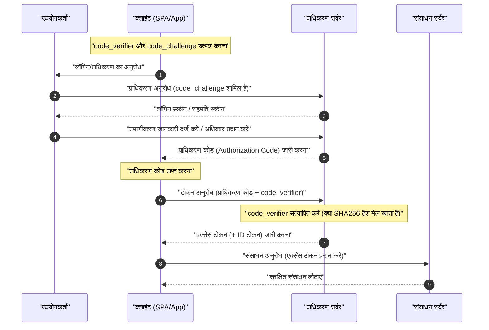

आधुनिक वेब एप्लिकेशन और मोबाइल ऐप में, सुरक्षा और उपयोगकर्ता अनुभव को संतुलित करने के लिए **OAuth 2.0** और **OIDC (OpenID Connect)** आवश्यक प्रौद्योगिकियां हैं। हालाँकि, कई डेवलपर 'प्रमाणीकरण (Authentication)' और 'प्राधिकरण (Authorization)' के बीच के अंतर को लेकर भ्रमित हो जाते हैं, जिसके परिणामस्वरूप अक्सर गलत कार्यान्वयन होता है।

इस लेख में, हम **OAuth 2.0** और **OIDC** की बुनियादी अवधारणाओं से लेकर उनकी संबंधित भूमिकाओं, प्रमाणीकरण और प्राधिकरण के बीच स्पष्ट अंतर, विभिन्न ग्रांट प्रकारों और PKCE का उपयोग करके सुरक्षित कार्यान्वयन विधियों तक सब कुछ बहुत विस्तार से और व्यापक रूप से समझाएंगे।

---

## 1. प्रमाणीकरण (Authentication) और प्राधिकरण (Authorization) के बीच स्पष्ट अंतर

सबसे पहले, आइए 'प्रमाणीकरण' और 'प्राधिकरण' के बीच के अंतर को स्पष्ट करें, जो सबसे महत्वपूर्ण और आसानी से भ्रमित करने वाला विषय है।

### प्रमाणीकरण (Authentication / AuthN)
**प्रमाणीकरण** 'एक्सेस करने वाला उपयोगकर्ता कौन है (क्या वे वही हैं जो वे होने का दावा करते हैं)' यह सत्यापित करने की प्रक्रिया है।
इसकी तुलना काम पर पहुंचने पर रिसेप्शन पर अपना 'कर्मचारी आईडी' या 'ड्राइवर का लाइसेंस' प्रस्तुत करने और यह साबित करने से की जा सकती है कि 'मैं इस कंपनी का कर्मचारी, अमुक-अमुक (नाम) हूं'।

### प्राधिकरण (Authorization / AuthZ)
दूसरी ओर, **प्राधिकरण**, 'किसी विशिष्ट व्यक्ति (या सिस्टम) को किसी विशिष्ट संसाधन तक पहुंचने की अनुमति देने' की प्रक्रिया है।
पहले के कंपनी के उदाहरण का उपयोग करते हुए, पहचान सत्यापन पूरा होने के बाद, यह एक्सेस नियंत्रण करने की कार्रवाई के बराबर है, जैसे 'चूंकि यह व्यक्ति एक सामान्य कर्मचारी है, इसलिए हम उसे सर्वर रूम में प्रवेश करने का अधिकार (कुंजी) नहीं देंगे, लेकिन हम उसे अपनी मंजिल पर प्रवेश करने का अधिकार (कुंजी) देंगे'।

| आइटम | प्रमाणीकरण (Authentication) | प्राधिकरण (Authorization) |
| --- | --- | --- |
| उद्देश्य | 'वे कौन हैं' यह पहचानना | 'वे क्या कर सकते हैं' यह निर्धारित करना |
| अंग्रेजी संक्षिप्त नाम | AuthN | AuthZ |
| विशिष्ट प्रोटोकॉल | OpenID Connect (OIDC), SAML | OAuth 2.0, XACML |
| क्या प्राप्त होता है | ID टोकन (उपयोगकर्ता जानकारी) | एक्सेस टोकन (एक्सेस अधिकार) |

हम अक्सर 'लॉगिन कार्यक्षमता को लागू करने के लिए OAuth का उपयोग करना' जैसी अभिव्यक्ति सुनते हैं, लेकिन कड़ाई से बोलते हुए, **OAuth 2.0** 'प्राधिकरण' के लिए एक प्रोटोकॉल है, और प्रमाणीकरण (लॉगिन) के लिए अकेले इसका उपयोग करना इसके इच्छित उद्देश्य (छद्म प्रमाणीकरण) के बाहर है। प्रमाणीकरण करने के लिए, आधुनिक मानक **OIDC** का उपयोग करना है, जो OAuth 2.0 का विस्तार है।

---

## 2. OAuth 2.0 को पूरी तरह से समझना

### 2.1 OAuth 2.0 क्या है?
**OAuth 2.0** तीसरे पक्ष के एप्लिकेशन को उपयोगकर्ता का पासवर्ड दिए बिना उपयोगकर्ता के डेटा तक सीमित पहुंच (एक्सेस टोकन) प्रदान करने के लिए एक मानक प्रोटोकॉल है (RFC 6749)।

### 2.2 OAuth 2.0 की 4 भूमिकाएं (Roles)
OAuth 2.0 के प्रवाह को समझने के लिए, निम्नलिखित 4 भूमिकाओं को समझना आवश्यक है।

1. **संसाधन स्वामी (Resource Owner)** : डेटा (संसाधन) का स्वामी। आमतौर पर इसका अर्थ 'उपयोगकर्ता' होता है।
2. **क्लाइंट (Client)** : उपयोगकर्ता के डेटा तक पहुंचने का प्रयास करने वाला एप्लिकेशन।
3. **प्राधिकरण सर्वर (Authorization Server)** : वह सर्वर जो उपयोगकर्ता को प्रमाणित करता है, एक्सेस अधिकारों की पुष्टि करता है, और क्लाइंट को एक एक्सेस टोकन जारी करता है।
4. **संसाधन सर्वर (Resource Server)** : वह सर्वर जो उपयोगकर्ता का डेटा रखता है, एक्सेस टोकन की पुष्टि करता है, और डेटा तक पहुंच की अनुमति देता है।

### 2.3 OAuth 2.0 के ग्रांट प्रकार (प्राधिकरण के तरीके)

OAuth 2.0 में, क्लाइंट की विशेषताओं के आधार पर कई 'ग्रांट प्रकार (टोकन प्राप्त करने का प्रवाह)' परिभाषित किए गए हैं।

#### 1. प्राधिकरण कोड ग्रांट (Authorization Code Grant)
यह सबसे सुरक्षित और आमतौर पर इस्तेमाल किया जाने वाला प्रवाह है। यह वेब एप्लिकेशन जैसे एप्लिकेशन के लिए उपयुक्त है जो क्लाइंट सीक्रेट (बैकएंड सर्वर वाले) को सुरक्षित रूप से रख सकते हैं।

#### 2. अंतर्निहित ग्रांट (Implicit Grant)
यह प्रवाह SPA (Single Page Application) जैसे एप्लिकेशन के लिए बनाया गया था जो क्लाइंट सीक्रेट नहीं रख सकते हैं। हालाँकि, चूंकि URL फ्रैगमेंट में एक्सेस टोकन के उजागर होने जैसे सुरक्षा जोखिम हैं, इसलिए **अब इसे अनुशंसित नहीं किया जाता है**। यहां तक कि SPA को भी 'प्राधिकरण कोड ग्रांट + PKCE' का उपयोग करना चाहिए, जिसकी चर्चा बाद में की गई है।

#### 3. संसाधन स्वामी पासवर्ड क्रेडेंशियल ग्रांट (Resource Owner Password Credentials Grant)
इस प्रवाह में, क्लाइंट सीधे उपयोगकर्ता का आईडी और पासवर्ड प्राप्त करता है और टोकन प्राप्त करने के लिए उन्हें प्राधिकरण सर्वर को भेजता है। इसका उपयोग केवल विरासत प्रणालियों (legacy systems) के माइग्रेशन जैसे अत्यंत सीमित उद्देश्यों के लिए किया जाता है। सुरक्षा कारणों से, **वर्तमान में यह अनुशंसित नहीं है**।

#### 4. क्लाइंट क्रेडेंशियल ग्रांट (Client Credentials Grant)
इस प्रवाह का उपयोग सिस्टम के बीच (M2M: मशीन से मशीन) संचार में किया जाता है जहां उपयोगकर्ता शामिल नहीं होता है। क्लाइंट स्वयं संसाधन स्वामी के रूप में कार्य करता है।

### 2.4 गहन विश्लेषण: प्राधिकरण कोड प्रवाह + PKCE (Proof Key for Code Exchange)

SPA और मोबाइल ऐप में, क्लाइंट सीक्रेट को सुरक्षित रूप से छिपाया नहीं जा सकता है। इसलिए, प्राधिकरण कोड इंटरसेप्शन अटैक (Authorization Code Interception Attack) को रोकने के लिए **PKCE** (RFC 7636) पेश किया गया था।

PKCE का तंत्र इस प्रकार है:
प्राधिकरण अनुरोध शुरू करने से पहले, क्लाइंट एक यादृच्छिक स्ट्रिंग `code_verifier` उत्पन्न करता है और `code_challenge` बनाने के लिए इसे हैश करता है।

गणितीय सूत्र के रूप में अभिव्यक्ति निम्नलिखित है:
$$
\text{code\_challenge} = \text{BASE64URL-ENCODE}( \text{SHA256}( \text{code\_verifier} ) )
$$

#### PKCE के साथ प्राधिकरण कोड प्रवाह का अनुक्रम आरेख (Sequence Diagram)



#### PKCE जनरेशन का कार्यान्वयन उदाहरण (JavaScript / Web Crypto API)

नीचे दिया गया कोड JavaScript परिवेश में PKCE के लिए आवश्यक पैरामीटर उत्पन्न करने का एक उदाहरण है।

```javascript
// एक यादृच्छिक स्ट्रिंग (code_verifier) उत्पन्न करें
function generateCodeVerifier() {
    const array = new Uint32Array(56 / 2);
    window.crypto.getRandomValues(array);
    return Array.from(array, dec => ('0' + dec.toString(16)).substr(-2)).join('');
}

// SHA-256 हैश की गणना करें और Base64URL एनकोड करें (code_challenge)
async function generateCodeChallenge(codeVerifier) {
    const encoder = new TextEncoder();
    const data = encoder.encode(codeVerifier);
    const hashBuffer = await window.crypto.subtle.digest('SHA-256', data);
    const hashArray = Array.from(new Uint8Array(hashBuffer));
    const base64String = btoa(String.fromCharCode.apply(null, hashArray));
    return base64String.replace(/\+/g, '-').replace(/\//g, '_').replace(/=+$/, '');
}

// निष्पादन का उदाहरण
const codeVerifier = generateCodeVerifier();
generateCodeChallenge(codeVerifier).then(codeChallenge => {
    console.log("Code Verifier:", codeVerifier);
    console.log("Code Challenge:", codeChallenge);
});
```

---

## 3. OIDC (OpenID Connect) को पूरी तरह से समझना

### 3.1 OIDC क्या है?
**OpenID Connect (OIDC)** **प्रमाणीकरण (Authentication)** के लिए एक सरल और शक्तिशाली पहचान परत (identity layer) है, जिसे OAuth 2.0 के ऊपर बनाया गया है। जबकि OAuth 2.0 'एक्सेस अधिकार प्रदान करने (प्राधिकरण)' को संभालता है, OIDC 'उपयोगकर्ता की पहचान सत्यापित करने (प्रमाणीकरण)' को संभालता है।

OIDC का उपयोग करके, क्लाइंट एक **ID टोकन (ID Token)** प्राप्त कर सकता है, जिसमें प्राधिकरण सर्वर (OIDC की दुनिया में इसे OpenID Provider, या OP कहा जाता है) द्वारा प्रमाणित उपयोगकर्ता की पहचान जानकारी शामिल होती है।

### 3.2 ID टोकन और एक्सेस टोकन के बीच अंतर
OAuth 2.0 / OIDC में इन दो टोकन की भूमिकाओं को भ्रमित नहीं करना चाहिए।

- **एक्सेस टोकन (Access Token)** : API (संसाधन सर्वर) तक पहुंचने के लिए 'कुंजी'। आमतौर पर, इसकी सामग्री को डिकोड नहीं किया जाता है; इसका उपयोग API अनुरोध के Authorization हेडर में संलग्न करके किया जाता है (अक्सर अपारदर्शी या Opaque टोकन)।
- **ID टोकन (ID Token)** : एक 'बिजनेस कार्ड' या 'प्रमाण पत्र' जिसमें उपयोगकर्ता के प्रमाणीकरण परिणाम और विशेषता जानकारी (प्रोफ़ाइल) शामिल होती है। यह हमेशा **JWT (JSON Web Token)** प्रारूप में जारी किया जाता है, और क्लाइंट उपयोगकर्ता जानकारी का उपयोग करने के लिए इसे डिकोड करता है। **इसे API एक्सेस अधिकारों के रूप में उपयोग नहीं किया जाना चाहिए।**

### 3.3 JWT (JSON Web Token) की संरचना और सत्यापन

ID टोकन को JWT प्रारूप में दर्शाया जाता है। JWT में `.` (डॉट) द्वारा अलग किए गए तीन Base64URL-एनकोडेड स्ट्रिंग होते हैं।

1. **हेडर (Header)** : टोकन का प्रकार (JWT) और हस्ताक्षर एल्गोरिदम (उदाहरण: RS256) को इंगित करता है।
2. **पेलोड (Payload)** : उपयोगकर्ता जानकारी और टोकन मेटाडेटा (दावे या क्लेम) शामिल हैं।
3. **हस्ताक्षर (Signature)** : एक एन्क्रिप्टेड हस्ताक्षर जो साबित करता है कि टोकन के साथ छेड़छाड़ नहीं की गई है।

#### पेलोड में शामिल प्रमुख दावे (Claims)
- `iss` (Issuer) : टोकन जारीकर्ता (OP का URL)
- `sub` (Subject) : उपयोगकर्ता का अद्वितीय पहचानकर्ता
- `aud` (Audience) : वह क्लाइंट जिसे यह टोकन प्राप्त करना चाहिए (Client ID)
- `exp` (Expiration Time) : टोकन की समाप्ति का समय
- `iat` (Issued At) : टोकन जारी करने की तिथि और समय

#### JWT का हस्ताक्षर सत्यापन तर्क (Logic)

ID टोकन प्राप्त करने वाले क्लाइंट को हस्ताक्षर (Signature) को अवश्य सत्यापित करना चाहिए। जब [RSA](https://kenji.blog/hi/p/modern-cryptography-public-key-hash-signature/) एल्गोरिदम (जैसे RS256) का उपयोग किया जाता है, तो OP द्वारा प्रकाशित सार्वजनिक कुंजी (JWKS) प्राप्त करके इसे सत्यापित किया जाता है।

हस्ताक्षर निर्माण का गणितीय मॉडल निम्नलिखित सूत्र द्वारा दर्शाया गया है:
$$
\text{Signature} = \text{Sign}_{\text{PrivateKey}}( \text{SHA256}( \text{Base64Url}(\text{Header}) + "." + \text{Base64Url}(\text{Payload}) ) )
$$

सत्यापन के दौरान, सार्वजनिक कुंजी का उपयोग करके इसे डिक्रिप्ट किया जाता है, और यह जाँच की जाती है कि क्या हैश मान मेल खाता है।

#### ID टोकन (JWT) डिकोडिंग का उदाहरण (Python)

नीचे दिया गया कोड Python की `PyJWT` लाइब्रेरी का उपयोग करके ID टोकन को सत्यापित और डिकोड करने का एक उदाहरण है।

```python
import jwt
from jwt import PyJWKClient

# जारीकर्ता का JWKS (सार्वजनिक कुंजी सेट) एंडपॉइंट
jwks_url = "https://example.com/.well-known/jwks.json"
jwk_client = PyJWKClient(jwks_url)

id_token = "eyJhbGciOiJSUzI1NiIs..." # प्राप्त ID टोकन
client_id = "your_client_id"
issuer = "https://example.com"

try:
    # टोकन के हेडर से उपयोग की गई कुंजी (kid) की पहचान करें और सार्वजनिक कुंजी प्राप्त करें
    signing_key = jwk_client.get_signing_key_from_jwt(id_token)
    
    # हस्ताक्षर का सत्यापन और aud (Audience), iss (Issuer), exp (Expiration) का सत्यापन एक साथ करें
    decoded_payload = jwt.decode(
        id_token,
        signing_key.key,
        algorithms=["RS256"],
        audience=client_id,
        issuer=issuer
    )
    print("प्रमाणीकरण सफल। उपयोगकर्ता ID:", decoded_payload["sub"])
    print("उपयोगकर्ता नाम:", decoded_payload.get("name"))

except jwt.ExpiredSignatureError:
    print("त्रुटि: टोकन की समय सीमा समाप्त हो गई है।")
except jwt.InvalidTokenError as e:
    print(f"त्रुटि: अमान्य टोकन है। विवरण: {e}")
```

---

## 4. सुरक्षा और सर्वोत्तम अभ्यास (Best Practices)

OAuth 2.0 और OIDC को लागू करते समय, कई सुरक्षा जोखिमों पर विचार किया जाना चाहिए।

### 4.1 State पैरामीटर के माध्यम से [CSRF](https://kenji.blog/hi/p/web-application-vulnerability-owasp-top-10/) सुरक्षा
प्राधिकरण अनुरोध में एक अप्रत्याशित `state` पैरामीटर शामिल करके और कॉलबैक के दौरान यह सत्यापित करके कि यह मेल खाता है, क्रॉस-साइट रिक्वेस्ट फोर्जारी ([CSRF](https://kenji.blog/hi/p/web-application-vulnerability-owasp-top-10/)) हमलों को रोका जाता है।

### 4.2 टोकन का जीवनकाल और गणना
सुरक्षा बनाए रखने के लिए, एक्सेस टोकन का जीवनकाल (`exp`) कम (उदाहरण: 15 मिनट से 1 घंटा) निर्धारित करना सबसे अच्छा अभ्यास है। यदि यह समाप्त हो जाता है, तो एक नया एक्सेस टोकन प्राप्त करने के लिए रिफ्रेश टोकन (Refresh Token) का उपयोग किया जाता है।

टोकन मान्य है या नहीं, इसका निर्धारण निम्नलिखित असमानता पर आधारित है। यहाँ, वर्तमान समय $ T_{now} $, टोकन जारी करने का समय $ T_{iat} $, और वैधता अवधि $ D_{lifetime} $ है।

$$
T_{now} < T_{iat} + D_{lifetime} \quad (\text{या केवल } T_{now} < T_{exp})
$$

### 4.3 OIDC प्रवाह का चयन
वेब एप्लिकेशन या मोबाइल ऐप के बावजूद, वर्तमान में सबसे अनुशंसित प्रवाह **प्राधिकरण कोड प्रवाह + PKCE** है। Implicit प्रवाह को अब सुरक्षित नहीं माना जाता है, इसलिए इसे नए विकास में कभी भी उपयोग नहीं किया जाना चाहिए।

## निष्कर्ष

इस लेख में, हमने **OAuth 2.0** और **OIDC** के बीच के अंतर, और 'प्राधिकरण' और 'प्रमाणीकरण' की मुख्य अवधारणाओं के बीच के अंतर का गहराई से विश्लेषण किया है।
- **OAuth 2.0** 'प्राधिकरण (अधिकार प्रदान करने)' के लिए एक ढांचा है।
- **OIDC** इसके ऊपर बना 'प्रमाणीकरण (पहचान सत्यापन)' के लिए एक प्रोटोकॉल है।
- आधुनिक एप्लिकेशन में, सुरक्षा कारणों से **प्राधिकरण कोड प्रवाह + PKCE** का उपयोग करना एक वास्तविक (de facto) मानक है।

इन विशिष्टताओं और तंत्रों को सही ढंग से समझकर, और उचित प्रवाह और सत्यापन तर्क को लागू करके, आइए एक सुरक्षित और मजबूत पहचान प्रबंधन प्रणाली का एहसास करें।
