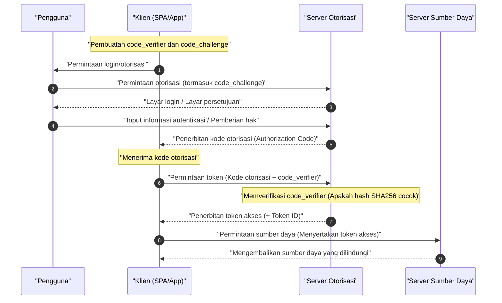

Dalam aplikasi web dan seluler modern, teknologi yang sangat penting untuk menyeimbangkan keamanan dan pengalaman pengguna adalah **OAuth 2.0** dan **OIDC (OpenID Connect)**. Namun, masih banyak kasus di mana pengembang menyalahartikan perbedaan antara "Autentikasi (Authentication)" dan "Otorisasi (Authorization)", yang berujung pada implementasi yang salah.

Artikel ini memberikan penjelasan yang sangat rinci dan komprehensif, mulai dari konsep dasar **OAuth 2.0** dan **OIDC**, peran masing-masing, perbedaan yang jelas antara autentikasi dan otorisasi, berbagai jenis tipe grant, hingga metode implementasi yang aman dengan PKCE.

---

## 1. Perbedaan yang Jelas antara Autentikasi (Authentication) dan Otorisasi (Authorization)

Pertama-tama, mari kita perjelas perbedaan antara "autentikasi" dan "otorisasi", yang merupakan hal paling penting namun sering disalahartikan.

### Autentikasi (Authentication / AuthN)
**Autentikasi** adalah proses untuk mengonfirmasi "siapa pengguna yang mengakses (apakah mereka benar-benar orang tersebut)".
Sebagai analogi, ini setara dengan menunjukkan "kartu identitas karyawan" atau "SIM" di resepsionis saat tiba di kantor untuk membuktikan "Saya adalah karyawan perusahaan ini bernama XX".

### Otorisasi (Authorization / AuthZ)
Di sisi lain, **otorisasi** adalah proses untuk "memberikan hak akses ke sumber daya tertentu kepada orang (atau sistem) tertentu".
Menggunakan contoh kantor sebelumnya, setelah verifikasi identitas selesai, ini setara dengan melakukan kontrol akses seperti "karena orang ini adalah karyawan biasa, saya tidak akan memberinya hak (kunci) untuk masuk ke ruang server, tetapi saya akan memberinya hak (kunci) untuk masuk ke lantainya sendiri".

| Item | Autentikasi (Authentication) | Otorisasi (Authorization) |
| --- | --- | --- |
| Tujuan | Mengidentifikasi "siapa" | Menentukan "apa yang bisa dilakukan" |
| Singkatan Bahasa Inggris | AuthN | AuthZ |
| Protokol Representatif | OpenID Connect (OIDC), SAML | OAuth 2.0, XACML |
| Yang Diterima | Token ID (Informasi pengguna) | Token Akses (Hak akses) |

Kita sering mendengar ungkapan "mengimplementasikan fitur login menggunakan OAuth", tetapi secara ketat **OAuth 2.0** adalah protokol untuk "otorisasi", dan menggunakannya sendiri untuk "autentikasi (login)" adalah penggunaan di luar tujuan spesifikasi (autentikasi semu). Untuk melakukan autentikasi, menggunakan **OIDC**, yang merupakan ekstensi dari OAuth 2.0, adalah standar modern.

---

## 2. Pemahaman Lengkap tentang OAuth 2.0

### 2.1 Apa itu OAuth 2.0?
**OAuth 2.0** adalah standar protokol untuk memberikan hak akses terbatas (token akses) ke data pengguna kepada aplikasi pihak ketiga tanpa menyerahkan kata sandi pengguna (RFC 6749).

### 2.2 4 Peran (Roles) dalam OAuth 2.0
Untuk memahami alur OAuth 2.0, sangat penting untuk memahami 4 peran berikut.

1. **Pemilik Sumber Daya (Resource Owner)** : Pemilik data (sumber daya). Biasanya merujuk pada "pengguna".
2. **Klien (Client)** : Aplikasi yang mencoba mengakses data pengguna.
3. **Server Otorisasi (Authorization Server)** : Server yang mengautentikasi pengguna, mengonfirmasi hak akses, dan kemudian menerbitkan token akses kepada klien.
4. **Server Sumber Daya (Resource Server)** : Server yang menyimpan data pengguna, memverifikasi token akses, dan mengizinkan akses ke data.

### 2.3 Tipe Grant OAuth 2.0 (Metode Pemberian Hak)

Dalam OAuth 2.0, beberapa "tipe grant (alur akuisisi token)" didefinisikan tergantung pada karakteristik klien.

#### 1. Grant Kode Otorisasi (Authorization Code Grant)
Ini adalah alur yang paling aman dan umum digunakan. Sangat cocok untuk aplikasi seperti aplikasi web yang dapat menyimpan rahasia klien dengan aman (memiliki server backend).

#### 2. Grant Implisit (Implicit Grant)
Ini adalah alur yang dibuat untuk aplikasi yang tidak dapat menyimpan rahasia klien, seperti SPA (Single Page Application). Namun, ini **sekarang sudah usang** karena risiko keamanan seperti token akses yang terekspos di fragmen URL. Bahkan di SPA, "Grant Kode Otorisasi + PKCE" yang dijelaskan di bawah ini harus digunakan.

#### 3. Grant Kredensial Kata Sandi Pemilik Sumber Daya (Resource Owner Password Credentials Grant)
Ini adalah alur di mana klien menerima ID dan kata sandi pengguna secara langsung dan mengirimkannya ke server otorisasi untuk mendapatkan token. Ini hanya digunakan untuk tujuan yang sangat terbatas seperti migrasi sistem warisan. Untuk alasan keamanan, ini **sekarang sudah usang**.

#### 4. Grant Kredensial Klien (Client Credentials Grant)
Ini adalah alur yang digunakan untuk komunikasi antar sistem (M2M: Machine to Machine) tanpa keterlibatan pengguna. Klien itu sendiri bertindak sebagai pemilik sumber daya.

### 2.4 Mendalam: Alur Kode Otorisasi + PKCE (Proof Key for Code Exchange)

Di SPA dan aplikasi seluler, rahasia klien tidak dapat disembunyikan dengan aman. Oleh karena itu, **PKCE** (RFC 7636) diperkenalkan untuk mencegah Serangan Intersepsi Kode Otorisasi (Authorization Code Interception Attack).

Cara kerja PKCE adalah sebagai berikut.
Klien menghasilkan string acak `code_verifier`, melakukan hash terhadapnya, dan membuat `code_challenge` sebelum memulai permintaan otorisasi.

Representasi matematisnya adalah sebagai berikut.
$$
\text{code\_challenge} = \text{BASE64URL-ENCODE}( \text{SHA256}( \text{code\_verifier} ) )
$$

#### Diagram Sekuens Alur Kode Otorisasi dengan PKCE



#### Contoh Implementasi Pembuatan PKCE (JavaScript / Web Crypto API)

Kode di bawah ini adalah contoh pembuatan parameter yang diperlukan untuk PKCE di lingkungan JavaScript.

```javascript
// Menghasilkan string acak (code_verifier)
function generateCodeVerifier() {
    const array = new Uint32Array(56 / 2);
    window.crypto.getRandomValues(array);
    return Array.from(array, dec => ('0' + dec.toString(16)).substr(-2)).join('');
}

// Menghitung hash SHA-256, dan encode Base64URL (code_challenge)
async function generateCodeChallenge(codeVerifier) {
    const encoder = new TextEncoder();
    const data = encoder.encode(codeVerifier);
    const hashBuffer = await window.crypto.subtle.digest('SHA-256', data);
    const hashArray = Array.from(new Uint8Array(hashBuffer));
    const base64String = btoa(String.fromCharCode.apply(null, hashArray));
    return base64String.replace(/\+/g, '-').replace(/\//g, '_').replace(/=+$/, '');
}

// Contoh eksekusi
const codeVerifier = generateCodeVerifier();
generateCodeChallenge(codeVerifier).then(codeChallenge => {
    console.log("Code Verifier:", codeVerifier);
    console.log("Code Challenge:", codeChallenge);
});
```

---

## 3. Pemahaman Lengkap tentang OIDC (OpenID Connect)

### 3.1 Apa itu OIDC?
**OpenID Connect (OIDC)** adalah lapisan identitas sederhana dan kuat untuk **autentikasi (Authentication)** yang dibangun di atas OAuth 2.0. Sementara OAuth 2.0 bertanggung jawab atas "pemberian hak akses (otorisasi)", OIDC bertanggung jawab atas "verifikasi identitas pengguna (autentikasi)".

Dengan menggunakan OIDC, klien dapat memperoleh **Token ID (ID Token)** yang berisi informasi identitas pengguna yang diautentikasi oleh server otorisasi (disebut OpenID Provider, OP dalam dunia OIDC).

### 3.2 Perbedaan antara Token ID dan Token Akses
Jangan sampai mencampuradukkan peran kedua token dalam OAuth 2.0 / OIDC.

- **Token Akses (Access Token)** : "Kunci" untuk mengakses API (server sumber daya). Biasanya isinya tidak didekripsi, dan dilampirkan ke header Authorization permintaan API (sering kali berupa Opaque token).
- **Token ID (ID Token)** : "Kartu nama" atau "sertifikat" yang berisi hasil autentikasi dan informasi atribut (profil) pengguna. Token ini selalu diterbitkan dalam format **JWT (JSON Web Token)**, dan didekode di sisi klien untuk menggunakan informasi pengguna. **Tidak boleh digunakan sebagai hak akses ke API.**

### 3.3 Struktur dan Verifikasi JWT (JSON Web Token)

Token ID direpresentasikan dalam format JWT. JWT terdiri dari tiga string yang dienkode dengan Base64URL yang dipisahkan oleh `.` (titik).

1. **Header (Header)** : Menunjukkan jenis token (JWT) dan algoritma tanda tangan (misalnya: RS256).
2. **Payload (Payload)** : Berisi informasi pengguna dan metadata token (klaim).
3. **Signature (Tanda Tangan)** : Tanda tangan terenkripsi yang membuktikan bahwa token belum dimanipulasi.

#### Klaim Utama yang Termasuk dalam Payload
- `iss` (Issuer) : Penerbit token (URL OP)
- `sub` (Subject) : Pengidentifikasi unik pengguna
- `aud` (Audience) : Klien yang seharusnya menerima token ini (Client ID)
- `exp` (Expiration Time) : Waktu kedaluwarsa token
- `iat` (Issued At) : Waktu dan tanggal penerbitan token

#### Logika Verifikasi Tanda Tangan JWT

Klien yang menerima Token ID wajib memverifikasi tanda tangannya (Signature). Jika menggunakan algoritma [RSA](https://kenji.blog/id/p/modern-cryptography-public-key-hash-signature/) (seperti RS256), klien akan mendapatkan kunci publik (JWKS) yang dipublikasikan oleh OP untuk memverifikasinya.

Model matematis untuk menghasilkan tanda tangan ditunjukkan dalam persamaan berikut.
$$
\text{Signature} = \text{Sign}_{\text{KunciPrivat}}( \text{SHA256}( \text{Base64Url}(\text{Header}) + "." + \text{Base64Url}(\text{Payload}) ) )
$$

Saat memverifikasi, ia mendekripsi dengan kunci publik dan memeriksa apakah nilai hash-nya cocok.

#### Contoh Dekode Token ID (JWT) (Python)

Kode berikut ini adalah contoh untuk memverifikasi dan mendekode Token ID menggunakan pustaka `PyJWT` Python.

```python
import jwt
from jwt import PyJWKClient

# Endpoint JWKS (set kunci publik) penerbit
jwks_url = "https://example.com/.well-known/jwks.json"
jwk_client = PyJWKClient(jwks_url)

id_token = "eyJhbGciOiJSUzI1NiIs..." # Token ID yang diperoleh
client_id = "your_client_id"
issuer = "https://example.com"

try:
    # Mengidentifikasi kunci (kid) yang digunakan dari header token, dan mendapatkan kunci publik
    signing_key = jwk_client.get_signing_key_from_jwt(id_token)
    
    # Melakukan verifikasi tanda tangan sekaligus verifikasi aud (Audience), iss (Issuer), dan exp (waktu kedaluwarsa)
    decoded_payload = jwt.decode(
        id_token,
        signing_key.key,
        algorithms=["RS256"],
        audience=client_id,
        issuer=issuer
    )
    print("Autentikasi berhasil. ID Pengguna:", decoded_payload["sub"])
    print("Nama pengguna:", decoded_payload.get("name"))

except jwt.ExpiredSignatureError:
    print("Error: Waktu kedaluwarsa token telah habis.")
except jwt.InvalidTokenError as e:
    print(f"Error: Token tidak valid. Detail: {e}")
```

---

## 4. Keamanan dan Praktik Terbaik

Saat mengimplementasikan OAuth 2.0 dan OIDC, penting untuk mempertimbangkan berbagai risiko keamanan.

### 4.1 Pencegahan [CSRF](https://kenji.blog/id/p/web-application-vulnerability-owasp-top-10/) dengan Parameter State
Dengan menyertakan parameter `state` yang tidak dapat ditebak saat meminta otorisasi, dan memverifikasi apakah nilainya cocok saat callback, Anda dapat mencegah serangan Cross-Site Request Forgery ([CSRF](https://kenji.blog/id/p/web-application-vulnerability-owasp-top-10/)).

### 4.2 Usia dan Perhitungan Token
Untuk menjaga keamanan, praktik terbaiknya adalah mengatur usia token akses (`exp`) secara singkat (misalnya: 15 menit hingga 1 jam). Jika telah kedaluwarsa, gunakan Refresh Token untuk mendapatkan token akses baru.

Penentuan apakah token valid didasarkan pada pertidaksamaan berikut. Di sini, biarkan waktu saat ini menjadi $ T_{now} $, waktu dan tanggal penerbitan token menjadi $ T_{iat} $, dan periode validitas menjadi $ D_{lifetime} $.

$$
T_{now} < T_{iat} + D_{lifetime} \quad (\text{atau cukup } T_{now} < T_{exp})
$$

### 4.3 Pemilihan Alur OIDC
Baik untuk aplikasi web maupun seluler, alur yang paling direkomendasikan saat ini adalah **Alur Kode Otorisasi + PKCE**. Alur Implisit tidak lagi dianggap aman dan tidak boleh digunakan sama sekali untuk pengembangan baru.

## Kesimpulan

Dalam artikel ini, kita telah mendalami perbedaan antara **OAuth 2.0** dan **OIDC**, serta perbedaan dalam konsep inti "otorisasi" dan "autentikasi".
- **OAuth 2.0** adalah kerangka kerja untuk "otorisasi (pemberian hak)".
- **OIDC** adalah protokol untuk "autentikasi (verifikasi identitas)" yang dibangun di atasnya.
- Pada aplikasi modern, menggunakan **Alur Kode Otorisasi + PKCE** merupakan standar de facto dalam hal keamanan.

Mari capai manajemen identitas yang aman dan tangguh dengan memahami spesifikasi dan mekanisme ini secara tepat, serta mengimplementasikan alur dan logika verifikasi yang sesuai.
