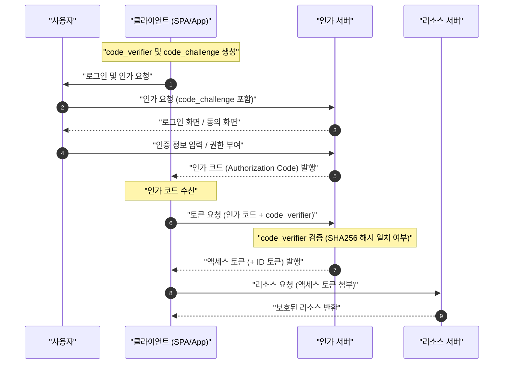

현대 웹 애플리케이션이나 모바일 앱에서 보안과 사용자 경험을 양립시키기 위해 필수적인 기술이 **OAuth 2.0** 과 **OIDC (OpenID Connect)** 입니다. 그러나 많은 개발자가 "인증 (Authentication)"과 "인가 (Authorization)"의 차이를 혼동하여 잘못된 구현을 하는 경우가 끊이지 않고 있습니다.

이 글에서는 **OAuth 2.0** 과 **OIDC** 의 기본 개념부터 각각의 역할, 인증과 인가의 명확한 차이, 각종 그랜트 타입, 그리고 PKCE를 수반하는 안전한 구현 기법까지 매우 상세하고 포괄적으로 해설합니다.

---

## 1. 인증 (Authentication) 과 인가 (Authorization) 의 명확한 차이

가장 먼저, 가장 중요하면서도 혼동하기 쉬운 "인증"과 "인가"의 차이에 대해 정리해 봅시다.

### 인증 (Authentication / AuthN)
**인증** 이란 "접근해 온 사용자가 누구인지(본인인지)"를 확인하는 프로세스입니다.
예를 들면, 회사에 출근했을 때 접수처에서 "사원증"이나 "운전면허증"을 제시하고 "저는 이 회사의 직원 〇〇입니다"라고 증명하는 행위에 해당합니다.

### 인가 (Authorization / AuthZ)
반면 **인가** 란 "어떤 특정 인물(또는 시스템)에 대해 특정 리소스에 대한 접근 권한을 부여하는" 프로세스입니다.
앞서 말한 회사의 예로 들자면, 본인 확인이 끝난 후 "이 사람은 일반 직원이므로 서버실에 들어갈 권한(열쇠)은 주지 않지만, 자신의 층에 들어갈 권한(열쇠)은 준다"와 같이 접근 제어를 하는 행위에 해당합니다.

| 항목 | 인증 (Authentication) | 인가 (Authorization) |
| --- | --- | --- |
| 목적 | "누구인지"를 특정한다 | "무엇을 할 수 있는지"를 결정한다 |
| 영어 약칭 | AuthN | AuthZ |
| 대표적인 프로토콜 | OpenID Connect (OIDC), SAML | OAuth 2.0, XACML |
| 받는 것 | ID 토큰 (사용자 정보) | 액세스 토큰 (접근 권한) |

종종 "OAuth를 이용하여 로그인 기능을 구현한다"라는 표현을 듣게 되지만, 엄밀히 말해서 **OAuth 2.0** 은 "인가"를 위한 프로토콜이며, 그것만으로 "인증(로그인)"을 수행하는 것은 사양의 목적 외 사용(유사 인증)이 됩니다. 인증을 수행하려면 OAuth 2.0을 확장한 **OIDC** 를 사용하는 것이 현대의 표준입니다.

---

## 2. OAuth 2.0 의 완전한 이해

### 2.1 OAuth 2.0 이란 무엇인가?
**OAuth 2.0** 은 서드파티 애플리케이션에 대해 사용자의 비밀번호를 넘기지 않고 사용자의 데이터에 대한 제한적인 접근 권한(액세스 토큰)을 부여하기 위한 표준 프로토콜입니다 (RFC 6749).

### 2.2 OAuth 2.0 의 4가지 역할 (Role)
OAuth 2.0의 흐름을 이해하기 위해서는 다음 4가지 역할을 파악하는 것이 필수적입니다.

1. **리소스 오너 (Resource Owner)** : 데이터(리소스)의 소유자. 보통 "사용자"를 가리킵니다.
2. **클라이언트 (Client)** : 사용자의 데이터에 접근하려는 애플리케이션.
3. **인가 서버 (Authorization Server)** : 사용자를 인증하고 접근 권한을 확인한 후, 클라이언트에게 액세스 토큰을 발행하는 서버.
4. **리소스 서버 (Resource Server)** : 사용자의 데이터를 보유하고, 액세스 토큰을 검증하여 데이터에 대한 접근을 허용하는 서버.

### 2.3 OAuth 2.0 의 그랜트 타입 (권한 부여 방식)

OAuth 2.0에는 클라이언트의 특성에 따라 여러 "그랜트 타입(토큰 획득 흐름)"이 정의되어 있습니다.

#### 1. 인가 코드 그랜트 (Authorization Code Grant)
가장 안전하고 일반적으로 사용되는 흐름입니다. 웹 애플리케이션과 같이 클라이언트 시크릿을 안전하게 유지할 수 있는(백엔드 서버를 가진) 애플리케이션에 적합합니다.

#### 2. 암묵적 그랜트 (Implicit Grant)
SPA (Single Page Application) 등 클라이언트 시크릿을 유지할 수 없는 애플리케이션을 위해 만들어진 흐름입니다. 그러나 액세스 토큰이 URL 프래그먼트에 노출되는 등의 보안 위험이 있기 때문에 **현재는 권장하지 않습니다**. SPA에서도 후술할 "인가 코드 그랜트 ＋ PKCE"를 사용해야 합니다.

#### 3. 리소스 오너 패스워드 크리덴셜 그랜트 (Resource Owner Password Credentials Grant)
클라이언트가 사용자의 ID와 비밀번호를 직접 받아 인가 서버에 전송하여 토큰을 얻는 흐름입니다. 레거시 시스템 마이그레이션 등 매우 제한적인 용도로만 사용됩니다. 보안상 **현재는 권장하지 않습니다**.

#### 4. 클라이언트 크리덴셜 그랜트 (Client Credentials Grant)
사용자가 관여하지 않고 시스템 간(M2M: Machine to Machine) 통신에 사용되는 흐름입니다. 클라이언트 자체가 리소스 오너로서 행동합니다.

### 2.4 심층 분석: 인가 코드 플로우 ＋ PKCE (Proof Key for Code Exchange)

SPA나 모바일 앱에서는 클라이언트 시크릿을 안전하게 은폐할 수 없습니다. 그래서 인가 코드 가로채기 공격 (Authorization Code Interception Attack) 을 방지하기 위해 도입된 것이 **PKCE** (RFC 7636) 입니다.

PKCE의 원리는 다음과 같습니다.
클라이언트는 인가 요청을 시작하기 전에 무작위 문자열인 `code_verifier` 를 생성하고, 이를 해시화하여 `code_challenge` 를 만듭니다.

수식으로 표현하면 다음과 같습니다.
$$
\text{code\_challenge} = \text{BASE64URL-ENCODE}( \text{SHA256}( \text{code\_verifier} ) )
$$

#### PKCE 를 수반하는 인가 코드 플로우의 시퀀스 다이어그램



#### PKCE 생성 구현 예시 (JavaScript / Web Crypto API)

다음 코드는 JavaScript 환경에서 PKCE에 필요한 매개변수를 생성하는 예시입니다.

```javascript
// 무작위 문자열 (code_verifier) 생성
function generateCodeVerifier() {
    const array = new Uint32Array(56 / 2);
    window.crypto.getRandomValues(array);
    return Array.from(array, dec => ('0' + dec.toString(16)).substr(-2)).join('');
}

// SHA-256 해시를 계산하고 Base64URL 인코딩 (code_challenge)
async function generateCodeChallenge(codeVerifier) {
    const encoder = new TextEncoder();
    const data = encoder.encode(codeVerifier);
    const hashBuffer = await window.crypto.subtle.digest('SHA-256', data);
    const hashArray = Array.from(new Uint8Array(hashBuffer));
    const base64String = btoa(String.fromCharCode.apply(null, hashArray));
    return base64String.replace(/\+/g, '-').replace(/\//g, '_').replace(/=+$/, '');
}

// 실행 예시
const codeVerifier = generateCodeVerifier();
generateCodeChallenge(codeVerifier).then(codeChallenge => {
    console.log("Code Verifier:", codeVerifier);
    console.log("Code Challenge:", codeChallenge);
});
```

---

## 3. OIDC (OpenID Connect) 의 완전한 이해

### 3.1 OIDC 란 무엇인가?
**OpenID Connect (OIDC)** 는 OAuth 2.0 위에 구축된 **인증 (Authentication)** 을 위한 단순하고 강력한 아이덴티티 계층입니다. OAuth 2.0이 "접근 권한 부여 (인가)"를 담당하는 반면, OIDC는 "사용자의 신원 확인 (인증)"을 담당합니다.

OIDC를 이용하면 클라이언트는 인가 서버(OIDC 세계에서는 OpenID Provider, OP라고 부릅니다)에서 인증된 사용자의 신원 정보를 포함하는 **ID 토큰 (ID Token)** 을 얻을 수 있습니다.

### 3.2 ID 토큰 과 액세스 토큰 의 차이
OAuth 2.0 / OIDC에서의 두 토큰의 역할을 혼동하지 않도록 합시다.

- **액세스 토큰 (Access Token)** : API(리소스 서버)에 접근하기 위한 "열쇠". 보통 내용은 해독하지 않고 API 요청의 Authorization 헤더에 부여하여 사용합니다 (Opaque 토큰인 경우가 많음).
- **ID 토큰 (ID Token)** : 사용자의 인증 결과와 속성 정보(프로필)가 기재된 "명함"이나 "증명서". 반드시 **JWT (JSON Web Token)** 형식으로 발행되며, 클라이언트 측에서 디코딩하여 사용자 정보를 이용합니다. **API의 접근 권한으로 사용해서는 안 됩니다.**

### 3.3 JWT (JSON Web Token) 의 구조와 검증

ID 토큰은 JWT 형식으로 표현됩니다. JWT는 `.` (점)으로 구분된 3개의 Base64URL 인코딩된 문자열로 구성됩니다.

1. **Header (헤더)** : 토큰의 타입 (JWT) 과 서명 알고리즘 (예: RS256) 을 나타냅니다.
2. **Payload (페이로드)** : 사용자 정보나 토큰의 메타데이터 (클레임) 를 포함합니다.
3. **Signature (서명)** : 토큰이 변조되지 않았음을 증명하는 암호화된 서명입니다.

#### Payload 에 포함되는 주요 클레임
- `iss` (Issuer) : 토큰 발행자 (OP의 URL)
- `sub` (Subject) : 사용자의 고유 식별자
- `aud` (Audience) : 이 토큰을 받아야 할 클라이언트 (Client ID)
- `exp` (Expiration Time) : 토큰의 만료 시간
- `iat` (Issued At) : 토큰의 발행 일시

#### JWT 의 서명 검증 로직

ID 토큰을 받은 클라이언트는 반드시 서명 (Signature) 을 검증해야 합니다. [RSA](https://kenji.blog/ko/p/modern-cryptography-public-key-hash-signature/) 알고리즘 (RS256 등) 이 사용될 경우, OP가 공개한 공개 키 (JWKS) 를 가져와 검증합니다.

서명 생성의 수학적 모델은 다음 수식으로 표현됩니다.
$$
\text{Signature} = \text{Sign}_{\text{PrivateKey}}( \text{SHA256}( \text{Base64Url}(\text{Header}) + "." + \text{Base64Url}(\text{Payload}) ) )
$$

검증 시에는 공개 키를 사용하여 복호화하고 해시 값이 일치하는지 확인합니다.

#### ID 토큰 (JWT) 의 디코딩 예시 (Python)

다음 코드는 Python의 `PyJWT` 라이브러리를 사용하여 ID 토큰을 검증 및 디코딩하는 예시입니다.

```python
import jwt
from jwt import PyJWKClient

# 발행자의 JWKS (공개 키 세트) 엔드포인트
jwks_url = "https://example.com/.well-known/jwks.json"
jwk_client = PyJWKClient(jwks_url)

id_token = "eyJhbGciOiJSUzI1NiIs..." # 획득한 ID 토큰
client_id = "your_client_id"
issuer = "https://example.com"

try:
    # 토큰의 헤더에서 사용 중인 키 (kid) 를 식별하고 공개 키를 가져옴
    signing_key = jwk_client.get_signing_key_from_jwt(id_token)
    
    # 서명 검증과 aud (Audience), iss (Issuer), exp (만료일) 검증을 동시에 수행
    decoded_payload = jwt.decode(
        id_token,
        signing_key.key,
        algorithms=["RS256"],
        audience=client_id,
        issuer=issuer
    )
    print("인증 성공. 사용자 ID:", decoded_payload["sub"])
    print("사용자 이름:", decoded_payload.get("name"))

except jwt.ExpiredSignatureError:
    print("오류: 토큰이 만료되었습니다.")
except jwt.InvalidTokenError as e:
    print(f"오류: 유효하지 않은 토큰입니다. 상세: {e}")
```

---

## 4. 보안과 모범 사례

OAuth 2.0 과 OIDC 를 구현할 때는 수많은 보안 위험을 고려해야 합니다.

### 4.1 State 매개변수에 의한 [CSRF](https://kenji.blog/ko/p/web-application-vulnerability-owasp-top-10/) 방어
인가 요청 시 예측 불가능한 `state` 매개변수를 포함하고, 콜백 시 그것이 일치하는지 검증함으로써 크로스 사이트 요청 위조 ([CSRF](https://kenji.blog/ko/p/web-application-vulnerability-owasp-top-10/)) 공격을 방지합니다.

### 4.2 토큰의 수명과 계산
보안을 유지하기 위해 액세스 토큰의 수명 (`exp`) 은 짧게 설정하는 것(예: 15분~1시간)이 모범 사례입니다. 만료일이 지난 경우 리프레시 토큰 (Refresh Token) 을 사용하여 새로운 액세스 토큰을 얻습니다.

토큰이 유효한지 여부의 판단은 다음 부등식에 기초합니다. 여기서는 현재 시각을 $ T_{now} $, 토큰 발행 일시를 $ T_{iat} $, 유효 기간을 $ D_{lifetime} $ 로 합니다.

$$
T_{now} < T_{iat} + D_{lifetime} \quad (\text{또는 단순히 } T_{now} < T_{exp})
$$

### 4.3 OIDC 흐름의 선택
웹 애플리케이션이나 모바일 앱을 불문하고 현재 가장 권장되는 흐름은 **인가 코드 플로우 ＋ PKCE** 입니다. Implicit 흐름은 더 이상 안전하다고 간주되지 않으므로 신규 개발에서는 절대 사용하지 마십시오.

## 요약

이 글에서는 **OAuth 2.0** 과 **OIDC** 의 차이, 그리고 "인가"와 "인증"이라는 핵심 개념의 차이에 대해 깊이 파고들었습니다.
- **OAuth 2.0** 은 "인가 (권한 부여)" 프레임워크.
- **OIDC** 는 그 위에 구축된 "인증 (본인 확인)" 프로토콜.
- 현대의 애플리케이션에서는 **인가 코드 플로우 ＋ PKCE** 를 이용하는 것이 보안상의 사실상 표준 (디팩토 스탠다드).

이러한 사양과 원리를 올바르게 이해하고 적절한 흐름과 검증 로직을 구현하여 안전하고 견고한 아이덴티티 관리를 실현합시다.
