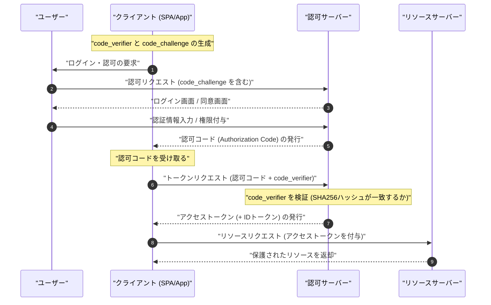

現代のWebアプリケーションやモバイルアプリにおいて、セキュリティとユーザー体験を両立させるために欠かせない技術が **OAuth 2.0** と **OIDC (OpenID Connect)** です。しかし、多くの開発者が「認証 (Authentication)」と「認可 (Authorization)」の違いを混同し、誤った実装をしてしまうケースが後を絶ちません。

この記事では、 **OAuth 2.0** と **OIDC** の基本概念から、それぞれの役割、認証と認可の明確な違い、各種グラントタイプ、そしてPKCEを伴うセキュアな実装手法まで、非常に詳細かつ網羅的に解説します。

---

## 1. 認証 (Authentication) と 認可 (Authorization) の明確な違い

まず最初に、最も重要かつ混同されやすい「認証」と「認可」の違いについて整理しましょう。

### 認証 (Authentication / AuthN)
**認証** とは、「アクセスしてきたユーザーが誰であるか（本人であるか）」を確認するプロセスです。
例えるなら、会社に出社した際に受付で「社員証」や「運転免許証」を提示し、「私はこの会社の従業員の〇〇です」と証明する行為に相当します。

### 認可 (Authorization / AuthZ)
一方、 **認可** とは、「ある特定の人物（あるいはシステム）に対して、特定のリソースへのアクセス権限を与える」プロセスです。
先ほどの会社の例で言えば、本人確認が終わった後、「この人は一般社員だから、サーバールームに入る権限（鍵）は与えないが、自分のフロアに入る権限（鍵）は与える」といったアクセス制御を行う行為に相当します。

| 項目 | 認証 (Authentication) | 認可 (Authorization) |
| --- | --- | --- |
| 目的 | 「誰であるか」を特定する | 「何ができるか」を決定する |
| 英語略称 | AuthN | AuthZ |
| 代表的なプロトコル | OpenID Connect (OIDC), SAML | OAuth 2.0, XACML |
| 受け取るもの | IDトークン (ユーザー情報) | アクセストークン (アクセス権) |

しばしば「OAuthを利用してログイン機能を実装する」という表現を耳にしますが、厳密には **OAuth 2.0** は「認可」のためのプロトコルであり、それ単体で「認証（ログイン）」を行うのは仕様の目的外利用（疑似認証）となります。認証を行うためには、OAuth 2.0を拡張した **OIDC** を使用するのが現代のスタンダードです。

---

## 2. OAuth 2.0 の完全理解

### 2.1 OAuth 2.0 とは何か？
**OAuth 2.0** は、サードパーティアプリケーションに対して、ユーザーのパスワードを渡すことなく、ユーザーのデータへの限定的なアクセス権（アクセストークン）を付与するための標準プロトコルです（RFC 6749）。

### 2.2 OAuth 2.0 の4つのロール（役割）
OAuth 2.0のフローを理解するためには、以下の4つのロールを把握することが不可欠です。

1. **リソースオーナ (Resource Owner)** : データ（リソース）の所有者。通常は「ユーザー」を指します。
2. **クライアント (Client)** : ユーザーのデータにアクセスしようとするアプリケーション。
3. **認可サーバー (Authorization Server)** : ユーザーを認証し、アクセス権を確認した上で、クライアントにアクセストークンを発行するサーバー。
4. **リソースサーバー (Resource Server)** : ユーザーのデータを保持し、アクセストークンを検証してデータへのアクセスを許可するサーバー。

### 2.3 OAuth 2.0 のグラントタイプ（権限付与方式）

OAuth 2.0 には、クライアントの特性に応じて複数の「グラントタイプ（トークン取得のフロー）」が定義されています。

#### 1. 認可コードグラント (Authorization Code Grant)
最もセキュアで一般的に使用されるフローです。Webアプリケーションのように、クライアントシークレットを安全に保持できる（バックエンドサーバーを持つ）アプリケーションに適しています。

#### 2. インプリシットグラント (Implicit Grant)
SPA (Single Page Application) など、クライアントシークレットを保持できないアプリケーション向けに作られたフローです。しかし、アクセストークンがURLフラグメントに露出するなどのセキュリティリスクがあるため、**現在では非推奨** となっています。SPAでも後述の「認可コードグラント ＋ PKCE」を使用すべきです。

#### 3. リソースオーナーパスワードクレデンシャルグラント (Resource Owner Password Credentials Grant)
クライアントがユーザーのIDとパスワードを直接受け取り、認可サーバーに送信してトークンを得るフローです。レガシーシステムの移行など極めて限定的な用途でのみ使用されます。セキュリティ上、**現在は非推奨** です。

#### 4. クライアントクレデンシャルグラント (Client Credentials Grant)
ユーザーが関与せず、システム間（M2M: Machine to Machine）の通信で使用されるフローです。クライアント自身がリソースオーナーとして振る舞います。

### 2.4 深掘り: 認可コードフロー ＋ PKCE (Proof Key for Code Exchange)

SPAやモバイルアプリでは、クライアントシークレットを安全に隠蔽できません。そこで、認可コードの横取り攻撃 (Authorization Code Interception Attack) を防ぐために導入されたのが **PKCE** (RFC 7636) です。

PKCEの仕組みは以下の通りです。
クライアントは認可リクエストを開始する前に、ランダムな文字列 `code_verifier` を生成し、それをハッシュ化して `code_challenge` を作成します。

数式による表現は以下のようになります。
$$
\text{code\_challenge} = \text{BASE64URL-ENCODE}( \text{SHA256}( \text{code\_verifier} ) )
$$

#### PKCE を伴う認可コードフローのシーケンス図



#### PKCE生成の実装例 (JavaScript / Web Crypto API)

以下のコードは、JavaScript環境でPKCEに必要なパラメータを生成する例です。

```javascript
// ランダムな文字列 (code_verifier) を生成
function generateCodeVerifier() {
    const array = new Uint32Array(56 / 2);
    window.crypto.getRandomValues(array);
    return Array.from(array, dec => ('0' + dec.toString(16)).substr(-2)).join('');
}

// SHA-256 ハッシュを計算し、Base64URLエンコード (code_challenge)
async function generateCodeChallenge(codeVerifier) {
    const encoder = new TextEncoder();
    const data = encoder.encode(codeVerifier);
    const hashBuffer = await window.crypto.subtle.digest('SHA-256', data);
    const hashArray = Array.from(new Uint8Array(hashBuffer));
    const base64String = btoa(String.fromCharCode.apply(null, hashArray));
    return base64String.replace(/\+/g, '-').replace(/\//g, '_').replace(/=+$/, '');
}

// 実行例
const codeVerifier = generateCodeVerifier();
generateCodeChallenge(codeVerifier).then(codeChallenge => {
    console.log("Code Verifier:", codeVerifier);
    console.log("Code Challenge:", codeChallenge);
});
```

---

## 3. OIDC (OpenID Connect) の完全理解

### 3.1 OIDC とは何か？
**OpenID Connect (OIDC)** は、OAuth 2.0 の上に構築された **認証（Authentication）** のためのシンプルで強力なアイデンティティレイヤーです。OAuth 2.0 が「アクセス権の付与（認可）」を担うのに対し、OIDC は「ユーザーの身元確認（認証）」を担います。

OIDCを利用することで、クライアントは認可サーバー（OIDCの世界では OpenID Provider, OP と呼ばれます）で認証されたユーザーの身元情報を含む **IDトークン (ID Token)** を取得できます。

### 3.2 IDトークン と アクセストークン の違い
OAuth 2.0 / OIDC における2つのトークンの役割を混同しないようにしましょう。

- **アクセストークン (Access Token)** : API（リソースサーバー）にアクセスするための「鍵」。通常は中身を解読せず、APIリクエストの Authorization ヘッダーに付与して使用します（Opaqueトークンであることが多い）。
- **IDトークン (ID Token)** : ユーザーの認証結果と属性情報（プロファイル）が記載された「名刺」や「証明書」。必ず **JWT (JSON Web Token)** フォーマットで発行され、クライアント側でデコードしてユーザー情報を利用します。**APIのアクセス権限として使用してはいけません。**

### 3.3 JWT (JSON Web Token) の構造と検証

IDトークンは JWT フォーマットで表現されます。JWTは `.` (ドット) で区切られた3つのBase64URLエンコードされた文字列で構成されます。

1. **Header (ヘッダ)** : トークンのタイプ（JWT）と署名アルゴリズム（例：RS256）を示す。
2. **Payload (ペイロード)** : ユーザー情報やトークンのメタデータ（クレーム）を含む。
3. **Signature (署名)** : トークンが改ざんされていないことを証明する[暗号化](https://kenji.blog/p/modern-cryptography-public-key-hash-signature/)された署名。

#### Payload に含まれる主要なクレーム
- `iss` (Issuer) : トークンの発行者 (OPのURL)
- `sub` (Subject) : ユーザーの一意な識別子
- `aud` (Audience) : このトークンを受け取るべきクライアント (Client ID)
- `exp` (Expiration Time) : トークンの有効期限
- `iat` (Issued At) : トークンの発行日時

#### JWTの署名検証ロジック

IDトークンを受け取ったクライアントは、必ず署名（Signature）を検証しなければなりません。[RSA](https://kenji.blog/p/modern-cryptography-public-key-hash-signature/)アルゴリズム（RS256など）が使われる場合、OPが公開している[公開鍵](https://kenji.blog/p/modern-cryptography-public-key-hash-signature/)（JWKS）を取得して検証します。

署名生成の数学的モデルは以下の式で表されます。
$$
\text{Signature} = \text{Sign}_{\text{PrivateKey}}( \text{SHA256}( \text{Base64Url}(\text{Header}) + "." + \text{Base64Url}(\text{Payload}) ) )
$$

検証時は、公開鍵を用いて復号し、ハッシュ値が一致するかを確認します。

#### IDトークン (JWT) のデコード例 (Python)

以下のコードは、Pythonの `PyJWT` ライブラリを使用してIDトークンを検証・デコードする例です。

```python
import jwt
from jwt import PyJWKClient

# 発行者のJWKS（公開鍵セット）エンドポイント
jwks_url = "https://example.com/.well-known/jwks.json"
jwk_client = PyJWKClient(jwks_url)

id_token = "eyJhbGciOiJSUzI1NiIs..." # 取得したIDトークン
client_id = "your_client_id"
issuer = "https://example.com"

try:
    # トークンのヘッダから使用されている鍵(kid)を特定し、公開鍵を取得
    signing_key = jwk_client.get_signing_key_from_jwt(id_token)
    
    # 署名の検証と、aud(Audience), iss(Issuer), exp(有効期限)の検証を同時に行う
    decoded_payload = jwt.decode(
        id_token,
        signing_key.key,
        algorithms=["RS256"],
        audience=client_id,
        issuer=issuer
    )
    print("認証成功。ユーザーID:", decoded_payload["sub"])
    print("ユーザー名:", decoded_payload.get("name"))

except jwt.ExpiredSignatureError:
    print("エラー: トークンの有効期限が切れています。")
except jwt.InvalidTokenError as e:
    print(f"エラー: 無効なトークンです。詳細: {e}")
```

---

## 4. セキュリティとベストプラクティス

OAuth 2.0 と OIDC を実装する際は、数多くのセキュリティリスクを考慮する必要があります。

### 4.1 State パラメータによる [CSRF](https://kenji.blog/p/web-application-vulnerability-owasp-top-10/) 対策
認可リクエスト時に推測不可能な `state` パラメータを含め、コールバック時にそれが一致するかを検証することで、クロスサイトリクエストフォージェリ ([CSRF](https://kenji.blog/p/web-application-vulnerability-owasp-top-10/)) 攻撃を防ぎます。

### 4.2 トークンの寿命と計算
セキュリティを保つため、アクセストークンの寿命（`exp`）は短く設定する（例：15分〜1時間）のがベストプラクティスです。有効期限が切れた場合は、リフレッシュトークン（Refresh Token）を用いて新しいアクセストークンを取得します。

トークンが有効かどうかの判定は以下の不等式に基づきます。ここでは、現在時刻を $ T_{now} $、トークンの発行日時を $ T_{iat} $、有効期間を $ D_{lifetime} $ とします。

$$
T_{now} < T_{iat} + D_{lifetime} \quad (\text{あるいは単に } T_{now} < T_{exp})
$$

### 4.3 OIDCのフローの選択
Webアプリケーションやモバイルアプリを問わず、現在最も推奨されているフローは **認可コードフロー ＋ PKCE** です。Implicit フローはもはや安全とは見なされないため、新規の開発では絶対に使用しないでください。

## まとめ

本記事では、 **OAuth 2.0** と **OIDC** の違い、そして「認可」と「認証」という中核概念の差異について深く掘り下げました。
- **OAuth 2.0** は「認可（権限付与）」のフレームワーク。
- **OIDC** はその上に構築された「認証（本人確認）」のプロトコル。
- 現代のアプリケーションでは、 **認可コードフロー ＋ PKCE** を利用することがセキュリティ上のデファクトスタンダード。

これらの仕様と仕組みを正しく理解し、適切なフローと検証ロジックを実装することで、安全かつ堅牢なアイデンティティ管理を実現しましょう。
