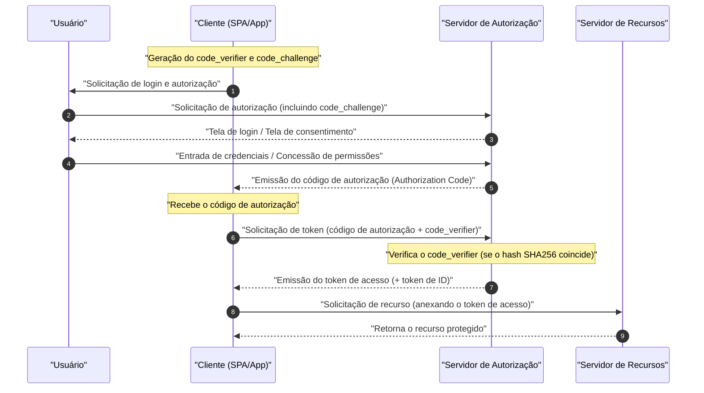

Nas aplicações web e móveis modernas, **OAuth 2.0** e **OIDC (OpenID Connect)** são tecnologias indispensáveis para equilibrar segurança e experiência do usuário. No entanto, muitos desenvolvedores confundem as diferenças entre "Autenticação (Authentication)" e "Autorização (Authorization)", o que resulta frequentemente em implementações incorretas.

Neste artigo, explicaremos de forma muito detalhada e abrangente, desde os conceitos básicos de **OAuth 2.0** e **OIDC**, até seus respectivos papéis, a diferença clara entre autenticação e autorização, os vários tipos de concessão (grant types) e as técnicas de implementação segura com PKCE.

---

## 1. A Diferença Clara entre Autenticação (Authentication) e Autorização (Authorization)

Primeiramente, vamos esclarecer a diferença entre "Autenticação" e "Autorização", que é a mais importante e facilmente confundida.

### Autenticação (Authentication / AuthN)
**Autenticação** é o processo de confirmar "quem é o usuário que está acessando (se é a própria pessoa)".
Por exemplo, é equivalente a apresentar um "crachá da empresa" ou "carteira de motorista" na recepção ao chegar ao trabalho, provando que "Eu sou o funcionário fulano desta empresa".

### Autorização (Authorization / AuthZ)
Por outro lado, **Autorização** é o processo de "conceder privilégios de acesso a um recurso específico para uma pessoa específica (ou sistema)".
Usando o exemplo anterior da empresa, após a confirmação de identidade, equivale a realizar o controle de acesso dizendo "Como esta pessoa é um funcionário comum, não lhe daremos a permissão (chave) para entrar na sala de servidores, mas daremos a permissão (chave) para entrar no seu próprio andar".

| Item | Autenticação (Authentication) | Autorização (Authorization) |
| --- | --- | --- |
| Objetivo | Identificar "quem é" | Determinar "o que pode fazer" |
| Sigla em Inglês | AuthN | AuthZ |
| Protocolos Representativos | OpenID Connect (OIDC), SAML | OAuth 2.0, XACML |
| O que recebe | Token de ID (Informações do usuário) | Token de Acesso (Direitos de acesso) |

Frequentemente ouvimos a expressão "implementar a funcionalidade de login usando OAuth", mas estritamente falando, **OAuth 2.0** é um protocolo para "autorização", e usá-lo sozinho para "autenticação (login)" é um uso fora do escopo de sua especificação (pseudo-autenticação). Para realizar a autenticação, o padrão moderno é usar **OIDC**, que é uma extensão do OAuth 2.0.

---

## 2. Entendimento Completo do OAuth 2.0

### 2.1 O que é OAuth 2.0?
**OAuth 2.0** é um protocolo padrão para conceder a aplicativos de terceiros acesso limitado (token de acesso) aos dados de um usuário sem compartilhar a senha do usuário (RFC 6749).

### 2.2 Os 4 Papéis (Roles) do OAuth 2.0
Para entender o fluxo do OAuth 2.0, é essencial compreender os seguintes 4 papéis:

1. **Proprietário do Recurso (Resource Owner)** : O dono dos dados (recursos). Geralmente refere-se ao "usuário".
2. **Cliente (Client)** : O aplicativo que tenta acessar os dados do usuário.
3. **Servidor de Autorização (Authorization Server)** : O servidor que autentica o usuário, verifica os direitos de acesso e emite o token de acesso para o cliente.
4. **Servidor de Recursos (Resource Server)** : O servidor que retém os dados do usuário e permite o acesso aos dados verificando o token de acesso.

### 2.3 Tipos de Concessão (Grant Types) do OAuth 2.0

O OAuth 2.0 define múltiplos "tipos de concessão (fluxos de obtenção de token)" dependendo das características do cliente.

#### 1. Concessão de Código de Autorização (Authorization Code Grant)
É o fluxo mais seguro e comumente usado. Adequado para aplicativos que podem manter o segredo do cliente (client secret) de forma segura (que possuem um servidor backend), como aplicações web.

#### 2. Concessão Implícita (Implicit Grant)
Um fluxo criado para aplicativos que não podem manter um segredo do cliente, como SPA (Single Page Application). No entanto, como o token de acesso fica exposto no fragmento da URL, apresentando riscos de segurança, **atualmente é desencorajado**. Mesmo para SPAs, deve-se usar a "Concessão de Código de Autorização + PKCE", descrita abaixo.

#### 3. Concessão de Credenciais de Senha do Proprietário do Recurso (Resource Owner Password Credentials Grant)
Um fluxo em que o cliente recebe diretamente o ID e a senha do usuário, e os envia ao servidor de autorização para obter um token. É usado apenas em aplicações extremamente limitadas, como migração de sistemas legados. Por motivos de segurança, **atualmente é desencorajado**.

#### 4. Concessão de Credenciais do Cliente (Client Credentials Grant)
Um fluxo usado na comunicação entre sistemas (M2M: Machine to Machine), onde o usuário não está envolvido. O próprio cliente atua como o proprietário do recurso.

### 2.4 Aprofundamento: Fluxo de Código de Autorização + PKCE (Proof Key for Code Exchange)

Em SPAs e aplicativos móveis, não é possível ocultar o segredo do cliente com segurança. Por isso, para evitar ataques de interceptação do código de autorização (Authorization Code Interception Attack), foi introduzido o **PKCE** (RFC 7636).

O funcionamento do PKCE é o seguinte:
Antes de iniciar a solicitação de autorização, o cliente gera uma string aleatória `code_verifier` e faz o hash dela para criar o `code_challenge`.

A representação matemática é a seguinte:
$$
\text{code\_challenge} = \text{BASE64URL-ENCODE}( \text{SHA256}( \text{code\_verifier} ) )
$$

#### Diagrama de Sequência do Fluxo de Código de Autorização com PKCE



#### Exemplo de Implementação da Geração PKCE (JavaScript / Web Crypto API)

O código abaixo é um exemplo de geração dos parâmetros necessários para o PKCE em um ambiente JavaScript.

```javascript
// Gerar uma string aleatória (code_verifier)
function generateCodeVerifier() {
    const array = new Uint32Array(56 / 2);
    window.crypto.getRandomValues(array);
    return Array.from(array, dec => ('0' + dec.toString(16)).substr(-2)).join('');
}

// Calcular o hash SHA-256 e codificar em Base64URL (code_challenge)
async function generateCodeChallenge(codeVerifier) {
    const encoder = new TextEncoder();
    const data = encoder.encode(codeVerifier);
    const hashBuffer = await window.crypto.subtle.digest('SHA-256', data);
    const hashArray = Array.from(new Uint8Array(hashBuffer));
    const base64String = btoa(String.fromCharCode.apply(null, hashArray));
    return base64String.replace(/\+/g, '-').replace(/\//g, '_').replace(/=+$/, '');
}

// Exemplo de execução
const codeVerifier = generateCodeVerifier();
generateCodeChallenge(codeVerifier).then(codeChallenge => {
    console.log("Code Verifier:", codeVerifier);
    console.log("Code Challenge:", codeChallenge);
});
```

---

## 3. Entendimento Completo do OIDC (OpenID Connect)

### 3.1 O que é OIDC?
**OpenID Connect (OIDC)** é uma camada de identidade simples e poderosa para **Autenticação (Authentication)**, construída sobre o OAuth 2.0. Enquanto o OAuth 2.0 é responsável por "conceder direitos de acesso (autorização)", o OIDC é responsável por "verificar a identidade do usuário (autenticação)".

Usando o OIDC, o cliente pode obter um **Token de ID (ID Token)** que contém informações de identidade do usuário autenticado pelo servidor de autorização (chamado de OpenID Provider, OP no mundo do OIDC).

### 3.2 A Diferença entre Token de ID e Token de Acesso
Cuidado para não confundir os papéis dos dois tokens no OAuth 2.0 / OIDC.

- **Token de Acesso (Access Token)** : A "chave" para acessar a API (Servidor de Recursos). Geralmente não tem seu conteúdo decodificado e é anexado no cabeçalho Authorization da requisição à API (muitas vezes é um token Opaco).
- **Token de ID (ID Token)** : O "cartão de visita" ou "certificado" que contém o resultado da autenticação e os atributos (perfil) do usuário. É sempre emitido no formato **JWT (JSON Web Token)**, e o lado do cliente o decodifica para usar as informações do usuário. **Não deve ser usado como permissão de acesso à API.**

### 3.3 Estrutura e Verificação do JWT (JSON Web Token)

O token de ID é representado no formato JWT. O JWT é composto por três strings codificadas em Base64URL separadas por `.` (ponto).

1. **Header (Cabeçalho)** : Indica o tipo de token (JWT) e o algoritmo de assinatura (ex: RS256).
2. **Payload (Carga Útil)** : Contém as informações do usuário e metadados do token (claims).
3. **Signature (Assinatura)** : A assinatura criptografada que prova que o token não foi adulterado.

#### Principais Claims Contidas no Payload
- `iss` (Issuer) : O emissor do token (URL do OP)
- `sub` (Subject) : O identificador único do usuário
- `aud` (Audience) : O cliente que deve receber este token (Client ID)
- `exp` (Expiration Time) : A data de validade do token
- `iat` (Issued At) : A data de emissão do token

#### Lógica de Verificação da Assinatura do JWT

O cliente que recebe o token de ID deve sempre verificar a assinatura (Signature). Se o algoritmo [RSA](https://kenji.blog/pt/p/modern-cryptography-public-key-hash-signature/) (como RS256) for usado, a verificação é feita obtendo a chave pública (JWKS) publicada pelo OP.

O modelo matemático para gerar a assinatura é representado pela seguinte equação:
$$
\text{Signature} = \text{Sign}_{\text{ChavePrivada}}( \text{SHA256}( \text{Base64Url}(\text{Header}) + "." + \text{Base64Url}(\text{Payload}) ) )
$$

Durante a verificação, é descriptografado usando a chave pública, e verifica-se se o valor do hash coincide.

#### Exemplo de Decodificação do Token de ID (JWT) (Python)

O código abaixo é um exemplo de verificação e decodificação do token de ID usando a biblioteca `PyJWT` do Python.

```python
import jwt
from jwt import PyJWKClient

# Endpoint do JWKS (Conjunto de Chaves Públicas) do emissor
jwks_url = "https://example.com/.well-known/jwks.json"
jwk_client = PyJWKClient(jwks_url)

id_token = "eyJhbGciOiJSUzI1NiIs..." # Token de ID obtido
client_id = "your_client_id"
issuer = "https://example.com"

try:
    # Identificar a chave (kid) usada no cabeçalho do token e obter a chave pública
    signing_key = jwk_client.get_signing_key_from_jwt(id_token)
    
    # Realizar simultaneamente a verificação da assinatura e a verificação de aud(Audience), iss(Issuer), e exp(Validade)
    decoded_payload = jwt.decode(
        id_token,
        signing_key.key,
        algorithms=["RS256"],
        audience=client_id,
        issuer=issuer
    )
    print("Autenticação bem-sucedida. ID do Usuário:", decoded_payload["sub"])
    print("Nome do Usuário:", decoded_payload.get("name"))

except jwt.ExpiredSignatureError:
    print("Erro: A validade do token expirou.")
except jwt.InvalidTokenError as e:
    print(f"Erro: Token inválido. Detalhes: {e}")
```

---

## 4. Segurança e Melhores Práticas

Ao implementar OAuth 2.0 e OIDC, é necessário considerar muitos riscos de segurança.

### 4.1 Prevenção de [CSRF](https://kenji.blog/pt/p/web-application-vulnerability-owasp-top-10/) usando o Parâmetro State
Ao incluir um parâmetro `state` imprevisível durante a solicitação de autorização e verificar se ele coincide no callback, evitam-se ataques de Falsificação de Requisição entre Sites ([CSRF](https://kenji.blog/pt/p/web-application-vulnerability-owasp-top-10/)).

### 4.2 Vida Útil e Cálculo de Tokens
Para manter a segurança, a melhor prática é definir uma vida útil curta para o token de acesso (`exp`) (ex: 15 minutos a 1 hora). Se a validade expirar, obtém-se um novo token de acesso usando o token de atualização (Refresh Token).

A determinação de se um token é válido é baseada na seguinte desigualdade. Aqui, a hora atual é $ T_{now} $, a data de emissão do token é $ T_{iat} $ e o período de validade é $ D_{lifetime} $.

$$
T_{now} < T_{iat} + D_{lifetime} \quad (\text{ou simplesmente } T_{now} < T_{exp})
$$

### 4.3 Escolha do Fluxo do OIDC
Independentemente de ser uma aplicação web ou móvel, o fluxo mais recomendado atualmente é o **Fluxo de Código de Autorização + PKCE**. Como o fluxo Implícito (Implicit flow) não é mais considerado seguro, ele absolutamente não deve ser usado em novos desenvolvimentos.

## Resumo

Neste artigo, nos aprofundamos nas diferenças entre **OAuth 2.0** e **OIDC**, e na diferença entre os conceitos centrais de "autorização" e "autenticação".
- **OAuth 2.0** é um framework para "autorização (concessão de permissões)".
- **OIDC** é um protocolo para "autenticação (verificação de identidade)" construído sobre ele.
- Nas aplicações modernas, usar o **Fluxo de Código de Autorização + PKCE** é o padrão de fato para segurança.

Ao compreender corretamente essas especificações e mecanismos, e implementar o fluxo e a lógica de verificação adequados, você pode alcançar um gerenciamento de identidade seguro e robusto.
