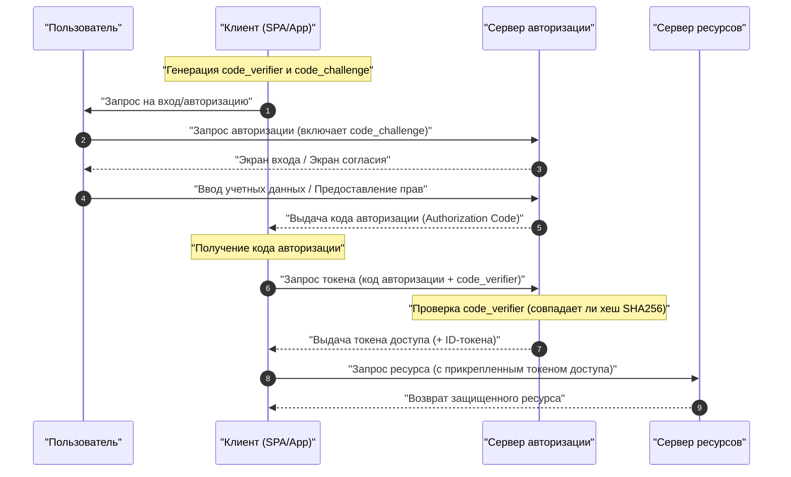

В современных веб- и мобильных приложениях **OAuth 2.0** и **OIDC (OpenID Connect)** — это технологии, необходимые для баланса между безопасностью и удобством пользователя. Однако многие разработчики продолжают путать различия между «аутентификацией (Authentication)» и «авторизацией (Authorization)», что приводит к некорректным реализациям.

В этой статье мы подробно и всесторонне рассмотрим основные концепции **OAuth 2.0** и **OIDC**, их роли, четкие различия между аутентификацией и авторизацией, различные типы грантов, а также методы безопасной реализации с использованием PKCE.

---

## 1. Четкие различия между аутентификацией (Authentication) и авторизацией (Authorization)

Прежде всего, давайте разберемся с различиями между «аутентификацией» и «авторизацией», которые наиболее важны и легко путаются.

### Аутентификация (Authentication / AuthN)
**Аутентификация** — это процесс подтверждения того, «кем является пользователь, запрашивающий доступ (является ли он тем, за кого себя выдает)».
Если привести пример, это равносильно тому, как по прибытии в компанию вы предъявляете на стойке регистрации «пропуск» или «водительские права», доказывая: «Я являюсь сотрудником этой компании по имени ХХ».

### Авторизация (Authorization / AuthZ)
С другой стороны, **авторизация** — это процесс «предоставления определенному лицу (или системе) прав доступа к определенному ресурсу».
Возвращаясь к примеру с компанией, после того как личность подтверждена, это эквивалентно контролю доступа: «Поскольку этот человек — обычный сотрудник, мы не дадим ему права (ключи) на вход в серверную, но дадим права (ключи) на вход на его этаж».

| Параметр | Аутентификация (Authentication) | Авторизация (Authorization) |
| --- | --- | --- |
| Цель | Определить «кто это» | Определить «что можно делать» |
| Английская аббревиатура | AuthN | AuthZ |
| Основные протоколы | OpenID Connect (OIDC), SAML | OAuth 2.0, XACML |
| Получаемые данные | ID-токен (информация о пользователе) | Токен доступа (права доступа) |

Часто можно услышать выражение «реализовать функцию входа в систему с использованием OAuth», но строго говоря, **OAuth 2.0** — это протокол для «авторизации», и его использование исключительно для «аутентификации (входа)» является использованием не по назначению (псевдо-аутентификацией). Для выполнения аутентификации современным стандартом является использование **OIDC**, который является расширением OAuth 2.0.

---

## 2. Полное понимание OAuth 2.0

### 2.1 Что такое OAuth 2.0?
**OAuth 2.0** — это стандартный протокол (RFC 6749) для предоставления сторонним приложениям ограниченных прав доступа (токена доступа) к данным пользователя без передачи его пароля.

### 2.2 Четыре роли в OAuth 2.0
Для понимания потока OAuth 2.0 необходимо знать следующие 4 роли.

1. **Владелец ресурса (Resource Owner)**: Владелец данных (ресурса). Обычно это означает «пользователя».
2. **Клиент (Client)**: Приложение, пытающееся получить доступ к данным пользователя.
3. **Сервер авторизации (Authorization Server)**: Сервер, который аутентифицирует пользователя, проверяет права доступа и затем выдает токен доступа клиенту.
4. **Сервер ресурсов (Resource Server)**: Сервер, который хранит данные пользователя и проверяет токен доступа для разрешения доступа к данным.

### 2.3 Типы грантов (способы предоставления прав) в OAuth 2.0

В OAuth 2.0 определено несколько «типов грантов (потоков получения токена)» в зависимости от характеристик клиента.

#### 1. Грант кода авторизации (Authorization Code Grant)
Самый безопасный и наиболее часто используемый поток. Он подходит для приложений, которые могут безопасно хранить секрет клиента (имеют бэкенд-сервер), таких как веб-приложения.

#### 2. Неявный грант (Implicit Grant)
Этот поток был создан для приложений, которые не могут хранить секрет клиента, таких как SPA (Single Page Application). Однако из-за рисков безопасности, таких как раскрытие токена доступа в фрагменте URL, **в настоящее время он не рекомендуется**. Для SPA также следует использовать описанный ниже «Грант кода авторизации + PKCE».

#### 3. Грант учетных данных владельца ресурса (Resource Owner Password Credentials Grant)
Поток, в котором клиент напрямую получает логин и пароль пользователя и отправляет их на сервер авторизации для получения токена. Используется только в крайне ограниченных случаях, таких как миграция устаревших систем. Из соображений безопасности **в настоящее время он не рекомендуется**.

#### 4. Грант учетных данных клиента (Client Credentials Grant)
Поток, используемый для взаимодействия между системами (M2M: Machine to Machine) без участия пользователя. Клиент сам выступает в роли владельца ресурса.

### 2.4 Глубокое погружение: Поток кода авторизации + PKCE (Proof Key for Code Exchange)

В SPA и мобильных приложениях невозможно безопасно скрыть секрет клиента. Поэтому для предотвращения атак с перехватом кода авторизации (Authorization Code Interception Attack) был введен **PKCE** (RFC 7636).

Механизм PKCE работает следующим образом.
Перед началом запроса авторизации клиент генерирует случайную строку `code_verifier`, а затем хеширует её для создания `code_challenge`.

Математическое выражение выглядит так:
$$
\text{code\_challenge} = \text{BASE64URL-ENCODE}( \text{SHA256}( \text{code\_verifier} ) )
$$

#### Диаграмма последовательности потока кода авторизации с PKCE



#### Пример реализации генерации PKCE (JavaScript / Web Crypto API)

Следующий код — это пример генерации необходимых параметров для PKCE в среде JavaScript.

```javascript
// Генерация случайной строки (code_verifier)
function generateCodeVerifier() {
    const array = new Uint32Array(56 / 2);
    window.crypto.getRandomValues(array);
    return Array.from(array, dec => ('0' + dec.toString(16)).substr(-2)).join('');
}

// Вычисление хеша SHA-256 и кодирование Base64URL (code_challenge)
async function generateCodeChallenge(codeVerifier) {
    const encoder = new TextEncoder();
    const data = encoder.encode(codeVerifier);
    const hashBuffer = await window.crypto.subtle.digest('SHA-256', data);
    const hashArray = Array.from(new Uint8Array(hashBuffer));
    const base64String = btoa(String.fromCharCode.apply(null, hashArray));
    return base64String.replace(/\+/g, '-').replace(/\//g, '_').replace(/=+$/, '');
}

// Пример выполнения
const codeVerifier = generateCodeVerifier();
generateCodeChallenge(codeVerifier).then(codeChallenge => {
    console.log("Code Verifier:", codeVerifier);
    console.log("Code Challenge:", codeChallenge);
});
```

---

## 3. Полное понимание OIDC (OpenID Connect)

### 3.1 Что такое OIDC?
**OpenID Connect (OIDC)** — это простой и мощный уровень идентификации для **аутентификации (Authentication)**, построенный поверх OAuth 2.0. В то время как OAuth 2.0 отвечает за «предоставление прав доступа (авторизацию)», OIDC отвечает за «подтверждение личности пользователя (аутентификацию)».

Используя OIDC, клиент может получить **ID-токен (ID Token)**, содержащий информацию о личности пользователя, аутентифицированного на сервере авторизации (который в мире OIDC называется OpenID Provider, OP).

### 3.2 Разница между ID-токеном и Токеном доступа
Не путайте роли этих двух токенов в OAuth 2.0 / OIDC.

- **Токен доступа (Access Token)**: «Ключ» для доступа к API (серверу ресурсов). Обычно его содержимое не расшифровывается, он просто добавляется в заголовок Authorization при API-запросе (часто это Opaque-токен).
- **ID-токен (ID Token)**: «Визитная карточка» или «сертификат», в котором записаны результаты аутентификации и атрибуты (профиль) пользователя. Он всегда выдается в формате **JWT (JSON Web Token)**, декодируется на стороне клиента, и информация о пользователе используется. **Его нельзя использовать в качестве права доступа к API.**

### 3.3 Структура и проверка JWT (JSON Web Token)

ID-токен представлен в формате JWT. JWT состоит из трех закодированных в Base64URL строк, разделенных точкой (`.`).

1. **Header (Заголовок)**: Указывает тип токена (JWT) и алгоритм подписи (например: RS256).
2. **Payload (Полезная нагрузка)**: Содержит информацию о пользователе и метаданные токена (утверждения).
3. **Signature (Подпись)**: Зашифрованная подпись, доказывающая, что токен не был подделан.

#### Основные утверждения, содержащиеся в Payload
- `iss` (Issuer) : Издатель токена (URL OP)
- `sub` (Subject) : Уникальный идентификатор пользователя
- `aud` (Audience) : Клиент, который должен получить этот токен (Client ID)
- `exp` (Expiration Time) : Время истечения срока действия токена
- `iat` (Issued At) : Дата и время выпуска токена

#### Логика проверки подписи JWT

Клиент, получивший ID-токен, обязательно должен проверить подпись (Signature). При использовании алгоритма [RSA](https://kenji.blog/ru/p/modern-cryptography-public-key-hash-signature/) (например, RS256) для проверки извлекается открытый ключ (JWKS), опубликованный OP.

Математическая модель создания подписи выражается следующей формулой:
$$
\text{Signature} = \text{Sign}_{\text{PrivateKey}}( \text{SHA256}( \text{Base64Url}(\text{Header}) + "." + \text{Base64Url}(\text{Payload}) ) )
$$

При проверке происходит расшифровка с помощью открытого ключа и проверка совпадения значения хеша.

#### Пример декодирования ID-токена (JWT) (Python)

Следующий код — это пример проверки и декодирования ID-токена с использованием библиотеки `PyJWT` в Python.

```python
import jwt
from jwt import PyJWKClient

# Конечная точка JWKS (набора открытых ключей) издателя
jwks_url = "https://example.com/.well-known/jwks.json"
jwk_client = PyJWKClient(jwks_url)

id_token = "eyJhbGciOiJSUzI1NiIs..." # Полученный ID-токен
client_id = "your_client_id"
issuer = "https://example.com"

try:
    # Определение используемого ключа (kid) из заголовка токена и получение открытого ключа
    signing_key = jwk_client.get_signing_key_from_jwt(id_token)
    
    # Одновременная проверка подписи и проверка aud(Audience), iss(Issuer), exp(Срок действия)
    decoded_payload = jwt.decode(
        id_token,
        signing_key.key,
        algorithms=["RS256"],
        audience=client_id,
        issuer=issuer
    )
    print("Аутентификация успешна. ID пользователя:", decoded_payload["sub"])
    print("Имя пользователя:", decoded_payload.get("name"))

except jwt.ExpiredSignatureError:
    print("Ошибка: Срок действия токена истёк.")
except jwt.InvalidTokenError as e:
    print(f"Ошибка: Недействительный токен. Подробности: {e}")
```

---

## 4. Безопасность и лучшие практики

При реализации OAuth 2.0 и OIDC необходимо учитывать множество рисков безопасности.

### 4.1 Защита от [CSRF](https://kenji.blog/ru/p/web-application-vulnerability-owasp-top-10/) с помощью параметра State
Включая непредсказуемый параметр `state` в запрос авторизации и проверяя его совпадение при обратном вызове, вы предотвращаете атаки межсайтовой подделки запроса ([CSRF](https://kenji.blog/ru/p/web-application-vulnerability-owasp-top-10/)).

### 4.2 Срок службы токена и его расчет
Для обеспечения безопасности лучшей практикой является установка короткого срока действия (`exp`) токена доступа (например, от 15 минут до 1 часа). Если срок действия истек, используется токен обновления (Refresh Token) для получения нового токена доступа.

Определение того, действителен ли токен, основывается на следующем неравенстве. Здесь текущее время — $ T_{now} $, время выпуска токена — $ T_{iat} $, а срок действия — $ D_{lifetime} $.

$$
T_{now} < T_{iat} + D_{lifetime} \quad (\text{или просто } T_{now} < T_{exp})
$$

### 4.3 Выбор потока OIDC
Независимо от того, является ли это веб-приложением или мобильным приложением, в настоящее время наиболее рекомендуемым потоком является **поток кода авторизации + PKCE**. Поскольку поток Implicit больше не считается безопасным, его категорически не следует использовать в новых разработках.

## Заключение

В этой статье мы глубоко изучили различия между **OAuth 2.0** и **OIDC**, а также разницу между ключевыми концепциями «авторизации» и «аутентификации».
- **OAuth 2.0** — это фреймворк для «авторизации (предоставления прав)».
- **OIDC** — это протокол для «аутентификации (подтверждения личности)», построенный поверх него.
- В современных приложениях использование **потока кода авторизации + PKCE** является стандартом безопасности де-факто.

Правильно понимая эти спецификации и механизмы, а также реализуя соответствующие потоки и логику проверки, мы сможем добиться безопасного и надежного управления идентификацией.
