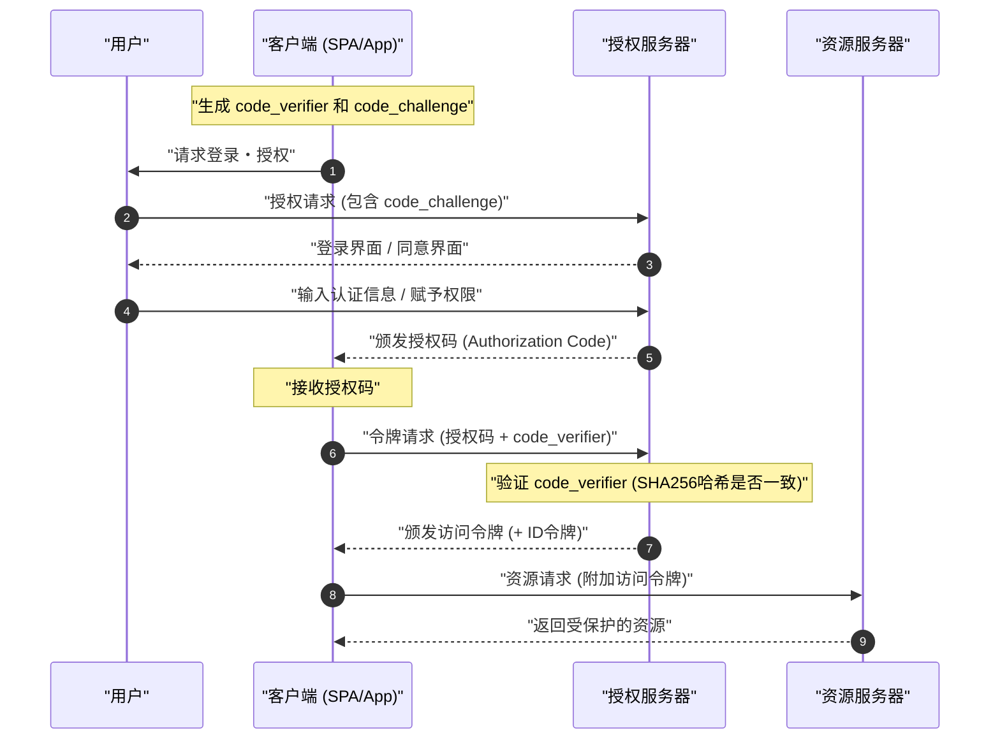

现代Web应用和移动应用中，为了兼顾安全性和用户体验，不可或缺的技术是 **OAuth 2.0** 和 **OIDC (OpenID Connect)** 。然而，许多开发者常常混淆“认证 (Authentication)”和“授权 (Authorization)”的区别，导致错误实现的情况屡见不鲜。

本文将从 **OAuth 2.0** 和 **OIDC** 的基本概念出发，非常详细且全面地讲解它们各自的作用、认证与授权的明确区别、各种授权类型，以及结合PKCE的安全实现方法。

---

## 1. 认证 (Authentication) 与 授权 (Authorization) 的明确区别

首先，我们来理清最重要且最容易混淆的“认证”与“授权”的区别。

### 认证 (Authentication / AuthN)
**认证** 是确认“访问的用户是谁（是否为本人）”的过程。
打个比方，这就相当于你去公司上班时，在前台出示“员工卡”或“驾驶证”，证明“我是这家公司的员工某某”的行为。

### 授权 (Authorization / AuthZ)
另一方面， **授权** 是“赋予特定人员（或系统）访问特定资源的权限”的过程。
用前面公司的例子来说，就是在确认身份之后，进行诸如“因为这个人是普通员工，所以不赋予进入机房的权限（钥匙），但赋予进入自己楼层的权限（钥匙）”这样的访问控制行为。

| 项目 | 认证 (Authentication) | 授权 (Authorization) |
| --- | --- | --- |
| 目的 | 确定“是谁” | 决定“能做什么” |
| 英文简称 | AuthN | AuthZ |
| 代表性协议 | OpenID Connect (OIDC), SAML | OAuth 2.0, XACML |
| 接收对象 | ID令牌 (用户信息) | 访问令牌 (访问权限) |

我们经常听到“使用OAuth来实现登录功能”的说法，但严格来说， **OAuth 2.0** 是用于“授权”的协议，单独使用它来进行“认证（登录）”属于规范外使用（伪认证）。为了进行认证，使用扩展了 OAuth 2.0 的 **OIDC** 是现代的标准做法。

---

## 2. 深入理解 OAuth 2.0

### 2.1 OAuth 2.0 是什么？
**OAuth 2.0** 是一种标准协议，用于向第三方应用程序赋予对用户数据的有限访问权限（访问令牌），而无需将用户的密码交给它们（RFC 6749）。

### 2.2 OAuth 2.0 的4个角色 (Role)
要理解OAuth 2.0的流程，必须掌握以下4个角色。

1. **资源所有者 (Resource Owner)** : 数据（资源）的所有者。通常指“用户”。
2. **客户端 (Client)** : 试图访问用户数据的应用程序。
3. **授权服务器 (Authorization Server)** : 在认证用户并确认访问权限后，向客户端颁发访问令牌的服务器。
4. **资源服务器 (Resource Server)** : 保存用户数据，并验证访问令牌以允许访问数据的服务器。

### 2.3 OAuth 2.0 的授权类型 (Grant Type)

OAuth 2.0 中，根据客户端的特性定义了多种“授权类型（获取令牌的流程）”。

#### 1. 授权码模式 (Authorization Code Grant)
这是最安全且最常用的流程。适用于像Web应用程序那样能够安全保存客户端密钥（拥有后端服务器）的应用程序。

#### 2. 隐式模式 (Implicit Grant)
这是为SPA (Single Page Application) 等无法保存客户端密钥的应用程序设计的流程。但是，由于存在访问令牌暴露在URL片段中等安全风险， **目前已被废弃 (Deprecated)** 。即使是SPA，也应使用下文提到的“授权码模式 ＋ PKCE”。

#### 3. 密码模式 (Resource Owner Password Credentials Grant)
客户端直接接收用户的ID和密码，并将其发送给授权服务器以获取令牌的流程。仅在旧系统迁移等极其有限的用途中使用。出于安全考虑， **目前已被废弃** 。

#### 4. 客户端凭证模式 (Client Credentials Grant)
不涉及用户，用于系统间（M2M: Machine to Machine）通信的流程。客户端自身扮演资源所有者的角色。

### 2.4 深入探讨: 授权码流程 ＋ PKCE (Proof Key for Code Exchange)

在SPA和移动应用中，无法安全地隐藏客户端密钥。因此，为了防止授权码拦截攻击 (Authorization Code Interception Attack)，引入了 **PKCE** (RFC 7636)。

PKCE的机制如下。
客户端在发起授权请求之前，生成一个随机字符串 `code_verifier`，并对其进行哈希处理以创建 `code_challenge`。

用数学公式表示如下：
$$
\text{code\_challenge} = \text{BASE64URL-ENCODE}( \text{SHA256}( \text{code\_verifier} ) )
$$

#### 带有 PKCE 的授权码流程的时序图



#### PKCE 生成的实现示例 (JavaScript / Web Crypto API)

以下代码是在 JavaScript 环境中生成 PKCE 所需参数的示例。

```javascript
// 生成随机字符串 (code_verifier)
function generateCodeVerifier() {
    const array = new Uint32Array(56 / 2);
    window.crypto.getRandomValues(array);
    return Array.from(array, dec => ('0' + dec.toString(16)).substr(-2)).join('');
}

// 计算 SHA-256 哈希，并进行 Base64URL 编码 (code_challenge)
async function generateCodeChallenge(codeVerifier) {
    const encoder = new TextEncoder();
    const data = encoder.encode(codeVerifier);
    const hashBuffer = await window.crypto.subtle.digest('SHA-256', data);
    const hashArray = Array.from(new Uint8Array(hashBuffer));
    const base64String = btoa(String.fromCharCode.apply(null, hashArray));
    return base64String.replace(/\+/g, '-').replace(/\//g, '_').replace(/=+$/, '');
}

// 执行示例
const codeVerifier = generateCodeVerifier();
generateCodeChallenge(codeVerifier).then(codeChallenge => {
    console.log("Code Verifier:", codeVerifier);
    console.log("Code Challenge:", codeChallenge);
});
```

---

## 3. 深入理解 OIDC (OpenID Connect)

### 3.1 OIDC 是什么？
**OpenID Connect (OIDC)** 是建立在 OAuth 2.0 之上的用于 **认证 (Authentication)** 的简单而强大的身份层。OAuth 2.0 负责“赋予访问权限（授权）”，而 OIDC 负责“确认用户身份（认证）”。

通过使用 OIDC，客户端可以获取包含在授权服务器（在 OIDC 世界中称为 OpenID Provider, OP）认证的用户身份信息的 **ID令牌 (ID Token)** 。

### 3.2 ID令牌与访问令牌的区别
请不要混淆 OAuth 2.0 / OIDC 中两种令牌的作用。

- **访问令牌 (Access Token)** : 访问API（资源服务器）的“钥匙”。通常不解密其内容，而是附加在API请求的 Authorization 头部中使用（大多为 Opaque 令牌）。
- **ID令牌 (ID Token)** : 记载了用户认证结果和属性信息（Profile）的“名片”或“证明书”。必定以 **JWT (JSON Web Token)** 格式颁发，客户端会在解码后使用用户信息。 **绝不能用作 API 的访问权限。**

### 3.3 JWT (JSON Web Token) 的结构与验证

ID令牌以 JWT 格式表示。JWT 由 `.` (点) 分隔的三个经过 Base64URL 编码的字符串组成。

1. **Header (头部)** : 指示令牌类型（JWT）和签名算法（例如：RS256）。
2. **Payload (负载)** : 包含用户信息和令牌元数据（声明）。
3. **Signature (签名)** : 证明令牌未被篡改的加密签名。

#### Payload 中包含的主要声明
- `iss` (Issuer) : 令牌颁发者 (OP的URL)
- `sub` (Subject) : 用户的唯一标识符
- `aud` (Audience) : 应接收此令牌的客户端 (Client ID)
- `exp` (Expiration Time) : 令牌的过期时间
- `iat` (Issued At) : 令牌的颁发时间

#### JWT 的签名验证逻辑

接收到 ID 令牌的客户端必须验证签名 (Signature)。当使用 [RSA](https://kenji.blog/zh-cn/p/modern-cryptography-public-key-hash-signature/) 算法（如 RS256）时，会获取 OP 公开的公钥 (JWKS) 进行验证。

签名生成的数学模型由以下公式表示：
$$
\text{Signature} = \text{Sign}_{\text{PrivateKey}}( \text{SHA256}( \text{Base64Url}(\text{Header}) + "." + \text{Base64Url}(\text{Payload}) ) )
$$

验证时，使用公钥进行解密，确认哈希值是否一致。

#### ID令牌 (JWT) 的解码示例 (Python)

以下代码是使用 Python 的 `PyJWT` 库来验证和解码 ID 令牌的示例。

```python
import jwt
from jwt import PyJWKClient

# 颁发者的 JWKS (公钥集) 端点
jwks_url = "https://example.com/.well-known/jwks.json"
jwk_client = PyJWKClient(jwks_url)

id_token = "eyJhbGciOiJSUzI1NiIs..." # 获取到的 ID 令牌
client_id = "your_client_id"
issuer = "https://example.com"

try:
    # 从令牌的头部确定使用的密钥 (kid)，并获取公钥
    signing_key = jwk_client.get_signing_key_from_jwt(id_token)
    
    # 同时验证签名，以及 aud(Audience), iss(Issuer), exp(过期时间)
    decoded_payload = jwt.decode(
        id_token,
        signing_key.key,
        algorithms=["RS256"],
        audience=client_id,
        issuer=issuer
    )
    print("认证成功。用户 ID:", decoded_payload["sub"])
    print("用户名:", decoded_payload.get("name"))

except jwt.ExpiredSignatureError:
    print("错误: 令牌已过期。")
except jwt.InvalidTokenError as e:
    print(f"错误: 无效的令牌。详情: {e}")
```

---

## 4. 安全性与最佳实践

在实现 OAuth 2.0 和 OIDC 时，必须考虑许多安全风险。

### 4.1 使用 State 参数防范 [CSRF](https://kenji.blog/zh-cn/p/web-application-vulnerability-owasp-top-10/)
在授权请求时包含不可猜测的 `state` 参数，并在回调时验证其是否一致，以此防范跨站请求伪造 ([CSRF](https://kenji.blog/zh-cn/p/web-application-vulnerability-owasp-top-10/)) 攻击。

### 4.2 令牌的生命周期与计算
为了保持安全性，最佳实践是将访问令牌的生命周期（`exp`）设置得较短（例如：15分钟到1小时）。过期后，使用刷新令牌（Refresh Token）获取新的访问令牌。

判断令牌是否有效的依据是以下不等式。这里设当前时间为 $ T_{now} $，令牌的颁发时间为 $ T_{iat} $，有效期限为 $ D_{lifetime} $。

$$
T_{now} < T_{iat} + D_{lifetime} \quad (\text{或者简单地为 } T_{now} < T_{exp})
$$

### 4.3 OIDC 流程的选择
无论是 Web 应用程序还是移动应用，目前最推荐的流程是 **授权码流程 ＋ PKCE** 。Implicit 流程已不再被视为安全，因此在新的开发中绝对不要使用。

## 总结

本文深入探讨了 **OAuth 2.0** 和 **OIDC** 的区别，以及“授权”与“认证”这两个核心概念的差异。
- **OAuth 2.0** 是用于“授权（赋予权限）”的框架。
- **OIDC** 是构建在其上的用于“认证（身份确认）”的协议。
- 在现代应用程序中，使用 **授权码流程 ＋ PKCE** 是安全性上的事实标准。

通过正确理解这些规范和机制，并实现合适的流程与验证逻辑，来实现安全且稳健的身份管理吧。
