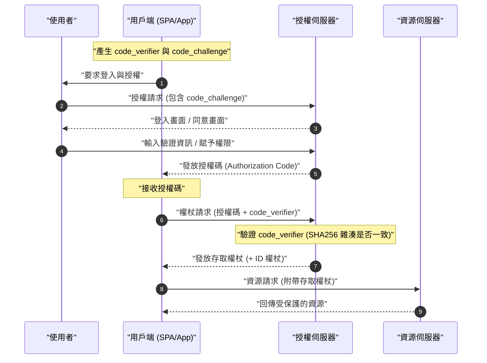

在現代的 Web 應用程式與行動應用程式中，為了兼顧安全性與使用者體驗，不可或缺的技術便是 **OAuth 2.0** 與 **OIDC (OpenID Connect)**。然而，許多開發者常常混淆「驗證 (Authentication)」與「授權 (Authorization)」的差異，導致錯誤實作的案例層出不窮。

本文將從 **OAuth 2.0** 與 **OIDC** 的基本概念開始，針對它們各自的角色、驗證與授權的明確差異、各種授權類型 (Grant Type)，以及伴隨 PKCE 的安全實作手法，進行非常詳細且全面的解說。

---

## 1. 驗證 (Authentication) 與 授權 (Authorization) 的明確差異

首先，讓我們來釐清最重要且最容易被混淆的「驗證」與「授權」的差異。

### 驗證 (Authentication / AuthN)
**驗證** 是指「確認前來存取的使用者是誰（是否為本人）」的過程。
打個比方，這就像是去公司上班時，在櫃台出示「員工證」或「駕照」，以證明「我是這家公司的員工某某某」的行為。

### 授權 (Authorization / AuthZ)
另一方面，**授權** 是指「賦予特定人物（或系統）存取特定資源的權限」的過程。
延續剛剛公司的例子，在完成身分確認（驗證）之後，「因為這個人是一般員工，所以不給予進入機房的權限（鑰匙），但給予進入自己所屬樓層的權限（鑰匙）」，進行這類存取控制的行為就相當於授權。

| 項目 | 驗證 (Authentication) | 授權 (Authorization) |
| --- | --- | --- |
| 目的 | 確認「是誰」 | 決定「能做什麼」 |
| 英文縮寫 | AuthN | AuthZ |
| 代表性協定 | OpenID Connect (OIDC), SAML | OAuth 2.0, XACML |
| 接收的憑證 | ID 權杖 (ID Token，包含使用者資訊) | 存取權杖 (Access Token，包含存取權限) |

我們常常會聽到「利用 OAuth 來實作登入功能」這樣的說法，但嚴格來說，**OAuth 2.0** 是一個用於「授權」的協定，如果單獨用它來進行「驗證（登入）」，便屬於規範外的使用（偽驗證）。為了進行驗證，現代的標準做法是使用基於 OAuth 2.0 擴充而來的 **OIDC**。

---

## 2. 完全理解 OAuth 2.0

### 2.1 什麼是 OAuth 2.0？
**OAuth 2.0** 是一個標準協定（RFC 6749），主要用於在不將使用者的密碼交給第三方應用程式的情況下，賦予該應用程式對使用者資料的有限存取權限（存取權杖）。

### 2.2 OAuth 2.0 的 4 個角色
要理解 OAuth 2.0 的流程，必須掌握以下 4 個角色：

1. **資源擁有者 (Resource Owner)**：資料（資源）的擁有者。通常是指「使用者」。
2. **用戶端 (Client)**：試圖存取使用者資料的應用程式。
3. **授權伺服器 (Authorization Server)**：負責驗證使用者身分、確認存取權限，並發放存取權杖給用戶端的伺服器。
4. **資源伺服器 (Resource Server)**：保存使用者資料，並負責驗證存取權杖以決定是否允許存取的伺服器。

### 2.3 OAuth 2.0 的授權類型 (Grant Type)

OAuth 2.0 根據用戶端的特性，定義了多種「授權類型（取得權杖的流程）」。

#### 1. 授權碼授權 (Authorization Code Grant)
這是最安全且最常被使用的流程。適用於像 Web 應用程式這樣能夠安全保存用戶端機密 (Client Secret)（擁有後端伺服器）的應用程式。

#### 2. 隱含授權 (Implicit Grant)
這是為 SPA (Single Page Application) 等無法安全保存用戶端機密的應用程式所設計的流程。然而，由於存取權杖會暴露在 URL 網址片段 (Fragment) 中，存在安全風險，因此 **目前已被棄用**。即使是 SPA，也應該使用後述的「授權碼授權 ＋ PKCE」。

#### 3. 資源擁有者密碼憑證授權 (Resource Owner Password Credentials Grant)
這是由用戶端直接接收使用者的帳號與密碼，並將其傳送給授權伺服器以取得權杖的流程。僅用於舊有系統轉移等極為受限的用途。基於安全性考量，**目前已被棄用**。

#### 4. 用戶端憑證授權 (Client Credentials Grant)
這是在沒有使用者參與的情況下，用於系統間 (M2M: Machine to Machine) 通訊的流程。用戶端本身會扮演資源擁有者的角色。

### 2.4 深入探討：授權碼流程 ＋ PKCE (Proof Key for Code Exchange)

在 SPA 或行動應用程式中，無法安全地隱藏用戶端機密。因此，為了防止授權碼攔截攻擊 (Authorization Code Interception Attack)，便導入了 **PKCE** (RFC 7636)。

PKCE 的運作機制如下：
用戶端在發起授權請求之前，會先產生一個隨機字串 `code_verifier`，並將其雜湊化以建立 `code_challenge`。

以數學公式表示如下：
$$
\text{code\_challenge} = \text{BASE64URL-ENCODE}( \text{SHA256}( \text{code\_verifier} ) )
$$

#### 伴隨 PKCE 的授權碼流程循序圖



#### PKCE 產生實作範例 (JavaScript / Web Crypto API)

以下是在 JavaScript 環境中產生 PKCE 所需參數的範例程式碼。

```javascript
// 產生隨機字串 (code_verifier)
function generateCodeVerifier() {
    const array = new Uint32Array(56 / 2);
    window.crypto.getRandomValues(array);
    return Array.from(array, dec => ('0' + dec.toString(16)).substr(-2)).join('');
}

// 計算 SHA-256 雜湊，並進行 Base64URL 編碼 (code_challenge)
async function generateCodeChallenge(codeVerifier) {
    const encoder = new TextEncoder();
    const data = encoder.encode(codeVerifier);
    const hashBuffer = await window.crypto.subtle.digest('SHA-256', data);
    const hashArray = Array.from(new Uint8Array(hashBuffer));
    const base64String = btoa(String.fromCharCode.apply(null, hashArray));
    return base64String.replace(/\+/g, '-').replace(/\//g, '_').replace(/=+$/, '');
}

// 執行範例
const codeVerifier = generateCodeVerifier();
generateCodeChallenge(codeVerifier).then(codeChallenge => {
    console.log("Code Verifier:", codeVerifier);
    console.log("Code Challenge:", codeChallenge);
});
```

---

## 3. 完全理解 OIDC (OpenID Connect)

### 3.1 什麼是 OIDC？
**OpenID Connect (OIDC)** 是一個建構在 OAuth 2.0 之上的簡單且強大的身分識別層，專門用於 **驗證 (Authentication)**。OAuth 2.0 負責「賦予存取權限（授權）」，而 OIDC 則負責「確認使用者身分（驗證）」。

透過使用 OIDC，用戶端可以從授權伺服器（在 OIDC 的世界中稱為 OpenID Provider，簡稱 OP）取得包含已驗證使用者身分資訊的 **ID 權杖 (ID Token)**。

### 3.2 ID 權杖與存取權杖的差異
請務必不要混淆 OAuth 2.0 / OIDC 中這兩種權杖的角色。

- **存取權杖 (Access Token)**：用於存取 API（資源伺服器）的「鑰匙」。通常不需要解密其內容，只需將其附加在 API 請求的 Authorization 標頭中使用即可（通常是不透明權杖 / Opaque Token）。
- **ID 權杖 (ID Token)**：記載了使用者驗證結果與屬性資訊（個人資料）的「名片」或「證明書」。必定會以 **JWT (JSON Web Token)** 格式發放，並由用戶端解碼以利用其中的使用者資訊。**絕對不能作為 API 的存取權限來使用。**

### 3.3 JWT (JSON Web Token) 的結構與驗證

ID 權杖是以 JWT 格式來表示。JWT 是由 3 個以 `.` (點) 分隔的 Base64URL 編碼字串所組成。

1. **Header (標頭)**：指示權杖的類型（JWT）與簽章演算法（例如：RS256）。
2. **Payload (內容)**：包含使用者資訊或權杖的中繼資料 (Claims)。
3. **Signature (簽章)**：經過加密的簽章，用於證明權杖未被竄改。

#### Payload 中包含的主要 Claim (宣告)
- `iss` (Issuer)：權杖發行者 (OP 的 URL)
- `sub` (Subject)：使用者的唯一識別碼
- `aud` (Audience)：應接收此權杖的用戶端 (Client ID)
- `exp` (Expiration Time)：權杖的有效期限
- `iat` (Issued At)：權杖的發行時間

#### JWT 的簽章驗證邏輯

接收到 ID 權杖的用戶端，必須驗證其簽章 (Signature)。如果使用的是 [RSA](https://kenji.blog/zh-tw/p/modern-cryptography-public-key-hash-signature/) 演算法（如 RS256），則需要取得 OP 公開的公鑰 (JWKS) 來進行驗證。

產生簽章的數學模型可以用以下公式表示：
$$
\text{Signature} = \text{Sign}_{\text{PrivateKey}}( \text{SHA256}( \text{Base64Url}(\text{Header}) + "." + \text{Base64Url}(\text{Payload}) ) )
$$

驗證時，會使用公鑰進行解密，並確認雜湊值是否一致。

#### ID 權杖 (JWT) 的解碼範例 (Python)

以下是使用 Python 的 `PyJWT` 函式庫來驗證並解碼 ID 權杖的範例。

```python
import jwt
from jwt import PyJWKClient

# 發行者的 JWKS (公鑰集) 端點
jwks_url = "https://example.com/.well-known/jwks.json"
jwk_client = PyJWKClient(jwks_url)

id_token = "eyJhbGciOiJSUzI1NiIs..." # 取得的 ID 權杖
client_id = "your_client_id"
issuer = "https://example.com"

try:
    # 從權杖的標頭中找出使用的金鑰 (kid)，並取得公鑰
    signing_key = jwk_client.get_signing_key_from_jwt(id_token)
    
    # 同時進行簽章驗證，以及 aud (Audience)、iss (Issuer)、exp (有效期限) 的驗證
    decoded_payload = jwt.decode(
        id_token,
        signing_key.key,
        algorithms=["RS256"],
        audience=client_id,
        issuer=issuer
    )
    print("驗證成功。使用者 ID:", decoded_payload["sub"])
    print("使用者名稱:", decoded_payload.get("name"))

except jwt.ExpiredSignatureError:
    print("錯誤: 權杖的有效期限已過。")
except jwt.InvalidTokenError as e:
    print(f"錯誤: 無效的權杖。詳細資訊: {e}")
```

---

## 4. 安全性與最佳實踐

在實作 OAuth 2.0 與 OIDC 時，必須考慮許多安全風險。

### 4.1 使用 State 參數防範 [CSRF](https://kenji.blog/zh-tw/p/web-application-vulnerability-owasp-top-10/)
在授權請求時包含一個無法預測的 `state` 參數，並在回呼 (Callback) 時驗證其是否一致，藉此防止跨站請求偽造 ([CSRF](https://kenji.blog/zh-tw/p/web-application-vulnerability-owasp-top-10/)) 攻擊。

### 4.2 權杖的壽命與計算
為了維持安全性，最佳實踐是將存取權杖的壽命（`exp`）設定得較短（例如：15 分鐘至 1 小時）。如果有效期限過期，則使用更新權杖 (Refresh Token) 來取得新的存取權杖。

判斷權杖是否有效的依據如下列不等式。在此，令現在時間為 $ T_{now} $、權杖發行時間為 $ T_{iat} $、有效期間為 $ D_{lifetime} $。

$$
T_{now} < T_{iat} + D_{lifetime} \quad (\text{或者簡單地表示為 } T_{now} < T_{exp})
$$

### 4.3 選擇 OIDC 的流程
無論是 Web 應用程式還是行動應用程式，目前最推薦的流程都是 **授權碼流程 ＋ PKCE**。由於 Implicit 流程已經不再被視為安全，因此絕對不要在新的開發中使用它。

## 總結

本文深入探討了 **OAuth 2.0** 與 **OIDC** 的差異，以及「授權」與「驗證」這兩個核心概念的不同之處。
- **OAuth 2.0** 是一個「授權（賦予權限）」的框架。
- **OIDC** 是建構其上的「驗證（身分確認）」協定。
- 在現代的應用程式中，使用 **授權碼流程 ＋ PKCE** 是安全性上的業界標準。

正確理解這些規範與機制，並實作適當的流程與驗證邏輯，來實現安全且堅固的身分識別管理吧。
