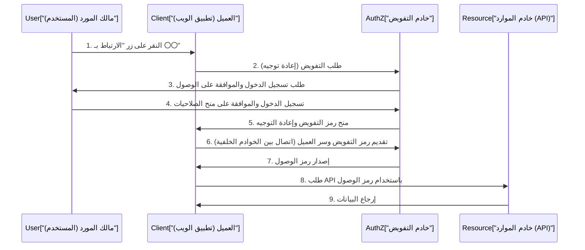
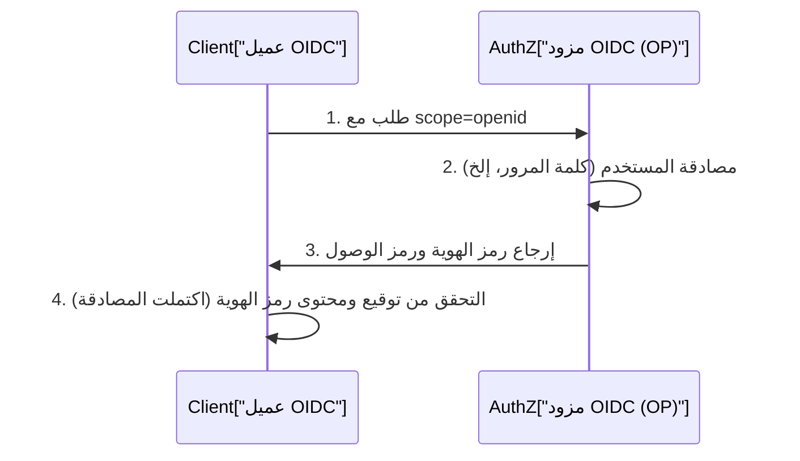

في تطبيقات الويب والهواتف المحمولة الحديثة، أصبحت ميزات تسجيل الدخول الاجتماعي مثل "تسجيل الدخول باستخدام Google" و "تسجيل الدخول باستخدام GitHub" أمراً لا غنى عنه. ومع ذلك، قد يكون عدد المطورين الذين يفهمون بدقة نوع الاتصالات التي تتم خلف الكواليس وكيف يتم ضمان الأمان قليلاً بشكل مفاجئ.

خاصةً الخلط بين الاختلافات بين "المصادقة (Authentication)" و "التفويض (Authorization)" هي حالات لا تنتهي، والتي يمكن أن تؤدي أحياناً إلى حوادث أمنية خطيرة.

في هذه المقالة، سننطلق من الاختلاف الجذري بين المصادقة والتفويض، ثم نتعمق تمامًا في إطار عمل التفويض القياسي "OAuth 2.0"، و "OpenID Connect (OIDC)" الذي يوسع OAuth 2.0 ليضيف وظيفة المصادقة، بالإضافة إلى تقنية الرموز "JWT (JSON Web Token)" المستخدمة فيها.

## 1. الاختلاف الجذري بين "المصادقة" و "التفويض"

في عالم الأمن، تعد "المصادقة (Authentication)" و "التفويض (Authorization)" مفاهيم متشابهة لكنها مختلفة. التمييز الواضح بين هذين الأمرين هو الخطوة الأولى لفهم OAuth 2.0 و OIDC.

### المصادقة (Authentication): "من أنت؟"
المصادقة هي عملية التحقق مما إذا كان المستخدم الذي يحاول الوصول إلى النظام "حقيقياً (كما يدعي)".
- **الهدف**: التحقق من الهوية (Identity Verification)
- **الطريقة**: كلمات المرور، المصادقة البيومترية (بصمة الإصبع، الوجه)، كلمات المرور لمرة واحدة (MFA)، مفاتيح الأمان المادية، إلخ.
- **النتيجة**: يتم التحقق من هوية المستخدم ويتم إنشاء جلسة داخل النظام.

### التفويض (Authorization): "ماذا يمكنك أن تفعل؟"
التفويض هو عملية منح حقوق الوصول إلى موارد معينة لكيان هويته معروفة بالفعل (أو يمتلك صلاحيات معينة).
- **الهدف**: منح الصلاحيات والتحكم في الوصول (Access Control)
- **الطريقة**: قوائم التحكم في الوصول (ACL)، التحكم في الوصول القائم على الأدوار (RBAC)، رموز الوصول في OAuth 2.0، إلخ.
- **النتيجة**: تصبح العمليات المصرح بها فقط (القراءة، الكتابة، الحذف، إلخ) قابلة للتنفيذ.

### مثال الفندق
هذا الاختلاف يصبح واضحاً جداً عند تشبيهه بـ "الفندق".

1. **تسجيل الدخول في مكتب الاستقبال (المصادقة)**:
   تقدم إثبات هويتك (جواز السفر أو رخصة القيادة) في مكتب الاستقبال لتثبت "أنك تارو يامادا الذي قام بالحجز". هذه هي المصادقة.
2. **استلام بطاقة المفتاح ودخول الغرفة (التفويض)**:
   بمجرد التحقق من هويتك، سيعطيك موظف الاستقبال بطاقة مفتاح يمكنها فتح "غرفة 305". عندما تمرر بطاقة المفتاح على باب الغرفة 305 للدخول، فإن آلية قفل الباب لا تهتم "بما إذا كنت تارو يامادا أم لا". إنها تتحقق فقط من "ما إذا كانت هذه البطاقة تمتلك صلاحية فتح الغرفة 305". هذا هو التفويض.

## 2. نظرة متعمقة على OAuth 2.0: إطار عمل للتفويض

### ما هو OAuth 2.0؟
OAuth 2.0 (RFC 6749) هو **بروتوكول تفويض قياسي** لمنح صلاحيات وصول محدودة (رمز الوصول) لتطبيقات الطرف الثالث دون تمرير كلمة مرور المستخدم.

### الأدوار الأربعة في OAuth 2.0
لفهم تدفق OAuth 2.0، يجب عليك استيعاب الأدوار الأربعة التالية:

1. **مالك المورد (Resource Owner)**:
   مالك البيانات (الموارد). عادةً ما يكون إنسانًا (المستخدم).
2. **العميل (Client)**:
   تطبيق الطرف الثالث الذي يريد الوصول إلى بيانات مالك المورد.
3. **خادم التفويض (Authorization Server)**:
   الخادم الذي يصادق مالك المورد ويصدر رمز وصول للعميل بعد الحصول على الموافقة.
4. **خادم الموارد (Resource Server)**:
   خادم API الذي يحتفظ ببيانات مالك المورد ويتحقق من رمز الوصول للسماح أو رفض الوصول إلى البيانات.

### تدفق رمز التفويض (Authorization Code Flow)
يحتوي OAuth 2.0 على عدة أنواع للمنح (طرق منح الصلاحيات)، ولكن الأكثر أمانًا وشيوعًا هو "تدفق رمز التفويض". يُستخدم بشكل أساسي في تطبيقات الويب التي تحتوي على خوادم خلفية (Backend).



النقطة الأهم في هذا التدفق هي **الخطوات 6-7**. لا يتلقى العميل رمز الوصول مباشرة، بل يتلقى "رمز تفويض" مؤقت عبر الواجهة الأمامية. ثم، في بيئة اتصال آمنة للخلفية، يتم إرسال رمز التفويض والمفتاح السري للعميل (Client Secret) إلى خادم التفويض لاستبدالهما برمز وصول. هذا يقلل بشكل كبير من خطر تسرب الرموز عبر سجل المتصفح أو اعتراض الشبكة.

#### امتداد الأمان: PKCE (Proof Key for Code Exchange)
بالنسبة للعملاء العامين الذين لا يمكنهم الحفاظ على Client Secret بشكل آمن مثل التطبيقات الأصلية و SPA (تطبيقات الصفحة الواحدة)، فإن مواصفات التوسيع PKCE (RFC 7636) تعتبر ضرورية. يمنع PKCE هجوم اعتراض رمز التفويض (Authorization Code Interception Attack) عن طريق إرسال قيمة تجزئة تم إنشاؤها ديناميكيًا (code_challenge) عند طلب التفويض، ثم إرسال القيمة الأصلية (code_verifier) عند طلب الرمز. حاليًا، كأفضل ممارسات الأمان، يوصى باستخدام PKCE حتى لتطبيقات الويب.

## 3. مخاطر استخدام OAuth 2.0 لـ "المصادقة"

مع انتشار OAuth 2.0، اعتقد العديد من المطورين أنه "إذا استخدمنا ميزة OAuth لفيسبوك أو جوجل، فلن نحتاج إلى بناء نظام تسجيل الدخول الخاص بنا". بعبارة أخرى، **قاموا بتحويل استخدام OAuth 2.0، وهو بروتوكول تفويض، لأغراض المصادقة (تسجيل الدخول)**. وهذا ما يسمى "المصادقة الزائفة (Pseudo-Authentication)".

### لماذا هو خطير؟
يشير رمز الوصول في OAuth 2.0 فقط إلى "الحق في الوصول إلى مورد معين"، ولا يتضمن أي معلومات حول "متى وأين وكيف تمت مصادقة المستخدم". علاوة على ذلك، على الرغم من أن رمز الوصول مرتبط بالعميل (التطبيق)، إلا أن خادم الموارد قد يسمح بالوصول دون التحقق من "لمن هذا الرمز".

#### هجوم استبدال رمز الوصول (Access Token Substitution Attack)
لنفترض أن مهاجمًا خبيثًا اعترض أو حصل على رمز وصول صالح تم إصداره لتطبيق آخر ضعيف (App A). يستخدم المهاجم هذا الرمز لإرسال طلب إلى واجهة برمجة تطبيقات تسجيل الدخول للتطبيق المستهدف (App B).
إذا كان لدى App B تطبيق سيء يعتبر "إذا كان رمز الوصول صالحًا ويمكن استرداد معلومات المستخدم، فإن تسجيل الدخول ناجح"، يمكن للمهاجم تسجيل الدخول بشكل غير قانوني إلى App B كحساب الضحية.
إذا شبهنا هذا بالفندق، فهو يعادل الخطأ الفادح المتمثل في "الاعتقاد غير المشروط بأن الشخص الذي أحضر مفتاح الغرفة 305 هو تارو يامادا".

## 4. ولادة OpenID Connect (OIDC)

لحل مخاطر استخدام OAuth 2.0 للمصادقة، تم تصميم **بروتوكول قياسي للمصادقة** كتوسيع لـ OAuth 2.0، وهو "OpenID Connect (OIDC)".

### آلية OIDC و "رمز الهوية (ID Token)"
بالإضافة إلى تدفق OAuth 2.0، أدخل OIDC مفهومًا جديدًا يسمى **"رمز الهوية (ID Token)"**.
رمز الهوية هو شهادة موجهة للعميل مليئة بمعلومات تتعلق بمصادقة المستخدم (Identity). وعادة ما يتم تمثيله بتنسيق JWT (JSON Web Token) ويتضمن توقيعًا رقميًا من خادم التفويض.

عندما يرسل العميل طلب تفويض، فإنه يضمّن `openid` في معلمة `scope`.
وبالتالي، يُصدر خادم التفويض رمز هوية مع رمز الوصول.



### لماذا OIDC آمن
يحتوي رمز الهوية على المعلومات (المطالبات - Claims) التالية:
- `iss` (Issuer): من أصدر هذا الرمز
- `sub` (Subject): المعرف الفريد للمستخدم
- `aud` (Audience): لمن (أي عميل) تم إصدار هذا الرمز
- `exp` (Expiration Time): وقت انتهاء صلاحية الرمز
- `iat` (Issued At): وقت إصدار الرمز

من خلال التحقق من `aud` (Audience) لرمز الهوية المستلم، يمكن للعميل التحقق مما إذا كان "هذا الرمز قد تم إصداره بالتأكيد لتطبيقنا". يمنع هذا تمامًا هجوم استبدال رمز الوصول المذكور أعلاه.

## 5. آلية والتحقق من JWT (JSON Web Token)

دعونا نتعمق في هيكل "JWT (تُنطق جوت: RFC 7519)"، المعتمد كرمز الهوية في OIDC.
JWT هو معيار لتمثيل بيانات JSON كسلسلة آمنة لعناوين URL، ويمنع التلاعب من خلال إرفاق توقيع رقمي.

### المكونات الثلاثة لـ JWT
يتكون JWT من ثلاثة أجزاء مفصولة بنقطة (`.`).
`Header.Payload.Signature`

#### 1. Header (الترويسة)
يحدد نوع الرمز (typ) وخوارزمية التوقيع المستخدمة (alg).
```json
{
  "typ": "JWT",
  "alg": "RS256"
}
```
يتم تشفير هذا باستخدام Base64URL.

#### 2. Payload (الحمولة)
يحتوي على البيانات الفعلية (المطالبات).
```json
{
  "iss": "https://accounts.google.com",
  "sub": "1234567890",
  "aud": "your-client-id.apps.googleusercontent.com",
  "iat": 1695800000,
  "exp": 1695803600,
  "name": "Taro Yamada",
  "email": "taro@example.com"
}
```
يتم أيضًا تشفير هذا باستخدام Base64URL. (ملاحظة: هذا ليس تشفيرًا، لذا يجب عدم تضمين معلومات سرية في الحمولة.)

#### 3. Signature (التوقيع)
هذا توقيع محسوب عن طريق دمج السلاسل المشفرة للترويسة والحمولة، باستخدام الخوارزمية المحددة والمفتاح السري (أو زوج المفاتيح العام/السري).
في حالة RS256 (توقيع RSA)، يقوم خادم التفويض بإنشاء توقيع باستخدام المفتاح السري، ويتحقق العميل من التوقيع باستخدام المفتاح العام (والذي يتم الحصول عليه عادة من نقطة نهاية JWKS).

### المخاطر الأمنية عند التحقق من JWT
عند التحقق من JWT بنفسك، يجب أن تحرص على عدم إدخال الثغرات الأمنية التالية:

1. **هجوم `alg: none`**: 
   عند تحديد `none` كـ `alg` في الترويسة، تتخطى بعض المكتبات المطبقة بشكل غير صحيح التحقق من التوقيع، وهي ثغرة أمنية شهيرة. يجب التأكد من تكوين الإعدادات بحيث تحدد بوضوح الخوارزمية المطلوبة للتحقق.
2. **الخلط بين المفتاح العام والمفتاح السري (HMAC/RSA Confusion)**:
   هجوم يغير فيه المهاجم الخوارزمية في الترويسة من RS256 إلى HS256 (تشفير المفتاح المتماثل)، ويستخدم المفتاح العام المخصص للتحقق من التوقيع كمفتاح متماثل لإنشاء رمز مزيف. يمكن منعه عن طريق التقييد الصارم للخوارزميات المسموح بها في المكتبة.
3. **عدم التحقق من الجمهور (`aud`)**:
   كما ذكرنا سابقًا، إذا لم تتحقق من أن الرمز مخصص لتطبيقك، فستسمح بتسجيل الدخول غير المصرح به باستخدام رموز من تطبيقات أخرى.

## الخلاصة: مستقبل المصادقة والتفويض الحديث

تعتبر OAuth 2.0 و OpenID Connect الأساس المطلق للمصادقة والتفويض على الويب اليوم.
- **إذا كنت بحاجة إلى تفويض**: OAuth 2.0
- **إذا كنت بحاجة إلى مصادقة (تسجيل دخول)**: OpenID Connect (OIDC)

إن الاستخدام الصحيح لهذين الاثنين والتحقق الصارم من رموز الهوية يعدان من المتطلبات الأساسية لتطوير التطبيقات الآمنة.

في السنوات الأخيرة، بدأت التقنيات الجديدة مثل "FIDO2 / WebAuthn" (التي تحقق المصادقة بدون كلمات مرور) و "مفاتيح المرور (Passkeys)" (التي تزامن معلومات المصادقة بين الأجهزة) في الانتشار. ومع ذلك، تعمل هذه التقنيات بشكل أساسي على تعزيز "المصادقة بين المستخدم والجهاز"، بينما سيستمر كل من OIDC و OAuth 2.0 في لعب دور مركزي في الأنظمة الخلفية وتكامل الأطراف الثالثة.

من خلال فهم فلسفة التصميم (السبب) وراء التكنولوجيا "لماذا تم تصميمها بهذه المواصفات"، ستتمكن من تصميم أنظمة أكثر قوة وأمانًا.
