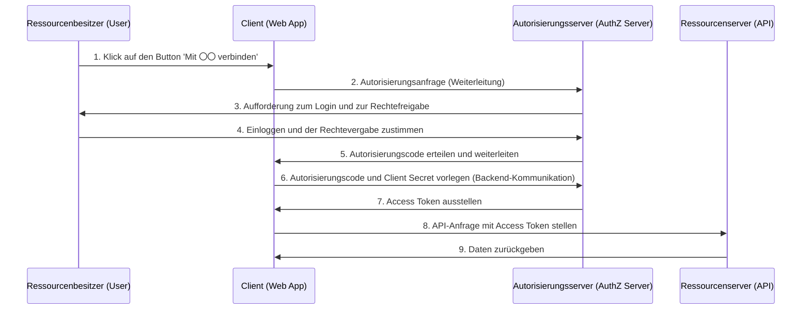
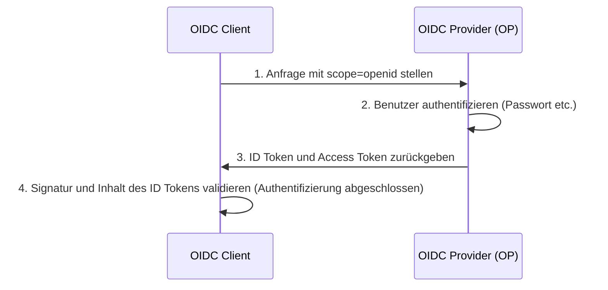

In modernen Web- und mobilen Anwendungen sind Social-Login-Funktionen wie „Mit Google anmelden“ oder „Mit GitHub anmelden“ unverzichtbar geworden. Es gibt jedoch überraschend wenige Entwickler, die genau verstehen, welche Kommunikation hinter den Kulissen stattfindet und wie die Sicherheit gewährleistet wird.

Insbesondere der Unterschied zwischen „Authentifizierung (Authentication)“ und „Autorisierung (Authorization)“ wird immer wieder verwechselt, was oft zu schwerwiegenden Sicherheitsvorfällen führt.

In diesem Artikel werden wir tief in die Materie eintauchen: Wir beginnen mit dem grundlegenden Unterschied zwischen Authentifizierung und Autorisierung, gehen weiter zu „OAuth 2.0“ (dem Standard-Framework für Autorisierung) und „OpenID Connect (OIDC)“ (einer Erweiterung von OAuth 2.0, die Authentifizierungsfunktionen hinzufügt), und enden bei der dort verwendeten Token-Technologie „JWT (JSON Web Token)“.

## 1. Der grundlegende Unterschied zwischen „Authentifizierung“ und „Autorisierung“

In der Welt der Sicherheit sind „Authentifizierung (Authentication)“ und „Autorisierung (Authorization)“ zwei ähnliche, aber völlig unterschiedliche Konzepte. Eine klare Unterscheidung zwischen diesen beiden ist der erste Schritt zum Verständnis von OAuth 2.0 und OIDC.

### Authentifizierung (Authentication): „Wer bist du?“
Authentifizierung ist der Prozess, bei dem überprüft wird, ob ein Benutzer, der auf ein System zugreifen möchte, „echt“ ist (also die Person, die er vorgibt zu sein).
- **Zweck**: Identitätsprüfung (Identity Verification)
- **Methoden**: Passwörter, biometrische Authentifizierung (Fingerabdruck, Gesicht), Einmalpasswörter (MFA), physische Sicherheitsschlüssel usw.
- **Ergebnis**: Die Identität des Benutzers wird bestätigt und eine Sitzung (Session) im System wird aufgebaut.

### Autorisierung (Authorization): „Was darfst du tun?“
Autorisierung ist der Prozess, bei dem einer bereits identifizierten (oder mit bestimmten Privilegien ausgestatteten) Entität das Recht gewährt wird, auf bestimmte Ressourcen zuzugreifen.
- **Zweck**: Rechtevergabe und Zugriffskontrolle (Access Control)
- **Methoden**: Access Control Lists (ACL), rollenbasierte Zugriffskontrolle (RBAC), Access Tokens in OAuth 2.0 usw.
- **Ergebnis**: Nur erlaubte Operationen (Lesen, Schreiben, Löschen usw.) können ausgeführt werden.

### Das Hotel-Beispiel
Dieser Unterschied lässt sich sehr gut am Beispiel eines „Hotels“ erklären.

1. **Check-in an der Rezeption (Authentifizierung)**:
   Sie legen an der Rezeption Ihren Ausweis (Reisepass oder Führerschein) vor, um zu beweisen, dass Sie „der gebuchte Taro Yamada“ sind. Das ist die Authentifizierung.
2. **Empfang der Zimmerkarte und Betreten des Zimmers (Autorisierung)**:
   Nachdem Ihre Identität bestätigt wurde, übergibt Ihnen der Rezeptionist eine Zimmerkarte, die das „Zimmer 305“ öffnet. Wenn Sie die Karte vor das Schloss von Zimmer 305 halten, um einzutreten, interessiert es den Schließmechanismus nicht, ob Sie „Taro Yamada“ sind. Er prüft lediglich: „Hat diese Karte die Berechtigung, Zimmer 305 zu öffnen?“. Das ist Autorisierung.

## 2. Deep Dive in OAuth 2.0: Ein Framework für Autorisierung

### Was ist OAuth 2.0?
OAuth 2.0 (RFC 6749) ist ein **Standardprotokoll für „Autorisierung“**, das es Drittanbieter-Anwendungen ermöglicht, begrenzte Zugriffsrechte (Access Tokens) zu erhalten, ohne dass das Passwort des Benutzers an diese weitergegeben wird.

### Die 4 Rollen (Akteure) in OAuth 2.0
Um den Ablauf von OAuth 2.0 zu verstehen, müssen Sie die folgenden 4 Rollen kennen:

1. **Ressourcenbesitzer (Resource Owner)**:
   Der Besitzer der Daten (Ressourcen). Normalerweise ein Mensch (Benutzer).
2. **Client (Client)**:
   Die Drittanbieter-Anwendung, die auf die Daten des Ressourcenbesitzers zugreifen möchte.
3. **Autorisierungsserver (Authorization Server)**:
   Der Server, der den Ressourcenbesitzer authentifiziert und nach dessen Zustimmung dem Client ein Access Token ausstellt.
4. **Ressourcenserver (Resource Server)**:
   Der API-Server, der die Daten des Ressourcenbesitzers speichert und Zugriffe auf diese Daten auf Basis von Access Tokens erlaubt oder verweigert.

### Autorisierungscode-Ablauf (Authorization Code Flow)
Es gibt in OAuth 2.0 verschiedene Grant-Typen (Methoden zur Rechtevergabe), aber der sicherste und gängigste ist der „Authorization Code Flow“. Dieser wird hauptsächlich in Webanwendungen mit einem Backend-Server verwendet.



Der wichtigste Aspekt dieses Ablaufs sind die **Schritte 6 und 7**. Der Client erhält das Access Token nicht direkt über das Frontend, sondern bekommt lediglich einen temporären „Autorisierungscode“. Im Backend, einer sicheren Kommunikationsumgebung, sendet der Client diesen Code zusammen mit seinem geheimen Schlüssel (Client Secret) an den Autorisierungsserver, um ihn gegen das Access Token einzutauschen. Dies minimiert das Risiko erheblich, dass das Token durch den Browserverlauf oder durch das Abhören von Netzwerken kompromittiert wird.

#### Sicherheitserweiterung: PKCE (Proof Key for Code Exchange)
Für öffentliche Clients, wie native Apps oder SPAs (Single Page Applications), die das Client Secret nicht sicher aufbewahren können, ist die Erweiterungsspezifikation PKCE (RFC 7636) zwingend erforderlich. PKCE verhindert das Abfangen des Autorisierungscodes (Authorization Code Interception Attack), indem bei der Autorisierungsanfrage ein dynamisch generierter Hash-Wert (`code_challenge`) gesendet und bei der Token-Anfrage der ursprüngliche Wert (`code_verifier`) übergeben wird. Heutzutage wird als Best Practice der Sicherheit empfohlen, PKCE auch bei Webanwendungen zu verwenden.

## 3. Die Gefahr, OAuth 2.0 zur „Authentifizierung“ zu nutzen

Als OAuth 2.0 immer beliebter wurde, dachten viele Entwickler: „Wenn wir die OAuth-Funktionen von Facebook oder Google nutzen, müssen wir kein eigenes Login-System bauen.“ Sie haben also **OAuth 2.0, ein Autorisierungsprotokoll, zweckentfremdet und für die Authentifizierung (Login) verwendet**. Dies wird als „Pseudo-Authentifizierung (Pseudo-Authentication)“ bezeichnet.

### Warum ist das gefährlich?
Ein OAuth 2.0 Access Token stellt lediglich das „Recht, auf eine bestimmte Ressource zuzugreifen“ dar. Es enthält absolut keine Informationen darüber, „wann, wo und wie der Benutzer authentifiziert wurde“. Zudem ist das Access Token an den Client (die App) gebunden, aber manchmal gewährt der Ressourcenserver den Zugriff, ohne zu überprüfen, „für wen“ das Token ausgestellt wurde.

#### Access Token Substitution Attack (Angriff durch Austausch des Access Tokens)
Nehmen wir an, ein böswilliger Angreifer fängt ein gültiges Access Token ab, das für eine andere, anfällige App (App A) ausgestellt wurde. Der Angreifer verwendet dieses Token dann, um eine Anfrage an die Login-API der Ziel-App (App B) zu senden.
Wenn App B schlampig implementiert ist – nach dem Motto „Wenn das Access Token gültig ist und Benutzerinformationen abgerufen werden können, werten wir den Login als erfolgreich“ – kann sich der Angreifer erfolgreich mit dem Konto des Opfers bei App B anmelden.
Um auf das Hotelbeispiel zurückzukommen: Das wäre ein fataler Fehler, der gleichbedeutend damit ist, dass man „jeden, der einen Schlüssel für Zimmer 305 mitbringt, bedingungslos für Taro Yamada hält“.

## 4. Die Geburt von OpenID Connect (OIDC)

Um das Risiko der Zweckentfremdung von OAuth 2.0 zur Authentifizierung zu beseitigen, wurde OAuth 2.0 erweitert, um ein **Standardprotokoll für Authentifizierung** zu schaffen: „OpenID Connect (OIDC)“.

### Wie OIDC funktioniert und das „ID Token“
OIDC führt zusätzlich zum OAuth 2.0-Ablauf ein neues Konzept ein: das **„ID Token (ID Token)“**.
Ein ID Token ist ein Zertifikat für den Client, das Informationen (Identity) über die Authentifizierung des Benutzers enthält. Es wird normalerweise im JWT-Format (JSON Web Token) dargestellt und enthält eine digitale Signatur des Autorisierungsservers.

Wenn der Client eine Autorisierungsanfrage sendet, fügt er `openid` in den `scope`-Parameter ein.
Dadurch stellt der Autorisierungsserver zusammen mit dem Access Token auch ein ID Token aus.



### Warum OIDC sicher ist
Ein ID Token enthält unter anderem die folgenden Informationen (Claims):
- `iss` (Issuer): Wer hat dieses Token ausgestellt?
- `sub` (Subject): Eindeutiger Identifikator des Benutzers
- `aud` (Audience): Für wen (welchen Client) wurde dieses Token ausgestellt?
- `exp` (Expiration Time): Ablaufdatum des Tokens
- `iat` (Issued At): Ausstellungszeitpunkt des Tokens

Indem der Client das `aud` (Audience) des empfangenen ID Tokens überprüft, kann er verifizieren: „Ist dieses Token definitiv für meine App ausgestellt worden?“. Dadurch lässt sich der zuvor erwähnte Access Token Substitution Attack vollständig verhindern.

## 5. Aufbau und Validierung von JWT (JSON Web Token)

Lassen Sie uns einen genaueren Blick auf die Struktur von „JWT (RFC 7519)“ werfen, das als ID Token in OIDC verwendet wird.
JWT ist ein Standard, der JSON-Daten als URL-sicheren String darstellt und durch das Hinzufügen einer digitalen Signatur Manipulationen verhindert.

### Die 3 Bestandteile eines JWT
Ein JWT besteht aus drei Teilen, die durch einen Punkt (`.`) voneinander getrennt sind:
`Header.Payload.Signature`

#### 1. Header (Kopfzeile)
Gibt den Typ des Tokens (`typ`) und den verwendeten Signaturalgorithmus (`alg`) an.
```json
{
  "typ": "JWT",
  "alg": "RS256"
}
```
Dieser Teil wird Base64URL-kodiert.

#### 2. Payload (Nutzdaten)
Enthält die tatsächlichen Daten (Claims).
```json
{
  "iss": "https://accounts.google.com",
  "sub": "1234567890",
  "aud": "your-client-id.apps.googleusercontent.com",
  "iat": 1695800000,
  "exp": 1695803600,
  "name": "Taro Yamada",
  "email": "taro@example.com"
}
```
Auch dieser Teil wird Base64URL-kodiert. (*Hinweis: Da die Daten nicht verschlüsselt sind, dürfen keine sensiblen Informationen im Payload enthalten sein.*)

#### 3. Signature (Signatur)
Dies ist eine Signatur, die berechnet wird, indem der kodierte Header und Payload kombiniert und mit dem angegebenen Algorithmus sowie dem geheimen Schlüssel (oder einem Schlüsselpaar aus privatem und öffentlichem Schlüssel) verarbeitet werden.
Im Fall von RS256 (RSA-Signatur) erstellt der Autorisierungsserver die Signatur mit einem privaten Schlüssel, und der Client validiert diese mit dem öffentlichen Schlüssel (der in der Regel von einem JWKS-Endpunkt abgerufen wird).

### Sicherheitsfallen bei der JWT-Validierung
Wenn Sie JWTs selbst validieren, müssen Sie darauf achten, dass Sie keine Schwachstellen wie die folgenden einbauen:

1. **`alg: none` Angriff**: 
   Eine bekannte Schwachstelle, bei der unzureichend implementierte Bibliotheken die Signaturüberprüfung überspringen, wenn im Header als `alg` `none` angegeben ist. Sie müssen das System so konfigurieren, dass der Algorithmus bei der Validierung immer explizit vorgegeben ist.
2. **Verwechslung von öffentlichem und privatem Schlüssel (HMAC/RSA Confusion)**:
   Ein Angriff, bei dem der Angreifer den Algorithmus im Header von RS256 auf HS256 (symmetrische Verschlüsselung) ändert und den öffentlichen Schlüssel zur Signaturvalidierung als gemeinsamen Schlüssel (Shared Key) missbraucht, um gefälschte Tokens zu erstellen. Dies lässt sich verhindern, indem die erlaubten Algorithmen in der Bibliothek streng limitiert werden.
3. **Fehlende Überprüfung der Audience (`aud`)**:
   Wie bereits erwähnt: Wenn Sie nicht überprüfen, ob das Token für Ihre eigene App bestimmt ist, ermöglichen Sie unbefugte Anmeldungen mit Tokens anderer Apps.

## Fazit: Die Zukunft der modernen Authentifizierung und Autorisierung

OAuth 2.0 und OpenID Connect bilden das absolute Fundament für Authentifizierung und Autorisierung im heutigen Web.
- **Wenn Autorisierung benötigt wird**: OAuth 2.0
- **Wenn Authentifizierung (Login) benötigt wird**: OpenID Connect (OIDC)

Die korrekte Unterscheidung und Anwendung dieser beiden sowie die strikte Validierung von ID Tokens sind zwingende Voraussetzungen für die Entwicklung sicherer Anwendungen.

In den letzten Jahren gewinnen neue Technologien wie „FIDO2 / WebAuthn“, die passwortlose Authentifizierung ermöglichen, und „Passkeys“, die Authentifizierungsinformationen zwischen Geräten synchronisieren, zunehmend an Bedeutung. Diese Technologien stärken jedoch primär die „Authentifizierung zwischen Benutzer und Gerät“. Für Backend-Systeme und Integrationen mit Drittanbietern werden OIDC und OAuth 2.0 weiterhin eine zentrale Rolle spielen.

Indem Sie die Designphilosophie (das „Warum“) hinter diesen Spezifikationen verstehen, werden Sie in der Lage sein, robustere und sicherere Systeme zu entwerfen.
