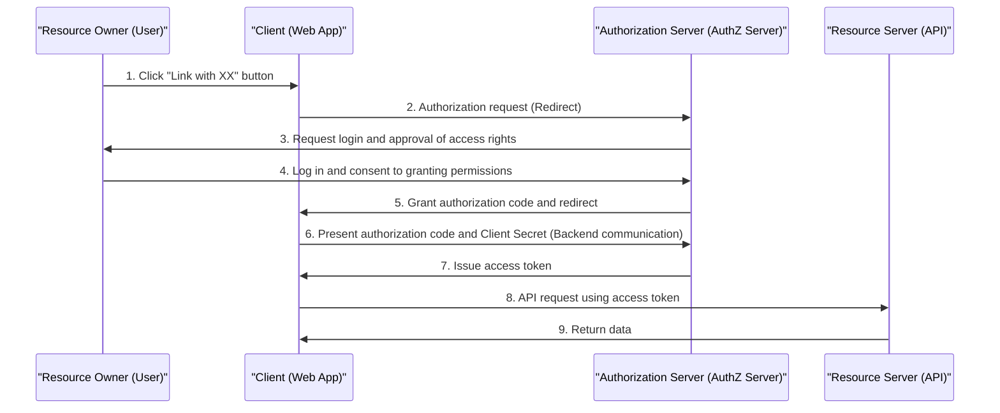
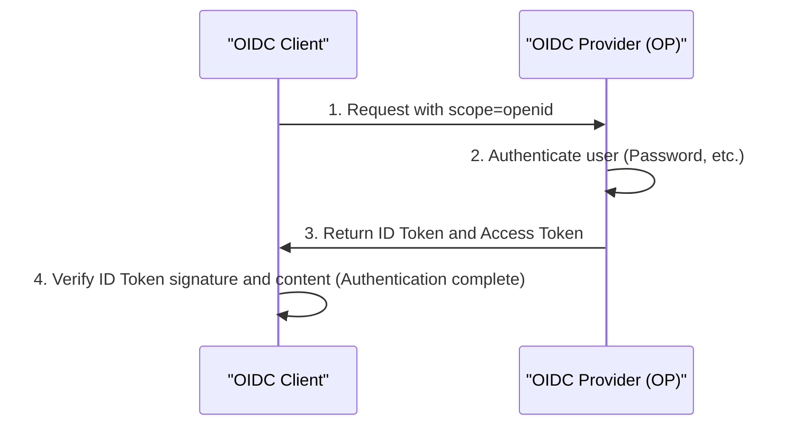

In modern web and mobile applications, social login features like "Login with Google" or "Login with GitHub" have become indispensable. However, surprisingly few developers accurately understand the communications happening behind the scenes and how their security is guaranteed.

Particularly, the cases of confusing the differences between "Authentication" and "Authorization" are endless, and this can sometimes lead to serious security incidents.

In this article, starting from the fundamental difference between authentication and authorization, we will dive deep and explain the standard framework for authorization, "OAuth 2.0", its extension that adds authentication features, "OpenID Connect (OIDC)", and the token technology used within them, "JWT (JSON Web Token)".

## 1. The Fundamental Difference Between "Authentication" and "Authorization"

In the world of security, "Authentication" and "Authorization" are similar but different concepts. Clearly distinguishing these two is the first step to understanding OAuth 2.0 and OIDC.

### Authentication: "Who are you?"
Authentication is the process of verifying whether the user attempting to access the system is "genuine (the person they claim to be)".
- **Purpose**: Identity Verification
- **Methods**: Passwords, Biometrics (fingerprint, face), One-Time Passwords (MFA), physical security keys, etc.
- **Result**: The user's identity is verified, and a session is established within the system.

### Authorization: "What can you do?"
Authorization is the process of granting specific resource access privileges to an entity whose identity is already known (or who possesses specific permissions).
- **Purpose**: Granting permissions and Access Control
- **Methods**: Access Control Lists (ACL), Role-Based Access Control (RBAC), Access tokens in OAuth 2.0, etc.
- **Result**: Only permitted operations (read, write, delete, etc.) become executable.

### The Hotel Analogy
This difference is very easy to understand when compared to a "hotel".

1. **Checking in at the front desk (Authentication)**:
   You present your ID (passport or driver's license) at the front desk and prove that "you are Taro Yamada who made the reservation". This is authentication.
2. **Receiving a card key and entering the room (Authorization)**:
   Once your identity is verified, the front desk staff hands you a card key that can open "Room 305". When you hold the card key over the door of Room 305 to enter, the door's locking mechanism doesn't care "whether you are Taro Yamada". It merely checks "does this card key have the authority to open Room 305". This is authorization.

## 2. OAuth 2.0 Deep Dive: A Framework for Authorization

### What is OAuth 2.0?
OAuth 2.0 (RFC 6749) is a **standard protocol for "authorization"** that grants third-party applications limited access privileges (access tokens) without handing over the user's password.

### The 4 Roles (Characters) in OAuth 2.0
To understand the OAuth 2.0 flow, it's necessary to grasp the following 4 roles.

1. **Resource Owner**:
   The owner of the data (resource). Usually a human (user).
2. **Client**:
   A third-party application that wants to access the resource owner's data.
3. **Authorization Server**:
   A server that authenticates the resource owner and, after obtaining consent, issues an access token to the client.
4. **Resource Server**:
   An API server that holds the resource owner's data, verifies the access token, and permits or denies access to the data.

### Authorization Code Flow
There are several grant types (methods of granting permissions) in OAuth 2.0, but the safest and most common is the "Authorization Code Flow". It is primarily used in web applications that have a backend server.



The biggest point of this flow is **steps 6-7**. The client does not receive the access token directly, but receives a temporary "authorization code" via the frontend. Then, in a secure communication environment in the backend, it sends the authorization code and the client's secret key (Client Secret) to the authorization server to exchange them for an access token. This minimizes the risk of the token leaking through browser history or network interception.

#### Security Extension: PKCE (Proof Key for Code Exchange)
For public clients that cannot securely store a Client Secret, such as native apps and SPAs (Single Page Applications), the PKCE (RFC 7636) extension specification is mandatory. PKCE prevents the Authorization Code Interception Attack by sending a dynamically generated hash value (code_challenge) during the authorization request and sending the original value (code_verifier) during the token request. Nowadays, using PKCE is recommended as a security best practice even for web applications.

## 3. The Danger of Using OAuth 2.0 for "Authentication"

As OAuth 2.0 became widespread, many developers thought, "If we use Facebook's or Google's OAuth features, we won't need to build our own login system." In other words, they **repurposed OAuth 2.0, which is an authorization protocol, for authentication (login)**. This is called "Pseudo-Authentication".

### Why is it dangerous?
An OAuth 2.0 access token only indicates the "right to access a specific resource" and contains absolutely no information about "when, where, and how the user was authenticated". Additionally, the access token is tied to the client (app), but the resource server might permit access without verifying "who the token is for".

#### Access Token Substitution Attack
Suppose a malicious attacker intercepts or obtains a legitimate access token issued for another vulnerable app (App A). The attacker uses that token to send a request to the login API of the target app (App B).
If App B had a sloppy implementation like "if the access token is valid and user info can be retrieved, treat it as a successful login", the attacker could illegitimately log into App B as the victim's account.
In the hotel analogy, this corresponds to a fatal mistake where "anyone who brings the key to Room 305 is unconditionally believed to be Taro Yamada".

## 4. The Birth of OpenID Connect (OIDC)

To solve the risks of repurposing OAuth 2.0 for authentication, OpenID Connect (OIDC) was designed as a **standard protocol for authentication** by extending OAuth 2.0.

### How OIDC Works and the "ID Token"
In addition to the OAuth 2.0 flow, OIDC introduced a new concept called the **"ID Token"**.
An ID Token is a certificate for the client packed with information about the user's authentication (Identity). It is typically expressed in the JWT (JSON Web Token) format and bears the digital signature of the authorization server.

When sending an authorization request, the client includes `openid` in the `scope` parameter.
As a result, the authorization server issues an ID Token alongside the access token.



### Why OIDC is Secure
An ID Token contains the following information (claims):
- `iss` (Issuer): Who issued this token
- `sub` (Subject): A unique identifier for the user
- `aud` (Audience): Who (which client) this token was issued for
- `exp` (Expiration Time): Token expiration time
- `iat` (Issued At): Token issuance date and time

By checking the `aud` (Audience) of the received ID Token, the client can verify "whether this token was definitely issued for its own app". This completely prevents the aforementioned access token substitution attack.

## 5. Mechanism and Verification of JWT (JSON Web Token)

Let's dive deep into the structure of "JWT (RFC 7519)", which is adopted as the ID Token in OIDC.
JWT is a standard that represents JSON data as a URL-safe string and prevents tampering by attaching a digital signature.

### The 3 Components of JWT
A JWT is composed of three parts separated by dots (`.`).
`Header.Payload.Signature`

#### 1. Header
Specifies the type of the token (typ) and the signing algorithm used (alg).
```json
{
  "typ": "JWT",
  "alg": "RS256"
}
```
This is Base64URL encoded.

#### 2. Payload
Contains the actual data (claims).
```json
{
  "iss": "https://accounts.google.com",
  "sub": "1234567890",
  "aud": "your-client-id.apps.googleusercontent.com",
  "iat": 1695800000,
  "exp": 1695803600,
  "name": "Taro Yamada",
  "email": "taro@example.com"
}
```
This is also Base64URL encoded. (*Because it is not encrypted, sensitive information must not be included in the payload.)

#### 3. Signature
This is a signature calculated by concatenating the encoded strings of the Header and Payload, using the specified algorithm and a private key (or a private/public key pair).
In the case of RS256 (RSA signature), the authorization server creates the signature with a private key, and the client verifies the signature using a public key (usually obtained from the JWKS endpoint).

### Security Pitfalls When Verifying JWTs
When verifying JWTs yourself, you must be careful not to introduce vulnerabilities like the following.

1. **`alg: none` Attack**: 
   A famous vulnerability where some improperly implemented libraries skip signature verification if `none` is specified in the header's `alg`. You must always explicitly specify the algorithm to be verified.
2. **Public and Private Key Confusion (HMAC/RSA Confusion)**:
   An attack where the attacker changes the header's algorithm from RS256 to HS256 (symmetric key cryptography) and uses the public key for signature verification as a symmetric key to forge tokens. This can be prevented by strictly restricting the allowed algorithms on the library side.
3. **Unverified Audience (`aud`)**:
   As mentioned earlier, failing to confirm that the token is intended for your own app allows unauthorized logins using tokens meant for other apps.

## Conclusion: The Future of Modern Authentication and Authorization

OAuth 2.0 and OpenID Connect are the absolute foundations of authentication and authorization on the web today.
- **If authorization is needed**: OAuth 2.0
- **If authentication (login) is needed**: OpenID Connect (OIDC)

Properly distinguishing between these two and strictly verifying ID Tokens are essential prerequisites for secure application development.

In recent years, new technologies like "FIDO2 / WebAuthn" for realizing passwordless logins and "Passkeys" for synchronizing authentication info across devices are becoming widespread. However, these technologies mainly strengthen "authentication between users and devices", while OIDC and OAuth 2.0 will likely continue to play a central role in linkage between backend systems and third parties.

By understanding the design philosophy (the "Why") behind the technology, you will be able to design more robust and secure systems.
