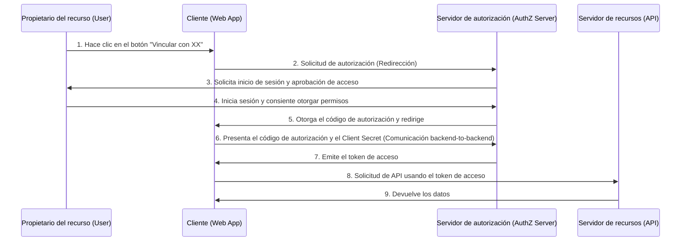
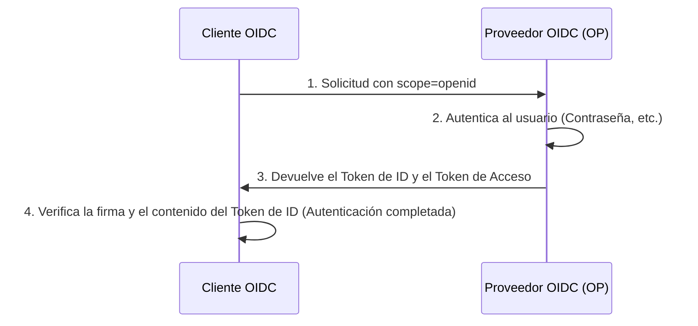

En las aplicaciones web y móviles modernas, las funciones de inicio de sesión social como "Iniciar sesión con Google" o "Iniciar sesión con GitHub" se han vuelto indispensables. Sin embargo, puede haber sorprendentemente pocos desarrolladores que entiendan con precisión qué tipo de comunicación ocurre detrás de escena y cómo se garantiza la seguridad.

En particular, hay un sinfín de casos donde se confunden las diferencias entre "Autenticación" (Authentication) y "Autorización" (Authorization), y esto a menudo lleva al desarrollo de incidentes de seguridad graves.

En este artículo, comenzaremos con la diferencia fundamental entre autenticación y autorización, y profundizaremos exhaustivamente en "OAuth 2.0", el marco de trabajo estándar para la autorización, así como "OpenID Connect (OIDC)", que extiende OAuth 2.0 para agregar funcionalidad de autenticación, y finalmente la tecnología de tokens utilizada allí: "JWT (JSON Web Token)".

## 1. La diferencia fundamental entre "Autenticación" y "Autorización"

En el mundo de la seguridad, la "Autenticación" (Authentication) y la "Autorización" (Authorization) son conceptos similares pero distintos. Distinguir claramente entre estos dos es el primer paso para entender OAuth 2.0 y OIDC.

### Autenticación (Authentication): "¿Quién eres?"
La autenticación es el proceso de confirmar si el usuario que intenta acceder al sistema es "auténtico" (la persona que dice ser).
- **Propósito**: Verificación de identidad (Identity Verification).
- **Métodos**: Contraseñas, biometría (huella dactilar, rostro), contraseñas de un solo uso (MFA), claves de seguridad físicas, etc.
- **Resultado**: Se verifica la identidad del usuario y se establece una sesión dentro del sistema.

### Autorización (Authorization): "¿Qué puedes hacer?"
La autorización es el proceso de otorgar derechos de acceso a un recurso específico a un sujeto cuya identidad ya se conoce (o que tiene ciertos privilegios).
- **Propósito**: Otorgamiento de permisos y control de acceso (Access Control).
- **Métodos**: Listas de control de acceso (ACL), control de acceso basado en roles (RBAC), tokens de acceso en OAuth 2.0, etc.
- **Resultado**: Solo se pueden ejecutar las operaciones permitidas (lectura, escritura, eliminación, etc.).

### La metáfora del hotel
Esta diferencia es muy fácil de entender si la comparamos con un "hotel".

1. **Check-in en la recepción (Autenticación)**:
   Presentas una identificación (pasaporte o licencia de conducir) en la recepción para demostrar que eres "Taro Yamada, quien hizo la reserva". Esto es autenticación.
2. **Recibir la tarjeta llave y entrar a la habitación (Autorización)**:
   Una vez verificada la identidad, el personal de recepción te entrega una tarjeta llave que puede abrir la "Habitación 305". Cuando acercas la tarjeta llave a la puerta de la Habitación 305 para entrar, al mecanismo de cierre de la puerta no le importa "si eres Taro Yamada". Simplemente comprueba "¿Tiene esta tarjeta llave permiso para abrir la Habitación 305?". Esto es autorización.

## 2. Profundizando en OAuth 2.0: Un marco de trabajo para la Autorización

### ¿Qué es OAuth 2.0?
OAuth 2.0 (RFC 6749) es un **protocolo estándar de "autorización"** para otorgar derechos de acceso limitados (tokens de acceso) a aplicaciones de terceros sin entregarles la contraseña del usuario.

### Los 4 roles de OAuth 2.0
Para entender el flujo de OAuth 2.0, es necesario comprender los siguientes cuatro roles:

1. **Propietario del recurso (Resource Owner)**:
   El propietario de los datos (recursos). Generalmente es un humano (usuario).
2. **Cliente (Client)**:
   La aplicación de terceros que desea acceder a los datos del propietario del recurso.
3. **Servidor de autorización (Authorization Server)**:
   El servidor que autentica al propietario del recurso y, tras obtener su consentimiento, emite un token de acceso al cliente.
4. **Servidor de recursos (Resource Server)**:
   El servidor de API que contiene los datos del propietario del recurso y que verifica el token de acceso para permitir o denegar el acceso a los datos.

### Flujo del código de autorización (Authorization Code Flow)
OAuth 2.0 tiene varios tipos de concesión (formas de otorgar permisos), pero el más seguro y común es el "Flujo del código de autorización". Se usa principalmente en aplicaciones web con servidores backend.



El punto más importante de este flujo son los **pasos 6 y 7**. El cliente no recibe el token de acceso directamente, sino que recibe un "código de autorización" temporal a través del frontend. Luego, en el entorno de comunicación seguro del backend, envía el código de autorización y la clave secreta del cliente (Client Secret) al servidor de autorización, y los intercambia por un token de acceso. Esto reduce al mínimo el riesgo de que el token se filtre a través del historial del navegador o de la interceptación de la red.

#### Extensión de seguridad: PKCE (Proof Key for Code Exchange)
Para clientes públicos que no pueden mantener seguro el Client Secret, como las aplicaciones nativas y SPA (Single Page Applications), es obligatoria una especificación de extensión llamada PKCE (RFC 7636). PKCE previene el ataque de interceptación del código de autorización (Authorization Code Interception Attack) enviando un valor hash generado dinámicamente (code_challenge) durante la solicitud de autorización, y enviando su valor original (code_verifier) durante la solicitud del token. Hoy en día, como mejor práctica de seguridad, se recomienda utilizar PKCE incluso para aplicaciones web.

## 3. El peligro de usar OAuth 2.0 para la "Autenticación"

A medida que OAuth 2.0 comenzó a popularizarse, muchos desarrolladores pensaron: "Si usamos la funcionalidad OAuth de Facebook o Google, no tendremos que construir nuestro propio sistema de inicio de sesión". En otras palabras, **desviaron OAuth 2.0, un protocolo de autorización, para la autenticación (inicio de sesión)**. A esto se le llama "Pseudo-Autenticación" (Pseudo-Authentication).

### ¿Por qué es peligroso?
Un token de acceso de OAuth 2.0 solo indica "el derecho a acceder a un recurso específico", y no contiene ninguna información sobre "cuándo, dónde y cómo se autenticó el usuario". Además, aunque el token de acceso está vinculado a un cliente (aplicación), el servidor de recursos a veces permite el acceso sin verificar "para quién es el token".

#### Ataque de sustitución del token de acceso (Access Token Substitution Attack)
Supongamos que un atacante malintencionado intercepta u obtiene un token de acceso legítimo emitido para otra aplicación vulnerable (App A). El atacante usa ese token para enviar una solicitud a la API de inicio de sesión de la aplicación objetivo (App B).
Si la App B tiene una implementación deficiente que asume que "si el token de acceso es válido y se puede obtener información del usuario, el inicio de sesión es exitoso", el atacante puede iniciar sesión de forma fraudulenta en la App B como la cuenta de la víctima.
Volviendo al ejemplo del hotel, esto equivaldría al error fatal de "creer incondicionalmente que cualquier persona que traiga la llave de la Habitación 305 es Taro Yamada".

## 4. El nacimiento de OpenID Connect (OIDC)

Para resolver los riesgos de usar OAuth 2.0 para la autenticación, se diseñó **un protocolo estándar para la autenticación** que extiende OAuth 2.0: "OpenID Connect (OIDC)".

### Cómo funciona OIDC y el "Token de ID"
OIDC introdujo un nuevo concepto llamado **"Token de ID (ID Token)"**, además del flujo de OAuth 2.0.
El token de ID es un certificado para el cliente que contiene información (Identidad) sobre la autenticación del usuario. Generalmente se representa en un formato llamado JWT (JSON Web Token) y está provisto de la firma digital del servidor de autorización.

Cuando el cliente envía una solicitud de autorización, incluye `openid` en el parámetro `scope`.
Como resultado, el servidor de autorización emite un token de ID junto con un token de acceso.



### Por qué OIDC es seguro
El Token de ID contiene la siguiente información (claims):
- `iss` (Issuer): Quién emitió este token.
- `sub` (Subject): El identificador único del usuario.
- `aud` (Audience): Para quién (qué cliente) se emitió este token.
- `exp` (Expiration Time): La fecha y hora de vencimiento del token.
- `iat` (Issued At): La fecha y hora de emisión del token.

Al comprobar el `aud` (Audience) del token de ID recibido, el cliente puede verificar "si este token fue definitivamente emitido para su propia aplicación". Esto previene por completo el ataque de sustitución del token de acceso mencionado anteriormente.

## 5. Mecanismo y validación de JWT (JSON Web Token)

Profundicemos en la estructura de "JWT (RFC 7519)", que se ha adoptado como el token de ID para OIDC.
JWT es un estándar que representa datos JSON como una cadena segura para URL y previene la manipulación al adjuntar una firma digital.

### Los 3 componentes de JWT
Un JWT consta de 3 partes separadas por puntos (`.`).
`Header.Payload.Signature`

#### 1. Header (Encabezado)
Especifica el tipo de token (typ) y el algoritmo de firma utilizado (alg).
```json
{
  "typ": "JWT",
  "alg": "RS256"
}
```
Esto está codificado en Base64URL.

#### 2. Payload (Carga útil)
Contiene los datos reales (claims).
```json
{
  "iss": "https://accounts.google.com",
  "sub": "1234567890",
  "aud": "your-client-id.apps.googleusercontent.com",
  "iat": 1695800000,
  "exp": 1695803600,
  "name": "Taro Yamada",
  "email": "taro@example.com"
}
```
Esto también está codificado en Base64URL. (*Como no está cifrado, no debe incluir información confidencial en el payload.*)

#### 3. Signature (Firma)
Es una firma calculada combinando las cadenas codificadas del Header y el Payload, utilizando el algoritmo especificado y una clave secreta (o un par de clave pública/privada).
En el caso de RS256 (Firma RSA), el servidor de autorización crea la firma con su clave privada, y el cliente verifica la firma usando la clave pública (generalmente obtenida del endpoint JWKS).

### Dificultades de seguridad al validar JWT
Al validar JWT por su cuenta, debe tener cuidado de no introducir vulnerabilidades como las siguientes:

1. **Ataque `alg: none`**:
   Es una vulnerabilidad famosa donde, si se especifica `none` para `alg` en el encabezado, algunas bibliotecas mal implementadas omitirán la validación de la firma. Siempre debe configurarse para especificar explícitamente el algoritmo al validar.
2. **Confusión de clave pública y privada (HMAC/RSA Confusion)**:
   Un ataque en el que un atacante cambia el algoritmo del encabezado de RS256 a HS256 (criptografía de clave simétrica) y crea un token falsificado utilizando la clave pública de validación de firma como clave simétrica. Se puede prevenir restringiendo estrictamente los algoritmos permitidos en el lado de la biblioteca.
3. **No comprobar el Audience (`aud`)**:
   Como se mencionó anteriormente, si no se verifica que el token es para su propia aplicación, permitirá el inicio de sesión no autorizado con el token de otra aplicación.

## Conclusión: El futuro de la Autenticación y Autorización modernas

OAuth 2.0 y OpenID Connect son la base absoluta de la autenticación y autorización en la web de hoy.
- **Si necesita Autorización**: OAuth 2.0
- **Si necesita Autenticación (Inicio de sesión)**: OpenID Connect (OIDC)

Utilizar estas herramientas de manera adecuada y validar estrictamente los tokens de ID son requisitos indispensables para desarrollar aplicaciones seguras.

En los últimos años, han comenzado a popularizarse nuevas tecnologías como "FIDO2 / WebAuthn" que logra el inicio de sesión sin contraseñas, y "Passkeys" que sincroniza las credenciales de autenticación entre dispositivos. Sin embargo, estas tecnologías fortalecen principalmente "la autenticación entre el usuario y el dispositivo", por lo que OIDC y OAuth 2.0 seguirán desempeñando un papel central en la integración entre sistemas backend y aplicaciones de terceros.

Al comprender la filosofía de diseño (el "Por qué") detrás de la tecnología de "por qué la especificación es así", podrá diseñar sistemas más robustos y seguros.
