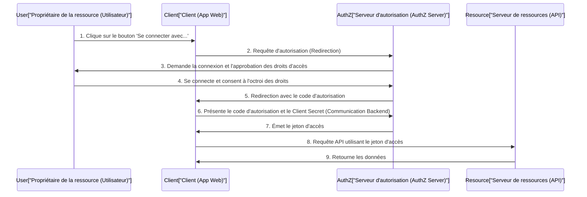
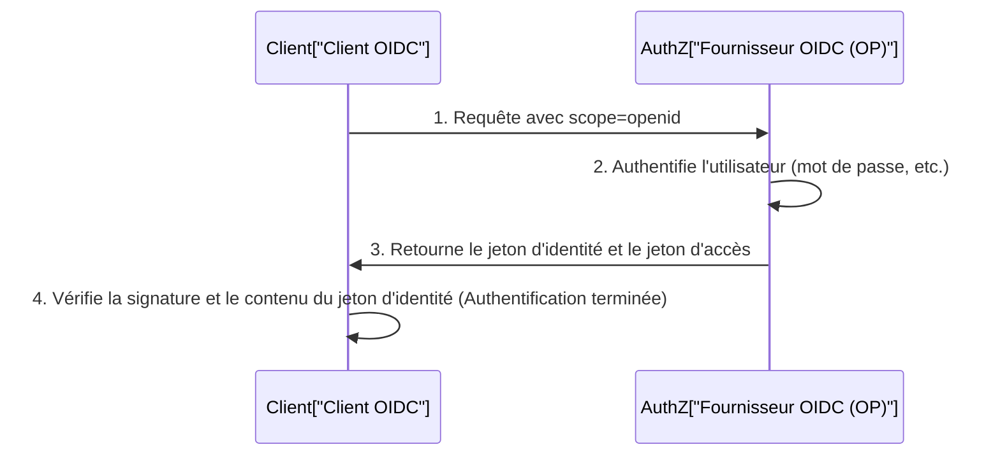

Dans les applications web et mobiles modernes, les fonctionnalités de connexion sociale comme « Se connecter avec Google » ou « Se connecter avec GitHub » sont devenues indispensables. Cependant, étonnamment peu de développeurs comprennent exactement quelles communications ont lieu en coulisses et comment la sécurité est garantie.

En particulier, les cas où la différence entre l'« Authentification » (Authentication) et l'« Autorisation » (Authorization) est confondue sont fréquents, et cela peut parfois conduire à des incidents de sécurité majeurs.

Dans cet article, nous partirons de la différence fondamentale entre authentification et autorisation, puis nous explorerons en profondeur « OAuth 2.0 », le framework standard pour l'autorisation, « OpenID Connect (OIDC) », qui étend OAuth 2.0 pour y ajouter des fonctionnalités d'authentification, et enfin la technologie de jetons « JWT (JSON Web Token) » utilisée dans ce contexte.

## 1. La différence fondamentale entre « Authentification » et « Autorisation »

Dans le monde de la sécurité, l'« Authentification » (Authentication) et l'« Autorisation » (Authorization) sont des concepts qui se ressemblent mais qui sont très différents. Distinguer clairement ces deux éléments est la première étape pour comprendre OAuth 2.0 et OIDC.

### Authentification (Authentication) : « Qui êtes-vous ? »
L'authentification est le processus qui permet de vérifier si l'utilisateur qui tente d'accéder au système est « authentique » (s'il est bien la personne qu'il prétend être).
- **Objectif** : Vérification de l'identité (Identity Verification)
- **Méthodes** : Mots de passe, biométrie (empreintes digitales, reconnaissance faciale), mots de passe à usage unique (MFA), clés de sécurité physiques, etc.
- **Résultat** : L'identité de l'utilisateur est confirmée et une session est établie dans le système.

### Autorisation (Authorization) : « Que pouvez-vous faire ? »
L'autorisation est le processus qui accorde des droits d'accès à des ressources spécifiques à une entité dont l'identité est déjà connue (ou qui possède des privilèges spécifiques).
- **Objectif** : Octroi de privilèges et contrôle d'accès (Access Control)
- **Méthodes** : Listes de contrôle d'accès (ACL), contrôle d'accès basé sur les rôles (RBAC), jetons d'accès (Access Tokens) dans OAuth 2.0, etc.
- **Résultat** : Seules les opérations autorisées (lecture, écriture, suppression, etc.) peuvent être exécutées.

### L'analogie de l'hôtel
Cette différence est très facile à comprendre avec l'analogie d'un « hôtel ».

1. **L'enregistrement à la réception (Authentification)** :
   Vous présentez une pièce d'identité (passeport ou permis de conduire) à la réception pour prouver que vous êtes bien « Taro Yamada, qui a fait la réservation ». C'est l'authentification.
2. **La réception de la carte-clé et l'entrée dans la chambre (Autorisation)** :
   Une fois votre identité confirmée, le personnel de la réception vous remet une carte-clé qui permet d'ouvrir la « chambre 305 ». Lorsque vous passez la carte-clé sur la serrure de la porte de la chambre 305 pour entrer, le mécanisme de la porte ne se soucie pas de savoir si « vous êtes Taro Yamada ». Il vérifie simplement si « cette carte-clé a le droit d'ouvrir la chambre 305 ». C'est l'autorisation.

## 2. Plongée dans OAuth 2.0 : Un framework pour l'autorisation

### Qu'est-ce qu'OAuth 2.0 ?
OAuth 2.0 (RFC 6749) est un **protocole standard d'autorisation** qui permet d'accorder à des applications tierces des droits d'accès limités (jetons d'accès) sans avoir à leur fournir le mot de passe de l'utilisateur.

### Les 4 rôles (acteurs) d'OAuth 2.0
Pour comprendre le flux OAuth 2.0, il faut saisir les 4 rôles suivants :

1. **Propriétaire de la ressource (Resource Owner)** :
   Le propriétaire des données (ressources). Il s'agit généralement d'un être humain (l'utilisateur).
2. **Client (Client)** :
   L'application tierce qui souhaite accéder aux données du propriétaire de la ressource.
3. **Serveur d'autorisation (Authorization Server)** :
   Le serveur qui authentifie le propriétaire de la ressource, obtient son consentement et émet un jeton d'accès au client.
4. **Serveur de ressources (Resource Server)** :
   Le serveur d'API qui détient les données du propriétaire de la ressource et qui autorise ou refuse l'accès aux données en vérifiant le jeton d'accès.

### Le flux du code d'autorisation (Authorization Code Flow)
OAuth 2.0 propose plusieurs types d'octroi (Grant Types), mais le plus sûr et le plus courant est le « flux du code d'autorisation ». Il est principalement utilisé par les applications web disposant d'un serveur backend.



Le point le plus important de ce flux se situe aux **étapes 6 à 7**. Le client ne reçoit pas directement le jeton d'accès, mais un « code d'autorisation » temporaire via le frontend. Ensuite, dans un environnement de communication sécurisé côté backend, il envoie le code d'autorisation et la clé secrète du client (Client Secret) au serveur d'autorisation pour les échanger contre un jeton d'accès. Cela réduit considérablement le risque que le jeton soit compromis par l'historique du navigateur ou par interception sur le réseau.

#### Extension de sécurité : PKCE (Proof Key for Code Exchange)
Pour les clients publics qui ne peuvent pas conserver le Client Secret de manière sécurisée, comme les applications natives ou les SPA (Single Page Applications), l'extension PKCE (prononcé Pixy : RFC 7636) est requise. PKCE empêche les attaques d'interception du code d'autorisation (Authorization Code Interception Attack) en envoyant une valeur de hachage générée dynamiquement (`code_challenge`) lors de la requête d'autorisation, puis en envoyant la valeur d'origine (`code_verifier`) lors de la demande de jeton. De nos jours, il est recommandé d'utiliser PKCE même pour les applications web, en tant que meilleure pratique de sécurité.

## 3. Le danger d'utiliser OAuth 2.0 pour l'« Authentification »

Lorsque OAuth 2.0 a commencé à se populariser, de nombreux développeurs ont pensé : « Si j'utilise la fonctionnalité OAuth de Facebook ou de Google, je n'aurai pas besoin de créer mon propre système de connexion. » En d'autres termes, ils ont **détourné OAuth 2.0, un protocole d'autorisation, pour l'utiliser à des fins d'authentification (connexion)**. C'est ce qu'on appelle la « Pseudo-Authentification » (Pseudo-Authentication).

### Pourquoi est-ce dangereux ?
Le jeton d'accès d'OAuth 2.0 indique seulement le « droit d'accéder à une ressource spécifique » et ne contient absolument aucune information sur « quand, où et comment l'utilisateur a été authentifié ». De plus, bien que le jeton d'accès soit lié à un client (application), il arrive que le serveur de ressources autorise l'accès sans vérifier « à qui est destiné ce jeton ».

#### Attaque par substitution de jeton d'accès (Access Token Substitution Attack)
Supposons qu'un attaquant malveillant intercepte ou obtienne un jeton d'accès valide émis pour une autre application vulnérable (App A). L'attaquant utilise ce jeton pour envoyer une requête à l'API de connexion de l'application cible (App B).
Si l'App B a une implémentation négligente du type « Si le jeton d'accès est valide et que nous pouvons récupérer les informations de l'utilisateur, alors la connexion est réussie », l'attaquant pourra se connecter illégalement à l'App B en se faisant passer pour la victime.
Pour reprendre l'analogie de l'hôtel, cela équivaudrait à l'erreur fatale de « croire aveuglément que toute personne apportant la clé de la chambre 305 est Taro Yamada ».

## 4. La naissance d'OpenID Connect (OIDC)

Pour résoudre les risques liés à l'utilisation d'OAuth 2.0 pour l'authentification, le **protocole standard conçu pour l'authentification**, qui étend OAuth 2.0, a été créé : c'est « OpenID Connect (OIDC) ».

### Le fonctionnement d'OIDC et le « Jeton d'identité » (ID Token)
OIDC a introduit un nouveau concept au flux d'OAuth 2.0 : le **« Jeton d'identité » (ID Token)**.
Le jeton d'identité est un certificat destiné au client, contenant des informations sur l'authentification de l'utilisateur (Identity). Il est généralement représenté au format JWT (JSON Web Token) et comporte la signature numérique du serveur d'autorisation.

Lorsque le client envoie une requête d'autorisation, il inclut `openid` dans le paramètre `scope`.
Ainsi, le serveur d'autorisation émettra un jeton d'identité en plus du jeton d'accès.



### Pourquoi OIDC est-il sûr ?
Le jeton d'identité contient les informations (revendications ou 'claims') suivantes :
- `iss` (Issuer) : Qui a émis ce jeton
- `sub` (Subject) : L'identifiant unique de l'utilisateur
- `aud` (Audience) : À qui (à quel client) ce jeton est-il destiné
- `exp` (Expiration Time) : La date d'expiration du jeton
- `iat` (Issued At) : La date d'émission du jeton

En vérifiant l'`aud` (Audience) du jeton d'identité reçu, le client peut confirmer de manière certaine : « Ce jeton a-t-il bien été émis pour ma propre application ? » Cela permet d'empêcher complètement l'attaque par substitution de jeton d'accès mentionnée précédemment.

## 5. Le fonctionnement et la vérification des JWT (JSON Web Token)

Examinons en profondeur la structure du « JWT (prononcé Jot : RFC 7519) », adopté comme format pour les jetons d'identité d'OIDC.
Le JWT est une norme qui représente des données JSON sous forme de chaîne de caractères compatible avec les URL (URL-safe) et empêche toute altération en y ajoutant une signature numérique.

### Les 3 composants d'un JWT
Un JWT est composé de 3 parties séparées par des points (`.`).
`Header.Payload.Signature`

#### 1. Header (En-tête)
Il spécifie le type de jeton (`typ`) et l'algorithme de signature utilisé (`alg`).
```json
{
  "typ": "JWT",
  "alg": "RS256"
}
```
Ceci est encodé en Base64URL.

#### 2. Payload (Charge utile)
Il contient les données réelles (les revendications).
```json
{
  "iss": "https://accounts.google.com",
  "sub": "1234567890",
  "aud": "your-client-id.apps.googleusercontent.com",
  "iat": 1695800000,
  "exp": 1695803600,
  "name": "Taro Yamada",
  "email": "taro@example.com"
}
```
Ceci est également encodé en Base64URL. (*Attention : Ce n'est pas chiffré, vous ne devez donc pas inclure d'informations confidentielles dans le payload.*)

#### 3. Signature
C'est la signature calculée en concaténant les chaînes encodées du Header et du Payload, en utilisant l'algorithme spécifié et une clé secrète (ou une paire de clés publique/privée).
Dans le cas de RS256 (signature RSA), le serveur d'autorisation crée la signature avec sa clé privée, et le client vérifie la signature à l'aide de la clé publique (généralement obtenue via un point de terminaison JWKS).

### Pièges de sécurité lors de la vérification d'un JWT
Lorsque vous vérifiez un JWT vous-même, vous devez faire attention à ne pas introduire les vulnérabilités suivantes.

1. **Attaque `alg: none`** : 
   Il s'agit d'une vulnérabilité bien connue où, si l'on spécifie `none` pour `alg` dans l'en-tête, certaines bibliothèques mal implémentées ignorent la vérification de la signature. Vous devez toujours configurer la vérification pour exiger explicitement l'algorithme attendu.
2. **Confusion entre clé publique et clé privée (HMAC/RSA Confusion)** :
   C'est une attaque où l'attaquant change l'algorithme de l'en-tête de RS256 à HS256 (cryptographie à clé symétrique) et crée un faux jeton en utilisant la clé publique de vérification de signature comme clé partagée. Cela peut être évité en limitant strictement les algorithmes autorisés côté bibliothèque.
3. **Non-vérification de l'Audience (`aud`)** :
   Comme mentionné précédemment, si vous ne vérifiez pas que le jeton est destiné à votre application, vous permettrez des connexions illégales avec des jetons provenant d'autres applications.

## Conclusion : L'avenir de l'authentification et de l'autorisation modernes

OAuth 2.0 et OpenID Connect constituent aujourd'hui le socle absolu de l'authentification et de l'autorisation sur le web.
- **Si vous avez besoin d'autorisation** : OAuth 2.0
- **Si vous avez besoin d'authentification (connexion)** : OpenID Connect (OIDC)

Les utiliser correctement à bon escient et vérifier rigoureusement les jetons d'identité sont des conditions préalables indispensables au développement d'applications sécurisées.

Ces dernières années, de nouvelles technologies telles que « FIDO2 / WebAuthn », qui permettent de se passer de mots de passe, et les « Passkeys », qui synchronisent les informations d'authentification entre les appareils, commencent à se répandre. Cependant, ces technologies renforcent principalement l'« authentification entre l'utilisateur et l'appareil » ; pour l'intégration entre les systèmes backend et les tiers, OIDC et OAuth 2.0 continueront de jouer un rôle central.

En comprenant la philosophie de conception (le "pourquoi") derrière ces spécifications techniques, vous serez en mesure de concevoir des systèmes plus robustes et plus sécurisés.
