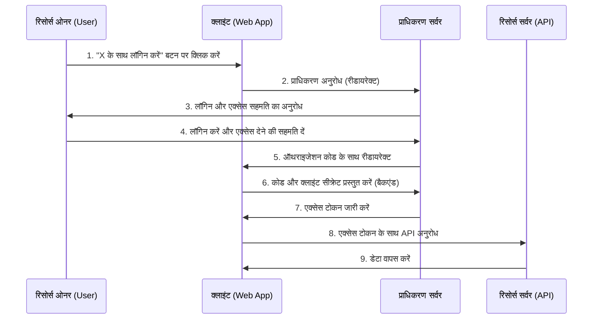
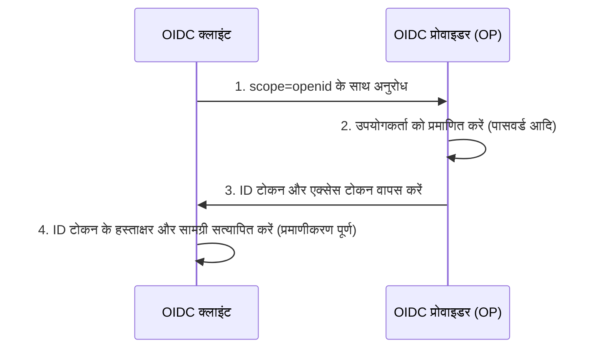

आधुनिक वेब और मोबाइल एप्लिकेशन में, "Google के साथ लॉगिन करें" या "GitHub के साथ लॉगिन करें" जैसी सोशल लॉगिन सुविधाएँ अपरिहार्य हो गई हैं। हालाँकि, बहुत कम डेवलपर्स वास्तव में यह समझते हैं कि बैकग्राउंड में कौन सा संचार (कम्युनिकेशन) हो रहा है और सुरक्षा कैसे सुनिश्चित की जाती है।

विशेष रूप से "प्रमाणीकरण (Authentication)" और "प्राधिकरण (Authorization)" के बीच अंतर को लेकर भ्रमित होने के मामले लगातार सामने आते रहते हैं, जिसके परिणामस्वरूप कभी-कभी गंभीर सुरक्षा घटनाएँ हो सकती हैं।

इस लेख में, हम प्रमाणीकरण और प्राधिकरण के बीच बुनियादी अंतर से शुरुआत करेंगे, और फिर प्राधिकरण के मानक फ्रेमवर्क "OAuth 2.0", इसमें प्रमाणीकरण सुविधाएँ जोड़ने के लिए इसके विस्तारित संस्करण "OpenID Connect (OIDC)", और अंत में इनमें इस्तेमाल होने वाली टोकन तकनीक "JWT (JSON Web Token)" तक गहराई से चर्चा करेंगे।

## 1. "प्रमाणीकरण (Authentication)" और "प्राधिकरण (Authorization)" के बीच मूलभूत अंतर

सुरक्षा की दुनिया में, "प्रमाणीकरण (Authentication)" और "प्राधिकरण (Authorization)" एक जैसी दिखने वाली लेकिन अलग अवधारणाएँ हैं। OAuth 2.0 और OIDC को समझने के लिए इन दोनों के बीच स्पष्ट अंतर करना पहला कदम है।

### प्रमाणीकरण (Authentication): "आप कौन हैं?"
प्रमाणीकरण वह प्रक्रिया है जिससे यह सत्यापित किया जाता है कि सिस्टम तक पहुँचने का प्रयास कर रहा उपयोगकर्ता "असली है या नहीं (वह वही व्यक्ति है जिसका वह दावा कर रहा है)"।
- **उद्देश्य**: पहचान का सत्यापन (Identity Verification)
- **तरीके**: पासवर्ड, बायोमेट्रिक्स (फिंगरप्रिंट, चेहरा), वन-टाइम पासवर्ड (MFA), भौतिक सुरक्षा कुंजियां आदि।
- **परिणाम**: उपयोगकर्ता की पहचान सत्यापित हो जाती है, और सिस्टम के भीतर एक सत्र (सेशन) स्थापित हो जाता है।

### प्राधिकरण (Authorization): "आप क्या कर सकते हैं?"
प्राधिकरण वह प्रक्रिया है जो एक ज्ञात (या विशेष अधिकार प्राप्त) एंटिटी को विशिष्ट संसाधनों तक पहुँच प्रदान करती है।
- **उद्देश्य**: अधिकार प्रदान करना और पहुँच नियंत्रण (Access Control)
- **तरीके**: एक्सेस कंट्रोल लिस्ट (ACL), रोल-बेस्ड एक्सेस कंट्रोल (RBAC), OAuth 2.0 में एक्सेस टोकन आदि।
- **परिणाम**: केवल अनुमत कार्य (पढ़ना, लिखना, हटाना आदि) ही निष्पादित किए जा सकते हैं।

### होटल का उदाहरण
इस अंतर को "होटल" के उदाहरण से बहुत आसानी से समझा जा सकता है।

1. **फ्रंट डेस्क पर चेक-इन (प्रमाणीकरण)**:
   आप फ्रंट डेस्क पर अपना पहचान पत्र (पासपोर्ट या ड्राइवर का लाइसेंस) प्रस्तुत करते हैं ताकि यह साबित हो सके कि आप "बुकिंग करने वाले व्यक्ति" हैं। यह प्रमाणीकरण है।
2. **की-कार्ड प्राप्त करना और कमरे में प्रवेश करना (प्राधिकरण)**:
   आपकी पहचान सत्यापित होने के बाद, फ्रंट डेस्क कर्मचारी आपको एक की-कार्ड देता है जो "कमरा नंबर 305" खोल सकता है। जब आप 305 नंबर के दरवाजे पर प्रवेश करने के लिए की-कार्ड का उपयोग करते हैं, तो दरवाजे का लॉक सिस्टम इस बात की परवाह नहीं करता है कि "आप कौन हैं"। यह केवल यह जांचता है कि "क्या इस की-कार्ड में कमरा 305 खोलने का अधिकार है"। यह प्राधिकरण है।

## 2. OAuth 2.0 का गहराई से अध्ययन: प्राधिकरण के लिए फ्रेमवर्क

### OAuth 2.0 क्या है?
OAuth 2.0 (RFC 6749) थर्ड-पार्टी एप्लिकेशनों को उपयोगकर्ता का पासवर्ड दिए बिना सीमित एक्सेस अधिकार (एक्सेस टोकन) प्रदान करने के लिए **"प्राधिकरण" का एक मानक प्रोटोकॉल** है।

### OAuth 2.0 की 4 भूमिकाएँ (संबंधित पक्ष)
OAuth 2.0 के फ्लो को समझने के लिए, निम्नलिखित 4 भूमिकाओं को समझना आवश्यक है।

1. **रिसोर्स ओनर (Resource Owner)**:
   डेटा (रिसोर्स) का स्वामी। आमतौर पर यह एक इंसान (उपयोगकर्ता) होता है।
2. **क्लाइंट (Client)**:
   थर्ड-पार्टी एप्लिकेशन जो रिसोर्स ओनर के डेटा तक पहुँचना चाहता है।
3. **प्राधिकरण सर्वर (Authorization Server)**:
   वह सर्वर जो रिसोर्स ओनर को प्रमाणित करता है, सहमति प्राप्त करता है, और फिर क्लाइंट को एक्सेस टोकन जारी करता है।
4. **रिसोर्स सर्वर (Resource Server)**:
   API सर्वर जो रिसोर्स ओनर का डेटा रखता है, और एक्सेस टोकन को सत्यापित करके डेटा तक पहुँच की अनुमति या अस्वीकृति देता है।

### ऑथराइजेशन कोड फ्लो (Authorization Code Flow)
OAuth 2.0 में कई ग्रांट प्रकार (अधिकार प्रदान करने के तरीके) हैं, लेकिन सबसे सुरक्षित और सामान्य "ऑथराइजेशन कोड फ्लो" है। इसका उपयोग मुख्य रूप से बैकएंड सर्वर वाले वेब एप्लिकेशन में किया जाता है।



इस फ्लो का सबसे महत्वपूर्ण बिंदु **चरण 6-7** है। क्लाइंट को सीधे एक्सेस टोकन प्राप्त नहीं होता है, बल्कि वह फ्रंटएंड के माध्यम से एक अस्थायी "ऑथराइजेशन कोड" प्राप्त करता है। फिर, सुरक्षित बैकएंड संचार वातावरण में, ऑथराइजेशन कोड और क्लाइंट की निजी कुंजी (Client Secret) को प्राधिकरण सर्वर पर भेजा जाता है, और एक्सेस टोकन के साथ बदल दिया जाता है। इससे ब्राउज़र इतिहास या नेटवर्क इंटरसेप्शन के माध्यम से टोकन लीक होने का जोखिम काफी हद तक कम हो जाता है।

#### सुरक्षा विस्तार: PKCE (Proof Key for Code Exchange)
नेटिव ऐप्स और SPA (सिंगल पेज एप्लिकेशन) जैसे सार्वजनिक क्लाइंट्स के लिए, जो क्लाइंट सीक्रेट को सुरक्षित रूप से स्टोर नहीं कर सकते हैं, PKCE (पिक्सी: RFC 7636) नामक एक एक्सटेंशन आवश्यक है। PKCE ऑथराइजेशन अनुरोध के दौरान गतिशील रूप से उत्पन्न हैश वैल्यू (code_challenge) भेजकर और टोकन अनुरोध के दौरान इसके मूल मूल्य (code_verifier) को भेजकर ऑथराइजेशन कोड इंटरसेप्शन हमले को रोकता है। आजकल, सुरक्षा की सर्वोत्तम प्रथाओं के रूप में वेब एप्लिकेशनों के लिए भी PKCE का उपयोग करने की सिफारिश की जाती है।

## 3. OAuth 2.0 को "प्रमाणीकरण" के लिए उपयोग करने के खतरे

जब OAuth 2.0 लोकप्रिय होने लगा, तो कई डेवलपर्स ने सोचा, "Facebook या Google की OAuth सुविधाओं का उपयोग करके, हमें अपना खुद का लॉगिन सिस्टम नहीं बनाना पड़ेगा।" दूसरे शब्दों में, उन्होंने **OAuth 2.0 का, जो एक प्राधिकरण प्रोटोकॉल है, प्रमाणीकरण (लॉगिन) के लिए दुरुपयोग किया**। इसे "छद्म प्रमाणीकरण (Pseudo-Authentication)" कहा जाता है।

### यह खतरनाक क्यों है?
OAuth 2.0 का एक्सेस टोकन केवल "किसी विशिष्ट संसाधन तक पहुँचने का अधिकार" दर्शाता है, और इसमें कोई भी जानकारी नहीं होती है कि "उपयोगकर्ता कब, कहाँ और कैसे प्रमाणित हुआ था"। साथ ही, एक्सेस टोकन क्लाइंट (ऐप) से जुड़ा होता है, लेकिन कभी-कभी रिसोर्स सर्वर यह सत्यापित किए बिना कि "टोकन किसके लिए है" एक्सेस की अनुमति दे सकता है।

#### एक्सेस टोकन प्रतिस्थापन हमला (Access Token Substitution Attack)
मान लें कि कोई दुर्भावनापूर्ण हमलावर किसी कमजोर ऐप (App A) के लिए जारी किए गए एक वैध एक्सेस टोकन को इंटरसेप्ट या प्राप्त कर लेता है। हमलावर उस टोकन का उपयोग करके लक्ष्य ऐप (App B) के लॉगिन API पर अनुरोध भेजता है।
यदि App B में ऐसा ढीला कार्यान्वयन है जो यह मानता है कि "यदि एक्सेस टोकन वैध है और उपयोगकर्ता की जानकारी प्राप्त की जा सकती है, तो लॉगिन सफल है", तो हमलावर पीड़ित के खाते के रूप में App B में अवैध रूप से लॉग इन कर सकता है।
होटल के उदाहरण में, यह एक घातक गलती के बराबर है जैसे "जो कोई भी कमरा 305 की चाबी लाता है, उसे बिना शर्त असली अतिथि मान लेना।"

## 4. OpenID Connect (OIDC) का जन्म

प्रमाणीकरण के लिए OAuth 2.0 के दुरुपयोग के जोखिमों को हल करने के लिए, OAuth 2.0 का विस्तार करके डिज़ाइन किया गया **प्रमाणीकरण के लिए मानक प्रोटोकॉल** "OpenID Connect (OIDC)" है।

### OIDC कैसे काम करता है और "ID टोकन"
OIDC ने OAuth 2.0 फ्लो के अतिरिक्त एक नई अवधारणा **"ID टोकन (ID Token)"** पेश की है।
ID टोकन क्लाइंट के लिए एक प्रमाण पत्र है, जिसमें उपयोगकर्ता के प्रमाणीकरण से संबंधित जानकारी (Identity) भरी होती है। आमतौर पर, इसे JWT (JSON Web Token) प्रारूप में दर्शाया जाता है, और इसमें प्राधिकरण सर्वर के डिजिटल हस्ताक्षर जुड़े होते हैं।

जब क्लाइंट प्राधिकरण अनुरोध भेजता है, तो वह `scope` पैरामीटर में `openid` शामिल करता है।
नतीजतन, प्राधिकरण सर्वर एक्सेस टोकन के साथ-साथ एक ID टोकन जारी करता है।



### OIDC सुरक्षित क्यों है
ID टोकन में निम्नलिखित जानकारी (Claims) शामिल होती है:
- `iss` (Issuer): किसने यह टोकन जारी किया
- `sub` (Subject): उपयोगकर्ता का विशिष्ट पहचानकर्ता
- `aud` (Audience): यह टोकन किसके लिए (किस क्लाइंट के लिए) जारी किया गया था
- `exp` (Expiration Time): टोकन की समाप्ति का समय
- `iat` (Issued At): टोकन जारी होने का समय

प्राप्त ID टोकन के `aud` (Audience) की जांच करके, क्लाइंट यह सत्यापित कर सकता है कि "क्या यह टोकन निश्चित रूप से हमारे ऐप के लिए जारी किया गया था"। इससे ऊपर बताए गए एक्सेस टोकन प्रतिस्थापन हमले को पूरी तरह से रोका जा सकता है।

## 5. JWT (JSON Web Token) का तंत्र और सत्यापन

आइए OIDC के ID टोकन के रूप में अपनाए गए "JWT (जॉट: RFC 7519)" की संरचना का गहराई से अध्ययन करें।
JWT एक ऐसा मानक है जो JSON डेटा को URL-सुरक्षित स्ट्रिंग के रूप में दर्शाता है और छेड़छाड़ को रोकने के लिए एक डिजिटल हस्ताक्षर जोड़ता है।

### JWT के 3 घटक
JWT तीन भागों से बना होता है जिन्हें बिंदु (`.`) से अलग किया जाता है:
`Header.Payload.Signature`

#### 1. Header (हेडर)
यह टोकन का प्रकार (typ) और उपयोग किए जा रहे हस्ताक्षर एल्गोरिदम (alg) को निर्दिष्ट करता है।
```json
{
  "typ": "JWT",
  "alg": "RS256"
}
```
इसे Base64URL में एनकोड किया जाता है।

#### 2. Payload (पेलोड)
इसमें वास्तविक डेटा (Claims) शामिल होता है।
```json
{
  "iss": "https://accounts.google.com",
  "sub": "1234567890",
  "aud": "your-client-id.apps.googleusercontent.com",
  "iat": 1695800000,
  "exp": 1695803600,
  "name": "Taro Yamada",
  "email": "taro@example.com"
}
```
इसे भी Base64URL में एनकोड किया जाता है। (*चूंकि यह एन्क्रिप्टेड नहीं है, इसलिए आपको पेलोड में संवेदनशील जानकारी शामिल नहीं करनी चाहिए।)

#### 3. Signature (सिग्नेचर / हस्ताक्षर)
यह हेडर और पेलोड के एनकोड किए गए स्ट्रिंग्स को जोड़कर और निर्दिष्ट एल्गोरिदम और निजी कुंजी (या निजी/सार्वजनिक कुंजी जोड़ी) का उपयोग करके गणना किया गया हस्ताक्षर है।
RS256 (RSA हस्ताक्षर) के मामले में, प्राधिकरण सर्वर निजी कुंजी के साथ एक हस्ताक्षर बनाता है, और क्लाइंट हस्ताक्षर को सत्यापित करने के लिए सार्वजनिक कुंजी (आमतौर पर JWKS एंडपॉइंट से प्राप्त) का उपयोग करता है।

### JWT सत्यापन के दौरान सुरक्षा खामियाँ
अपना स्वयं का JWT सत्यापन करते समय, सावधान रहें कि निम्नलिखित जैसी कमजोरियां पैदा न हों:

1. **`alg: none` हमला**:
   यदि हेडर के `alg` को `none` पर सेट किया गया है, तो कुछ अनुचित रूप से कार्यान्वित लाइब्रेरी हस्ताक्षर सत्यापन को छोड़ देती हैं। यह एक प्रसिद्ध भेद्यता है। आपको हमेशा स्पष्ट रूप से एल्गोरिदम निर्दिष्ट करने और सत्यापित करने के लिए कॉन्फ़िगर करना चाहिए।
2. **सार्वजनिक और निजी कुंजियों का भ्रम (HMAC/RSA Confusion)**:
   यह एक ऐसा हमला है जहां हमलावर हेडर में एल्गोरिदम को RS256 से HS256 (सिमेट्रिक एन्क्रिप्शन) में बदल देता है, और हस्ताक्षर सत्यापन के लिए सार्वजनिक कुंजी का उपयोग सिमेट्रिक कुंजी के रूप में करके जाली टोकन बनाता है। लाइब्रेरी द्वारा अनुमत एल्गोरिदम को सख्ती से सीमित करके इसे रोका जा सकता है।
3. **Audience (`aud`) की अनपुष्टि**:
   जैसा कि पहले उल्लेख किया गया है, यदि आप यह सत्यापित नहीं करते हैं कि टोकन आपके ऐप के लिए है, तो आप किसी अन्य ऐप के टोकन का उपयोग करके अनधिकृत लॉगिन की अनुमति दे सकते हैं।

## निष्कर्ष: आधुनिक प्रमाणीकरण और प्राधिकरण का भविष्य

OAuth 2.0 और OpenID Connect आज वेब पर प्रमाणीकरण और प्राधिकरण की परम नींव हैं।
- **यदि प्राधिकरण की आवश्यकता है**: OAuth 2.0
- **यदि प्रमाणीकरण (लॉगिन) की आवश्यकता है**: OpenID Connect (OIDC)

सुरक्षित एप्लिकेशन विकास के लिए इन दोनों का सही उपयोग करना और ID टोकन का कड़ाई से सत्यापन करना एक आवश्यक शर्त है।

हाल के वर्षों में, पासवर्ड रहित लॉगिन सक्षम करने वाली "FIDO2 / WebAuthn" और उपकरणों के बीच क्रेडेंशियल्स सिंक करने वाली "पासकीज़ (Passkeys)" जैसी नई तकनीकों ने लोकप्रियता हासिल करना शुरू कर दिया है। हालाँकि, ये तकनीकें मुख्य रूप से "उपयोगकर्ता और डिवाइस के बीच प्रमाणीकरण" को बढ़ाती हैं, और OIDC और OAuth 2.0 बैकएंड सिस्टम और थर्ड-पार्टी एकीकरण के लिए एक केंद्रीय भूमिका निभाते रहेंगे।

तकनीक के पीछे छिपे "यह इस तरह क्यों डिज़ाइन किया गया है" (Why) के दर्शन को समझकर, आप अधिक मजबूत और सुरक्षित सिस्टम डिज़ाइन करने में सक्षम होंगे。
