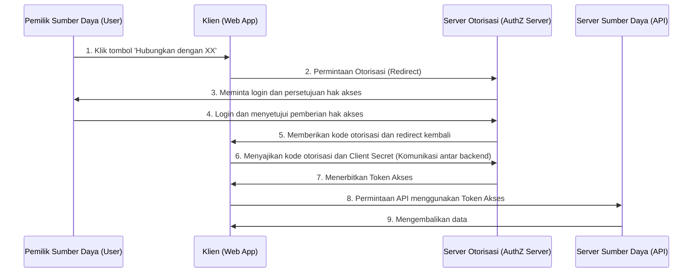
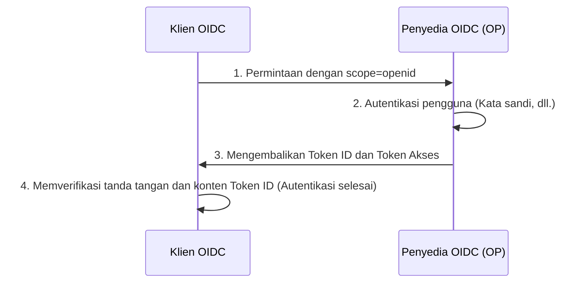

Dalam aplikasi web dan seluler modern, fitur login sosial seperti 'Login dengan Google' atau 'Login dengan GitHub' telah menjadi sesuatu yang esensial. Namun, mungkin secara mengejutkan hanya sedikit pengembang yang benar-benar memahami komunikasi apa yang terjadi di balik layar dan bagaimana keamanannya dijamin.

Secara khusus, masih sering terjadi kebingungan mengenai perbedaan antara 'Autentikasi' (Authentication) dan 'Otorisasi' (Authorization), yang terkadang dapat berujung pada insiden keamanan yang serius.

Artikel ini akan membahas secara mendalam, mulai dari perbedaan mendasar antara autentikasi dan otorisasi, lalu membahas kerangka kerja standar untuk otorisasi yaitu 'OAuth 2.0', kemudian 'OpenID Connect (OIDC)' yang memperluas OAuth 2.0 dengan menambahkan fitur autentikasi, serta teknologi token yang digunakan di dalamnya yaitu 'JWT (JSON Web Token)'.

## 1. Perbedaan Mendasar Antara 'Autentikasi' dan 'Otorisasi'

Dalam dunia keamanan, 'Autentikasi' (Authentication) dan 'Otorisasi' (Authorization) adalah konsep yang terlihat mirip namun sebenarnya berbeda. Membedakan keduanya dengan jelas adalah langkah pertama untuk memahami OAuth 2.0 dan OIDC.

### Autentikasi (Authentication): 'Siapa Anda?'
Autentikasi adalah proses untuk memverifikasi apakah pengguna yang mencoba mengakses sistem 'adalah asli (orang yang mereka klaim)'.
- **Tujuan**: Verifikasi Identitas (Identity Verification)
- **Metode**: Kata sandi, autentikasi biometrik (sidik jari, wajah), kata sandi satu kali (MFA), kunci keamanan fisik, dll.
- **Hasil**: Identitas pengguna diverifikasi, dan sesi dibuat di dalam sistem.

### Otorisasi (Authorization): 'Apa yang Dapat Anda Lakukan?'
Otorisasi adalah proses memberikan hak akses ke sumber daya tertentu kepada subjek yang identitasnya sudah diketahui (atau yang memiliki hak istimewa tertentu).
- **Tujuan**: Pemberian hak istimewa dan kontrol akses (Access Control)
- **Metode**: Access Control List (ACL), Role-Based Access Control (RBAC), token akses dalam OAuth 2.0, dll.
- **Hasil**: Hanya operasi yang diizinkan (baca, tulis, hapus, dll.) yang dapat dieksekusi.

### Analogi Hotel
Perbedaan ini sangat mudah dipahami jika diibaratkan dengan 'hotel'.

1. **Check-in di meja resepsionis (Autentikasi)**:
   Anda menunjukkan kartu identitas (paspor atau SIM) di meja resepsionis untuk membuktikan bahwa 'Anda adalah Taro Yamada yang membuat reservasi'. Ini adalah autentikasi.
2. **Menerima kartu kunci dan masuk ke kamar (Otorisasi)**:
   Setelah identitas Anda diverifikasi, staf resepsionis memberikan kartu kunci yang dapat membuka 'Kamar 305'. Saat Anda menempelkan kartu kunci ke pintu Kamar 305 untuk masuk, mekanisme kunci pintu tidak peduli 'apakah Anda Taro Yamada atau bukan'. Kunci tersebut hanya memeriksa 'apakah kartu kunci ini memiliki izin untuk membuka Kamar 305'. Ini adalah otorisasi.

## 2. Pendalaman OAuth 2.0: Kerangka Kerja untuk Otorisasi

### Apa itu OAuth 2.0?
OAuth 2.0 (RFC 6749) adalah **protokol standar untuk 'otorisasi'** yang digunakan untuk memberikan hak akses terbatas (token akses) kepada aplikasi pihak ketiga, tanpa memberikan kata sandi pengguna.

### 4 Peran (Karakter) dalam OAuth 2.0
Untuk memahami alur OAuth 2.0, Anda perlu memahami empat peran berikut:

1. **Pemilik Sumber Daya (Resource Owner)**:
   Pemilik data (sumber daya). Biasanya adalah manusia (pengguna).
2. **Klien (Client)**:
   Aplikasi pihak ketiga yang ingin mengakses data pemilik sumber daya.
3. **Server Otorisasi (Authorization Server)**:
   Server yang mengautentikasi pemilik sumber daya dan menerbitkan token akses kepada klien setelah mendapatkan persetujuan.
4. **Server Sumber Daya (Resource Server)**:
   Server API yang menyimpan data pemilik sumber daya, dan mengizinkan atau menolak akses ke data dengan memverifikasi token akses.

### Alur Kode Otorisasi (Authorization Code Flow)
OAuth 2.0 memiliki beberapa tipe pemberian izin (grant types), tetapi yang paling aman dan umum adalah 'Alur Kode Otorisasi' (Authorization Code Flow). Ini terutama digunakan dalam aplikasi Web yang memiliki server backend.



Poin terbesar dari alur ini ada pada **Langkah 6 hingga 7**. Klien tidak menerima token akses secara langsung, melainkan menerima 'kode otorisasi' sementara melalui frontend. Kemudian, dalam lingkungan komunikasi backend yang aman, kode otorisasi dan kunci rahasia klien (Client Secret) dikirim ke server otorisasi untuk ditukar dengan token akses. Hal ini meminimalkan risiko kebocoran token melalui riwayat browser atau intersepsi jaringan.

#### Ekstensi Keamanan: PKCE (Proof Key for Code Exchange)
Untuk klien publik yang tidak dapat menyimpan Client Secret dengan aman, seperti aplikasi native atau SPA (Single Page Application), spesifikasi ekstensi yang disebut PKCE (diucapkan 'Pixy': RFC 7636) menjadi wajib. PKCE mencegah serangan intersepsi kode otorisasi (Authorization Code Interception Attack) dengan mengirimkan nilai hash yang dihasilkan secara dinamis (`code_challenge`) saat permintaan otorisasi, dan mengirimkan nilai aslinya (`code_verifier`) saat permintaan token. Saat ini, sebagai praktik keamanan terbaik, penggunaan PKCE sangat direkomendasikan bahkan untuk aplikasi Web.

## 3. Bahaya Menggunakan OAuth 2.0 untuk 'Autentikasi'

Ketika OAuth 2.0 mulai populer, banyak pengembang berpikir, 'Jika menggunakan fitur OAuth dari Facebook atau Google, kita tidak perlu membuat sistem login sendiri.' Dengan kata lain, mereka **menyalahgunakan OAuth 2.0, yang merupakan protokol otorisasi, untuk autentikasi (login)**. Hal ini disebut 'Autentikasi Semu' (Pseudo-Authentication).

### Mengapa Berbahaya?
Token akses OAuth 2.0 hanya menunjukkan 'hak untuk mengakses sumber daya tertentu' dan sama sekali tidak memuat informasi tentang 'kapan, di mana, dan bagaimana pengguna diautentikasi'. Selain itu, meskipun token akses terikat pada klien (aplikasi), server sumber daya terkadang mengizinkan akses tanpa memverifikasi 'untuk siapa token tersebut ditujukan'.

#### Serangan Penggantian Token Akses (Access Token Substitution Attack)
Misalkan penyerang jahat mencegat atau mendapatkan token akses yang sah yang diterbitkan untuk aplikasi lain yang rentan (App A). Penyerang menggunakan token tersebut untuk mengirim permintaan ke API login aplikasi target (App B).
Jika App B memiliki implementasi yang ceroboh seperti 'jika token akses valid dan informasi pengguna dapat diambil, maka login dianggap berhasil', penyerang dapat masuk secara tidak sah ke App B sebagai akun korban.
Jika diibaratkan dengan hotel, ini sama dengan kesalahan fatal 'mempercayai tanpa syarat bahwa siapa pun yang membawa kunci Kamar 305 adalah Taro Yamada'.

## 4. Lahirnya OpenID Connect (OIDC)

Untuk mengatasi risiko penyalahgunaan OAuth 2.0 untuk autentikasi, **protokol standar untuk autentikasi** yang dirancang sebagai ekstensi dari OAuth 2.0 adalah 'OpenID Connect (OIDC)'.

### Cara Kerja OIDC dan 'Token ID'
OIDC memperkenalkan konsep baru bernama **'Token ID' (ID Token)** sebagai tambahan pada alur OAuth 2.0.
Token ID adalah sertifikat untuk klien yang berisi informasi tentang autentikasi pengguna (Identitas). Biasanya direpresentasikan dalam format JWT (JSON Web Token) dan dilengkapi dengan tanda tangan digital dari server otorisasi.

Saat klien mengirimkan permintaan otorisasi, klien menyertakan `openid` dalam parameter `scope`.
Hal ini menyebabkan server otorisasi menerbitkan Token ID bersama dengan token akses.



### Alasan Mengapa OIDC Aman
Token ID berisi informasi (klaim) berikut:
- `iss` (Issuer): Siapa yang menerbitkan token ini
- `sub` (Subject): Pengidentifikasi unik untuk pengguna
- `aud` (Audience): Untuk siapa (klien mana) token ini diterbitkan
- `exp` (Expiration Time): Waktu kedaluwarsa token
- `iat` (Issued At): Tanggal dan waktu token diterbitkan

Klien dapat memverifikasi 'apakah token ini benar-benar diterbitkan untuk aplikasinya' dengan memeriksa `aud` (Audience) dari Token ID yang diterima. Hal ini dapat sepenuhnya mencegah Serangan Penggantian Token Akses yang disebutkan sebelumnya.

## 5. Cara Kerja dan Verifikasi JWT (JSON Web Token)

Mari kita bahas lebih dalam struktur 'JWT' (diucapkan 'jot': RFC 7519), yang diadopsi sebagai Token ID dalam OIDC.
JWT adalah standar yang merepresentasikan data JSON sebagai string URL-safe dan melengkapinya dengan tanda tangan digital untuk mencegah gangguan (tampering).

### 3 Komponen JWT
JWT terdiri dari tiga bagian yang dipisahkan oleh titik (`.`).
`Header.Payload.Signature`

#### 1. Header
Menentukan jenis token (`typ`) dan algoritma tanda tangan yang digunakan (`alg`).
```json
{
  "typ": "JWT",
  "alg": "RS256"
}
```
Ini dienkode dengan Base64URL.

#### 2. Payload
Berisi data aktual (klaim).
```json
{
  "iss": "https://accounts.google.com",
  "sub": "1234567890",
  "aud": "your-client-id.apps.googleusercontent.com",
  "iat": 1695800000,
  "exp": 1695803600,
  "name": "Taro Yamada",
  "email": "taro@example.com"
}
```
Ini juga dienkode dengan Base64URL. (*Karena tidak dienkripsi, Anda tidak boleh memasukkan informasi rahasia ke dalam payload.*)

#### 3. Signature (Tanda Tangan)
Tanda tangan yang dihitung dengan menggabungkan string terenkode dari Header dan Payload, menggunakan algoritma yang ditentukan dan kunci rahasia (atau pasangan kunci publik/privat).
Dalam kasus RS256 (Tanda tangan RSA), server otorisasi membuat tanda tangan dengan kunci privat, dan klien memverifikasi tanda tangan menggunakan kunci publik (biasanya diperoleh dari endpoint JWKS).

### Jebakan Keamanan saat Memverifikasi JWT
Saat memverifikasi JWT sendiri, Anda harus berhati-hati agar tidak menciptakan kerentanan seperti berikut:

1. **Serangan `alg: none`**: 
   Ini adalah kerentanan terkenal di mana jika Anda menentukan `none` pada `alg` di header, beberapa pustaka (library) yang diimplementasikan dengan tidak benar akan melewati verifikasi tanda tangan. Anda harus selalu menentukan algoritma secara eksplisit untuk pengaturan verifikasi.
2. **Kebingungan Kunci Publik dan Kunci Privat (HMAC/RSA Confusion)**:
   Serangan di mana penyerang mengubah algoritma dalam header dari RS256 menjadi HS256 (kriptografi kunci simetris) dan menggunakan kunci publik untuk verifikasi tanda tangan sebagai kunci simetris guna membuat token palsu. Ini dapat dicegah dengan membatasi secara ketat algoritma yang diizinkan di sisi pustaka.
3. **Audience (`aud`) Tidak Diperiksa**:
   Seperti yang disebutkan sebelumnya, jika Anda tidak memastikan bahwa token ditujukan untuk aplikasi Anda, Anda dapat mengizinkan login tidak sah dengan token dari aplikasi lain.

## Kesimpulan: Masa Depan Autentikasi dan Otorisasi Modern

OAuth 2.0 dan OpenID Connect adalah fondasi mutlak untuk autentikasi dan otorisasi di web saat ini.
- **Jika Anda memerlukan otorisasi**: OAuth 2.0
- **Jika Anda memerlukan autentikasi (login)**: OpenID Connect (OIDC)

Menggunakan keduanya dengan benar dan memverifikasi Token ID secara ketat adalah persyaratan mutlak untuk pengembangan aplikasi yang aman.

Dalam beberapa tahun terakhir, teknologi baru seperti 'FIDO2 / WebAuthn' yang mencapai otentikasi tanpa kata sandi (passwordless), dan 'Passkeys' yang menyinkronkan informasi autentikasi antar perangkat mulai populer. Namun, teknologi ini terutama untuk memperkuat 'autentikasi antara pengguna dan perangkat', sedangkan untuk kolaborasi antara sistem backend dan pihak ketiga, OIDC dan OAuth 2.0 akan terus memainkan peran sentral.

Dengan memahami filosofi desain (Mengapa) di balik 'mengapa spesifikasinya dibuat seperti itu' dari teknologi ini, Anda akan dapat merancang sistem yang lebih kuat dan aman.
