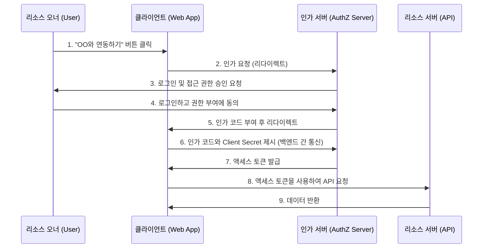
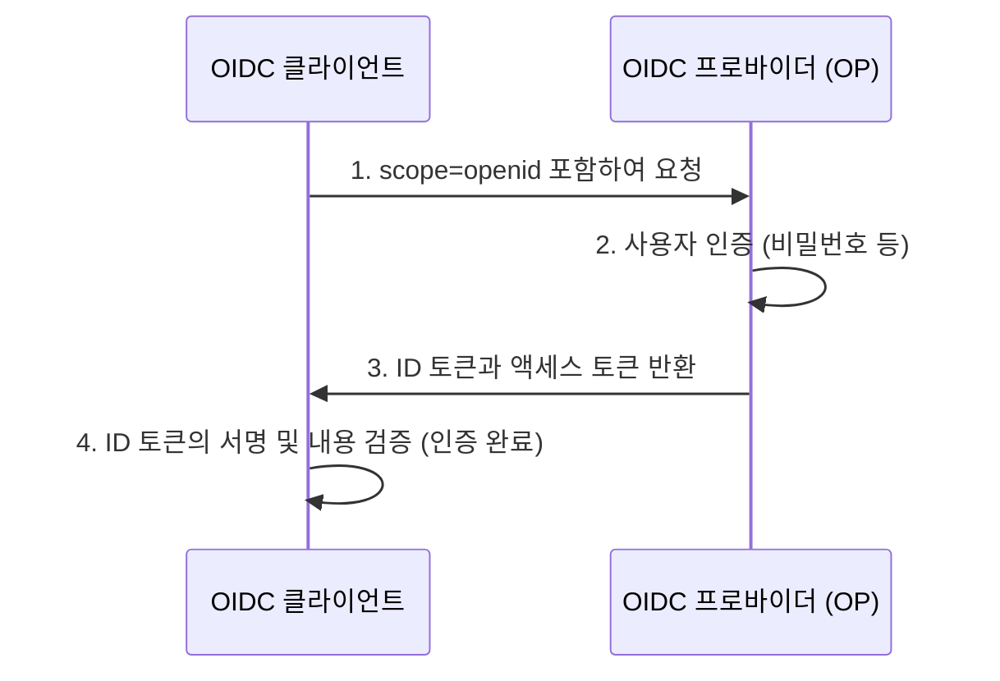

현대의 웹 애플리케이션이나 모바일 앱에서 'Google로 로그인', 'GitHub로 로그인'과 같은 소셜 로그인 기능은 빼놓을 수 없는 요소가 되었습니다. 하지만 그 이면에서 어떤 통신이 이루어지고 있으며 안전성이 어떻게 담보되는지를 정확히 이해하고 있는 개발자는 의외로 적을지도 모릅니다.

특히 '인증(Authentication)'과 '인가(Authorization)'의 차이를 혼동하는 경우는 끊이지 않으며, 이것이 원인이 되어 중대한 보안 사고로 발전하는 경우도 있습니다.

본 기사에서는 인증과 인가의 근본적인 차이점부터 출발하여, 인가의 표준 프레임워크인 'OAuth 2.0'과 OAuth 2.0을 확장하여 인증 기능을 추가한 'OpenID Connect (OIDC)', 나아가 그곳에서 사용되는 토큰 기술인 'JWT (JSON Web Token)'까지 철저하게 파헤쳐 설명합니다.

## 1. '인증'과 '인가'의 근본적인 차이

보안의 세계에서 '인증(Authentication)'과 '인가(Authorization)'는 비슷하면서도 다른 개념입니다. 이 둘을 명확하게 구별하는 것이 OAuth 2.0이나 OIDC를 이해하기 위한 첫걸음이 됩니다.

### 인증(Authentication): "당신은 누구인가?"
인증이란 시스템에 액세스하려는 사용자가 '진짜인지(주장하는 바와 같은 인물인지)'를 확인하는 프로세스입니다.
- **목적**: 신원 증명(Identity Verification)
- **수단**: 비밀번호, 생체 인증(지문, 얼굴), 원타임 비밀번호(MFA), 물리적 보안 키 등.
- **결과**: 사용자의 신원이 확인되고, 시스템 내에 세션이 확립된다.

### 인가(Authorization): "당신은 무엇을 할 수 있는가?"
인가란 이미 신원이 판명된(혹은 특정 권한을 가지고 있는) 주체에 대해, 특정 리소스에 대한 액세스 권한을 부여하는 프로세스입니다.
- **목적**: 권한 부여와 접근 제어(Access Control)
- **수단**: 액세스 컨트롤 리스트(ACL), 역할 기반 접근 제어(RBAC), OAuth 2.0에서의 액세스 토큰 등.
- **결과**: 허용된 작업(읽기, 쓰기, 삭제 등)만 실행 가능해진다.

### 호텔의 비유
이 차이는 '호텔'에 비유하면 매우 알기 쉽습니다.

1. **프런트 데스크에서의 체크인(인증)**:
   프런트에서 신분증(여권이나 운전면허증)을 제시하고, '예약한 홍길동이라는 것'을 증명합니다. 이것이 인증입니다.
2. **카드 키 수령과 객실 입실(인가)**:
   신원이 확인되면 프런트 직원은 '305호'를 열 수 있는 카드 키를 건네줍니다. 당신이 305호 문에 카드 키를 대고 들어갈 때, 문의 잠금장치는 '당신이 홍길동인지'는 신경 쓰지 않습니다. 단지 '이 카드 키에 305호를 열 권한이 있는지'만을 확인합니다. 이것이 인가입니다.

## 2. OAuth 2.0 심층 탐구: 인가를 위한 프레임워크

### OAuth 2.0이란?
OAuth 2.0(RFC 6749)은 서드파티 애플리케이션에 대해 사용자의 비밀번호를 넘기지 않고 제한적인 액세스 권한(액세스 토큰)을 부여하기 위한 **'인가'의 표준 프로토콜**입니다.

### OAuth 2.0의 4가지 역할(등장인물)
OAuth 2.0의 흐름을 이해하기 위해서는 다음 4가지 역할을 파악해야 합니다.

1. **리소스 오너(Resource Owner)**:
   데이터(리소스)의 소유자. 일반적으로 인간(사용자)입니다.
2. **클라이언트(Client)**:
   리소스 오너의 데이터에 액세스하고 싶은 서드파티 애플리케이션.
3. **인가 서버(Authorization Server)**:
   리소스 오너를 인증하고, 동의를 얻은 후 클라이언트에게 액세스 토큰을 발급하는 서버.
4. **리소스 서버(Resource Server)**:
   리소스 오너의 데이터를 보유하고 있으며, 액세스 토큰을 검증하여 데이터에 대한 액세스를 허용하거나 거부하는 API 서버.

### 인가 코드 흐름(Authorization Code Flow)
OAuth 2.0에는 여러 가지 권한 부여 방식(그랜트 타입)이 있지만, 가장 안전하고 일반적인 것이 '인가 코드 흐름'입니다. 주로 백엔드 서버를 가진 웹 애플리케이션에서 사용됩니다.



이 흐름의 가장 큰 포인트는 **6~7단계**입니다. 클라이언트는 직접 액세스 토큰을 받는 것이 아니라, 임시적인 '인가 코드'를 프론트엔드를 거쳐 받습니다. 그리고 백엔드의 안전한 통신 환경에서 인가 코드와 클라이언트의 비밀 키(Client Secret)를 인가 서버로 전송하여 액세스 토큰과 교환합니다. 이를 통해 토큰이 브라우저의 기록이나 네트워크 도청으로 인해 유출될 위험을 극한까지 줄였습니다.

#### 보안 확장: PKCE (Proof Key for Code Exchange)
네이티브 앱이나 SPA(Single Page Application)처럼 Client Secret을 안전하게 보관할 수 없는 퍼블릭 클라이언트의 경우, PKCE(픽시: RFC 7636)라는 확장 사양이 필수가 됩니다. PKCE는 인가 요청 시에 동적으로 생성한 해시값(code_challenge)을 보내고, 토큰 요청 시에 그 원래의 값(code_verifier)을 보냄으로써 인가 코드 탈취 공격(Authorization Code Interception Attack)을 방지합니다. 현재는 보안의 모범 사례로서 웹 애플리케이션이더라도 PKCE를 이용하는 것이 권장되고 있습니다.

## 3. OAuth 2.0을 '인증'에 사용하는 것의 위험성

OAuth 2.0이 보급되기 시작하자 많은 개발자들이 'Facebook이나 Google의 OAuth 기능을 사용하면 자체 로그인 시스템을 만들지 않아도 된다'고 생각했습니다. 즉, **인가 프로토콜인 OAuth 2.0을 인증(로그인)에 유용**한 것입니다. 이를 '유사 인증(Pseudo-Authentication)'이라고 부릅니다.

### 왜 위험한가?
OAuth 2.0의 액세스 토큰은 '특정 리소스에 액세스할 수 있는 권리'를 나타낼 뿐이며, '사용자가 언제, 어디서, 어떻게 인증되었는가'라는 정보는 전혀 포함되어 있지 않습니다. 또한 액세스 토큰은 클라이언트(앱)와 연결되어 있지만, 리소스 서버는 '누구를 위한 토큰인지'를 검증하지 않고 액세스를 허용해버릴 수 있습니다.

#### 액세스 토큰 교체 공격 (Access Token Substitution Attack)
악의적인 공격자가 다른 취약한 앱(App A)용으로 발급된 정당한 액세스 토큰을 가로채거나 획득했다고 가정해 봅시다. 공격자는 그 토큰을 사용하여 표적이 되는 앱(App B)의 로그인 API에 요청을 보냅니다.
만약 App B가 "액세스 토큰이 유효하고 사용자 정보를 얻을 수 있으면 로그인 성공으로 간주한다"는 식으로 허술하게 구현되어 있었다면, 공격자는 피해자의 계정으로 App B에 부정 로그인할 수 있게 됩니다.
이는 호텔에 비유하자면 '305호의 열쇠를 가져온 사람을 무조건 홍길동이라고 믿어버리는' 치명적인 실수에 해당합니다.

## 4. OpenID Connect (OIDC)의 탄생

OAuth 2.0을 인증에 유용하는 것의 위험성을 해결하기 위해, OAuth 2.0을 확장하여 설계된 **인증을 위한 표준 프로토콜**이 'OpenID Connect (OIDC)'입니다.

### OIDC의 구조와 'ID 토큰'
OIDC는 OAuth 2.0의 흐름에 더해 **'ID 토큰(ID Token)'**이라는 새로운 개념을 도입했습니다.
ID 토큰은 사용자의 인증에 관한 정보(Identity)가 채워져 있는 클라이언트용 증명서입니다. 일반적으로 JWT(JSON Web Token)라는 포맷으로 표현되며 인가 서버의 디지털 서명이 부여되어 있습니다.

클라이언트는 인가 요청을 보낼 때 `scope` 파라미터에 `openid`를 포함시킵니다.
이를 통해 인가 서버는 액세스 토큰과 함께 ID 토큰을 발급합니다.



### OIDC가 안전한 이유
ID 토큰에는 다음과 같은 정보(클레임)가 포함되어 있습니다.
- `iss` (Issuer): 누가 이 토큰을 발급했는가
- `sub` (Subject): 사용자의 고유한 식별자
- `aud` (Audience): 이 토큰은 누구(어떤 클라이언트)를 향해 발급되었는가
- `exp` (Expiration Time): 토큰의 만료 시간
- `iat` (Issued At): 토큰의 발급 일시

클라이언트는 받은 ID 토큰의 `aud`(Audience)를 확인함으로써 '이 토큰이 확실하게 자신의 앱을 위해 발급된 것인지'를 검증할 수 있습니다. 이로써 앞서 언급한 액세스 토큰 교체 공격을 완벽하게 방지할 수 있습니다.

## 5. JWT (JSON Web Token)의 구조와 검증

OIDC의 ID 토큰으로 채택되어 있는 'JWT(조트: RFC 7519)'에 대해 그 구조를 깊이 파헤쳐 봅시다.
JWT는 JSON 데이터를 URL-safe한 문자열로 표현하고, 디지털 서명을 부여함으로써 변조를 방지하는 규격입니다.

### JWT의 3가지 구성 요소
JWT는 점(`.`)으로 구분된 3개의 파트로 구성됩니다.
`Header.Payload.Signature`

#### 1. Header(헤더)
토큰의 종류(typ)와 사용되고 있는 서명 알고리즘(alg)을 지정합니다.
```json
{
  "typ": "JWT",
  "alg": "RS256"
}
```
이것을 Base64URL로 인코딩합니다.

#### 2. Payload(페이로드)
실제 데이터(클레임)가 포함됩니다.
```json
{
  "iss": "https://accounts.google.com",
  "sub": "1234567890",
  "aud": "your-client-id.apps.googleusercontent.com",
  "iat": 1695800000,
  "exp": 1695803600,
  "name": "Taro Yamada",
  "email": "taro@example.com"
}
```
이것도 Base64URL 인코딩됩니다. (※ 암호화되어 있는 것은 아니므로 기밀 정보를 페이로드에 포함시켜서는 안 됩니다.)

#### 3. Signature(시그니처/서명)
Header와 Payload의 인코딩된 문자열을 결합하고, 지정된 알고리즘과 비밀 키(또는 비밀 키/공개 키 쌍)를 사용하여 계산된 서명입니다.
RS256(RSA 서명)의 경우 인가 서버가 비밀 키로 서명을 생성하고, 클라이언트는 공개 키(일반적으로 JWKS 엔드포인트에서 획득)를 사용하여 서명을 검증합니다.

### JWT 검증 시 보안상의 함정
JWT를 자체적으로 검증할 때 다음과 같은 취약점을 만들지 않도록 주의해야 합니다.

1. **`alg: none` 공격**: 
   헤더의 `alg`에 `none`을 지정하면, 부적절하게 구현된 일부 라이브러리가 서명 검증을 건너뛰게 되는 유명한 취약점입니다. 반드시 알고리즘을 명시적으로 지정하여 검증하도록 설정해야 합니다.
2. **공개 키와 비밀 키 혼동 (HMAC/RSA Confusion)**:
   공격자가 헤더의 알고리즘을 RS256에서 HS256(대칭키 암호)으로 변경하고, 서명 검증용 공개 키를 대칭키로 사용하여 위조 토큰을 생성하는 공격입니다. 라이브러리 측에서 허용하는 알고리즘을 엄격하게 제한함으로써 방지할 수 있습니다.
3. **Audience (`aud`) 미확인**:
   앞서 언급한 바와 같이, 자신의 앱용 토큰임을 확인하지 않으면 다른 앱의 토큰으로 부정 로그인을 허용하게 됩니다.

## 결론: 모던 인증・인가의 미래

OAuth 2.0과 OpenID Connect는 오늘날 웹에서의 인증・인가의 절대적인 기반입니다.
- **인가가 필요하다면**: OAuth 2.0
- **인증(로그인)이 필요하다면**: OpenID Connect (OIDC)

이들을 올바르게 구별해서 사용하고 ID 토큰의 검증을 엄밀하게 수행하는 것이 안전한 애플리케이션 개발의 필수 조건이 됩니다.

최근에는 패스워드리스를 실현하는 'FIDO2 / WebAuthn'이나 디바이스 간에 인증 정보를 동기화하는 '패스키(Passkeys)'와 같은 새로운 기술이 보급되기 시작하고 있습니다. 그러나 이러한 기술은 주로 '사용자와 기기 간의 인증'을 강화하는 것이며, 백엔드 시스템이나 서드파티 간의 연동에 있어서는 계속해서 OIDC와 OAuth 2.0이 중심적인 역할을 수행할 것입니다.

기술 이면에 있는 '왜 그 사양으로 되어 있는가'라는 설계 사상(Why)을 이해함으로써, 보다 견고하고 안전한 시스템을 설계할 수 있게 됩니다.
