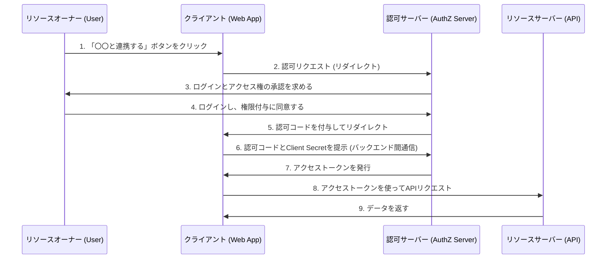
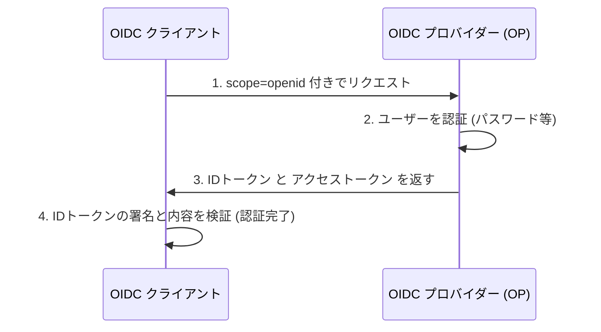

現代のウェブアプリケーションやモバイルアプリにおいて、「Googleでログイン」「GitHubでログイン」といったソーシャルログイン機能は欠かせないものとなっています。しかし、その裏側でどのような通信が行われ、安全性が担保されているのかを正確に理解している開発者は意外と少ないかもしれません。

特に「認証（Authentication）」と「認可（Authorization）」の違いを混同してしまうケースは後を絶たず、それが原因で重大なセキュリティインシデントに発展することもあります。

本記事では、認証と認可の根本的な違いから出発し、認可の標準フレームワークである「OAuth 2.0」、そしてOAuth 2.0を拡張して認証機能を追加した「OpenID Connect (OIDC)」、さらにそこで用いられるトークン技術「JWT (JSON Web Token)」まで、徹底的に深掘りして解説します。

## 1. 「認証」と「認可」の根本的な違い

セキュリティの世界において、「認証（Authentication）」と「認可（Authorization）」は似て非なる概念です。この2つを明確に区別することが、OAuth 2.0やOIDCを理解するための第一歩となります。

### 認証（Authentication）: 「あなたは誰か？」
認証とは、システムにアクセスしようとしているユーザーが「本物かどうか（主張する通りの人物か）」を確認するプロセスです。
- **目的**: 身元の証明（Identity Verification）
- **手法**: パスワード、生体認証（指紋、顔）、ワンタイムパスワード（MFA）、物理セキュリティキーなど。
- **結果**: ユーザーの身元が確認され、システム内にセッションが確立される。

### 認可（Authorization）: 「あなたは何ができるか？」
認可とは、すでに身元が判明している（あるいは特定の権限を持っている）主体に対して、特定のリソースへのアクセス権限を与えるプロセスです。
- **目的**: 権限の付与とアクセス制御（Access Control）
- **手法**: アクセスコントロールリスト（ACL）、ロールベースアクセス制御（RBAC）、OAuth 2.0におけるアクセストークンなど。
- **結果**: 許可された操作（読み取り、書き込み、削除など）のみが実行可能になる。

### ホテルの例え
この違いは「ホテル」に例えると非常に分かりやすくなります。

1. **フロントデスクでのチェックイン（認証）**:
   フロントで身分証明書（パスポートや運転免許証）を提示し、「予約した山田太郎であること」を証明します。これが認証です。
2. **カードキーの受け取りと部屋への入室（認可）**:
   身元が確認されると、フロントスタッフは「305号室」を開けられるカードキーを渡します。あなたが305号室のドアにカードキーをかざして入室する際、ドアのロック機構は「あなたが山田太郎かどうか」は気にしていません。単に「このカードキーには305号室を開ける権限があるか」だけを確認しています。これが認可です。

## 2. OAuth 2.0 深掘り：認可のためのフレームワーク

### OAuth 2.0とは？
OAuth 2.0（RFC 6749）は、サードパーティのアプリケーションに対して、ユーザーのパスワードを渡すことなく、限定的なアクセス権限（アクセストークン）を付与するための**「認可」の標準プロトコル**です。

### OAuth 2.0の4つのロール（登場人物）
OAuth 2.0のフローを理解するためには、以下の4つの役割を把握する必要があります。

1. **リソースオーナー (Resource Owner)**:
   データ（リソース）の所有者。通常は人間（ユーザー）です。
2. **クライアント (Client)**:
   リソースオーナーのデータにアクセスしたいサードパーティ・アプリケーション。
3. **認可サーバー (Authorization Server)**:
   リソースオーナーを認証し、同意を得た上でクライアントにアクセストークンを発行するサーバー。
4. **リソースサーバー (Resource Server)**:
   リソースオーナーのデータを保持しており、アクセストークンを検証してデータへのアクセスを許可・拒否するAPIサーバー。

### 認可コードフロー（Authorization Code Flow）
OAuth 2.0にはいくつかのグラントタイプ（権限付与方式）がありますが、最も安全で一般的なのが「認可コードフロー」です。主にバックエンドサーバーを持つWebアプリケーションで使用されます。



このフローの最大のポイントは、**ステップ6〜7**です。クライアントは直接アクセストークンを受け取るのではなく、一時的な「認可コード」をフロントエンド経由で受け取ります。そして、バックエンドの安全な通信環境で、認可コードとクライアントの秘密鍵（Client Secret）を認可サーバーに送信し、アクセストークンと交換します。これにより、トークンがブラウザの履歴やネットワーク傍受によって漏洩するリスクを極限まで減らしています。

#### セキュリティ拡張：PKCE (Proof Key for Code Exchange)
ネイティブアプリやSPA（Single Page Application）のように、Client Secretを安全に保持できないパブリッククライアント向けには、PKCE（ピクシー: RFC 7636）という拡張仕様が必須となります。PKCEは、認可リクエスト時に動的に生成したハッシュ値（code_challenge）を送り、トークンリクエスト時にその元の値（code_verifier）を送ることで、認可コードの横取り攻撃（Authorization Code Interception Attack）を防ぎます。現在では、セキュリティのベストプラクティスとして、WebアプリケーションであってもPKCEを利用することが推奨されています。

## 3. OAuth 2.0を「認証」に使うことの危険性

OAuth 2.0が普及し始めると、多くの開発者が「FacebookやGoogleのOAuth機能を使えば、自前のログインシステムを作らなくて済む」と考えました。つまり、**認可のプロトコルであるOAuth 2.0を、認証（ログイン）に流用した**のです。これを「疑似認証（Pseudo-Authentication）」と呼びます。

### なぜ危険なのか？
OAuth 2.0のアクセストークンは「特定のリソースにアクセスできる権利」を示すだけであり、「ユーザーがいつ、どこで、どのように認証されたか」という情報は一切含まれていません。また、アクセストークンはクライアント（アプリ）に紐付いていますが、リソースサーバーは「誰向けのトークンか」を検証せずにアクセスを許可してしまうことがあります。

#### アクセストークン置換攻撃 (Access Token Substitution Attack)
悪意のある攻撃者が、別の脆弱なアプリ（App A）向けに発行された正当なアクセストークンを傍受、または取得したとします。攻撃者はそのトークンを使って、標的となるアプリ（App B）のログインAPIにリクエストを送ります。
もしApp Bが「アクセストークンが有効であり、ユーザー情報を取得できればログイン成功とする」という雑な実装をしていた場合、攻撃者は被害者のアカウントとしてApp Bに不正ログインできてしまいます。
これは、ホテルで例えるなら「305号室の鍵を持ってきた人を、無条件で山田太郎だと信じ込む」という致命的なミスに相当します。

## 4. OpenID Connect (OIDC) の誕生

OAuth 2.0を認証に流用することのリスクを解決するため、OAuth 2.0を拡張して設計された**認証のための標準プロトコル**が「OpenID Connect (OIDC)」です。

### OIDCの仕組みと「IDトークン」
OIDCは、OAuth 2.0のフローに加えて、**「IDトークン（ID Token）」**という新しい概念を導入しました。
IDトークンは、ユーザーの認証に関する情報（Identity）が詰め込まれた、クライアント向けの証明書です。通常、JWT（JSON Web Token）というフォーマットで表現され、認可サーバーのデジタル署名が付与されています。

クライアントは認可リクエストを送る際、`scope`パラメータに`openid`を含めます。
これにより、認可サーバーはアクセストークンと共にIDトークンを発行します。



### OIDCが安全な理由
IDトークンには以下のような情報（クレーム）が含まれています。
- `iss` (Issuer): 誰がこのトークンを発行したか
- `sub` (Subject): ユーザーの一意な識別子
- `aud` (Audience): このトークンは誰（どのクライアント）に向けて発行されたか
- `exp` (Expiration Time): トークンの有効期限
- `iat` (Issued At): トークンの発行日時

クライアントは受け取ったIDトークンの`aud`（Audience）を確認することで、「このトークンが確実に自アプリ向けに発行されたものか」を検証できます。これにより、先述のアクセストークン置換攻撃を完全に防ぐことができます。

## 5. JWT (JSON Web Token) の仕組みと検証

OIDCのIDトークンとして採用されている「JWT（ジョット: RFC 7519）」について、その構造を深掘りしましょう。
JWTは、JSONデータをURLセーフな文字列として表現し、デジタル署名を付与することで改ざんを防ぐ規格です。

### JWTの3つの構成要素
JWTは、ドット（`.`）で区切られた3つのパートで構成されます。
`Header.Payload.Signature`

#### 1. Header（ヘッダー）
トークンの種類（typ）と、使用されている署名アルゴリズム（alg）を指定します。
```json
{
  "typ": "JWT",
  "alg": "RS256"
}
```
これをBase64URLエンコードします。

#### 2. Payload（ペイロード）
実際のデータ（クレーム）が含まれます。
```json
{
  "iss": "https://accounts.google.com",
  "sub": "1234567890",
  "aud": "your-client-id.apps.googleusercontent.com",
  "iat": 1695800000,
  "exp": 1695803600,
  "name": "Taro Yamada",
  "email": "taro@example.com"
}
```
これもBase64URLエンコードされます。（※暗号化されているわけではないため、機密情報をペイロードに含めてはいけません。）

#### 3. Signature（シグネチャ・署名）
HeaderとPayloadのエンコード済み文字列を結合し、指定されたアルゴリズムと秘密鍵（または秘密鍵・公開鍵のペア）を使って計算された署名です。
RS256（RSA署名）の場合、認可サーバーが秘密鍵で署名を作成し、クライアントは公開鍵（通常はJWKSエンドポイントから取得）を使って署名を検証します。

### JWT検証時のセキュリティ上の落とし穴
JWTを自前で検証する際、以下のような脆弱性を作り込まないように注意が必要です。

1. **`alg: none` 攻撃**: 
   ヘッダーの`alg`に`none`を指定すると、一部の不適切に実装されたライブラリが署名の検証をスキップしてしまうという有名な脆弱性です。必ずアルゴリズムを明示的に指定して検証するように設定する必要があります。
2. **公開鍵と秘密鍵の混同 (HMAC/RSA Confusion)**:
   攻撃者がヘッダーのアルゴリズムをRS256からHS256（共通鍵暗号）に変更し、署名検証用の公開鍵を共通鍵として使って偽造トークンを作成する攻撃です。ライブラリ側で許可するアルゴリズムを厳密に制限することで防げます。
3. **Audience (`aud`) の未確認**:
   先述の通り、自アプリ向けのトークンであることを確認しないと、別アプリのトークンで不正ログインを許してしまいます。

## 結論：モダンな認証・認可の未来

OAuth 2.0とOpenID Connectは、今日のウェブにおける認証・認可の絶対的な基盤です。
- **認可が必要なら**: OAuth 2.0
- **認証（ログイン）が必要なら**: OpenID Connect (OIDC)

これらを正しく使い分け、IDトークンの検証を厳密に行うことが、安全なアプリケーション開発の必須条件となります。

近年では、パスワードレスを実現する「FIDO2 / WebAuthn」や、デバイス間で認証情報を同期する「パスキー (Passkeys)」といった新しい技術が普及し始めています。しかし、これらの技術は主に「ユーザーとデバイス間の認証」を強化するものであり、バックエンドシステムやサードパーティ間の連携においては、引き続きOIDCとOAuth 2.0が中心的な役割を担い続けるでしょう。

技術の裏側にある「なぜその仕様になっているのか」という設計思想（Why）を理解することで、より堅牢でセキュアなシステムを設計できるようになります。
