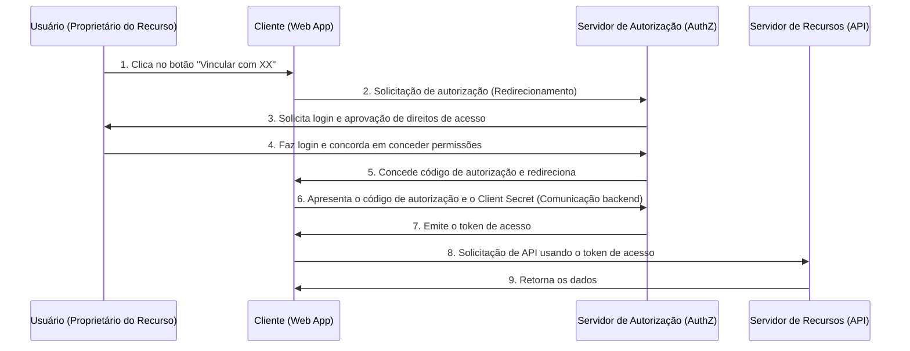
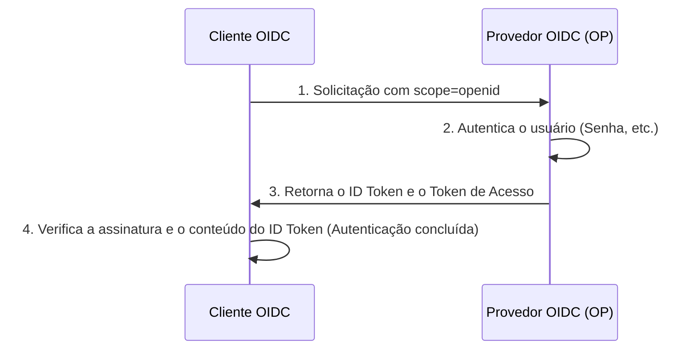

Nas aplicações web e móveis modernas, funções de login social como "Login com Google" ou "Login com GitHub" tornaram-se indispensáveis. No entanto, o número de desenvolvedores que entendem exatamente que tipo de comunicação ocorre nos bastidores e como a segurança é garantida pode ser surpreendentemente pequeno.

Em particular, os casos em que a diferença entre "Autenticação" (Authentication) e "Autorização" (Authorization) é confundida são infinitos, e isso às vezes pode levar a graves incidentes de segurança.

Neste artigo, partindo da diferença fundamental entre autenticação e autorização, exploraremos a fundo o "OAuth 2.0", que é a estrutura padrão para autorização, o "OpenID Connect (OIDC)", que estende o OAuth 2.0 para adicionar recursos de autenticação, e a tecnologia de token "JWT (JSON Web Token)" usada lá.

## 1. A diferença fundamental entre "Autenticação" e "Autorização"

No mundo da segurança, "Autenticação" (Authentication) e "Autorização" (Authorization) são conceitos semelhantes, mas diferentes. Distinguir claramente esses dois é o primeiro passo para entender o OAuth 2.0 e o OIDC.

### Autenticação (Authentication): "Quem é você?"
A autenticação é o processo de confirmar se o usuário que tenta acessar o sistema é "genuíno (a pessoa que afirma ser)".
- **Objetivo**: Verificação de identidade (Identity Verification)
- **Métodos**: Senhas, biometria (impressão digital, rosto), senhas de uso único (MFA), chaves de segurança físicas, etc.
- **Resultado**: A identidade do usuário é confirmada e uma sessão é estabelecida no sistema.

### Autorização (Authorization): "O que você pode fazer?"
A autorização é o processo de conceder direitos de acesso a recursos específicos para uma entidade cuja identidade já foi determinada (ou que possui privilégios específicos).
- **Objetivo**: Concessão de permissões e controle de acesso (Access Control)
- **Métodos**: Listas de controle de acesso (ACL), controle de acesso baseado em funções (RBAC), tokens de acesso no OAuth 2.0, etc.
- **Resultado**: Apenas as operações permitidas (leitura, gravação, exclusão, etc.) podem ser executadas.

### A metáfora do hotel
Essa diferença é muito fácil de entender quando comparada a um "hotel".

1. **Check-in na recepção (Autenticação)**:
   Você apresenta sua identidade (passaporte ou carteira de motorista) na recepção para provar que "você é o Taro Yamada que fez a reserva". Isso é autenticação.
2. **Recebimento da chave de cartão e entrada no quarto (Autorização)**:
   Assim que sua identidade é confirmada, a equipe da recepção lhe entrega uma chave de cartão que pode abrir o "Quarto 305". Quando você aproxima a chave de cartão da porta do quarto 305 para entrar, o mecanismo de bloqueio da porta não se importa "se você é o Taro Yamada ou não". Ele simplesmente verifica "se esta chave de cartão tem autorização para abrir o Quarto 305". Isso é autorização.

## 2. Mergulho profundo no OAuth 2.0: Um framework para Autorização

### O que é OAuth 2.0?
OAuth 2.0 (RFC 6749) é um **protocolo padrão de "autorização"** para conceder direitos de acesso limitados (tokens de acesso) a aplicações de terceiros sem repassar a senha do usuário.

### Os 4 papéis (personagens) do OAuth 2.0
Para entender o fluxo do OAuth 2.0, você precisa compreender os quatro papéis a seguir.

1. **Proprietário do Recurso (Resource Owner)**:
   O proprietário dos dados (recursos). Geralmente um humano (usuário).
2. **Cliente (Client)**:
   Uma aplicação de terceiros que deseja acessar os dados do proprietário do recurso.
3. **Servidor de Autorização (Authorization Server)**:
   O servidor que autentica o proprietário do recurso e, com o consentimento dele, emite um token de acesso ao cliente.
4. **Servidor de Recursos (Resource Server)**:
   O servidor de API que detém os dados do proprietário do recurso, verifica o token de acesso e permite ou nega o acesso aos dados.

### Fluxo de Código de Autorização (Authorization Code Flow)
Existem vários tipos de concessão (grant types) no OAuth 2.0, mas o mais seguro e comum é o "Fluxo de Código de Autorização". É usado principalmente em aplicações Web com um servidor backend.



O ponto mais importante desse fluxo são as **etapas 6 a 7**. O cliente não recebe diretamente o token de acesso, mas recebe um "código de autorização" temporário através do frontend. Então, em um ambiente de comunicação seguro no backend, ele envia o código de autorização e a chave secreta do cliente (Client Secret) para o servidor de autorização e os trocam por um token de acesso. Isso minimiza o risco do token vazar pelo histórico do navegador ou por interceptação na rede.

#### Extensão de Segurança: PKCE (Proof Key for Code Exchange)
Para clientes públicos que não podem armazenar com segurança o Client Secret, como aplicativos nativos ou SPA (Single Page Application), a especificação de extensão PKCE (Pixy: RFC 7636) é obrigatória. O PKCE envia um valor de hash gerado dinamicamente (`code_challenge`) no momento da solicitação de autorização, e envia o valor original (`code_verifier`) no momento da solicitação do token, prevenindo assim o Ataque de Interceptação do Código de Autorização (Authorization Code Interception Attack). Atualmente, é recomendado como prática recomendada de segurança que até mesmo as aplicações Web utilizem PKCE.

## 3. Os perigos de usar o OAuth 2.0 para "Autenticação"

Quando o OAuth 2.0 começou a se popularizar, muitos desenvolvedores pensaram: "Se usarmos a função OAuth do Facebook ou do Google, não precisaremos construir nosso próprio sistema de login". Ou seja, **eles se apropriaram do OAuth 2.0, que é um protocolo de autorização, para usá-lo como autenticação (login)**. Isso é chamado de "Pseudo-Autenticação" (Pseudo-Authentication).

### Por que é perigoso?
O token de acesso do OAuth 2.0 indica apenas "o direito de acessar um recurso específico" e não contém nenhuma informação sobre "quando, onde ou como o usuário foi autenticado". Além disso, os tokens de acesso estão vinculados ao cliente (aplicativo), mas o servidor de recursos pode permitir o acesso sem verificar "para quem o token foi emitido".

#### Ataque de Substituição de Token de Acesso (Access Token Substitution Attack)
Suponha que um invasor mal-intencionado intercepte ou obtenha um token de acesso legítimo emitido para outro aplicativo vulnerável (App A). O invasor usa esse token para enviar uma solicitação à API de login do aplicativo alvo (App B).
Se o App B tiver uma implementação falha como "se o token de acesso for válido e informações do usuário puderem ser obtidas, considere o login um sucesso", o invasor poderá fazer login ilegalmente no App B como a conta da vítima.
Na metáfora do hotel, isso equivaleria ao erro fatal de "acreditar incondicionalmente que quem quer que traga a chave do Quarto 305 seja o Taro Yamada".

## 4. O nascimento do OpenID Connect (OIDC)

Para resolver os riscos de usar o OAuth 2.0 para autenticação, foi projetado um **protocolo padrão para autenticação** que estende o OAuth 2.0: o "OpenID Connect (OIDC)".

### Como funciona o OIDC e o "ID Token"
O OIDC introduziu um novo conceito ao fluxo do OAuth 2.0, o **"ID Token" (Token de ID)**.
O ID Token é um certificado para o cliente que contém as informações de autenticação do usuário (Identity). Geralmente é representado no formato JWT (JSON Web Token) e carrega a assinatura digital do servidor de autorização.

Quando o cliente envia uma solicitação de autorização, ele inclui `openid` no parâmetro `scope`.
Com isso, o servidor de autorização emite o ID Token junto com o token de acesso.



### Por que o OIDC é seguro?
O ID Token contém informações (claims) como:
- `iss` (Issuer): Quem emitiu este token
- `sub` (Subject): Identificador único do usuário
- `aud` (Audience): Para quem (qual cliente) este token foi emitido
- `exp` (Expiration Time): Tempo de expiração do token
- `iat` (Issued At): Data e hora de emissão do token

Ao verificar o `aud` (Audience) do ID Token recebido, o cliente pode confirmar que "este token foi definitivamente emitido para o meu aplicativo". Isso previne completamente o ataque de substituição de token de acesso mencionado anteriormente.

## 5. Estrutura e Verificação do JWT (JSON Web Token)

Vamos nos aprofundar na estrutura do "JWT (RFC 7519)", que foi adotado como o ID Token do OIDC.
O JWT é um padrão que previne a adulteração expressando os dados JSON como uma string URL-safe e anexando uma assinatura digital.

### Os 3 componentes do JWT
O JWT consiste em três partes separadas por pontos (`.`).
`Header.Payload.Signature`

#### 1. Header (Cabeçalho)
Especifica o tipo de token (`typ`) e o algoritmo de assinatura usado (`alg`).
```json
{
  "typ": "JWT",
  "alg": "RS256"
}
```
Isso é codificado em Base64URL.

#### 2. Payload (Carga Útil)
Contém os dados reais (claims).
```json
{
  "iss": "https://accounts.google.com",
  "sub": "1234567890",
  "aud": "your-client-id.apps.googleusercontent.com",
  "iat": 1695800000,
  "exp": 1695803600,
  "name": "Taro Yamada",
  "email": "taro@example.com"
}
```
Isso também é codificado em Base64URL. (*Como não é criptografado, informações confidenciais não devem ser incluídas no payload.*)

#### 3. Signature (Assinatura)
Uma assinatura calculada concatenando as strings codificadas do Header e do Payload, usando o algoritmo especificado e uma chave secreta (ou um par de chaves pública e privada).
No caso do RS256 (assinatura RSA), o servidor de autorização cria a assinatura com a chave privada, e o cliente verifica a assinatura usando a chave pública (geralmente obtida do endpoint JWKS).

### Armadilhas de segurança na verificação do JWT
Ao verificar o JWT por conta própria, você deve tomar cuidado para não introduzir vulnerabilidades como as seguintes:

1. **Ataque `alg: none`**: 
   É uma vulnerabilidade famosa em que, se `none` for especificado para `alg` no cabeçalho, algumas bibliotecas mal implementadas podem ignorar a verificação da assinatura. O algoritmo deve sempre ser especificado explicitamente e configurado para ser verificado.
2. **Confusão de chave pública e privada (HMAC/RSA Confusion)**:
   Um ataque onde o invasor altera o algoritmo no cabeçalho de RS256 para HS256 (criptografia de chave simétrica) e usa a chave pública destinada à verificação da assinatura como chave simétrica para criar um token forjado. Isso pode ser evitado restringindo estritamente os algoritmos permitidos no lado da biblioteca.
3. **Não verificação do Audience (`aud`)**:
   Como mencionado anteriormente, se você não verificar se o token é destinado ao seu aplicativo, permitirá logins não autorizados com tokens de outros aplicativos.

## Conclusão: O futuro da Autenticação e Autorização modernas

O OAuth 2.0 e o OpenID Connect são a base absoluta da autenticação e autorização na web atual.
- **Se precisar de autorização**: OAuth 2.0
- **Se precisar de autenticação (login)**: OpenID Connect (OIDC)

Utilizar esses padrões adequadamente e realizar a verificação rigorosa do ID Token é uma exigência essencial para o desenvolvimento seguro de aplicativos.

Nos últimos anos, novas tecnologias começaram a se popularizar, como "FIDO2 / WebAuthn" (que viabiliza ambientes sem senhas) e "Passkeys" (Chaves de acesso, que sincronizam informações de autenticação entre dispositivos). No entanto, essas tecnologias servem principalmente para fortalecer "a autenticação entre o usuário e o dispositivo"; na integração entre sistemas backend ou terceiros, o OIDC e o OAuth 2.0 continuarão a desempenhar um papel central.

Compreender a filosofia de design (o "porquê") por trás das especificações tecnológicas, permitirá que você crie sistemas muito mais robustos e seguros.
