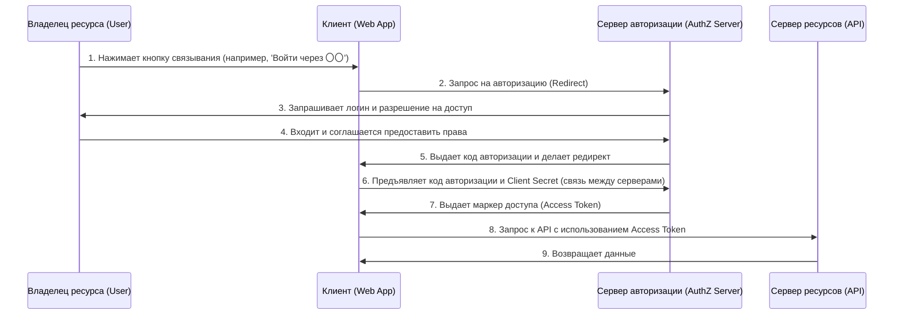
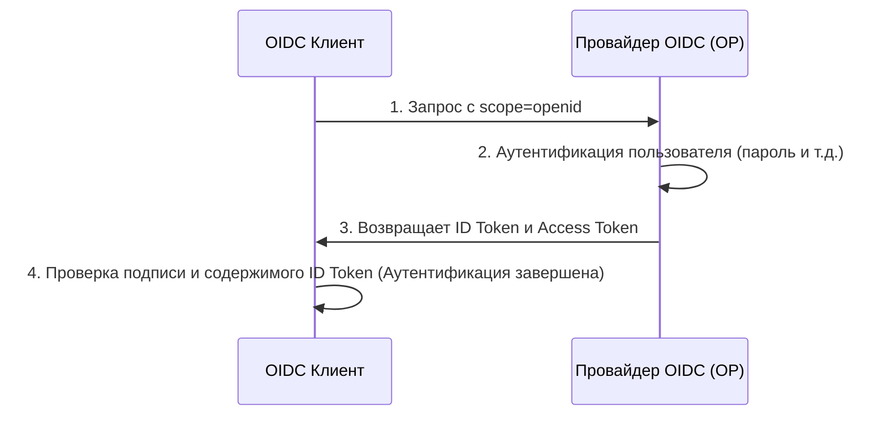

В современных веб- и мобильных приложениях функции социального входа, такие как "Войти через Google" или "Войти через GitHub", стали незаменимыми. Однако на удивление мало разработчиков точно понимают, какие именно коммуникации происходят под капотом и как обеспечивается их безопасность.

В частности, случаи, когда путают различия между «аутентификацией» (Authentication) и «авторизацией» (Authorization), не прекращаются, и это иногда приводит к серьезным инцидентам безопасности.

В этой статье мы подробно и глубоко разберем всё, начиная с фундаментальной разницы между аутентификацией и авторизацией, перейдем к стандартному фреймворку авторизации "OAuth 2.0", расширяющему его для добавления функции аутентификации протоколу "OpenID Connect (OIDC)", и вплоть до технологии токенов "JWT (JSON Web Token)", используемой в них.

## 1. Фундаментальное различие между «аутентификацией» и «авторизацией»

В мире безопасности «аутентификация» (Authentication) и «авторизация» (Authorization) — это похожие, но разные концепции. Четкое различие между ними — первый шаг к пониманию OAuth 2.0 и OIDC.

### Аутентификация (Authentication): "Кто вы?"
Аутентификация — это процесс проверки того, является ли пользователь, пытающийся получить доступ к системе, «настоящим» (тем, за кого он себя выдает).
- **Цель**: Подтверждение личности (Identity Verification)
- **Методы**: Пароли, биометрия (отпечаток пальца, лицо), одноразовые пароли (MFA), физические ключи безопасности и т.д.
- **Результат**: Личность пользователя подтверждена, и в системе устанавливается сеанс.

### Авторизация (Authorization): "Что вы можете делать?"
Авторизация — это процесс предоставления прав доступа к определенным ресурсам субъекту, личность которого уже установлена (или который обладает определенными правами).
- **Цель**: Предоставление прав и контроль доступа (Access Control)
- **Методы**: Списки контроля доступа (ACL), управление доступом на основе ролей (RBAC), токены доступа в OAuth 2.0 и т.д.
- **Результат**: Разрешается выполнение только разрешенных операций (чтение, запись, удаление и т.д.).

### Аналогия с гостиницей
Эту разницу очень легко понять на примере «гостиницы».

1. **Регистрация на стойке администратора (Аутентификация)**:
   Вы предъявляете на стойке удостоверение личности (паспорт или водительские права) и доказываете, что «вы — Иван Иванов, который забронировал номер». Это аутентификация.
2. **Получение ключ-карты и вход в номер (Авторизация)**:
   Когда ваша личность подтверждена, сотрудник стойки регистрации выдает вам ключ-карту, которая может открыть номер «305». Когда вы прикладываете ключ-карту к двери номера 305, чтобы войти, механизму замка двери все равно, «Иван Иванов ли вы». Он просто проверяет, «есть ли у этой ключ-карты право открыть номер 305». Это авторизация.

## 2. Глубокое погружение в OAuth 2.0: Фреймворк для авторизации

### Что такое OAuth 2.0?
OAuth 2.0 (RFC 6749) — это **стандартный протокол «авторизации»** для предоставления сторонним приложениям ограниченных прав доступа (токена доступа) без передачи пароля пользователя.

### 4 роли (участника) в OAuth 2.0
Чтобы понять поток OAuth 2.0, необходимо знать следующие 4 роли:

1. **Владелец ресурса (Resource Owner)**:
   Владелец данных (ресурса). Обычно это человек (пользователь).
2. **Клиент (Client)**:
   Стороннее приложение, которое хочет получить доступ к данным владельца ресурса.
3. **Сервер авторизации (Authorization Server)**:
   Сервер, который аутентифицирует владельца ресурса и после получения его согласия выдает токен доступа клиенту.
4. **Сервер ресурсов (Resource Server)**:
   API-сервер, который хранит данные владельца ресурса, проверяет токен доступа и разрешает или запрещает доступ к данным.

### Поток кода авторизации (Authorization Code Flow)
В OAuth 2.0 есть несколько типов предоставления прав (grant types), но самым безопасным и распространенным является «Поток кода авторизации». В основном он используется в веб-приложениях с бэкенд-серверами.



Самый важный момент в этом потоке — **шаги 6 и 7**. Клиент не получает маркер доступа напрямую, а получает временный «код авторизации» через фронтенд. Затем, в безопасной среде связи на бэкенде, он отправляет код авторизации и секретный ключ клиента (Client Secret) на сервер авторизации для обмена на маркер доступа. Это максимально снижает риск утечки токена через историю браузера или перехват сети.

#### Расширение безопасности: PKCE (Proof Key for Code Exchange)
Для публичных клиентов, которые не могут безопасно хранить Client Secret, таких как нативные приложения или SPA (Single Page Application), обязательно использование расширения PKCE (RFC 7636). PKCE предотвращает атаки перехвата кода авторизации (Authorization Code Interception Attack) путем отправки динамически сгенерированного хеш-значения (code_challenge) при запросе на авторизацию и отправки исходного значения (code_verifier) при запросе токена. В настоящее время в качестве лучшей практики безопасности рекомендуется использовать PKCE даже для веб-приложений.

## 3. Опасность использования OAuth 2.0 для «аутентификации»

По мере распространения OAuth 2.0 многие разработчики решили: «Если мы используем функции OAuth от Facebook или Google, нам не нужно будет создавать собственную систему входа». Другими словами, **они приспособили протокол авторизации OAuth 2.0 для аутентификации (входа)**. Это называется «Псевдо-аутентификацией» (Pseudo-Authentication).

### Почему это опасно?
Маркер доступа OAuth 2.0 указывает только на «право доступа к определенному ресурсу» и не содержит никакой информации о том, «когда, где и как пользователь был аутентифицирован». Кроме того, хотя маркер доступа привязан к клиенту (приложению), сервер ресурсов иногда может разрешить доступ без проверки того, «для кого предназначен этот токен».

#### Атака с подменой маркера доступа (Access Token Substitution Attack)
Предположим, злонамеренный злоумышленник перехватил или получил действительный маркер доступа, выпущенный для другого уязвимого приложения (App A). Злоумышленник использует этот токен для отправки запроса к API входа в целевое приложение (App B).
Если в App B реализована небрежная логика, например «если маркер доступа действителен и мы можем получить информацию о пользователе, считаем вход успешным», злоумышленник сможет несанкционированно войти в App B как жертва.
Возвращаясь к аналогии с гостиницей, это эквивалентно фатальной ошибке «безоговорочно верить, что любой человек, принесший ключ от номера 305, является Иваном Ивановым».

## 4. Рождение OpenID Connect (OIDC)

Чтобы устранить риски использования OAuth 2.0 для аутентификации, был разработан **стандартный протокол для аутентификации** «OpenID Connect (OIDC)», являющийся расширением OAuth 2.0.

### Как работает OIDC и "ID Token"
В дополнение к потоку OAuth 2.0, OIDC ввел новую концепцию **«Токен идентификации» (ID Token)**.
ID Token — это сертификат для клиента, в который упакована информация об аутентификации пользователя (Identity). Обычно он представлен в формате JWT (JSON Web Token) и содержит цифровую подпись сервера авторизации.

При отправке запроса на авторизацию клиент включает `openid` в параметр `scope`.
В результате сервер авторизации выдает ID Token вместе с маркером доступа.



### Почему OIDC безопасен
ID Token содержит следующую информацию (claims):
- `iss` (Issuer): Кто выпустил этот токен
- `sub` (Subject): Уникальный идентификатор пользователя
- `aud` (Audience): Для кого (какого клиента) был выпущен этот токен
- `exp` (Expiration Time): Срок действия токена
- `iat` (Issued At): Время выпуска токена

Проверяя `aud` (Audience) полученного ID Token, клиент может убедиться, что «этот токен определенно был выпущен для моего приложения». Это полностью предотвращает упомянутую выше атаку с подменой маркера доступа.

## 5. Устройство и проверка JWT (JSON Web Token)

Давайте подробнее рассмотрим структуру «JWT (RFC 7519)», принятого в качестве ID Token в OIDC.
JWT — это стандарт, который предотвращает фальсификацию путем представления данных JSON в виде URL-безопасной строки и добавления цифровой подписи.

### 3 компонента JWT
JWT состоит из трех частей, разделенных точкой (`.`).
`Header.Payload.Signature`

#### 1. Header (Заголовок)
Указывает тип токена (typ) и используемый алгоритм подписи (alg).
```json
{
  "typ": "JWT",
  "alg": "RS256"
}
```
Это кодируется в Base64URL.

#### 2. Payload (Полезная нагрузка)
Содержит фактические данные (claims).
```json
{
  "iss": "https://accounts.google.com",
  "sub": "1234567890",
  "aud": "your-client-id.apps.googleusercontent.com",
  "iat": 1695800000,
  "exp": 1695803600,
  "name": "Taro Yamada",
  "email": "taro@example.com"
}
```
Она также кодируется в Base64URL. (*Поскольку данные не зашифрованы, в полезную нагрузку не следует включать конфиденциальную информацию.*)

#### 3. Signature (Подпись)
Это подпись, рассчитанная с использованием указанного алгоритма и секретного ключа (или пары открытого/закрытого ключей) путем объединения закодированных строк Header и Payload.
В случае RS256 (RSA-подпись) сервер авторизации создает подпись с помощью закрытого ключа, а клиент проверяет подпись с помощью открытого ключа (обычно получаемого из эндпоинта JWKS).

### Уязвимости в безопасности при проверке JWT
При самостоятельной проверке JWT необходимо следить за тем, чтобы не создать следующие уязвимости.

1. **Атака `alg: none`**: 
   Это известная уязвимость, при которой, если в `alg` заголовка указано `none`, некоторые неправильно реализованные библиотеки пропускают проверку подписи. Обязательно нужно настроить явное указание алгоритма для проверки.
2. **Путаница открытого и закрытого ключей (HMAC/RSA Confusion)**:
   Атака, при которой злоумышленник изменяет алгоритм в заголовке с RS256 на HS256 (симметричное шифрование) и создает поддельный токен, используя открытый ключ для проверки подписи в качестве симметричного ключа. Это предотвращается строгим ограничением разрешенных алгоритмов на стороне библиотеки.
3. **Непроверенная аудитория (`aud`)**:
   Как упоминалось ранее, если вы не проверите, что токен предназначен для вашего приложения, вы допустите несанкционированный вход с токеном другого приложения.

## Заключение: Будущее современных систем аутентификации и авторизации

OAuth 2.0 и OpenID Connect — это абсолютная основа аутентификации и авторизации в сегодняшнем вебе.
- **Если вам нужна авторизация**: OAuth 2.0
- **Если вам нужна аутентификация (вход)**: OpenID Connect (OIDC)

Правильное их разделение и строгая проверка ID-токенов являются обязательными условиями для разработки безопасных приложений.

В последние годы начинают распространяться новые технологии, такие как «FIDO2 / WebAuthn», реализующие беспарольный доступ, и «Passkeys» (Ключи доступа), синхронизирующие учетные данные между устройствами. Однако эти технологии в первую очередь направлены на усиление «аутентификации между пользователем и устройством», и OIDC с OAuth 2.0 продолжат играть центральную роль во взаимодействии между бэкенд-системами и третьими сторонами.

Понимание философии проектирования (Почему?), лежащей в основе технологий («почему спецификация именно такая?»), позволит вам проектировать более надежные и безопасные системы.
