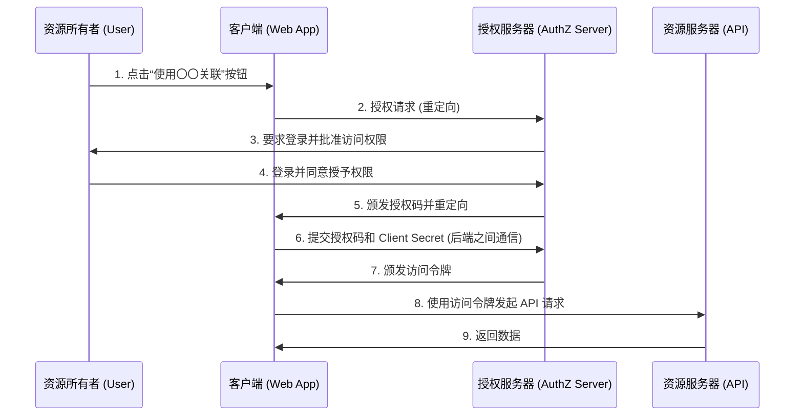
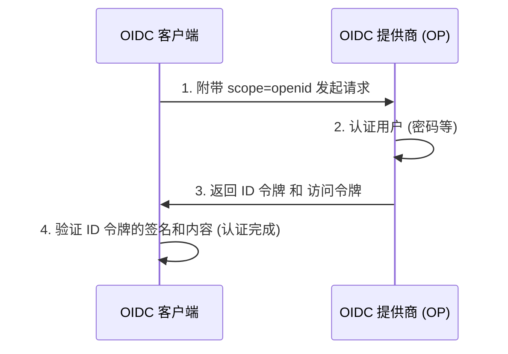

在现代的 Web 应用和移动应用中，“使用 Google 登录”或“使用 GitHub 登录”等社交登录功能已变得不可或缺。然而，令人意外的是，能够准确理解其背后发生了怎样的通信以及安全性是如何保障的开发者可能并不多。

尤其是混淆了“认证（Authentication）”与“授权（Authorization）”的区别的情况屡见不鲜，这甚至可能演变成严重的安全事件。

在本文中，我们将从认证与授权的根本区别出发，深入探讨作为授权标准框架的“OAuth 2.0”，基于 OAuth 2.0 扩展以添加认证功能的“OpenID Connect (OIDC)”，以及其中使用的令牌技术“JWT (JSON Web Token)”。

## 1. “认证”与“授权”的根本区别

在安全领域，“认证（Authentication）”和“授权（Authorization）”是看似相似实则不同的概念。明确区分这两者是理解 OAuth 2.0 和 OIDC 的第一步。

### 认证（Authentication）：“你是谁？”
认证是指确认试图访问系统的用户“是否为真（是否是其所主张的人）”的过程。
- **目的**: 身份验证（Identity Verification）
- **方法**: 密码、生物特征认证（指纹、面部）、一次性密码（MFA）、物理安全密钥等。
- **结果**: 用户的身份得到确认，并在系统内建立会话。

### 授权（Authorization）：“你能做什么？”
授权是指向已明确身份（或拥有特定权限）的主体，赋予访问特定资源权限的过程。
- **目的**: 授予权限与访问控制（Access Control）
- **方法**: 访问控制列表（ACL）、基于角色的访问控制（RBAC）、OAuth 2.0 中的访问令牌（Access Token）等。
- **结果**: 仅能执行被允许的操作（读取、写入、删除等）。

### 酒店的比喻
如果用“酒店”来打比方，这种区别就非常容易理解了。

1. **在前台办理入住（认证）**:
   你在前台出示身份证件（护照或驾驶证），证明“你是预订了房间的山田太郎”。这就是认证。
2. **领取房卡并进入房间（授权）**:
   身份确认后，前台工作人员会交给你一张能打开“305号房”的房卡。当你将房卡靠近 305 号房的门禁刷卡进入时，门锁机构并不关心“你是否是山田太郎”。它仅仅是确认“这张房卡是否拥有打开 305 号房的权限”。这就是授权。

## 2. 深入探讨 OAuth 2.0：授权框架

### 什么是 OAuth 2.0？
OAuth 2.0（RFC 6749）是一个**用于“授权”的标准协议**，它允许向第三方应用赋予有限的访问权限（访问令牌），而无需向其提供用户的密码。

### OAuth 2.0 的 4 个角色
为了理解 OAuth 2.0 的流程，必须掌握以下 4 个角色：

1. **资源所有者 (Resource Owner)**:
   数据（资源）的所有者。通常是人（用户）。
2. **客户端 (Client)**:
   希望访问资源所有者数据的第三方应用程序。
3. **授权服务器 (Authorization Server)**:
   负责认证资源所有者，并在获得同意后向客户端颁发访问令牌的服务器。
4. **资源服务器 (Resource Server)**:
   持有资源所有者的数据，验证访问令牌以允许或拒绝数据访问的 API 服务器。

### 授权码流程（Authorization Code Flow）
OAuth 2.0 有几种授权类型（Grant Type），但最安全且最常见的是“授权码流程”。它主要用于带有后端服务器的 Web 应用程序。



这个流程最大的关键点在于**步骤 6～7**。客户端不是直接获取访问令牌，而是通过前端接收一个临时的“授权码”。然后，在安全的后端通信环境中，将授权码与客户端的密钥（Client Secret）发送给授权服务器，以此换取访问令牌。这样可以最大限度地降低令牌因浏览器历史记录或网络拦截而泄露的风险。

#### 安全扩展：PKCE (Proof Key for Code Exchange)
对于原生应用或 SPA（单页应用）等无法安全保管 Client Secret 的公共客户端（Public Client），必须使用一项名为 PKCE（RFC 7636）的扩展规范。PKCE 通过在授权请求时发送动态生成的哈希值（code_challenge），并在令牌请求时发送其原始值（code_verifier），来防止授权码拦截攻击（Authorization Code Interception Attack）。现在，作为安全最佳实践，建议即便是 Web 应用程序也使用 PKCE。

## 3. 将 OAuth 2.0 用于“认证”的危险性

随着 OAuth 2.0 的普及，许多开发者认为：“只要使用 Facebook 或 Google 的 OAuth 功能，就不需要自己做登录系统了。”换句话说，**他们将作为授权协议的 OAuth 2.0 滥用于认证（登录）了**。这被称为“伪认证（Pseudo-Authentication）”。

### 为什么危险？
OAuth 2.0 的访问令牌仅仅表示“拥有访问特定资源的权利”，完全不包含“用户是在何时、何地、如何被认证的”信息。此外，访问令牌是与客户端（应用）绑定的，但资源服务器有时会不验证“令牌是发给谁的”就允许访问。

#### 访问令牌替换攻击 (Access Token Substitution Attack)
假设恶意攻击者拦截或获取了一个针对另一个存在漏洞的应用（App A）颁发的合法访问令牌。攻击者使用该令牌，向目标应用（App B）的登录 API 发送请求。
如果 App B 粗糙地实现了“只要访问令牌有效，且能获取到用户信息，就视为登录成功”的逻辑，攻击者就可以作为受害者账户非法登录到 App B。
用酒店来比喻，这相当于犯了一个致命的错误：“只要有人拿着 305 号房的钥匙，就无条件地相信他就是山田太郎”。

## 4. OpenID Connect (OIDC) 的诞生

为了解决将 OAuth 2.0 用于认证所带来的风险，基于 OAuth 2.0 扩展设计的**用于认证的标准协议**“OpenID Connect (OIDC)”应运而生。

### OIDC 的工作原理与“ID 令牌”
OIDC 在 OAuth 2.0 流程的基础上，引入了一个名为**“ID 令牌（ID Token）”**的新概念。
ID 令牌是包含用户认证相关信息（Identity）的、面向客户端的证书。它通常以 JWT（JSON Web Token）格式表示，并附有授权服务器的数字签名。

客户端在发送授权请求时，会在 `scope` 参数中包含 `openid`。
由此，授权服务器将连同访问令牌一起颁发 ID 令牌。



### OIDC 为何安全
ID 令牌包含以下信息（声明，Claims）：
- `iss` (Issuer): 谁颁发了这个令牌
- `sub` (Subject): 用户的唯一标识符
- `aud` (Audience): 这个令牌是发给谁（哪个客户端）的
- `exp` (Expiration Time): 令牌的过期时间
- `iat` (Issued At): 令牌的颁发时间

客户端通过检查收到的 ID 令牌的 `aud`（Audience），可以验证“这个令牌是否确实是发给自己应用的”。通过这种方式，可以完全防止前面提到的访问令牌替换攻击。

## 5. JWT (JSON Web Token) 的机制与验证

让我们深入探讨作为 OIDC 的 ID 令牌被采用的“JWT (RFC 7519)”的结构。
JWT 是一种将 JSON 数据表示为 URL 安全的字符串，并通过附加数字签名来防止篡改的规范。

### JWT 的 3 个组成部分
JWT 由点（`.`）分隔的 3 个部分组成。
`Header.Payload.Signature`

#### 1. Header（头部）
指定令牌的类型（typ）以及所使用的签名算法（alg）。
```json
{
  "typ": "JWT",
  "alg": "RS256"
}
```
这会被进行 Base64URL 编码。

#### 2. Payload（有效载荷）
包含实际的数据（声明）。
```json
{
  "iss": "https://accounts.google.com",
  "sub": "1234567890",
  "aud": "your-client-id.apps.googleusercontent.com",
  "iat": 1695800000,
  "exp": 1695803600,
  "name": "Taro Yamada",
  "email": "taro@example.com"
}
```
这同样会被进行 Base64URL 编码。（※由于它并未被加密，因此决不能在 Payload 中包含机密信息。）

#### 3. Signature（签名）
将编码后的 Header 和 Payload 字符串拼接后，使用指定的算法和私钥（或私钥-公钥对）计算出的签名。
在 RS256（RSA 签名）的情况下，授权服务器使用私钥创建签名，客户端使用公钥（通常从 JWKS 端点获取）来验证签名。

### 验证 JWT 时的安全陷阱
在自行验证 JWT 时，需要注意避免引入以下漏洞：

1. **`alg: none` 攻击**: 
   如果在 Header 的 `alg` 中指定 `none`，某些实现不当的库会跳过签名的验证，这是一个著名的漏洞。必须明确设置验证时所指定的算法。
2. **公钥与私钥混淆 (HMAC/RSA Confusion)**:
   攻击者将 Header 的算法从 RS256 更改为 HS256（对称加密），并将用于签名验证的公钥作为对称密钥来创建伪造令牌的攻击。通过在库端严格限制允许的算法即可防范。
3. **未确认 Audience (`aud`)**:
   如前所述，如果不确认该令牌是发给自己应用的，就会允许使用其他应用的令牌进行非法登录。

## 结论：现代认证与授权的未来

OAuth 2.0 和 OpenID Connect 是当今 Web 中认证与授权的绝对基石。
- **如果需要授权**: OAuth 2.0
- **如果需要认证（登录）**: OpenID Connect (OIDC)

正确区分使用这两者，并严格进行 ID 令牌的验证，是开发安全应用程序的必要条件。

近年来，实现无密码的“FIDO2 / WebAuthn”以及在设备间同步认证信息的“通行密钥 (Passkeys)”等新技术正开始普及。然而，这些技术主要强化的是“用户与设备之间的认证”，在后端系统以及第三方之间的关联中，OIDC 和 OAuth 2.0 仍将继续发挥核心作用。

通过理解技术背后的“为什么要设计成这样”的设计思想（Why），我们就能设计出更加坚固和安全的系统。
