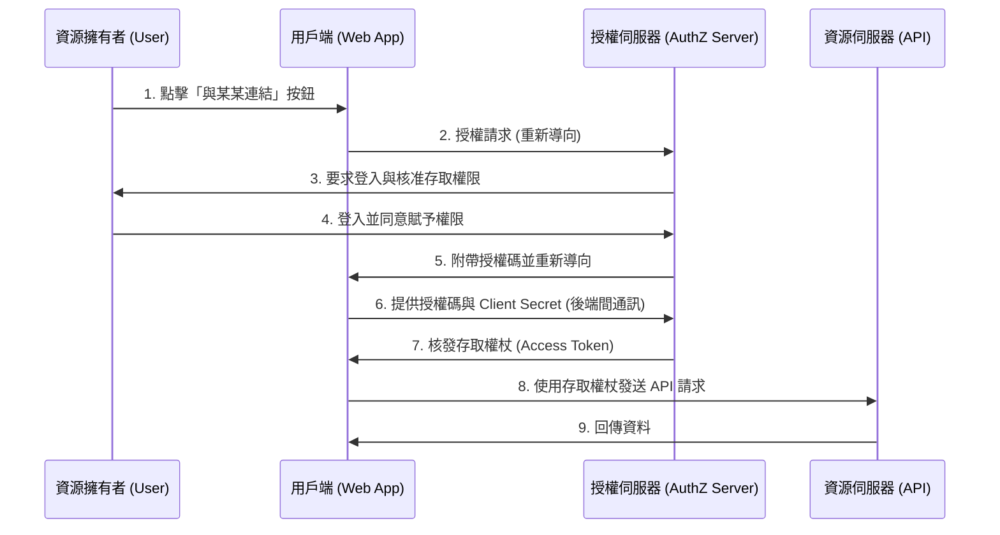
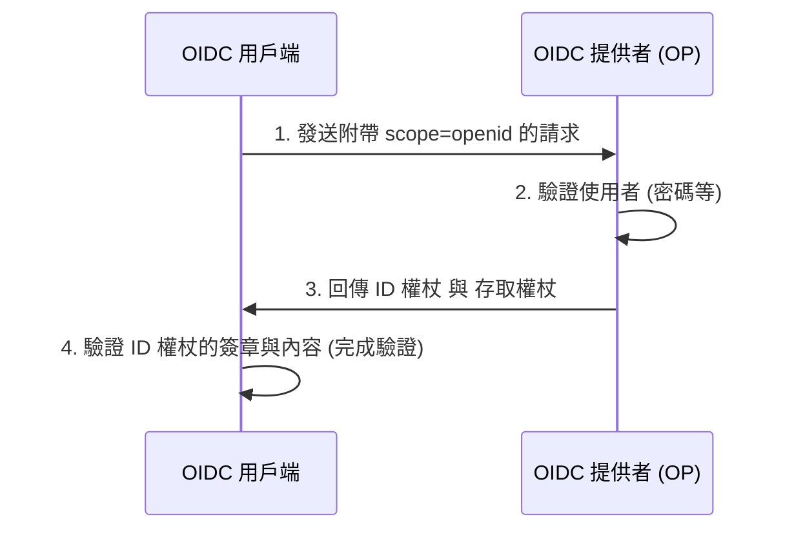

在現代的網頁應用程式與行動應用程式中，「使用 Google 登入」、「使用 GitHub 登入」等社群登入功能已成為不可或缺的一部分。然而，令人意外的是，能夠準確理解其背後進行了什麼樣的通訊以及如何確保安全性的開發者，可能並不多。

特別是混淆「驗證 (Authentication)」與「授權 (Authorization)」差異的情況層出不窮，這有時甚至會導致重大的資安事件。

本文將從驗證與授權的根本差異出發，深入探討授權的標準框架「OAuth 2.0」、擴充 OAuth 2.0 以加入驗證功能的「OpenID Connect (OIDC)」，以及其中使用的權杖技術「JWT (JSON Web Token)」。

## 1. 「驗證」與「授權」的根本差異

在資安領域中，「驗證 (Authentication)」與「授權 (Authorization)」是看似相似實則截然不同的概念。明確區分這兩者，是理解 OAuth 2.0 與 OIDC 的第一步。

### 驗證 (Authentication)： 「你是誰？」
驗證是指確認試圖存取系統的使用者是否為「真實本人 (是否如同其所聲稱的身份)」的過程。
- **目的**：身分證明 (Identity Verification)
- **方法**：密碼、生物辨識 (指紋、臉部)、一次性密碼 (MFA)、實體安全金鑰等。
- **結果**：確認使用者的身分，並在系統內建立工作階段 (Session)。

### 授權 (Authorization)： 「你能做什麼？」
授權是指對於已確認身分 (或擁有特定權限) 的主體，賦予其存取特定資源權限的過程。
- **目的**：賦予權限與存取控制 (Access Control)
- **方法**：存取控制串列 (ACL)、角色基礎存取控制 (RBAC)、OAuth 2.0 中的存取權杖 (Access Token) 等。
- **結果**：僅能執行被允許的操作 (讀取、寫入、刪除等)。

### 飯店的比喻
將這個差異用「飯店」來比喻會非常容易理解。

1. **在櫃檯辦理入住手續 (驗證)**：
   在櫃檯出示身分證件 (護照或駕照)，證明自己是「預訂房間的王小明」。這就是驗證。
2. **領取房卡與進入房間 (授權)**：
   身分確認後，櫃檯人員會交給您一張能打開「305號房」的房卡。當您將房卡感應 305 號房的房門以進入房間時，門鎖機制並不在乎「您是不是王小明」。它只是單純確認「這張房卡是否有打開 305 號房的權限」。這就是授權。

## 2. 深入探討 OAuth 2.0：用於授權的框架

### 什麼是 OAuth 2.0？
OAuth 2.0 (RFC 6749) 是在不將使用者的密碼交給第三方應用程式的情況下，賦予其有限的存取權限 (存取權杖) 的**「授權」標準協定**。

### OAuth 2.0 的 4 個角色
為了理解 OAuth 2.0 的流程，必須掌握以下 4 種角色：

1. **資源擁有者 (Resource Owner)**：
   資料 (資源) 的擁有者。通常是人 (使用者)。
2. **用戶端 (Client)**：
   想要存取資源擁有者資料的第三方應用程式。
3. **授權伺服器 (Authorization Server)**：
   驗證資源擁有者，並在取得同意後向用戶端核發存取權杖的伺服器。
4. **資源伺服器 (Resource Server)**：
   保存資源擁有者資料的 API 伺服器，會驗證存取權杖以允許或拒絕資料的存取。

### 授權碼流程 (Authorization Code Flow)
OAuth 2.0 有幾種授權類型 (Grant Types)，其中最安全且常見的是「授權碼流程」。主要用於擁有後端伺服器的網頁應用程式。



這個流程最大的重點在於**步驟 6 到 7**。用戶端並非直接接收存取權杖，而是透過前端接收暫時的「授權碼」。接著，在後端安全的通訊環境下，將授權碼與用戶端密碼 (Client Secret) 傳送給授權伺服器以交換存取權杖。透過這種方式，可以將權杖因瀏覽器歷史紀錄或網路竊聽而外洩的風險降到最低。

#### 安全性擴充：PKCE (Proof Key for Code Exchange)
對於像原生應用程式或 SPA (Single Page Application) 這類無法安全保存 Client Secret 的公開用戶端 (Public Client)，必須使用名為 PKCE (發音為 pixie：RFC 7636) 的擴充規範。PKCE 會在授權請求時發送動態生成的雜湊值 (`code_challenge`)，並在權杖請求時發送其原始值 (`code_verifier`)，藉此防止授權碼攔截攻擊 (Authorization Code Interception Attack)。現在，作為資安的最佳實務，即使是網頁應用程式也建議使用 PKCE。

## 3. 將 OAuth 2.0 用於「驗證」的危險性

隨著 OAuth 2.0 開始普及，許多開發者認為「只要使用 Facebook 或 Google 的 OAuth 功能，就不需要自己建立登入系統了」。也就是說，**將作為授權協定的 OAuth 2.0 挪用為驗證 (登入) 之用**。這被稱為「偽驗證 (Pseudo-Authentication)」。

### 為什麼危險？
OAuth 2.0 的存取權杖只表示「能夠存取特定資源的權利」，完全沒有包含「使用者是在何時、何地、如何被驗證」的資訊。此外，存取權杖雖然與用戶端 (應用程式) 綁定，但資源伺服器有時會在沒有驗證「這是發給誰的權杖」的情況下就允許存取。

#### 存取權杖替換攻擊 (Access Token Substitution Attack)
假設惡意攻擊者攔截或取得了發給另一個脆弱應用程式 (App A) 的合法存取權杖。攻擊者使用該權杖向目標應用程式 (App B) 的登入 API 發送請求。
如果 App B 實作得不夠嚴謹，僅判定「存取權杖有效且能取得使用者資訊即算登入成功」，攻擊者就能以受害者的帳號非法登入 App B。
以飯店的比喻來說，這相當於犯下了「無條件相信拿著 305 號房鑰匙來的人就是王小明」這種致命錯誤。

## 4. OpenID Connect (OIDC) 的誕生

為了解決將 OAuth 2.0 挪用於驗證的風險，擴充 OAuth 2.0 所設計出的**驗證標準協定**正是「OpenID Connect (OIDC)」。

### OIDC 的運作機制與「ID 權杖 (ID Token)」
OIDC 在 OAuth 2.0 的流程之上，引入了名為**「ID 權杖 (ID Token)」**的新概念。
ID 權杖是包含了使用者驗證相關資訊 (Identity)，專門發給用戶端的憑證。它通常以 JWT (JSON Web Token) 的格式呈現，並附有授權伺服器的數位簽章。

用戶端在發送授權請求時，會在 `scope` 參數中加入 `openid`。
藉此，授權伺服器便會連同存取權杖一起核發 ID 權杖。



### 為什麼 OIDC 比較安全？
ID 權杖中包含了以下資訊 (宣告, Claims)：
- `iss` (Issuer)：誰核發了這個權杖
- `sub` (Subject)：使用者的唯一識別碼
- `aud` (Audience)：這個權杖是發給誰 (哪個用戶端) 的
- `exp` (Expiration Time)：權杖的到期時間
- `iat` (Issued At)：權杖的核發時間

用戶端透過確認收到的 ID 權杖的 `aud` (Audience)，就能驗證「這個權杖是否確實是發給自己應用程式的」。這可以完全防止前面提到的存取權杖替換攻擊。

## 5. JWT (JSON Web Token) 的運作機制與驗證

讓我們來深入探討作為 OIDC ID 權杖採用的「JWT (發音為 jot：RFC 7519)」結構。
JWT 是一種將 JSON 資料表示為 URL 安全字串，並加上數位簽章以防止竄改的標準。

### JWT 的 3 個組成要素
JWT 由點 (`.`) 分隔的 3 個部分組成：
`Header.Payload.Signature`

#### 1. Header (標頭)
指定權杖的類型 (`typ`) 與使用的簽章演算法 (`alg`)。
```json
{
  "typ": "JWT",
  "alg": "RS256"
}
```
這會被進行 Base64URL 編碼。

#### 2. Payload (有效負載)
包含實際的資料 (宣告)。
```json
{
  "iss": "https://accounts.google.com",
  "sub": "1234567890",
  "aud": "your-client-id.apps.googleusercontent.com",
  "iat": 1695800000,
  "exp": 1695803600,
  "name": "Taro Yamada",
  "email": "taro@example.com"
}
```
這同樣會被進行 Base64URL 編碼。(※由於並沒有經過加密，所以絕對不能在有效負載中包含機密資訊。)

#### 3. Signature (簽章)
將編碼後的 Header 與 Payload 字串結合，並使用指定的演算法與私鑰 (或私鑰/公鑰對) 計算出來的簽章。
在 RS256 (RSA 簽章) 的情況下，授權伺服器會使用私鑰建立簽章，而用戶端則使用公鑰 (通常是從 JWKS 端點取得) 來驗證簽章。

### 驗證 JWT 時的安全陷阱
在自行驗證 JWT 時，必須注意避免產生以下的安全性漏洞：

1. **`alg: none` 攻擊**：
   這是一個著名的漏洞，如果在標頭的 `alg` 指定為 `none`，部分實作不當的函式庫就會跳過簽章驗證。必須設定為明確指定演算法來進行驗證。
2. **混淆公鑰與私鑰 (HMAC/RSA Confusion)**：
   攻擊者將標頭的演算法從 RS256 變更為 HS256 (對稱金鑰加密)，並將驗證簽章用的公鑰當作對稱金鑰來建立偽造權杖的攻擊。可以透過在函式庫端嚴格限制允許的演算法來防範。
3. **未確認 Audience (`aud`)**：
   如前所述，如果不確認是否為發給自己應用程式的權杖，就會允許使用其他應用程式的權杖進行非法登入。

## 結論：現代身分驗證與授權的未來

OAuth 2.0 與 OpenID Connect 是今日網路上驗證與授權的絕對基石。
- **如果需要授權**：OAuth 2.0
- **如果需要驗證 (登入)**：OpenID Connect (OIDC)

正確區分使用這兩者，並嚴格進行 ID 權杖的驗證，是開發安全應用程式的必要條件。

近年來，實現無密碼的「FIDO2 / WebAuthn」以及在裝置間同步驗證資訊的「通行密鑰 (Passkeys)」等新技術開始普及。然而，這些技術主要在於強化「使用者與裝置之間的驗證」，在後端系統或第三方之間的整合上，OIDC 與 OAuth 2.0 仍將繼續扮演核心角色。

透過理解技術背後「為什麼要這樣設計」的設計理念 (Why)，就能夠設計出更堅固且安全的系統。
