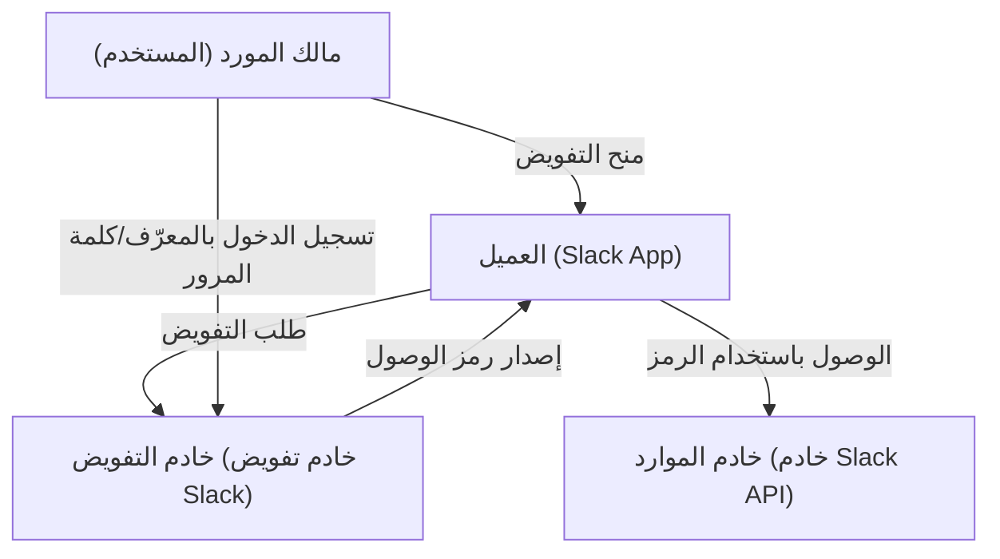
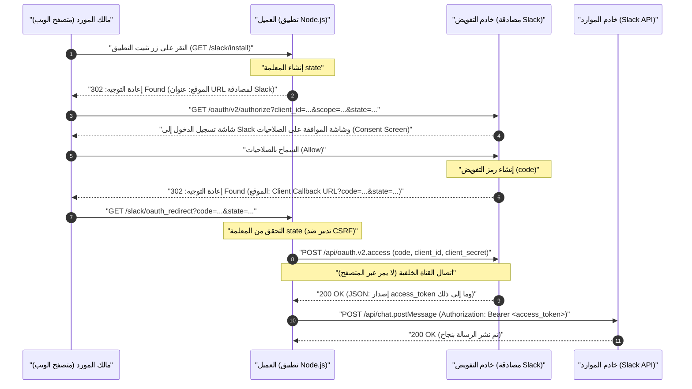
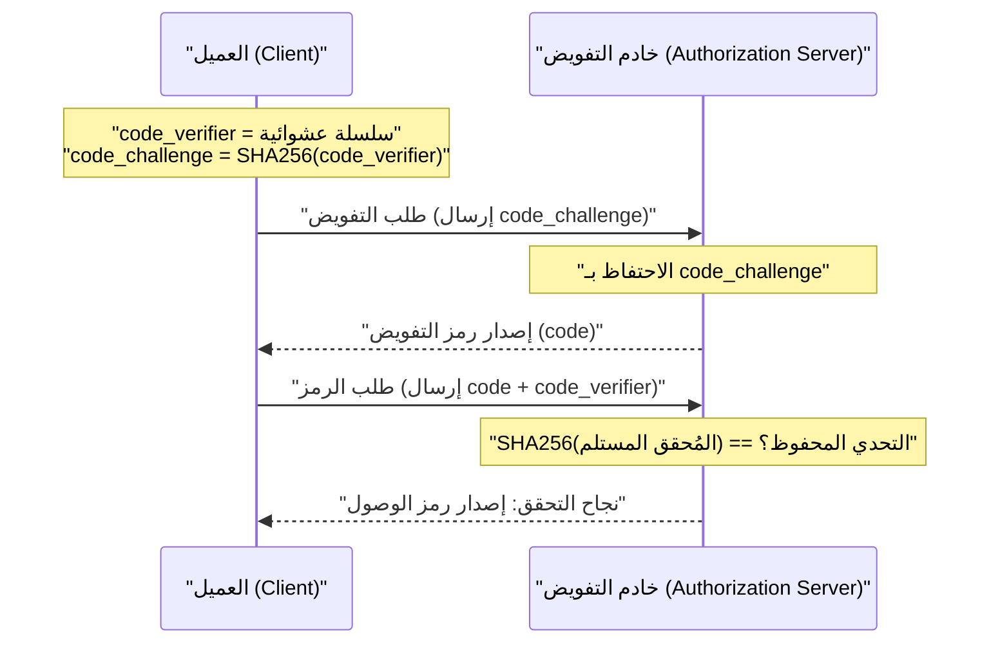

# مقدمة: لماذا نتعلم OAuth 2.0؟

في تطبيقات الويب الحديثة، أصبح من المعتاد جداً أن تعمل خدمات متعددة معاً. على سبيل المثال، ميزات مثل "تسجيل الدخول باستخدام حساب Google" أو "إرسال إشعار إلى Slack عند تحديث مهمة في Trello" أو "إضافة رابط اجتماع Zoom تلقائياً إلى تقويم Google". الإطار الذي يعمل خلف الكواليس لتنفيذ كل هذا هو إطار التفويض **OAuth 2.0 (Open Authorization 2.0)**.

في الماضي، عند تبادل البيانات بين الخدمات المختلفة، تم استخدام طرق خطيرة للغاية مثل "المصادقة الأساسية" أو "مشاركة كلمة المرور"، حيث يقوم المستخدم بإعطاء معرّفه وكلمة المرور الخاصة به مباشرة إلى الخدمة المتكاملة. ومع ذلك، تؤدي هذه الطريقة إلى منح الخدمة الأخرى صلاحيات المستخدم الكاملة، مما يشكل خطراً أمنياً فادحاً.

تم إنشاء OAuth 2.0 كبروتوكول قياسي (RFC 6749) لتفويض "صلاحيات معينة (النطاقات Scope) فقط" لـ "فترة زمنية محدودة" إلى تطبيقات الطرف الثالث، مع تجنب "مشاركة كلمات المرور" بهذه الطريقة.

في هذه المقالة، سنشرح آلية عمل OAuth 2.0 بشكل مفصل وعملي للغاية من خلال تنفيذ تطبيق (Slack App) يستهدف **Slack (Slack API)**، والذي أصبح المعيار الفعلي كأداة تواصل للأعمال. هذا الشرح الشامل الذي يتجاوز 10,000 حرف يتضمن أمثلة برمجية باستخدام Node.js (Express)، ومخططات تسلسلية توضح تدفق البروتوكول، ويتعمق في المفاهيم الأمنية الهامة مثل المعلمة `state` والخلفية الرياضية والتشفيرية لـ PKCE.

---

# 1. المفاهيم الأساسية لـ OAuth 2.0: الأدوار الأربعة (Roles)

الخطوة الأولى لفهم OAuth 2.0 هي الفهم الدقيق للأشخاص (الأدوار) المعنيين. في RFC 6749، يتم تعريف الأدوار الأربعة التالية:



1. **مالك المورد (Resource Owner)**
   - الكيان الذي يمتلك صلاحية منح حق الوصول إلى المورد. عادةً ما يشير إلى "المستخدم النهائي (الإنسان)". في هذا المثال، هو "أنت نفسك، كعضو في مساحة عمل Slack ولديك صلاحية نشر رسائل في القنوات".
2. **العميل (Client)**
   - التطبيق الذي يحاول الوصول إلى خادم الموارد بعد الحصول على إذن من مالك المورد. في هذا المثال، هو "تطبيق Node.js الذي تقوم بتطويره (Slack App)". على الرغم من تسميته "العميل"، إلا أنه في سياق OAuth، يسمى "العميل" حتى لو كان تطبيق ويب يعمل على جانب الخادم.
3. **خادم التفويض (Authorization Server)**
   - الخادم الذي يقوم بمصادقة مالك المورد، ويحصل على التفويض منه، ويصدر رمز الوصول للعميل. في هذا المثال، هي بنية مصادقة Slack التي توفر `slack.com/oauth/v2/authorize`.
4. **خادم الموارد (Resource Server)**
   - الخادم الذي يستضيف الموارد المحمية، ويستقبل طلبات الوصول إلى الموارد باستخدام رمز الوصول، ويستجيب لها. في هذا المثال، هي نقاط نهاية `slack.com/api/` التي توفر واجهات برمجة التطبيقات مثل `chat.postMessage`.

بكلمات بسيطة، تدفق OAuth هو **"سلسلة من الخطوات حيث يحصل العميل على موافقة مالك المورد، ويستلم رمز وصول من خادم التفويض، ويستخدمه لاسترداد البيانات والتعامل معها من خادم الموارد"**.

---

# 2. التشريح الكامل لمنح رمز التفويض (Authorization Code Grant)

هناك عدة تدفقات (أنواع المنح) في OAuth 2.0، ولكن التدفق الأكثر توصيةً واستخداماً في البيئات التي يمكن فيها الاحتفاظ بالمفتاح السري (Client Secret) بأمان على جانب الخادم (مثل تطبيقات الويب) هو **منح رمز التفويض (Authorization Code Grant)**.

الميزة الرئيسية لمنح رمز التفويض هي الفصل الواضح بين **القناة الأمامية (Front Channel - الاتصال عبر المتصفح)** و **القناة الخلفية (Back Channel - الاتصال المباشر بين الخوادم)**. في القناة الأمامية، يتم تمرير "رمز تفويض (Authorization Code)" مؤقت فقط، بينما يتم الحصول على "رمز الوصول (Access Token)" النهائي في القناة الخلفية. هذا يقلل بشكل كبير من خطر تسريب الرمز عبر سجل المتصفح أو المُحيل (Referer).

يوضح المخطط التسلسلي التالي العملية الكاملة لمنح رمز التفويض في Slack App.



دعونا نحلل هذا التدفق خطوة بخطوة من خلال تنفيذ كود Node.js (Express) محدد.

---

# 3. التحضير للتنفيذ: الإعداد في Slack Developer Console

قبل كتابة الكود، نحتاج إلى تسجيل "وجود عميل جديد" في نظام Slack.

1. انتقل إلى [Slack API: Applications](https://api.slack.com/apps) وانقر على "Create New App".
2. حدد "From scratch" وحدد اسم التطبيق (مثل: `My First OAuth App`) ومساحة العمل التي تريد التثبيت فيها.
3. في شاشة "Basic Information" التي تظهر بعد الإنشاء، احصل على بيانات الاعتماد (Credentials) الهامة التالية.
   - **Client ID**: المعرّف الذي يميز تطبيقك بشكل فريد وعلني. لا توجد مشكلة في تضمينه في الطلبات التي تمر عبر المتصفح (القناة الأمامية).
   - **Client Secret**: سلسلة سرية يعرفها تطبيقك فقط. **يجب ألا يتم كشفها أبداً لجانب المتصفح، ويجب عدم رفعها (commit) إلى GitHub وغيرها.**
4. انتقل إلى شاشة "OAuth & Permissions" وسجل عنوان URL لرد النداء (Callback) في "Redirect URLs". بافتراض التطوير المحلي (Local Development) هذه المرة، سنقوم بإعداد ما يلي:
   - `http://localhost:3000/slack/oauth_redirect`

الآن اكتملت التحضيرات. لنبدأ في تنفيذ الخادم.

---

# 4. خطوة التنفيذ 1: `/slack/install` والمعلمة `state` للحماية من CSRF

سنقوم بإنشاء نقطة النهاية الأولى للمستخدمين لبدء استخدام التطبيق (لتثبيته في مساحة العمل). المسؤولية الأكبر هنا هي إعادة توجيه المستخدم إلى خادم تفويض Slack، ولكن الأهمية الأمنية القصوى تكمن في **إنشاء وحفظ المعلمة `state`**.

## الحاجة إلى معلمة state (منع هجمات CSRF)

إذا لم تكن المعلمة `state` موجودة، فيمكن لمهاجم خبيث بدء عملية التفويض باستخدام حساب Slack الخاص به، وجعل الضحية ينقر على عنوان URL لرد النداء الذي يحتوي على "رمز التفويض" الذي تم الحصول عليه (مثال: `http://localhost:3000/slack/oauth_redirect?code=ATTACKER_CODE`). عند قيام متصفح الضحية بتنفيذ ذلك، يكتمل الارتباط بحساب Slack الخاص بالمهاجم في جلسة الضحية، مما يتسبب في تسرب المعلومات أو عمليات غير مقصودة (Login CSRF).

لمنع ذلك، فإن `state` عبارة عن سلسلة عشوائية غير قابلة للتخمين تُستخدم للتحقق من أن المتصفح الذي بدأ الطلب هو نفس المتصفح الذي تلقى رد النداء (Callback).

## إنتروبيا state (الخلفية الرياضية)

لإنشاء `state` آمن، يلزم وجود رقم عشوائي يحتوي على "إنتروبيا" (كمية معلومات) كافية. تعتمد الإنتروبيا $E$ على عدد أنواع السلاسل التي يمكن إنشاؤها $N$، ويتم التعبير عنها بالمعادلة التالية:

$$
E = \log_2(N) \quad (\text{وحدة: bits})
$$

على سبيل المثال، إذا قمنا بإنشاء رقم شبه عشوائي آمن تشفيرياً (CSPRNG) بحجم 16 بايت وتحويله إلى سلسلة سداسية عشرية (Hex)، فسيكون عدد الحالات التي يمكن تمثيلها هو $2^{128}$.

$$
E = \log_2(2^{128}) = 128 \text{ bits}
$$

مع إنتروبيا 128 بت، من المستحيل فعلياً (احتمال فلكي) العثور على تصادم من خلال هجوم القوة العمياء في علوم الكمبيوتر الحديثة. عادةً، يوصى بوجود `state` ذو إنتروبيا لا تقل عن 128 بت كمتطلب أمني.

## التنفيذ باستخدام Node.js

```javascript
// app.js (مقتطف)
const express = require('express');
const crypto = require('crypto');
const session = require('express-session');
const dotenv = require('dotenv');

dotenv.config();

const app = express();

// إعداد البرنامج الوسيط للجلسة (لحفظ state)
app.use(session({
  secret: process.env.SESSION_SECRET,
  resave: false,
  saveUninitialized: true,
  cookie: { secure: false } // يجب تعيينها كـ true في بيئة الإنتاج
}));

const SLACK_CLIENT_ID = process.env.SLACK_CLIENT_ID;
const SLACK_AUTHORIZE_URL = 'https://slack.com/oauth/v2/authorize';

app.get('/slack/install', (req, res) => {
  // إنشاء رقم عشوائي قوي بحجم 16 بايت وتحويله إلى سلسلة سداسية عشرية (الإنتروبيا: 128 بت)
  const state = crypto.randomBytes(16).toString('hex');
  
  // حفظ في الجلسة ليتم التحقق منه عند رد النداء (callback)
  req.session.oauth_state = state;

  // قائمة النطاقات (الصلاحيات) المطلوبة (مفصولة بفواصل)
  // chat:write = صلاحية إرسال رسالة إلى القناة
  // channels:read = صلاحية قراءة معلومات القنوات العامة
  const scope = 'chat:write,channels:read';

  // معلمات URL لبناء خادم تفويض Slack
  const params = new URLSearchParams({
    client_id: SLACK_CLIENT_ID,
    scope: scope,
    state: state,
    redirect_uri: 'http://localhost:3000/slack/oauth_redirect'
  });

  const authUrl = `${SLACK_AUTHORIZE_URL}?${params.toString()}`;
  
  // إعادة توجيه المستخدم إلى شاشة تفويض Slack (302 Found)
  res.redirect(authUrl);
});
```

عند الوصول إلى نقطة النهاية هذه، ستكون استجابة HTTP كالتالي:

```http
HTTP/1.1 302 Found
Location: https://slack.com/oauth/v2/authorize?client_id=123.456&scope=chat%3Awrite%2Cchannels%3Aread&state=a1b2c3d4e5f6g7h8i9j0k1l2m3n4o5p6&redirect_uri=http%3A%2F%2Flocalhost%3A3000%2Fslack%2Foauth_redirect
Set-Cookie: connect.sid=...; Path=/; HttpOnly
```

سينتقل متصفح المستخدم على الفور إلى `Location` المحدد، وستظهر شاشة Slack (Consent Screen)، وستظهر الشاشة المألوفة "My First OAuth App يطلب الوصول إلى مساحة العمل الخاصة بك".

---

# 5. خطوة التنفيذ 2: استلام رد النداء واستبدال رمز الوصول

عندما ينقر المستخدم على "السماح (Allow)" في شاشة Slack، سيقوم خادم Slack بإعادة توجيه متصفح المستخدم إلى `redirect_uri` الذي تم إعداده مسبقاً. في ذلك الوقت، يتم إرفاق `code` (رمز التفويض) و `state` الذي أرسلناه سابقاً كمعلمات استعلام في عنوان URL.

في الخلفية (Backend)، نقوم بالعمليات التالية:
1. التحقق مما إذا كان `state` المرسل يتطابق تماماً مع `state` المحفوظ في الجلسة.
2. في حالة التطابق، استخدام `code` المستلم ومعرّف العميل `client_id` والمعلومات السرية `client_secret` للاتصال بـ Slack API عبر القناة الخلفية وطلب رمز الوصول (Access Token).

```javascript
const axios = require('axios');
const SLACK_CLIENT_SECRET = process.env.SLACK_CLIENT_SECRET;
const SLACK_ACCESS_TOKEN_URL = 'https://slack.com/api/oauth.v2.access';

app.get('/slack/oauth_redirect', async (req, res) => {
  const { code, state, error } = req.query;

  // معالجة حالة رفض المستخدم للتفويض
  if (error === 'access_denied') {
    return res.status(403).send('تم رفض الوصول.');
  }

  // 1. التحقق من state (تدبير ضد CSRF)
  const savedState = req.session.oauth_state;
  if (!state || state !== savedState) {
    return res.status(400).send('Invalid State Parameter (تم اكتشاف هجوم CSRF)');
  }

  // حذف state المستخدم (لمنع هجمات إعادة الإرسال Replay Attack)
  delete req.session.oauth_state;

  try {
    // 2. استبدال رمز التفويض برمز وصول (اتصال القناة الخلفية)
    const tokenResponse = await axios.post(SLACK_ACCESS_TOKEN_URL, new URLSearchParams({
      client_id: SLACK_CLIENT_ID,
      client_secret: SLACK_CLIENT_SECRET,
      code: code,
      redirect_uri: 'http://localhost:3000/slack/oauth_redirect'
    }).toString(), {
      headers: {
        'Content-Type': 'application/x-www-form-urlencoded'
      }
    });

    const data = tokenResponse.data;

    if (!data.ok) {
      console.error('Token Exchange Error:', data.error);
      return res.status(500).send(`Slack API Error: ${data.error}`);
    }

    // نجاح! تم الحصول على رمز الوصول
    const accessToken = data.access_token;
    const teamName = data.team.name;
    const botUserId = data.bot_user_id;

    console.log(`Successfully installed to ${teamName}. Access Token: ${accessToken}`);

    // عادةً ما تقوم بتشفير الرمز وحفظه في قاعدة البيانات هنا
    // saveToDatabase(data.team.id, encrypt(accessToken));

    res.send(`اكتمل التثبيت! مساحة العمل: ${teamName}`);

  } catch (err) {
    console.error('Network Error:', err);
    res.status(500).send('حدث خطأ في الاتصال.');
  }
});
```

كاستجابة لـ `/api/oauth.v2.access`، سيُرجع Slack ملف JSON كما يلي.

```json
{
    "ok": true,
    "app_id": "A12345678",
    "authed_user": {
        "id": "U12345678"
    },
    "scope": "chat:write,channels:read",
    "token_type": "bot",
    "access_token": "<YOUR_BOT_TOKEN_HERE>",
    "bot_user_id": "B12345678",
    "team": {
        "id": "T12345678",
        "name": "My Workspace"
    },
    "enterprise": null
}
```

هذه السلسلة التي تبدأ بـ `xoxb-` هي **رمز وصول البوت (Bot Access Token)** في Slack. من الآن فصاعداً، عندما يرسل التطبيق طلباً إلى Slack API (خادم الموارد)، سيتم إثبات المصادقة والصلاحيات عن طريق إضافة `Authorization: Bearer xoxb-...` إلى ترويسة HTTP.

---

# 6. نطاقات الرموز ومبدأ الامتياز الأقل (Principle of Least Privilege)

أحد أهم المفاهيم في OAuth 2.0 هو "النطاق (Scope)". يشير النطاق إلى مدى الصلاحيات المرتبطة برمز الوصول.

في Slack، يتم تصنيف الصلاحيات بدقة بالغة، وتنقسم بشكل عام إلى **نطاقات رموز البوت (Bot Token Scopes)** و **نطاقات رموز المستخدمين (User Token Scopes)**.
- `chat:write` (Bot): صلاحية إرسال رسالة إلى القناة كالتطبيق (البوت) نفسه.
- `chat:write` (User): صلاحية إرسال رسالة نيابة عن المستخدم الذي قام بتثبيت التطبيق (باسم المستخدم وأيقونته).
- `channels:read`: صلاحية الحصول على قائمة القنوات.
- `channels:history`: صلاحية قراءة سجل الرسائل السابقة في القناة.

وفقاً للمبدأ الأمني الأساسي "مبدأ الامتياز الأقل (Principle of Least Privilege)"، فإن القاعدة الذهبية هي **طلب النطاقات الضرورية تماماً فقط للوظائف التي يوفرها التطبيق**. على سبيل المثال، إذا كان التطبيق مخصصاً "لإرسال الإشعارات فقط"، فيجب أن يطلب `chat:write` فقط، ولا ينبغي له طلب `channels:history` (صلاحية قراءة جميع المحادثات السابقة). هذا لتقليل الضرر إلى الحد الأدنى في الحالة غير المتوقعة التي يتم فيها اختراق التطبيق وتسريب الرمز.

---

# 7. أمان متقدم أكثر: PKCE (مفتاح الإثبات لتبادل الرمز Proof Key for Code Exchange)

مؤخراً، تم توحيد **PKCE (مفتاح الإثبات لتبادل الرمز، RFC 7636، يُنطق "بيكسي")** واستخدامه على نطاق واسع كآلية لتعزيز أمان OAuth 2.0.

في الأصل، تم تصميم PKCE لـ "العملاء العامين (Public Clients)" مثل التطبيقات الأصلية (iOS/Android) أو تطبيقات الصفحة الواحدة (SPA) التي لا يمكنها الاحتفاظ بـ `client_secret` بأمان. ومع ذلك، يوصى الآن بشدة باستخدام PKCE حتى مع "العملاء السريين (Confidential Clients)" على جانب الخادم وفقاً لأفضل الممارسات الأمنية (مسودة OAuth 2.1).

## آلية عمل PKCE والخلفية الرياضية

يُثبت PKCE بشكل مشفر أن "الشخص الذي بدأ طلب التفويض" و "الشخص الذي يطلب استبدال الرمز" هما نفس الكيان.

1. يُنشئ العميل سلسلة عشوائية **`code_verifier`** (من 43 إلى 128 حرفاً).
2. يقوم بعمل تجزئة (Hash) لها باستخدام **SHA-256**، وتشفيرها بتنسيق BASE64URL، ليصبح الناتج هو **`code_challenge`**.

بصيغة رياضية، يمكن التعبير عنها كما يلي:

$$
\text{code\_challenge} = \text{BASE64URL-ENCODE}( \text{SHA256}( \text{ASCII}(\text{code\_verifier}) ) )
$$

3. يقوم العميل بإرسال `code_challenge` و `code_challenge_method=S256` بالإضافة إلى `state` إلى خادم التفويض (Slack) عند تنفيذ `/slack/install` (يقوم Slack بحفظ هذا مؤقتاً).
4. بعد رد النداء (Callback)، عند استبدال الرمز (`/api/oauth.v2.access`)، يقوم العميل بإرسال **`code_verifier`** الأصلي قبل عملية التجزئة.
5. يقوم خادم التفويض (Slack) بعمل تجزئة SHA-256 لـ `code_verifier` المستلم بنفسه، ويتحقق مما إذا كان يتطابق تماماً مع `code_challenge` المحفوظ في الخطوة 3.



من خلال هذه الآلية، حتى لو تم سرقة "رمز التفويض (code)" بواسطة تطبيق خبيث أو عن طريق التنصت على مسار الاتصال، لا يمكن للمهاجم الحصول على رمز الوصول لأنه لا يعرف `code_verifier` الأصلي (نظراً لطبيعة دالة التجزئة SHA-256 غير القابلة للعكس، من المستحيل حساب الـ verifier العكسي من التحدي challenge).

حالياً، تتقدم دعم PKCE في بعض التدفقات الجديدة لـ Slack API وغيرها من واجهات برمجة تطبيقات SaaS الحديثة (مثل Auth0، Okta، X/Twitter API v2 وغيرها)، وأصبح تقنية يجب على المطورين اعتمادها بنشاط.

---

# 8. الإدارة والتشغيل الآمن لرموز الوصول

أخيراً، إليك أفضل الممارسات لكيفية حفظ رموز الوصول التي تم الحصول عليها.

## 1. التشفير الإلزامي عند الحفظ في قاعدة البيانات
رمز الوصول (`xoxb-...`) هو حرفياً "المفتاح الرئيسي" لمساحة عمل Slack. يجب ألا تحفظه بنص صريح في قاعدة البيانات (مثل MySQL، PostgreSQL، MongoDB). في حالة حدوث كارثة مثل تسرب قاعدة البيانات عبر حقن SQL مثلاً، سيتم اختراق مساحات عمل Slack لجميع العملاء.

تأكد دائماً من تشفيره باستخدام تشفير قوي بالمفتاح المتماثل مثل **AES-256-GCM** في طبقة التطبيق قبل حفظه في قاعدة البيانات (DB). تتم إدارة المفتاح الرئيسي للتشفير/فك التشفير بصرامة باستخدام خدمات إدارة المفاتيح الآمنة مثل AWS KMS (Key Management Service) أو GCP Cloud KMS.

## 2. تدوير الرموز (Token Rotation)
هناك مخاطرة في الاستمرار في استخدام رموز صالحة لفترة طويلة. في أحدث تطبيقات OAuth، يوصى باعتماد آلية لإنشاء رمز وصول جديد كل بضع ساعات باستخدام "رمز التجديد (Refresh Token)" وهو ما يسمى بـ (Token Rotation). في Slack API أيضاً، يمكنك تفعيل تدوير الرموز (Token Rotation) في الإعدادات الاختيارية.

---

# الخلاصة

في هذه المقالة، شرحنا بالتفصيل تدفق منح رمز التفويض لـ OAuth 2.0، مع أمثلة برمجية محددة لتنفيذ تكامل Slack App باستخدام Node.js.

1. من خلال الوعي بـ **الأدوار الأربعة (RO، Client، AS، RS)**، تصبح بنية النظام بأكمله واضحة.
2. **منح رمز التفويض** يضمن الأمان من خلال الاستخدام الذكي لمسارات الاتصال (القناة الأمامية/الخلفية) بين المتصفح والخادم.
3. إن فهم الآليات التشفيرية الأساسية، مثل الدفاع ضد CSRF بواسطة **المعلمة `state`** ومنع هجمات اعتراض رمز التفويض بواسطة **PKCE**، هو أقصر طريق للتنفيذ الآمن.
4. يعتبر تصميم النطاق بناءً على **مبدأ الامتياز الأقل** والتشفير عند الحفظ في قاعدة البيانات عناصر لا غنى عنها مطلقاً في العمليات التشغيلية.

عالم OAuth 2.0 عميق جداً، وهناك مواصفات ضخمة في RFC وحده، ولكن من خلال التعلم العملي باستهداف منصة فعلية (Slack) كما فعلنا، ستتمكن من إدراك فلسفة التصميم المتطورة وآليات الأمان القوية الخاصة به. نأمل أن تكون المعرفة الواردة في هذه المقالة مفيدة في تطوير تطبيقاتك المستقبلية وتنفيذ تكامل واجهات برمجة التطبيقات (API).
